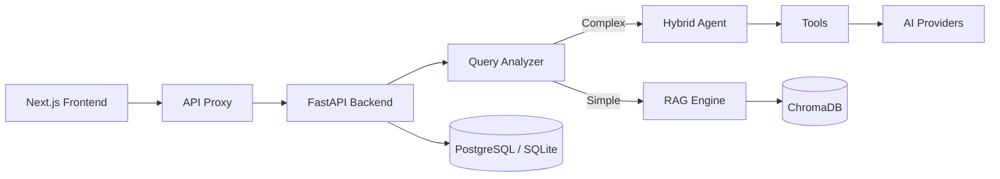

# 🏠 AI Real Estate Assistant

> **AI-powered conversational platform for property search, analytics, and market insights.**
>
> Ask in natural language — *"2-bedroom apartment in Kraków under 500k"* — get matched listings.
> Try the live demo below, no signup needed.

[](https://python.org)
[](https://fastapi.tiangolo.com/)
[](https://nextjs.org/)
[](https://www.typescriptlang.org/)
[](https://github.com/AleksNeStu/ai-real-estate-assistant/actions/workflows/ci.yml)
[](LICENSE)
[](https://realestate-web-dz1y.onrender.com/)
[](https://propvectorai.com?utm_source=github&utm_medium=readme&utm_campaign=hosted-badge)
[](https://github.com/AleksNeStu/ai-real-estate-assistant/releases)

<!-- markdownlint-disable MD051 -->
## Table of Contents

- [Live Demo](#-live-demo)
- [What's New in v5.1](#-whats-new-in-v51)
- [Architecture](#-architecture)
- [Quick Start](#-quick-start)
- [Three Developer Differentiators](#-three-developer-differentiators)
- [Hosted Version: PropVector AI](#hosted-version-propvector-ai)
- [Features](#-features)
- [Screenshots](#-screenshots)
- [Tech Stack](#-tech-stack)
- [Project Growth](#-project-growth)
- [Releases](#-releases)
- [Project Structure](#-project-structure)
- [Testing](#-testing)
- [Documentation](#-documentation)
- [Roadmap](#-roadmap)
- [Branches](#-branches)
- [Deployment](#-deployment)
- [Configuration](#-configuration)
- [Contributing](#-contributing)
- [License](#-license)
<!-- markdownlint-restore -->

## 🌐 Live Demo

<div align="center">

### [**🚀 Try the Live Demo →**](https://realestate-web-dz1y.onrender.com/)

**No login required — explore in demo mode**

</div>

Experience the full power of AI-driven real estate search without any setup:

- 🔍 **Natural Language Property Search** — ask questions like *"2-bedroom apartment in Kraków under 500k"* and get matched listings
- 🤖 **AI-Powered Chat** — conversational interface for finding your perfect property
- 📊 **Financial Tools** — mortgage calculator, rent-vs-buy comparison, ROI analysis, and TCO calculator
- 🗺️ **Interactive Maps** — clustered property markers with area analytics
- 🌍 **9 Languages** — English, Polish, Russian, German, Spanish, Italian, Portuguese, Turkish, and Ukrainian

> **Note:** The demo uses simulated AI responses for instant exploration. Production deployment requires API keys.

## 🆕 What's New in v5.1

Three small but demoable additions, shipped together as a focused release:

- **AI Property Valuation with Multi-Year Price Forecast** — paste a property id (or enter features manually) and get an LLM-powered estimate of current value plus projected value at 1y, 3y, 5y, and 10y horizons, with a confidence band and key drivers. Try it at `/valuation`.
- **Inline monthly payment on listing cards** — every property card on the search results page now shows a small "$X / mo" estimate next to the title (20% down, 30-year fixed, 6.5% APR by default; not a lending offer).
- **AI Neighborhood One-Liner** — property detail pages now feature a short AI-generated summary of the neighborhood's character, lifestyle, and accessibility. Falls back silently if the LLM is unavailable.

All three work in demo mode without any paid external APIs.

## 💻 Local Demo Setup

Run the full demo locally with comprehensive mock data in minutes:

```powershell
# Step 1: Launch Docker containers (5-8 min)
.\scripts\demo\01-launch-docker.ps1

# Step 2: Generate comprehensive demo data (2-3 min)
.\scripts\demo\02-generate-data.ps1

# Access the demo
# Frontend: http://localhost:3082
# Backend:  http://localhost:8082
# API Docs: http://localhost:8082/docs
```

**Demo Data Includes:**

- 🏠 250+ properties across 5 Polish cities (Kraków, Warsaw, Gdańsk, Wrocław, Poznań)
- 👥 50 users with different roles
- 🔍 100 saved searches with diverse filters
- ⭐ 200 favorites across users
- 🏢 15 real estate agent profiles
- 📊 150 leads/inquiries
- 📈 300 activity events
- ⚙️ 40 preference profiles
- 📋 20 CMA reports

**Stop the demo:**

```powershell
.\scripts\demo\03-stop-docker.ps1
```

**[→ Demo Setup Documentation](scripts/demo/README.md)** — Complete guide with troubleshooting.

## 🖥️ Deployment & Memory Notes

The backend uses an **environment-conditional lazy provider load** (`apps/api/models/provider_factory.py`) to stay under Render's free-tier 512 MB memory cap. This is **only triggered when the `RENDER` env var is set to `"true"`** (which Render does automatically on every service).

| Platform / Setup | `RENDER` set? | Provider loading | Memory baseline | Notes |
|---|---|---|---|---|
| **Render** (free / starter) | ✅ yes | Lazy — only the active `DEFAULT_PROVIDER` (`zai`) is imported at startup; the other 12 are loaded on first use | ~480 MB | Workaround for 512 MB hard cap |
| **VPS / bare metal** | ❌ no | Eager — all 13 providers imported at startup | ~530 MB | No memory constraint; full DX |
| **Docker / docker-compose** (local or self-hosted) | ❌ no (unless you set it) | Eager — all 13 providers imported at startup | ~530 MB | Same as VPS |
| **Other PaaS** (Fly.io, Railway, Render preview, AWS App Runner, etc.) | ❌ no | Eager — all 13 providers imported at startup | depends on instance type | Pick a plan with ≥1 GB RAM for safety |
| **Local dev / CI** | ❌ no | Eager | ~530 MB | Tests assume this path |

If you self-host on a VPS, Docker, or any non-Render platform, **you don't need to do anything** — the eager path gives you all 13 providers from the start with no artificial latency. The lazy path is a Render-specific workaround for the 512 MB free-tier cap and is **not** a best practice for memory-constrained production deployments in general.

To override the gate (e.g. force lazy loading on a different platform), set `RENDER=true` in the environment.


## 📸 Screenshots

<div align="center">


*Homepage · Search · Chat · Agents · Analytics*

</div>

### What it looks like

| Landing | AI Assistant | AI Agents |
|---|---|---|
|  |  |  |
| Analytics | Knowledge & RAG | City Overview |
|  |  |  |

*All dark-theme desktop captures (1280x800). Working source files live in
`assets/screenshots/*-dark.png`. Light-theme variants are available in
`docs/screenshots/`.*

## ✨ Features

### 🤖 Multi-Provider AI
6+ LLM providers with intelligent routing — OpenAI, Anthropic, Google, Grok, DeepSeek, and local Ollama. Automatic fallback chain ensures reliability.

### 🔍 Smart Property Search
Natural language queries with automatic filter extraction. Hybrid semantic + keyword search powered by ChromaDB with MMR reranking for 30-40% better relevance.

### 📊 Analytics & Financial Tools
Mortgage calculator, rent-vs-buy comparison, investment ROI analysis, TCO calculator, Comparative Market Analysis (CMA) reports, and **AI price forecast with multi-year projection** (v5.1).

### 🏘️ AI Neighborhood One-Liner (v5.1)
Short 2-3 sentence AI summary of any neighborhood's character, lifestyle, and accessibility — appears on property detail pages.

### 🗺️ Interactive Maps
Mapbox/Leaflet maps with property clustering, area comparisons, and city-overview analytics.

### 🌍 9 Languages
English, Polish, Russian, German, Spanish, Italian, Portuguese, Turkish, and Ukrainian — with EU AI Act compliance labels.

### 🔒 Enterprise Security
OWASP-hardened with rate limiting, audit logging, SSRF protection, and dual-mode auth (API Key + JWT). Progressive 5-stage security pipeline with full scanning on all branches.

## 🛠️ Tech Stack

| Layer | Technology |
|-------|------------|
| Backend API | FastAPI (Python 3.12+) |
| Frontend | Next.js 16 + React 19 |
| Vector DB | ChromaDB (semantic search + MMR reranking) |
| Relational DB | PostgreSQL / SQLite |
| LLM Providers | OpenAI, Anthropic, Google, Grok, DeepSeek, local Ollama |
| Container | Docker / Docker Compose |
| Hosting (staging) | Render free tier |
| CI/CD | GitHub Actions (CI + GHCR + Render deploy) |
| Monitoring | Uptime Kuma + structured logs |

## 📈 Project Growth

### GitHub Stats

[](https://github.com/AleksNeStu/ai-real-estate-assistant)
[](https://github.com/AleksNeStu/ai-real-estate-assistant)
[](https://github.com/AleksNeStu/ai-real-estate-assistant/issues)

### Star Growth

<!-- Chart is regenerated daily by .github/workflows/star-history.yml (custom Python
     step: GitHub REST + matplotlib at 1400x533). Static SVG on the star-history orphan
     branch. The hosted star-history.com embed broke when GitHub restricted the
     stargazers API on 2026-06-30; the previous carsteneu/mystarhistory@v1 self-hosted
     step hardcoded 800x533 and emitted one label per month, causing the X-axis labels
     to overlap. -->
<a href="https://star-history.com/#AleksNeStu/ai-real-estate-assistant&Date">
<picture>
  <source media="(prefers-color-scheme: dark)" srcset="https://raw.githubusercontent.com/AleksNeStu/ai-real-estate-assistant/star-history/assets/my-star-history/star-history-dark.svg">
  
</picture>
</a>

### Key Metrics

| Metric           | Value                                       |
| ---------------- | ------------------------------------------- |
| **Commits**      | 1177+                                       |
| **Tests**        | 7,000+ (6,254 backend + 1,000 frontend)     |
| **Lines of Code** | 60,000+ (27K Python + 34K TypeScript)      |
| **Contributors** | 7                                           |
| **Languages**    | 9 supported                                 |

## 🚀 Releases

| Version | Date | Highlights |
|---|---|---|
| [v5.0.12](CHANGELOG.md#5012---2026-06-22) | 2026-06-22 | Flaky-test fix, deploy independence, release verification workflow |
| [v5.0.11](CHANGELOG.md#5011---2026-06-22) | 2026-06-22 | `pydantic-settings` CVE, dependabot config fix, first GitHub Release page |
| [v5.0.10](CHANGELOG.md#5010---2026-06-20) | 2026-06-20 | `aiohttp` 9 advisories, `fastapi` 4 advisories, starlette direct dep |

See [GitHub Releases](https://github.com/AleksNeStu/ai-real-estate-assistant/releases)
and [CHANGELOG.md](CHANGELOG.md) for the full version history. Going forward, each
release ships with a themed name and a short narrative paragraph — see
[`.github/RELEASE_TEMPLATE.md`](.github/RELEASE_TEMPLATE.md).

## 🏗️ Architecture



See [docs/architecture/large-saas-overview.md](docs/architecture/large-saas-overview.md) for the full system design.

## 🚀 Quick Start

### PowerShell Scripts (recommended for Windows)

```powershell
# Clone and start demo mode (no API keys required)
git clone https://github.com/AleksNeStu/ai-real-estate-assistant.git
cd ai-real-estate-assistant
.\start-docker.ps1

# Stop: .\stop-docker.ps1
# Logs: .\logs-docker.ps1
```

### Docker (manual)

```bash
git clone https://github.com/AleksNeStu/ai-real-estate-assistant.git
cd ai-real-estate-assistant
cp deploy/compose/.env.example deploy/compose/.env
# Edit deploy/compose/.env — demo mode enabled by default
docker compose -f deploy/compose/docker-compose.yml up --build
# Frontend: http://localhost:3082 · API: http://localhost:8082/docs
```

### Manual

```bash
# Backend
cd apps/api && uv venv .venv && source .venv/bin/activate
uv pip install -e ".[dev]" && python -m uvicorn api.main:app --reload --port 8000

# Frontend
cd apps/web && npm install && npm run dev
# Frontend: http://localhost:3000 · API: http://localhost:8000
```

> **[5-Minute Quickstart →](docs/development/QUICKSTART_5MIN.md)** — Full setup with verification scripts.

## 🏠 Three Developer Differentiators

### 1. Multi-Provider LLM Routing
13 LLM providers with automatic fallback chain — OpenAI, Anthropic Google, Grok, DeepSeek, and local Ollama. Per-request provider selection via header or request parameter; no code changes required to switch models.

### 2. Hybrid RAG + ChromaDB Vector Search
Query complexity classifier routes requests to RAG-only (simple), hybrid RAG+enhancement (medium), or agent+tools (complex). ChromaDB with MMR reranking provides semantic similarity search.

### 3. 9-Language Localization
English, Polish, Russian, German, Spanish, Italian, Portuguese, Turkish, and Ukrainian — with EU AI Act compliance labels on AI-generated outputs.

<!-- HOSTED-FUNNEL-START -->
## Hosted Version: PropVector AI

PropVector AI is the hosted version of this project — the same core RAG
and vector-search engine, with managed tiers for live data, accounts,
AI CRM, and enterprise capabilities. The repo stays open-core: the core
engine remains free, anything that gates revenue lives in the hosted product.

| Capability | OSS (this repo) | Hosted (PropVector AI) |
|---|---|---|
| Core RAG property Q&A, demo dataset | Free | Included |
| Bring-your-own LLM keys, local Ollama | Free | Included |
| Vector search (ChromaDB) on sample data | Free | Included |
| Live/MLS data feeds, enrichment pipeline | Not included | Pro |
| Accounts, favorites, saved searches, alerts | Not included | Pro |
| AI CRM (lead scoring, drip, pipeline) | Not included | Pro/Enterprise |
| Multi-agent Agentic OS | Limited | Pro |
| CRM connectors (HubSpot/Pipedrive), SSO, MFA | Not included | Enterprise |
| White-label / self-host support contract | Not included | Enterprise (custom) |

**Free $0** · **Pro $29/mo** · **Enterprise (custom)** — tiers reflect
the public roadmap and may adjust before launch.

[PropVector AI](https://propvectorai.com) is launching soon; the landing
page ships alongside billing. The fastest way to reach the maintainer
today is to [open a Discussion](https://github.com/AleksNeStu/ai-real-estate-assistant/discussions)
with the `[Commercial]` prefix.
<!-- HOSTED-FUNNEL-END -->

## 📁 Project Structure

```text
ai-real-estate-assistant/
├── apps/
│   ├── api/                    # FastAPI backend (Python 3.12+)
│   │   ├── api/                # Routers, main.py, dependencies
│   │   ├── agents/             # HybridAgent, QueryAnalyzer
│   │   ├── tools/              # LangChain tools
│   │   ├── models/             # LLM provider factory
│   │   ├── db/                 # SQLAlchemy models, repositories
│   │   ├── vector_store/       # ChromaDB integration
│   │   └── tests/              # pytest unit/integration/e2e
│   └── web/                    # Next.js 16 frontend (React 19)
│       └── src/
│           ├── app/            # App Router pages
│           ├── components/     # UI components
│           ├── contexts/       # React contexts
│           └── lib/            # API client, utilities
├── deploy/                     # Dockerfiles, compose files, k8s
├── docs/                       # Architecture, API, guides
├── scripts/                    # dev, demo, validation, setup
└── .github/                    # CI/CD, FUNDING, issue templates
```

## 🧪 Testing

### Quick Commands

**Windows:**
```powershell
.\scripts\testing\test-fast.ps1       # ⚡ Quick test (3-5 min) - during development
.\scripts\testing\test-ci.ps1         # 🔍 Full CI (8-12 min) - before commit
.\scripts\testing\test-all.ps1        # 🐛 See all failures - fixing multiple issues
.\scripts\testing\test-coverage.ps1   # 📊 Coverage report - before PR
```

**Linux/macOS:**
```bash
./scripts/testing/test-fast.sh        # ⚡ Quick test (3-5 min)
./scripts/testing/test-ci.sh          # 🔍 Full CI (8-12 min)
./scripts/testing/test-all.sh         # 🐛 See all failures
./scripts/testing/test-coverage.sh    # 📊 Coverage report
```

**See [Testing Guide](docs/testing/TESTING_GUIDE.md) for detailed usage.**

### Test Coverage

| Layer | Tests | Tools | Coverage |
|-------|------:|-------|----------|
| Backend | 6,254+ | pytest, mypy, ruff | 90%+ |
| Frontend | 1,000+ | Jest, ESLint | 80%+ |
| Security | 5 scanners | Gitleaks, Semgrep, Bandit, Trivy, CodeQL | - |
| E2E | WCAG 2.1 AA | axe-core, Playwright | - |

**Performance:** Tests run in parallel using pytest-xdist (local) and GitHub Actions matrix (CI).

## 📖 Documentation

| Doc | Description |
|-----|-------------|
| [Architecture](docs/architecture/large-saas-overview.md) | System design, data flow, deployment |
| [API Reference](docs/api/API_REFERENCE.md) | All endpoints with examples |
| [User Guide](docs/user/USER_GUIDE.md) | How to use the assistant |
| [Contributing](docs/development/CONTRIBUTING.md) | Development workflow |
| [Testing Guide](docs/testing/TESTING_GUIDE.md) | Writing and running tests |
| [CI/CD Pipeline](docs/guides/ci-cd.md) | Progressive security pipeline |
| [Deployment](docs/deployment/DEPLOYMENT.md) | Docker & Render staging |
| [Troubleshooting](docs/development/TROUBLESHOOTING.md) | Common issues |
| [Changelog](CHANGELOG.md) | Version history |

## 🗺️ Roadmap

### Upcoming Features

- **Multi-Tenant Architecture** — Complete data isolation with tenant-aware models and repositories
- **Billing API** — Stripe integration for subscription management and usage-based pricing
- **Market Analytics Dashboard** — Advanced charts and trends for real estate markets
- **Mobile App** — React Native application for iOS and Android
- **Property Comparison Tool** — Side-by-side property analysis
- **Email Notifications** — Alerts for price drops, new listings, and market updates
- **API Rate Limiting** — Per-user quotas and usage analytics

See [GitHub Issues](https://github.com/AleksNeStu/ai-real-estate-assistant/issues) for planned features and discussions.

## 🌿 Branches

| Branch                                                                              | Status    | Description                    |
| ----------------------------------------------------------------------------------- | --------- | ------------------------------ |
| [`dev`](https://github.com/AleksNeStu/ai-real-estate-assistant/tree/dev)            | 🔥 Active | Current development & staging  |
| [`main`](https://github.com/AleksNeStu/ai-real-estate-assistant/tree/main)           | 🟢 Stable  | Stable releases                |

## 🚢 Deployment

- **Staging:** [realestate-web-dz1y.onrender.com](https://realestate-web-dz1y.onrender.com/) — auto-deploys from `dev` branch
- **Production:** deploys from `main` via `deploy.yml` workflow

> **Note:** Render free tier services spin down after inactivity. First visit may take ~30-60s to cold start.

See [Deployment Guide](docs/deployment/DEPLOYMENT.md) for Docker, Render, and Kubernetes setup.

## ⚙️ Configuration

```bash
# Required — at least one LLM provider
OPENAI_API_KEY="sk-..."
ANTHROPIC_API_KEY="sk-ant-..."
GOOGLE_API_KEY="AI..."

# Backend
ENVIRONMENT="local"
CORS_ALLOW_ORIGINS="http://localhost:3000"

# Optional
OLLAMA_BASE_URL="http://localhost:11434"    # Local models
ENABLE_JWT_AUTH="true"                      # User auth
REDIS_URL="redis://localhost:6379"          # Caching
```

See [.env.example](.env.example) for the full list.

## 🤝 Contributing

Contributions are welcome! See [CONTRIBUTING.md](CONTRIBUTING.md) for the workflow.

Please note that this project is released with a [Contributor Code of Conduct](.github/CODE_OF_CONDUCT.md). By participating in this project you agree to abide by its terms.

1. Fork → `git checkout -b feature/short-description`
2. Run checks locally (`make ci`)
3. Commit: `type(scope): message`
4. Open a PR against `dev`

## 📄 License

MIT License — see [LICENSE](LICENSE).

## 💖 Contributors

[](https://github.com/AleksNeStu/ai-real-estate-assistant/graphs/contributors)

Want to help shape the project? See [Contributing](#-contributing) above.

## 💖 Support

If you find this project helpful:

[](https://github.com/sponsors/AleksNeStu)
[](https://www.buymeacoffee.com/AleksNeStu)
[](https://ko-fi.com/AleksNeStu)

### 🏠 Commercial Support

Need deployment help, customization, or CRM integration? Start a [Discussion](https://github.com/AleksNeStu/ai-real-estate-assistant/discussions) with `[Commercial]` prefix.

---

<div align="center">

**⭐ Star this repo if you find it helpful!**

Made with ❤️ using Python, FastAPI, and Next.js

Copyright © 2025-2026 [Alex Nesterovich](https://github.com/AleksNeStu)

</div>
