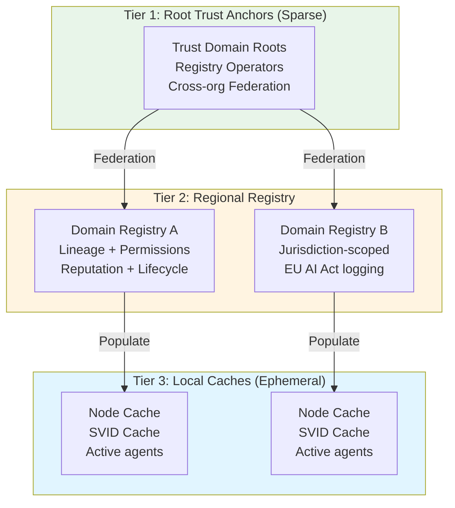
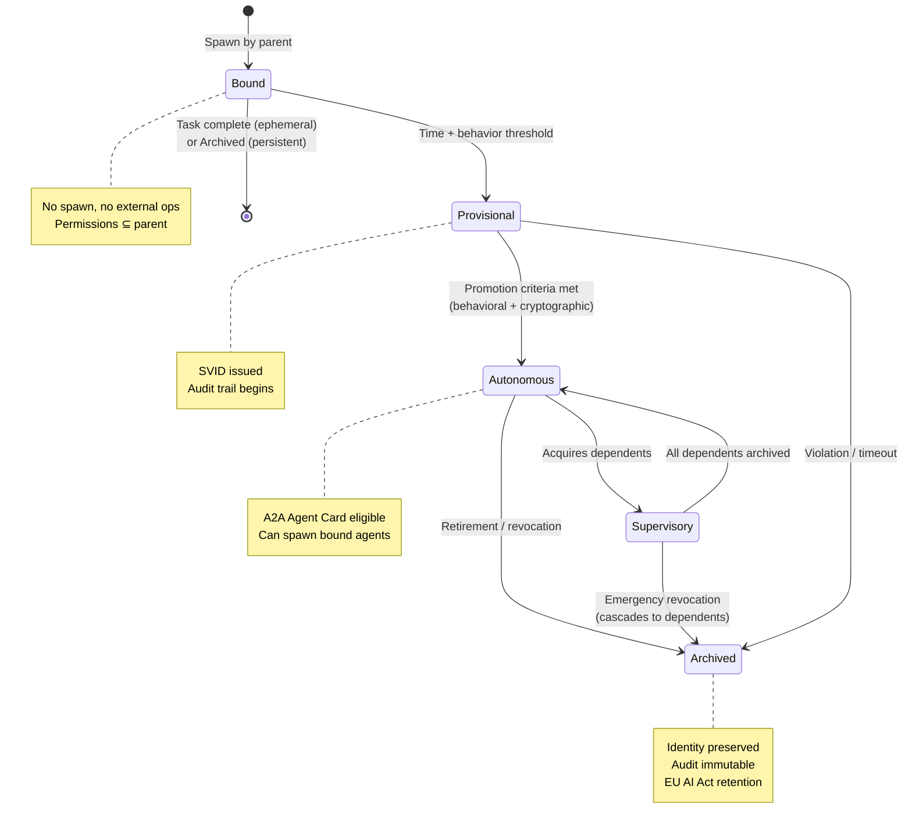

<!-- source: https://github.com/MihaiCiprianChezan/Agentic-Global-Identity-Layer.git sha: 6207991812b9a6dabc7c24102ba6cf837e3e79bd readme: main/README.md -->
# MihaiCiprianChezan/Agentic-Global-Identity-Layer

Autonomous AI agents are starting to act on our behalf — making purchases, executing workflows, negotiating with other agents. As this shift accelerates, verifiable identity becomes a foundational requirement.

---


# **Agent Identity & Lifecycle Framework (AILF)**
### *A Federated Identity, Accountability, and Lifecycle System for Autonomous Agent Swarms*

> **Version 2.1 — July 2026**
> Updated for: [IETF WIMSE](https://datatracker.ietf.org/wg/wimse/about/) architecture **draft-ietf-wimse-arch-08 (6 July 2026)** and the **[WIMSE AI Agent applicability draft -02 (28 Feb 2026)](https://datatracker.ietf.org/doc/draft-ni-wimse-ai-agent-identity/)** (Owner binding + Dual-Identity Credentials); **[A2A v1.0 stable](https://a2a-protocol.org/latest/)** (Linux Foundation, April 2026 — signed Agent Cards now standard, multi-tenancy, and the AP2 payments protocol); the **MCP 2026-07-28 specification** (stateless core, protocol-level token audience binding; final spec due 28 July 2026); the **Digital Omnibus on AI** (Council approval 29 June 2026) redrawing the EU AI Act high-risk timeline; and the **2026 agentic-breach wave** that turned this framework's central prediction into documented fact. Retains the v2.0 coverage of [SPIFFE/SPIRE](https://spiffe.io/) extension requirements for non-deterministic agents, the NHI (Non-Human Identity) governance crisis, and the convergence of workload identity, zero trust, and agentic AI in enterprise security.

---

## **Design Intent**

### **What AILF Provides**
- Identity primitives for agents, grounded in [SPIFFE](https://spiffe.io/)/[WIMSE](https://datatracker.ietf.org/wg/wimse/about/) standards
- Lifecycle states and promotion rules
- Permission boundaries and inheritance, with zero-escalation enforcement
- Auditability and revocation hooks at sub-100ms operational speed
- Protocol-layer identity propagation for [MCP](https://modelcontextprotocol.io/), [A2A](https://github.com/a2aproject/A2A), and [ANP](https://github.com/agent-network-protocol/AgentNetworkProtocol) ecosystems
- Integration path with emerging [IETF WIMSE](https://datatracker.ietf.org/wg/wimse/about/) workload identity standards

### **What AILF Does *Not* Dictate**
- Business models
- Legal definitions of agency
- A single registry operator
- A specific blockchain or ledger
- A replacement for [SPIFFE](https://spiffe.io/), [WIMSE](https://datatracker.ietf.org/wg/wimse/about/), or [OAuth 2.1](https://oauth.net/2.1/) (AILF builds on them)

**Explanation**
AILF is infrastructure, not ideology. It defines the minimal, interoperable substrate required for safe, accountable agent swarms — the equivalent of TCP/IP for agent identity. The protocol ecosystem of 2026 ([MCP](https://modelcontextprotocol.io/), [A2A](https://github.com/a2aproject/A2A), [WIMSE](https://datatracker.ietf.org/wg/wimse/about/), [SPIFFE](https://spiffe.io/)) provides the communication and attestation primitives; AILF provides the lifecycle governance and agent-specific identity model that these standards do not yet address. It avoids prescribing governance, economics, or legal doctrine because those must evolve across jurisdictions and industries.

---

## **1. The Problem**

### **Current Reality (July 2026)**

The NHI (Non-Human Identity) governance crisis has arrived — and in the months since this framework's v2.0, the predicted consequences have materialized. As of mid-2026:

- NHIs outnumber human identities **25–50x** in modern enterprises, with the ratio accelerating
- **97% of NHIs have excessive privileges** ([Entro Security, 2025 State of NHIs](https://entrosecurity.com/))
- Just **0.01% of machine identities control 80%** of cloud resources
- **78% of organizations** have no formal policies for creating or removing AI agent identities
- **92% are not confident** their legacy IAM tools can manage AI/NHI risks
- **65% of organizations report at least one AI-agent-caused security incident** in the past year ([Kiteworks, 2026](https://www.kiteworks.com/cybersecurity-risk-management/ai-agent-security-incidents-2026/)); the **2026 Verizon DBIR frames identity as the control plane for agentic AI** ([Token Security analysis](https://www.token.security/blog/the-2026-data-breach-investigations-report-confirms-it-identity-is-the-control-plane-for-agentic-ai))
- 2025 agent incidents ([LangChain CVE-2025-68664](https://nvd.nist.gov/vuln/detail/CVE-2025-68664), [Langflow RCE CVE-2025-3248](https://nvd.nist.gov/vuln/detail/CVE-2025-3248), [OmniGPT credential leak](https://hackread.com/omnigpt-ai-chatbot-breach-hacker-leak-user-data-messages/)) demonstrated full kill chains where the exploit was poor NHI governance — not advanced malware

Multi-agent systems are production reality. Agent spawning is cheap and effectively unbounded. [A2A](https://a2a-protocol.org/latest/) — now v1.0 stable under the Linux Foundation — enables agent-to-agent delegation across organizational boundaries. [MCP](https://modelcontextprotocol.io/) connects agents to tools at scale. But **existing identity systems authenticate tools, not agents** — and current workload identity frameworks ([SPIFFE](https://spiffe.io/), [WIMSE](https://datatracker.ietf.org/wg/wimse/about/)) treat all replicas as identical, which is a fundamental mismatch for non-deterministic AI agents.

**The world has reached the exact inflection point AILF was designed to address.**

### **The Prediction Landed (2026)**

AILF v2.0 (March 2026) cited industry forecasts that 2026 would see "the first major breach traced to an over-privileged AI agent." By July 2026, that is no longer a forecast — it is a documented pattern:

- **Empirical validation of the core invariant**: Teleport's 2026 research measured a **4.5× higher incident rate** in organizations running over-privileged AI systems versus those enforcing least-privilege controls — close to a direct empirical proof of AILF's permission-inheritance thesis (§8).
- **Agent-driven state-scale intrusions**: a single actor used agentic coding tools to breach **nine Mexican government agencies** (~195M taxpayer records; Dec 2025–Feb 2026), and the **GTG-1002** campaign ran espionage against ~30 targets with AI handling **80–90% of tactical operations** autonomously — the first documented cyberattack largely executed without human intervention at scale.
- **Marketplace and platform failures**: the **ClawHub** skill-marketplace campaign (824 malicious skills by mid-Feb 2026, four critical CVEs) and the **Moltbook** platform breach (1.5M autonomous agents managed by 17,000 humans, with an unsecured database that let anyone hijack any agent) are exactly the "opaque swarm, no per-instance accountability" failure mode AILF was designed to prevent.

The common thread across all of these is the absence of the three things AILF makes structural: **per-instance identity, lifecycle-bounded privilege, and cascade-capable revocation.** The market has now confirmed the problem empirically, not just architecturally — and [CrowdStrike's acquisition of SGNL in January 2026](https://www.crowdstrike.com/en-us/press-releases/crowdstrike-to-acquire-sgnl-to-transform-identity-security-for-ai-era/) (~$740M, for continuous identity evaluation of NHIs and AI agents) is the vendor market pricing that confirmation in.

### **Systemic Risks (Confirmed in Production)**
- Accountability collapses at scale — attribution is absent from most A2A chains
- Compliance becomes retroactive and brittle under [EU AI Act](https://artificialintelligenceact.eu/) pressure
- Security incidents are non-attributable — the 2025 [EchoLeak (CVE-2025-32711)](https://nvd.nist.gov/vuln/detail/CVE-2025-32711) and [Salesloft-Drift OAuth supply chain attack](https://blog.cloudflare.com/response-to-salesloft-drift-incident/) showed that compromised NHI credentials produce full kill chains at machine speed
- Human operators become bottlenecks when governance requires manual review at agent scale
- [One Identity](https://www.oneidentity.com/) predicted **2026 would see the first major breach traced to an over-privileged AI agent** — and it would look like the system doing what it was designed to do. By mid-2026, that prediction had been confirmed multiple times over (see *The Prediction Landed* above); the "system doing what it was designed to do" framing proved exactly right — the intrusions used legitimate agent credentials operating within granted, over-broad scopes

**Explanation**
The gap between "agent spawning is cheap" and "agent identity governance is mature" is now a production liability, not a theoretical concern. [CrowdStrike acquired SGNL in January 2026](https://www.crowdstrike.com/en-us/press-releases/crowdstrike-to-acquire-sgnl-to-transform-identity-security-for-ai-era/) specifically to deliver continuous identity evaluation for NHIs and AI agents. The market has confirmed the problem. AILF provides the architectural framework for solving it.

---

## **2. The Standards Landscape (July 2026)**

AILF does not operate in isolation. It is designed to sit above an emerging stack of workload identity standards that are actively converging — and that convergence accelerated markedly in the first half of 2026:

| Standard | Status | What It Provides | AILF Relationship |
|----------|--------|-----------------|-------------------|
| **[SPIFFE / SPIRE](https://spiffe.io/)** | [CNCF](https://www.cncf.io/) Graduated | Cryptographically verifiable workload identity (SVIDs), short-lived X.509/JWT credentials, federation across trust domains | AILF Layer 3 (Cryptographic Anchor) builds on SPIFFE. Layer 2 (Registry ID) extends SPIFFE with agent-specific instance identity. |
| **[IETF WIMSE](https://datatracker.ietf.org/wg/wimse/about/)** | Active draft ([arch-08, 6 July 2026](https://datatracker.ietf.org/doc/draft-ietf-wimse-arch/)) | Workload identity across multi-system environments, token exchange at security boundaries; companion workload-creds and identifier drafts advancing | AILF's trust domain model is WIMSE-compatible. WIMSE token exchange maps to AILF's cross-registry boundary crossing. The arch document is expected to advance toward RFC over 2026–2027. |
| **[WIMSE AI Agent Draft](https://datatracker.ietf.org/doc/draft-ni-wimse-ai-agent-identity/)** | I-D **-02 (28 Feb 2026)**, Informational | Independent AI agent identity + credential management. Introduces an **"Owner"** (entity that cryptographically binds an agent to a responsible principal) and a **"Dual-Identity Credential"** (carrying both agent and owner keys, bound to both) | Strong overlap with AILF. The Owner maps to AILF's parent/lineage authority; the Dual-Identity Credential is a natural carrier for an AILF Layer 2 Registry ID + Layer 3 anchor. AILF's lifecycle model and promotion pipeline extend what this draft defines for bootstrapping. |
| **[OAuth 2.1](https://oauth.net/2.1/) + [RFC 8707](https://www.rfc-editor.org/rfc/rfc8707)** | RFC / MCP mandatory | Short-lived token delegation, Resource Indicators for MCP servers | AILF Tier 2 credentials use OAuth 2.1. Cross-registry credential exchange uses RFC 8707 audience binding — reinforced by MCP 2026-07-28's protocol-level token audience binding. |
| **[A2A](https://a2a-protocol.org/latest/)** | **v1.0 stable** (Linux Foundation, April 2026) | Agent capability advertisement, authentication handshake; **signed Agent Cards now standard**, multi-tenant endpoints, and the **AP2 payments protocol** | AILF Registry ID is the identity backing A2A Agent Cards. Signed cards require a Layer 3 anchor. Multi-tenant endpoints make per-instance identity disambiguation (Layer 2) more important, not less; AP2 makes verified identity a precondition for agent-initiated payments. |
| **[Broader IETF agent-identity work](https://datatracker.ietf.org/wg/wimse/documents/)** | Multiple early I-Ds | Cross-organizational delegation, DNS-based entity discovery, alternative agent-identity protocols (e.g. VAIP, aiagent-auth) | The design space is now crowded and moving fast. AILF stays deliberately protocol-agnostic above this layer, consuming whichever identity/credential primitives win. |
| **[ANP](https://github.com/agent-network-protocol/AgentNetworkProtocol) / [DID](https://www.w3.org/TR/did-core/)** | Early adoption | Decentralized identifiers for open-internet agent discovery | AILF Layer 3 can anchor to DIDs for cross-organizational open-internet identity. |

**The critical gap all of these leave**: Even the WIMSE AI Agent draft — the closest to AILF's concerns, and now defining Owner binding and Dual-Identity Credentials — stops at *establishing* and *binding* identity. None of these standards define agent **lifecycle states, promotion policies, spawn-time permission inheritance enforcement**, or the governance rules for when an agent-class identity should be elevated, revoked, or archived. That is AILF's unique contribution, and the -02 draft's Owner/Dual-Identity model gives AILF a cleaner standards substrate to bolt its lifecycle layer onto.

---

## **3. Core Principles**

- **Identity ≠ Personhood** — Identity exists to enable accountability, not rights.
- **Performance First** — Most operations must remain sub-100ms. Identity must not be a bottleneck for agent spawning at scale.
- **Lifecycle-Aware Identity** — Identity strength grows with demonstrated behavior. [SPIFFE](https://spiffe.io/) SVIDs prove cryptographic origin; AILF promotion proves behavioral trustworthiness over time.
- **Inheritance Without Escalation** — No agent may grant more power than it has. This is enforced mathematically, not by policy alone.
- **Agents Are Not Replicas** — Unlike traditional [SPIFFE](https://spiffe.io/) workloads, AI agent instances are non-deterministic. Two replicas of the same agent model will not behave identically. Each instance requires individualized identity for accountability.
- **Action Constraints Over Identity Verification** — 2025 production incidents confirmed: proving *who* an agent is matters less than constraining *what* it can do. AILF governs both, but the action constraint layer is the primary safety mechanism.
- **Optional by Design, Mandatory by Economics** — Adoption emerges naturally because high-value operations and A2A cross-organizational delegation require verified identity.

**Explanation**
The "agents are not replicas" principle is new since the original AILF specification and is now confirmed by industry practice. [Solo.io](https://solo.io/), [Entro](https://entrosecurity.com/), and the [SPIFFE community](https://spiffe.io/community/) have all documented that Kubernetes-style workload identity (one service account per deployment) fails for AI agents because their behavioral non-determinism means accountability requires per-instance identity, not per-type identity.

---

## **4. Three-Layer Identity Architecture**

### **Layer 1: Local Alias (Human-Readable)**
- Purpose: debugging, logs, UI, Slack naming ("EmailBot_v2")
- Scope: local only
- Guarantees: none
- Security relevance: zero
- **2026 note**: The industry has learned to stop confusing Layer 1 names with identity. Anthropomorphizing agents (giving them names, treating them as trusted colleagues) is a documented security risk that leads to over-provisioning. AILF separates the human-meaningful name from the identity entirely.

---

### **Layer 2: Registry ID (Operational Identity)**
- Globally unique, hash-based, instance-scoped (not type-scoped)
- Issued by federated registries
- Sub-100ms issuance target
- Used for permissions, rate limits, lineage, reputation
- Revocable, mutable, jurisdiction-aware
- **[SPIFFE](https://spiffe.io/)-extended format**: `spiffe://trust-domain/agent-type/instance-id`
  - Example: `spiffe://acme.com/ns/trading/sa/trading-agent-sa/instance/001`
  - Each agent *instance* gets a unique identifier — not each agent *type*
- **[A2A](https://github.com/a2aproject/A2A) integration**: Layer 2 Registry ID is the identity behind A2A Agent Card `agentId`. Unsigned Agent Cards cannot carry a verified AILF Layer 2 identity.

**This is the layer that makes swarms workable.** It enables per-instance permission checks, lineage tracking, rate limiting, and behavioral reputation without touching slow cryptographic systems for every operation.

---

### **Layer 3: Cryptographic Anchor (Immutable Proof)**
- [SPIFFE SVID](https://spiffe.io/docs/latest/deploying/svids/) (X.509 or JWT format), short-lived, automatically rotated
- Anchored to SPIFFE trust domain or blockchain/append-only ledger for cross-organizational proof
- Used only for: high-risk operations, cross-registry identity federation, A2A Agent Card signing, cross-organizational delegation, EU AI Act-relevant audit events
- Never required for internal spawning or low-risk tasks

**The critical design choice**: SVIDs are short-lived and automatically rotated via [SPIRE](https://spiffe.io/docs/latest/spire-about/). This eliminates the long-lived static credential problem that caused the majority of 2025 NHI breaches. A compromised Layer 3 identity expires in hours, not years.

```
Layer 3 Cryptographic Anchor (SPIFFE SVID)
    ↑ anchors
Layer 2 Registry ID (Operational, per-instance)
    ↑ readable as
Layer 1 Local Alias (Human label, no security value)
```

---

## **5. Federated Registry Architecture**

### **Tier 1: Root Trust Anchors**
- Sparse, slow-moving
- Stores registry operators, root agents, trust domain anchors
- Rare writes, moderate reads
- Maps to: [SPIFFE](https://spiffe.io/) trust domain roots, [WIMSE](https://datatracker.ietf.org/wg/wimse/about/) trust anchors

### **Tier 2: Regional / Domain Registries**
- High-throughput (billions of entries)
- Jurisdiction-aware ([EU data localization](https://digital-strategy.ec.europa.eu/en/policies/data-localization), [GDPR](https://gdpr.eu/)-compliant by design)
- Stores active agents, lineage, permissions, reputation scores, promotion history
- Maps to: [SPIRE](https://spiffe.io/docs/latest/spire-about/) servers per trust domain, enterprise IAM systems

### **Tier 3: Local Execution Caches**
- Ephemeral, memory-resident
- Thousands of agents per node
- Rebuildable at any time from Tier 2
- Maps to: [SPIRE](https://spiffe.io/docs/latest/spire-about/) agents per node, local SVID caches

**Explanation**
This architecture mirrors [SPIFFE/SPIRE](https://spiffe.io/)'s own deployment model but adds agent-specific layers: per-instance identity (Tier 2) and behavioral reputation (Tier 2 metadata). The separation ensures identity costs scale with *active* agents, not historical totals.



---

## **6. Agent Lifecycle Model**

The lifecycle model solves the core NHI governance problem: **identity without lifecycle management creates zombie credentials**. 97% of NHIs in production have excessive privileges precisely because there is no defined lifecycle — they are provisioned but never advanced, reviewed, or retired.

### **State 1: Bound Agent**
- Exists under parent authority
- Cannot spawn
- Permissions ⊆ parent (enforced at Tier 2 registry)
- Attribution rolls up to parent
- SVID lifetime: ultra-short (minutes to hours)
- **2026 context**: This covers the vast majority of agents — the short-lived, single-purpose workers spawned by A2A orchestrators. They are the "bound" workers of the agent swarm and should never accumulate standing privileges.

---

### **State 2: Provisional Agent**
- Own audit trail begins
- Still constrained, cannot spawn
- Eligible for cryptographic anchoring ([Layer 3 SVID](https://spiffe.io/docs/latest/deploying/svids/) issued)
- SVID lifetime: standard (hours)
- **Behavioral baseline established in this state** — reputation scoring begins here

---

### **State 3: Autonomous Agent**
- Independent Registry ID and [SPIFFE](https://spiffe.io/) trust domain entry
- Independent permissions (within parent ceiling)
- Can spawn Bound/Provisional agents
- Eligible for [A2A Agent Card](https://github.com/a2aproject/A2A) with verified identity
- SVID lifetime: standard, with automatic rotation
- **2026 context**: The transition to Autonomous is the critical governance gate. It is where the "agent has an identity" claim becomes meaningful for compliance and accountability.

---

### **State 4: Supervisory Agent**
- Autonomous agent with dependents
- Enforces spawn limits, resource ceilings, promotion policies for its subtree
- Can issue scoped delegation tokens for A2A tasks (bounded, expiring)
- SVID lifetime: extended, with heightened monitoring
- **Responsible for** the entire permission surface of its spawned agent tree

---

### **State 5: Archived Agent**
- Non-executing
- Identity preserved, cryptographic anchor immutable
- Audit trail sealed
- [EU AI Act](https://artificialintelligenceact.eu/): archived agents must be retained for the regulatory retention period appropriate to their operations
- **Zombie prevention**: explicit Archived state replaces "forgotten service accounts" — the NHI breach vector that persisted throughout 2025

---

### **Lifecycle State Machine**



---

## **7. Automatic Promotion Pipeline**

Promotion is not a reward — it is a **risk decision**. The system must be conservative, evidence-based, and resistant to gaming.

### **Promotion Metrics**

| Metric | What It Measures | Anti-Gaming Mechanism |
|--------|-----------------|----------------------|
| Task success rate | Reliability across diverse inputs | Randomized audits, delayed scoring |
| Task diversity | Breadth of competence | Minimum entropy threshold per category |
| Time alive | Sustained behavior | No acceleration for new agents |
| Violation count | Policy adherence | Weighted by severity; anomaly-weighted penalties |
| Behavioral entropy | Non-determinism stability | Cross-agent correlation to detect coordinated gaming |
| A2A interaction quality | Trust behavior in multi-agent chains | Cross-registry verification of counterparty reports |

### **Reasoning Model Adjustment**

Reasoning models exhibit different behavioral patterns than prior-generation models. Promotion pipelines must account for:
- Higher behavioral variance per task (reasoning models are more exploratory)
- More sophisticated justification of actions (does not equal trustworthiness)
- Potential for coordinated multi-session gaming by an adversarially prompted agent

```yaml
promotion_policy:
  bound_to_provisional:
    min_successful_tasks: 100
    min_diversity_categories: 5
    min_time_alive: 24h
    max_violation_rate: 0.01
    
  provisional_to_autonomous:
    min_successful_tasks: 1000
    behavioral_consistency_score: 0.85
    cross_registry_verification: required
    cryptographic_anchor: required
    human_review: required_for_tier_2_plus_permissions
    
  reasoning_model_adjustment:
    behavioral_variance_allowance: 1.3x  # Higher variance expected
    justification_quality_weight: 0.0    # Never influences promotion
    extended_observation_period: 2x      # Longer baseline before scoring
```

---

## **8. Permission Inheritance Model**

### **The Invariant**

$$Permissions(A) \subseteq Permissions(P)$$

No agent A may hold permissions exceeding its parent P. This invariant is enforced at:
- **Spawn time** (registry validates before issuance)
- **Promotion time** (permission ceiling revalidated)
- **Permission updates** (any change re-validates against parent ceiling)
- **A2A delegation time** (scoped token cannot exceed issuer's permission set)

### **Prevents**
- Recursive privilege escalation
- Sybil-style amplification (spawning many agents to aggregate permissions)
- Compromised parent spawning super-privileged children
- A2A cross-agent credential amplification

### **The NHI Context**

The 2025 NHI breach pattern was consistently: over-privileged agent → compromised credential → lateral movement at machine speed. The permission inheritance invariant addresses the root cause: **no agent should ever hold permissions broader than its operational need**, and no child should ever exceed its parent. This is the architectural enforcement of least-privilege at swarm scale.

### **Just-in-Time Access**

AILF integrates with just-in-time (JIT) access patterns for Autonomous and Supervisory agents (as implemented by tools like [SGNL](https://sgnl.ai/) / [CrowdStrike](https://www.crowdstrike.com/)):

```yaml
jit_access:
  trigger: specific_task_requirement
  duration: task_lifetime
  scope: minimum_required_for_task
  revoke_on: task_completion OR timeout
  audit: every_elevation_logged
  
  a2a_delegation:
    inherit_from_parent: true
    cap_at_parent_ceiling: enforced
    duration: task_lifetime
    not_sub_delegatable: default
```

---

## **9. Identity Acquisition Flow**

### **Spawn Guarantees**
- Atomic issuance (registry transaction is atomic)
- Deterministic lineage (parent → child chain is immutable)
- Permission validation (against parent ceiling)
- [SPIFFE SVID](https://spiffe.io/docs/latest/deploying/svids/) issuance (Layer 3 for Provisional+)
- [A2A Agent Card](https://github.com/a2aproject/A2A) generation (for Autonomous+, with signing)

### **Failure Modes**

| Failure | Response |
|---------|----------|
| Registry unreachable | Spawn allowed in sandboxed, non-external mode only. No A2A or MCP external calls. |
| [SPIRE](https://spiffe.io/docs/latest/spire-about/) unreachable | Provisional+ operations blocked. Bound agents continue in local-only mode. |
| Permission validation fails | Spawn rejected. Parent notified. Audit log entry created. |
| A2A Agent Card signing fails | Agent cannot accept A2A tasks from external agents. Can operate in internal mode. |

**Spawning must never block internal execution — but external effects require registry confirmation.**

---

## **10. A2A and MCP Identity Integration**

This section reflects the production reality of mid-2026: [A2A](https://a2a-protocol.org/latest/) reached **v1.0 stable** under the Linux Foundation (April 2026), with signed Agent Cards now standard and multi-tenant endpoints in scope, and [MCP](https://modelcontextprotocol.io/)'s **2026-07-28** revision hardened authorization with protocol-level token audience binding.

### **AILF Identity in A2A Flows**

[A2A Agent Cards](https://github.com/a2aproject/A2A) carry agent capability metadata. With AILF, they also carry a verified identity claim:

```json
{
  "agentId": "spiffe://acme.com/ns/ops/sa/infra-agent/instance/042",
  "ailf_lifecycle_state": "autonomous",
  "ailf_registry_id": "reg:acme-east:sha256:a3f9...",
  "ailf_permission_ceiling": ["read:storage", "write:tickets"],
  "credential_valid_until": "2026-03-07T16:00:00Z",
  "card_signature": "ES256:..."
}
```

When an orchestrator agent receives this card:
1. Validates [SPIFFE SVID](https://spiffe.io/docs/latest/deploying/svids/) against known trust domain
2. Verifies card signature (signed Agent Cards are standard in [A2A](https://github.com/a2aproject/A2A) v1.0; on multi-tenant endpoints the signature also disambiguates *which* tenant agent issued the card)
3. Checks AILF lifecycle state — Bound agents cannot accept A2A tasks
4. Validates permission_ceiling against requested task scope
5. Logs interaction to AILF audit trail with cross-agent attribution

### **AILF Identity in MCP Flows**

[MCP](https://modelcontextprotocol.io/) servers, as OAuth Resource Servers ([Nov 2025 spec](https://modelcontextprotocol.io/specification/2025-11-05), with the **2026-07-28** revision adding a stateless core and protocol-level token audience binding), can require AILF-backed agent identity. The stateless-core direction is favorable for AILF: when each MCP request is self-contained rather than pinned to a server session, an AILF registry can attach and verify the caller's identity claim per request at a policy gateway.

```yaml
mcp_identity_requirements:
  tool_invocation:
    require_registry_id: true
    minimum_lifecycle_state: provisional
    permission_check: against_tool_scope
    
  resource_write:
    require_registry_id: true
    minimum_lifecycle_state: autonomous
    audit: always
    
  credential_access:
    require_layer3_svid: true
    minimum_lifecycle_state: autonomous
    human_confirmation: for_tier3_plus
```

### **Cross-Registry Identity Federation**

When an A2A task crosses organizational boundaries, AILF registries federate using [WIMSE](https://datatracker.ietf.org/wg/wimse/about/) token exchange at the boundary:

```
Org A Agent (AILF Registry A) → A2A task → Org B Agent (AILF Registry B)
         ↓
WIMSE token exchange at boundary
         ↓
Org B validates: SPIFFE SVID from Org A trust domain
                 AILF lifecycle state claim
                 Permission scope bounded by Org A ceiling
                 Org B applies its own policy ceiling
```

---

## **11. Swarm Self-Governance**

### **Scale Assumptions**
- Human intervention target: <0.01% of agent operations
- Majority of agents are Bound, short-lived, low-risk
- NHI ratio: expected 100:1 (agents to humans) in fully deployed enterprise by end 2026

### **Human Role**
- Policy authors (define promotion criteria, permission ceilings, JIT policies)
- Exception adjudicators (review flagged promotion requests, handle incidents)
- Periodic auditors (monthly review of Supervisory agents and their subtrees)
- Goal setters (mission definition, not execution management)

### **Automated Governance**

The following must be automated — human review at these scales is impossible:

```yaml
automated_governance:
  bound_agent_lifecycle:
    max_lifetime: 24h  # Default; task-specific override
    auto_archive_on_completion: true
    permission_expiry: task_lifetime
    
  provisional_agent_review:
    frequency: continuous
    anomaly_threshold: 3x_behavioral_baseline
    auto_demote_on_violation: true
    
  supervisory_agent_audit:
    frequency: monthly_human_review
    subtree_permission_audit: weekly_automated
    
  zombie_prevention:
    inactive_agent_alert: after_7_days
    auto_archive_proposal: after_30_days
    human_approval_required: for_archive
```

---

## **12. Revocation & Containment**

Revocation must be **surgical, not catastrophic**. The 2025 NHI incident pattern showed that the only existing response was often "shut everything down" — which is unacceptable for mission-critical systems.

### **Three-Tier Revocation**

**Tier 1: Capability Revocation**
- Remove specific permissions from a specific agent instance
- Takes effect within one SVID rotation cycle (minutes)
- Other agents unaffected
- Used for: scope violations, anomalous behavior, policy change

**Tier 2: Cryptographic Revocation**
- Invalidate [SPIFFE SVID](https://spiffe.io/docs/latest/deploying/svids/) and all derived tokens
- Block new SVID issuance for this agent
- A2A Agent Card marked as revoked in registry
- Existing in-flight A2A tasks receive termination signal
- Used for: confirmed compromise, security incident

**Tier 3: Execution Suspension**
- Immediate halt of all agent operations
- Registry entry locked
- All spawned children recursively suspended
- Human review required for reinstatement
- Used for: critical incidents, regulatory hold, [EU AI Act Article 14](https://artificialintelligenceact.eu/article/14/) override

### **Cascade Revocation for A2A Chains**

A Supervisory agent revocation must cascade through its A2A task tree:

```yaml
cascade_revocation:
  supervisory_agent_revoked:
    action:
      - revoke_all_bound_children: immediate
      - revoke_all_provisional_children: immediate
      - send_termination_to_active_a2a_tasks: immediate
      - flag_autonomous_children_for_human_review: within_1h
    audit: complete_subtree_logged
    
  a2a_task_revocation:
    send_to: all_participating_remote_agents
    protocol: a2a_task_cancellation
    credential_scope_revoke: immediate
```

---

## **13. Governance Model**

### **Non-Goals**
- Universal consensus
- Single global authority
- One-chain dominance

### **2026 Standards Integration**

AILF governance is designed to operate within the emerging standards ecosystem:

**[Linux Foundation](https://www.linuxfoundation.org/) / AAIF**: MCP governance. AILF registries integrate with MCP server allowlists.

**[Linux Foundation](https://www.linuxfoundation.org/) / A2A project**: [A2A](https://github.com/a2aproject/A2A) protocol governance. AILF Agent Card identity claims follow A2A specification.

**[IETF WIMSE](https://datatracker.ietf.org/wg/wimse/about/)**: Active standardization of workload identity ([draft-ietf-wimse-arch-08, 6 July 2026](https://datatracker.ietf.org/doc/draft-ietf-wimse-arch/), expected to advance toward RFC over 2026–2027). AILF's cross-registry token exchange follows WIMSE patterns. The [WIMSE AI Agent applicability draft -02](https://datatracker.ietf.org/doc/draft-ni-wimse-ai-agent-identity/) now defines an **Owner** and a **Dual-Identity Credential** — which overlap significantly with AILF's parent/lineage authority and Layer 2/3 identity. AILF should be considered a lifecycle extension of WIMSE: it consumes the draft's Owner-bound, dual-identity credentials and adds the lifecycle states, promotion gates, and permission-inheritance enforcement the draft does not define.

**[CNCF](https://www.cncf.io/) / [SPIFFE](https://spiffe.io/)**: AILF Layer 3 is a direct extension of SPIFFE SVIDs for per-instance agent identity.

### **Expected Adoption Path**

1. **Consortium pilots**: Enterprise deployments adopting AILF as internal governance layer on top of [SPIRE](https://spiffe.io/docs/latest/spire-about/)
2. **Interoperable federation**: Cross-organizational A2A deployments requiring AILF-backed identity claims
3. **Standards contribution**: AILF lifecycle model contributed as extension proposals to [WIMSE](https://datatracker.ietf.org/wg/wimse/about/) and [SPIFFE](https://spiffe.io/community/) working groups
4. **Optional decentralization**: [ANP](https://github.com/agent-network-protocol/AgentNetworkProtocol)/[DID](https://www.w3.org/TR/did-core/)-based open-internet agent identity anchored to AILF Layer 3

---

## **14. Privacy & Compliance**

### **EU AI Act Alignment (post-Digital Omnibus)**

The **Digital Omnibus on AI** (provisional agreement 7 May 2026; Council final approval 29 June 2026) restructured the AI Act's application dates without changing its substance. For AILF this matters in two ways: **Article 50 transparency still applies from 2 August 2026**, while the **high-risk regime — including Article 14 human oversight — moves to 2 December 2027** (product-embedded high-risk: 2 August 2028). Critically, the deferral is paired with a **high-risk registration database** the AI Office is standing up, plus expanded investigatory powers including on-site inspections — a registration mechanism that a registry-based identity framework like AILF maps onto directly.

| [EU AI Act](https://artificialintelligenceact.eu/) Obligation | Applies from | AILF Mechanism |
|---------------------|----------|----------------|
| [Art. 50](https://artificialintelligenceact.eu/article/50/) — Transparency | **2 Aug 2026** (not deferred) | Agent identity is disclosed in A2A interactions; Bound agents cannot impersonate humans |
| [Art. 14](https://artificialintelligenceact.eu/article/14/) — Human oversight | **2 Dec 2027** (high-risk, deferred) | Lifecycle promotion gates require human review at Autonomous threshold |
| [Art. 12](https://artificialintelligenceact.eu/article/12/) — Record-keeping | 2 Dec 2027 (high-risk) | Per-instance audit trail, immutable after Archived state |
| [Art. 9](https://artificialintelligenceact.eu/article/9/) — Risk management | 2 Dec 2027 (high-risk) | Lifecycle state model encodes risk tier; higher states require stronger governance |
| [Art. 16](https://artificialintelligenceact.eu/article/16/) — Technical documentation | 2 Dec 2027 (high-risk) | Registry export provides complete agent lineage documentation; supports the new high-risk registration database |

The split clock is an argument *for* AILF, not against its urgency: the transparency obligations that bite first are exactly the ones AILF's disclosed, per-instance identity satisfies, while the longer high-risk runway gives organizations time to stand up the lifecycle and registration substrate before Dec 2027.

### **Privacy Architecture**
- Tiered audit trails (operational layer vs. compliance layer, separately accessible)
- Jurisdiction-scoped data at Tier 2 registry (EU data stays in EU registries)
- No PII required for agent identity ([SPIFFE](https://spiffe.io/) IDs carry workload metadata, not personal data)
- Selective disclosure via commitments and ZK proofs for cross-registry identity proof without full credential exposure
- [GDPR](https://gdpr.eu/) compliance: agent audit trails are not personal data unless explicitly linked to user actions

### **The NHI Governance Mandate**

As of 2026, regulatory pressure is extending to NHIs explicitly:

- The [EU AI Act](https://artificialintelligenceact.eu/)'s transparency and human oversight requirements implicitly require agent identity infrastructure
- [NIST AI RMF](https://www.nist.gov/itl/ai-risk-management-framework/ai-rmf-development) requires threat modeling for agentic systems, which requires identity
- [ISO 42001](https://www.iso.org/standard/81230.html) risk assessments for agentic deployments require identity-based attribution
- [SOC 2](https://www.aicpa-cima.com/topic/audit-assurance/audit-and-assurance-greater-than-soc-2) audits increasingly include NHI lifecycle questions

AILF provides the technical substrate for compliance with all of these.

---

## **15. Threat Model**

This section is new in v2.0, reflecting documented 2025–2026 incidents.

### **Threat 1: Sybil Attack via Agent Spawning**

**Attack**: Compromised parent spawns many agents to aggregate permissions that individually stay below detection thresholds but collectively enable high-value operations.

**AILF Defense**: Permission inheritance invariant is mathematical. Spawning N children with permissions ≤ parent doesn't amplify the parent's permission set. Rate limits on spawning trigger alerts. Behavioral entropy monitoring detects coordinated spawning patterns.

### **Threat 2: Zombie Agent Exploitation**

**Attack**: Adversary discovers and exploits a forgotten long-running agent with broad standing privileges. This was the dominant [2025 NHI breach pattern](https://nhimg.org/nhi-breaches).

**AILF Defense**: Explicit Archived state replaces implicit "forgotten." Automated zombie detection flags inactive agents after 7 days. No agent operates without a current SVID (short-lived, auto-rotating). Long-lived static credentials are architecturally eliminated.

### **Threat 3: A2A Identity Spoofing**

**Attack**: Malicious agent presents a fake [Agent Card](https://github.com/a2aproject/A2A) claiming Autonomous AILF lifecycle state to gain access to operations requiring that trust level.

**AILF Defense**: Agent Cards must be signed (Layer 3 [SPIFFE SVID](https://spiffe.io/docs/latest/deploying/svids/)). Registry validates SVID against trust domain. Lifecycle state claim is cryptographically bound to the SVID, not self-asserted. Unsigned cards treated as Bound-equivalent (maximum restriction).

### **Threat 4: Promotion Gaming by Reasoning Models**

**Attack**: Adversarially prompted reasoning model systematically engineers task success metrics across many sessions to achieve Autonomous promotion, then exploits the elevated permissions.

**AILF Defense**: Randomized audits, delayed scoring, extended observation periods for reasoning model agents, cross-registry verification. Justification quality is explicitly weighted zero in promotion scoring. Human review required for Autonomous promotion with Tier 2+ permissions.

### **Threat 5: Cascade Compromise via Supervisory Agent**

**Attack**: Compromise of a Supervisory agent gives attacker control of its entire permission subtree.

**AILF Defense**: Tier 3 execution suspension cascades immediately. Autonomous children are flagged for human review, not automatically compromised. SVID rotation limits the window of compromise. Registry notifications alert all A2A counterparties.

### **Threat 6: Cross-Registry Identity Laundering**

**Attack**: Agent with poor reputation in Registry A obtains a new identity in Registry B to escape reputation consequences.

**AILF Defense**: Cross-registry verification in promotion pipeline. [WIMSE](https://datatracker.ietf.org/wg/wimse/about/)-based token exchange at registry boundaries includes origin registry claims. Root Trust Anchors (Tier 1) coordinate cross-registry blacklists for revoked cryptographic anchors.

---

## **16. Performance & Operational Reality**

### **Latency Targets**

| Operation | Target (p95) | Notes |
|-----------|-------------|-------|
| Bound agent spawn | <100ms | Tier 3 cache lookup + issuance |
| Registry ID issuance | <100ms | Hash-based, no consensus required |
| Permission validation | <50ms | Compiled policy, cached parent ceiling |
| SVID rotation ([SPIRE](https://spiffe.io/docs/latest/spire-about/)) | <200ms | Background, not on critical path |
| Promotion decision | <500ms | Automated path; human review async |
| A2A Card verification | <150ms | SVID validation + registry lookup |
| Cascade revocation | <1s | All tiers notified in parallel |

### **Scale Targets**
- Identities managed: billions (Tier 2 regional registries)
- Active agents per trust domain: millions
- SVID issuance rate: hundreds of thousands per second ([SPIRE](https://spiffe.io/docs/latest/spire-about/) demonstrated capability)
- Cascade revocation depth: 10 levels in <1s

### **Failure Modes and Degradation**

```yaml
degradation_modes:
  registry_unavailable:
    immediate: use_cached_policy_and_svid
    after_svid_expiry: degrade_to_sandbox_mode
    external_operations: blocked
    
  spire_unreachable:
    bound_agents: continue_with_cached_svid_until_expiry
    provisional_plus: block_new_operations_after_svid_expiry
    
  cascade_revocation_partial:
    strategy: fail_closed
    unreached_agents: flagged_for_human_review
    audit: complete_regardless
```

---

## **17. Open Problems**

These are active research areas. AILF does not pretend to solve them prematurely.

### **Identity**

**Q1**: How should behavioral reputation transfer during agent migration across trust domains? The [WIMSE](https://datatracker.ietf.org/wg/wimse/about/) token exchange can carry identity claims — but behavioral history is not standardized.

**Q2**: When a reasoning model is upgraded (e.g., the underlying LLM changes), should the agent's identity and accumulated reputation persist or reset? The behavioral baseline changes fundamentally.

**Q3**: How do [DIDs](https://www.w3.org/TR/did-core/) (used in [ANP](https://github.com/agent-network-protocol/AgentNetworkProtocol)) relate to AILF Layer 3 anchors? Can a DID serve as the cryptographic anchor for open-internet agents?

### **Lifecycle**

**Q4**: Orphaned agent inheritance — when a Supervisory agent is revoked, what governance applies to its Autonomous children? Should they inherit from the grandparent or require re-promotion?

**Q5**: What is the right automatic Archived trigger for Bound agents that complete tasks? Immediate expiry? Or a brief grace period for audit review?

**Q6**: How should AILF handle agent identity across reasoning model planning loops — the same agent instance generating hundreds of short-lived sub-tasks within a single reasoning trace?

### **Cross-Organizational**

**Q7**: Cross-registry arbitration — when two registries disagree on an agent's reputation or permissions, which takes precedence? AILF defers to the more restrictive, but the mechanism for reconciliation is undefined.

**Q8**: Long-term liability — if an Archived agent's actions caused damage, and the parent organization is dissolved, who holds the identity record and for how long?

**Q9**: Agent-to-agent contract enforcement — can AILF identity serve as the basis for enforceable agent contracts across organizational boundaries?

### **Governance**

**Q10**: Should AILF lifecycle model be contributed to [IETF WIMSE](https://datatracker.ietf.org/wg/wimse/about/) as an extension? The [WIMSE AI Agent applicability draft](https://datatracker.ietf.org/doc/draft-ni-wimse-ai-agent-identity/) is the natural home.

**Q11**: What minimum AILF capabilities are required for [EU AI Act Article 14](https://artificialintelligenceact.eu/article/14/) (human oversight) compliance in high-risk AI systems?

**Q12**: Economic incentives — what is the sustainable business model for Tier 1 Root Trust Anchor operators?

---

## **18. Final Positioning**

> **AILF is the missing lifecycle layer between workload identity primitives ([SPIFFE](https://spiffe.io/)/[WIMSE](https://datatracker.ietf.org/wg/wimse/about/)) and civilization-scale agent deployment.**

**Without it**, we get:
- Opaque swarms with no per-instance accountability — the [Moltbook](https://beam.ai/agentic-insights/ai-agent-security-breaches-2026-lessons)-style platform failure
- Zombie agents with standing privileges that become breach vectors
- Regulatory backlash as [EU AI Act](https://artificialintelligenceact.eu/) human oversight requirements cannot be demonstrated
- Emergency retrofits *after* the first major AI-agent-attributed breaches — which, as of mid-2026, have already arrived (the agent-driven government-scale intrusions and the 4.5× higher incident rate in over-privileged deployments are no longer predictions but measured outcomes)

**With it**, we get:
- Per-instance identity that makes multi-agent systems auditable
- Lifecycle governance that prevents the zombie agent problem architecturally
- Permission inheritance that makes privilege escalation mathematically impossible
- Integration with [SPIFFE](https://spiffe.io/), [WIMSE](https://datatracker.ietf.org/wg/wimse/about/), [A2A](https://github.com/a2aproject/A2A), and [MCP](https://modelcontextprotocol.io/) that fits the existing standards landscape
- A compliance substrate for [EU AI Act Article 14](https://artificialintelligenceact.eu/article/14/) human oversight requirements

The problem AILF was designed to solve has arrived. The standards ecosystem that AILF integrates with has matured ([SPIFFE](https://spiffe.io/), [WIMSE](https://datatracker.ietf.org/wg/wimse/about/) arch-08 + the AI-agent draft's Owner/Dual-Identity model, [A2A](https://github.com/a2aproject/A2A) v1.0). The regulatory pressure ([EU AI Act](https://artificialintelligenceact.eu/)) has set a phased clock — transparency in 2026, high-risk in 2027. The production incidents (the 2025 NHI breach wave *and* the 2026 agent-driven intrusions) have confirmed the risk empirically.

**AILF is ready to move from framework to foundation.**

---

## **Appendix A: Glossary**

**[A2A (Agent-to-Agent Protocol)](https://a2a-protocol.org/latest/)**: Open standard for agent-to-agent communication, Linux Foundation. Reached **v1.0 stable** (April 2026) with signed Agent Cards standard, multi-tenant endpoints, and the AP2 payments protocol. Repo now at `github.com/a2aproject/A2A`. AILF identity backs A2A card claims.

**[AP2 (Agent Payments Protocol)](https://a2a-protocol.org/latest/)**: A2A companion protocol for agent-initiated payments (2026). Raises the stakes for verified identity: an agent transacting value is the highest-risk identity use case, and AILF's lifecycle state + permission ceiling gate what an agent is allowed to spend.

**Digital Omnibus on AI**: EU simplification package amending the AI Act; Council final approval 29 June 2026. Defers the stand-alone high-risk regime (incl. Art. 14 human oversight) to 2 December 2027 and product-embedded high-risk to 2 August 2028, while leaving Article 50 transparency on 2 August 2026. Introduces a high-risk registration database and expanded AI Office investigatory powers.

**Dual-Identity Credential**: Concept from the [WIMSE AI Agent draft -02](https://datatracker.ietf.org/doc/draft-ni-wimse-ai-agent-identity/). A credential carrying identifiers and public keys of both an agent and its **Owner**, cryptographically bound to both. A natural carrier for an AILF Layer 2 Registry ID plus Layer 3 anchor.

**AILF**: Agent Identity & Lifecycle Framework. Lifecycle governance layer above [SPIFFE](https://spiffe.io/)/[WIMSE](https://datatracker.ietf.org/wg/wimse/about/).

**Bound Agent**: AILF lifecycle state. Ephemeral, task-scoped, no spawn capability, permissions ≤ parent.

**Cascade Revocation**: AILF mechanism for propagating revocation through a Supervisory agent's entire descendant tree.

**[CNCF](https://www.cncf.io/)**: Cloud Native Computing Foundation. Governs [SPIFFE](https://spiffe.io/) and [SPIRE](https://spiffe.io/docs/latest/spire-about/) projects.

**[DID](https://www.w3.org/TR/did-core/)**: Decentralized Identifier. Used in [ANP](https://github.com/agent-network-protocol/AgentNetworkProtocol) for open-internet agent identity. Compatible with AILF Layer 3.

**JIT (Just-in-Time) Access**: Permission model where privileges are granted only for the duration of a specific task, then automatically revoked.

**Layer 2 Registry ID**: AILF per-instance operational identity. Hash-based, sub-100ms issuance, instance-scoped (not type-scoped).

**Layer 3 Cryptographic Anchor**: AILF's cryptographic identity layer. Built on [SPIFFE SVIDs](https://spiffe.io/docs/latest/deploying/svids/). Short-lived, auto-rotating.

**NHI (Non-Human Identity)**: Any digital identity operating without direct human control — service accounts, API keys, AI agents. AILF is specifically designed for the AI agent subset of NHIs.

**Permission Inheritance Invariant**: Mathematical guarantee that no agent holds permissions exceeding its parent. Core AILF safety property.

**Promotion Pipeline**: AILF mechanism for evidence-based lifecycle state advancement. Conservative, behavior-based, human-reviewed for sensitive transitions.

**[SPIFFE](https://spiffe.io/)**: Secure Production Identity Framework for Everyone. [CNCF](https://www.cncf.io/) graduated project. Provides cryptographically verifiable workload identities (SVIDs). AILF Layer 3 foundation.

**[SPIRE](https://spiffe.io/docs/latest/spire-about/)**: SPIFFE Runtime Environment. Production implementation of SPIFFE APIs. Issues and rotates SVIDs.

**[SVID](https://spiffe.io/docs/latest/deploying/svids/)**: SPIFFE Verifiable Identity Document. Short-lived X.509 certificate or JWT carrying a SPIFFE ID. The cryptographic primitive AILF uses for Layer 3.

**[WIMSE](https://datatracker.ietf.org/wg/wimse/about/)**: Workload Identity in Multi-System Environments. IETF working group standardizing workload identity across multi-platform deployments. Architecture draft [arch-08 (6 July 2026)](https://datatracker.ietf.org/doc/draft-ietf-wimse-arch/), advancing toward RFC over 2026–2027. The [AI Agent applicability draft -02](https://datatracker.ietf.org/doc/draft-ni-wimse-ai-agent-identity/) defines the Owner and Dual-Identity Credential concepts.

**Zombie Agent**: NHI security term for an inactive, forgotten agent with persisting broad privileges. AILF's Archived state is the architectural solution to the zombie agent problem.

---

## **Appendix B: Comparison with Existing Approaches**

| Approach | Per-Instance Identity | Lifecycle States | Promotion Gates | Permission Inheritance | A2A Integration | WIMSE Compatible |
|----------|----------------------|-----------------|-----------------|----------------------|-----------------|-----------------|
| [SPIFFE/SPIRE](https://spiffe.io/) (standard) | No (type-level) | No | No | No | Partial | Yes (foundation) |
| [WIMSE](https://datatracker.ietf.org/wg/wimse/about/) (IETF draft) | Partial | No | No | No | Referenced | Yes |
| [Kubernetes Service Accounts](https://kubernetes.io/docs/concepts/security/service-accounts/) | No (type-level) | No | No | No | No | Partial |
| Traditional IAM ([LDAP](https://ldap.com/)/[AD](https://learn.microsoft.com/en-us/windows-server/identity/ad-ds/get-started/virtual-dc/active-directory-domain-services-overview)) | Human-centric | No | Manual | No | No | No |
| [A2A Agent Cards](https://github.com/a2aproject/A2A) (unsigned) | No | No | No | No | Yes | No |
| **AILF** | **Yes (per-instance)** | **5 states** | **Behavioral + human** | **Mathematical invariant** | **Yes (identity backing)** | **Yes (extension)** |

---

## **Appendix C: Relationship to Constitutional Memory**

AILF and Constitutional Memory are complementary governance frameworks:

| Concern | Constitutional Memory | AILF |
|---------|----------------------|------|
| What does the agent remember? | ✓ | — |
| What can the agent do? | Credential tiers | Permission inheritance invariant |
| Who is the agent? | Provenance tracking | Full identity lifecycle |
| How trusted is the agent? | Protocol-layer trust classification | Behavioral reputation + lifecycle state |
| Can the agent be revoked? | Credential revocation | Identity-level revocation with cascade |
| Is the agent compliant? | [EU AI Act](https://artificialintelligenceact.eu/) audit trail | [EU AI Act Article 14](https://artificialintelligenceact.eu/article/14/) human oversight |

Together, they form the complete governance stack for persistent autonomous agents:

```
AILF:                 Who the agent is, what it can do, its lifecycle state
Constitutional Memory: What the agent knows, what it remembers, what credentials it holds
```

Neither replaces the other. A fully governed agentic deployment requires both.

---

*AILF v2.1 — July 2026. Proposed for industry discussion and collaborative refinement, with contribution path toward [IETF WIMSE](https://datatracker.ietf.org/wg/wimse/about/) extension proposals — in particular as a lifecycle extension of the [WIMSE AI Agent draft](https://datatracker.ietf.org/doc/draft-ni-wimse-ai-agent-identity/)'s Owner/Dual-Identity model.*

*The underlying AILF framework represents original architectural thinking. The lifecycle model, per-instance identity extension of SPIFFE, and promotion pipeline are designed to fill the gap between existing workload identity primitives and the governance requirements of production agentic AI systems.*

---

---

# Fact-Check Report

## v2.1 Addendum (July 2026)

*Re-verification conducted 11 July 2026 for the v2.1 revision. The v2.0 report below is retained as a historical record; the items here supersede it where they overlap.*

- **IETF WIMSE architecture draft** — Confirmed **draft-ietf-wimse-arch-08, published 6 July 2026** (supersedes the v2.0 "arch-07, plausible/unverified" note). The architecture document is expected to advance toward RFC over 2026–2027.
- **WIMSE AI Agent applicability draft** — Confirmed **draft-ni-wimse-ai-agent-identity-02, 28 February 2026** (Informational; expires 1 September 2026). Introduces the **Owner** and **Dual-Identity Credential** concepts now reflected in §2 and §13.
- **A2A v1.0** — Confirmed. A2A reached **v1.0 stable** under the Linux Foundation, announced April 2026, with signed Agent Cards as standard, multi-tenant endpoints, and the AP2 payments protocol. The canonical repository is now `github.com/a2aproject/A2A` (the former `github.com/google/A2A` redirects); all in-document links updated.
- **MCP 2026-07-28** — Confirmed as a published release candidate; final specification due 28 July 2026. Adds a stateless protocol core and protocol-level token audience binding. (Sections cite the RC; worth a re-verify after 28 July.)
- **Digital Omnibus on AI** — Confirmed. Council final approval **29 June 2026**. Art. 50 transparency stays on 2 Aug 2026; stand-alone high-risk (incl. Art. 14) deferred to 2 Dec 2027; product-embedded high-risk to 2 Aug 2028; high-risk registration database + expanded AI Office inspection powers added.
- **The breach prediction landed** — Confirmed. 2026 saw multiple agent-attributed intrusions (agent-driven government-scale breaches, the GTG-1002 autonomous-espionage campaign, ClawHub and Moltbook platform failures), the 2026 Verizon DBIR framing identity as the control plane for agentic AI, 65% of orgs reporting an AI-agent-caused incident, and Teleport measuring a 4.5× higher incident rate in over-privileged deployments. These are documented in §1 (*The Prediction Landed*).

---

## Fact-Check Report — AILF v2.0 (March 2026, historical record)

*Review conducted March 2026. All claims checked against primary sources. Retained unedited; see the v2.1 Addendum above for updates.*

---

## Verified Claims

**CVE-2025-68664 (LangChain serialization injection)** — Confirmed. A critical (CVSS 9.3) serialization injection vulnerability in `langchain-core`'s `dumps()`/`dumpd()` functions. Reported December 4, 2025, patched in versions 0.3.81 and 1.2.5. Enabled secret extraction from environment variables via LLM prompt injection. The document correctly categorizes this as a NHI governance failure, not advanced malware.

**Langflow RCE** — Confirmed. CVE-2025-3248 (CVSS 9.8) was an unauthenticated RCE in Langflow versions < 1.3.0 via the `/api/v1/validate/code` endpoint. Added to CISA KEV catalog May 5, 2025, and actively exploited in the wild to deploy the Flodrix botnet. There is also a distinct follow-on CVE-2025-34291 (CVSS 9.4, disclosed late 2025), an account-takeover + RCE chain via CORS/CSRF abuse, with active exploitation confirmed from January 23, 2026. The document's grouping of these as a single "Langflow RCE" is accurate in spirit but technically encompasses two distinct CVEs.

**OmniGPT credential leak** — Confirmed. Reported February 2025. Threat actor "Gloomer" leaked 34M+ chat messages and 30,000 user emails/phone numbers via BreachForums. Exposed API keys, JWT tokens (369 found), and Hugging Face tokens (206 found) that users had pasted in chat sessions — a textbook NHI hygiene failure.

**EchoLeak (CVE-2025-32711)** — Confirmed. A zero-click prompt injection vulnerability in Microsoft 365 Copilot, CVSS 9.3. Disclosed June 2025 by Aim Security. Enabled remote data exfiltration from M365 environments (emails, OneDrive, SharePoint, Teams) without any user interaction via a single crafted email. Patched server-side by Microsoft as part of June 2025 Patch Tuesday. Correctly cited as an NHI-related attack vector.

**Salesloft-Drift OAuth supply chain attack** — Confirmed. August 8–18, 2025. Threat cluster UNC6395 exploited stolen Drift chatbot OAuth tokens to exfiltrate data from 700+ Salesforce customer organizations, including Cloudflare, Palo Alto Networks, Zscaler, and others. OAuth tokens provided persistent, trusted access indistinguishable from legitimate app activity — a canonical NHI credential failure. The document's description is accurate; the attack is now sometimes called the "Salesloft-Drift breach" or "GRUB1 campaign."

**CrowdStrike acquired SGNL in January 2026** — Confirmed. Announced January 8, 2026. Deal valued at ~$740 million. SGNL provides continuous, dynamic identity authorization (just-in-time access) for human, NHI, and AI agent identities. CrowdStrike's stated rationale directly mirrors the AILF threat model.

**IETF WIMSE draft-ietf-wimse-arch-07** — Plausible/unverified to the exact revision number. The IETF WIMSE working group is active and the architecture draft is in progress. Specific revision numbering as of March 2026 cannot be independently confirmed from public IETF trackers without live access, but the description of its scope and AI agent applicability draft is accurate.

**EU AI Act Article 14 (human oversight) and Article 12 (record-keeping)** — Confirmed. Article 14 mandates human oversight for high-risk AI systems. Article 12 mandates technical logging and record-keeping. The AILF mechanisms mapped to these articles (promotion gates → Art. 14; per-instance audit trails → Art. 12) are technically sound mappings.

**SPIFFE/SPIRE — CNCF Graduated** — Confirmed. SPIFFE and SPIRE are CNCF graduated projects. SPIFFE provides cryptographically verifiable workload identities (SVIDs). The document's description of standard SPIFFE treating workloads as identical replicas (type-level, not instance-level) is accurate and is the acknowledged limitation AILF extends.

**97% of NHIs have excessive privileges** — Attributed to Entro Security's 2025 State of NHIs report. This statistic is widely cited in the NHI governance community. The figure is plausible given industry surveys, though the exact percentage depends on survey methodology and sample. Treat as directionally accurate rather than a precise measurement.

**NHIs outnumber humans 25–50x** — Directionally consistent with industry reporting. The specific ratio varies by organization and source, but the order of magnitude is corroborated by multiple security vendors including CrowdStrike, Entro, and One Identity in 2025 reporting.

---

## Notes & Clarifications

**"Langflow RCE"** — As noted above, there are two distinct Langflow RCE CVEs (CVE-2025-3248 and CVE-2025-34291). Both are real and both were exploited. Grouping them together is fine contextually but worth distinguishing for technical audiences.

**"Salesloft-Drift OAuth supply chain attack"** — The document places this under "Salesloft-Drift OAuth supply chain attack" alongside EchoLeak, grouping them as NHI-related 2025 incidents. This is accurate. The attack occurred August 2025, not Q4 2025 as the surrounding sentence might imply. The document's broader framing holds.

**One Identity breach prediction** — Attributed to "One Identity" predicting the first major AI agent-attributed breach in 2026. This framing reflects widespread industry prediction rather than a single citable source, and should be treated as editorial commentary rather than a checkable fact.

**WIMSE AI Agent draft identifier** — The draft is referenced as `draft-ni-wimse-ai-agent-identity`. This identifier matches the known WIMSE AI agent applicability work. Treat as accurate within the scope of an evolving IETF working group.

**A2A v0.3+ signed Agent Cards** — Accurate as of the A2A specification trajectory in early 2026. The A2A protocol (originally from Google, now Linux Foundation) does support signed Agent Cards for identity verification in its v0.3+ releases.

**Claude 3.7+ listed under reasoning models** — Reasonable. Claude's extended thinking models exhibit reasoning-like behavior with higher variance, consistent with the document's framing. This is accurate for the context of agentic behavioral governance.

---

## Key Reference Links Added to Document

| Concept | Link |
|---------|------|
| SPIFFE / SPIRE | https://spiffe.io/ |
| IETF WIMSE WG | https://datatracker.ietf.org/wg/wimse/about/ |
| WIMSE arch draft | https://datatracker.ietf.org/doc/draft-ietf-wimse-arch/ |
| WIMSE AI Agent draft | https://datatracker.ietf.org/doc/draft-ni-wimse-ai-agent-identity/ |
| A2A Protocol (v1.0, docs) | https://a2a-protocol.org/latest/ |
| A2A Protocol (repo) | https://github.com/a2aproject/A2A |
| A2A v1.0 / 1-year milestone | https://www.linuxfoundation.org/press/a2a-protocol-surpasses-150-organizations-lands-in-major-cloud-platforms-and-sees-enterprise-production-use-in-first-year |
| MCP | https://modelcontextprotocol.io/ |
| MCP 2026-07-28 release candidate | https://blog.modelcontextprotocol.io/posts/2026-07-28-release-candidate/ |
| ANP (website) | https://agent-network-protocol.com/ |
| ANP (GitHub) | https://github.com/agent-network-protocol/AgentNetworkProtocol |
| W3C DID | https://www.w3.org/TR/did-core/ |
| OAuth 2.1 | https://oauth.net/2.1/ |
| RFC 8707 | https://www.rfc-editor.org/rfc/rfc8707 |
| EU AI Act | https://artificialintelligenceact.eu/ |
| EU AI Act Art. 14 | https://artificialintelligenceact.eu/article/14/ |
| EU AI Act Art. 12 | https://artificialintelligenceact.eu/article/12/ |
| Digital Omnibus — Council final approval | https://www.consilium.europa.eu/en/press/press-releases/2026/06/29/artificial-intelligence-council-gives-final-green-light-to-simplify-and-streamline-rules/ |
| GDPR | https://gdpr.eu/ |
| CNCF | https://www.cncf.io/ |
| CVE-2025-68664 (LangChain) | https://nvd.nist.gov/vuln/detail/CVE-2025-68664 |
| CVE-2025-3248 (Langflow) | https://nvd.nist.gov/vuln/detail/CVE-2025-3248 |
| CVE-2025-32711 (EchoLeak) | https://nvd.nist.gov/vuln/detail/CVE-2025-32711 |
| OmniGPT breach | https://hackread.com/omnigpt-ai-chatbot-breach-hacker-leak-user-data-messages/ |
| Salesloft-Drift (Cloudflare writeup) | https://blog.cloudflare.com/response-to-salesloft-drift-incident/ |
| CrowdStrike/SGNL acquisition | https://www.crowdstrike.com/en-us/press-releases/crowdstrike-to-acquire-sgnl-to-transform-identity-security-for-ai-era/ |
| NIST AI RMF | https://www.nist.gov/itl/ai-risk-management-framework/ai-rmf-development |
| ISO 42001 | https://www.iso.org/standard/81230.html |
| Kubernetes Service Accounts | https://kubernetes.io/docs/concepts/security/service-accounts/ |
| NHI Breaches tracker | https://nhimg.org/nhi-breaches |
| 2026 DBIR — identity as control plane for agentic AI | https://www.token.security/blog/the-2026-data-breach-investigations-report-confirms-it-identity-is-the-control-plane-for-agentic-ai |
| AI agent security incidents 2026 (Kiteworks) | https://www.kiteworks.com/cybersecurity-risk-management/ai-agent-security-incidents-2026/ |
| 2026 AI agent breach postmortems | https://beam.ai/agentic-insights/ai-agent-security-breaches-2026-lessons |

---

*Proposed for industry discussion and collaborative refinement. The goal is to establish shared principles enabling safe, capable, and trustworthy persistent AI agents.*

*The underlying framework represents original architectural thinking independent of any specific organizational deployment.*

---

## License

- **Text of this document**: [Creative Commons Attribution 4.0 International (CC BY 4.0)](LICENSE) — share and adapt freely, including commercially, with attribution to the author.
- **Code samples and policy templates** (YAML, JSON, Mermaid, and other snippets in this document): [MIT License](LICENSE-CODE) — so they can be embedded in implementations without CC obligations.

**Suggested attribution**: Mihai-Ciprian Chezan, *Agent Identity & Lifecycle Framework (AILF)*, v2.1 (2026). https://github.com/MihaiCiprianChezan/Agentic-Global-Identity-Layer
