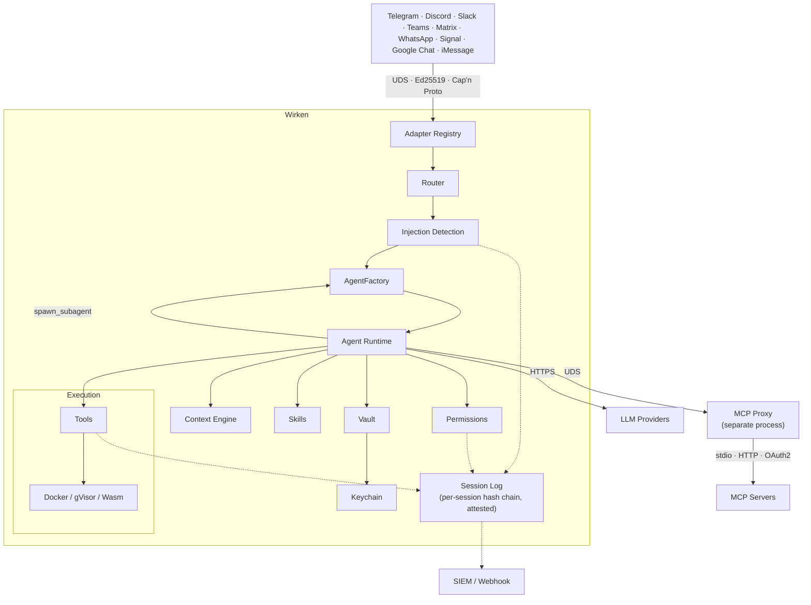

<!-- source: https://github.com/gebruder/wirken.git sha: 6ac9884e6d9b46b5ddd7f9803de3a004f068beea readme: main/README.md -->
# gebruder/wirken

The enterprise gateway for autonomous agents. Identity management, per-channel isolation, credential vault, per-session tamper-evident audit log.

---

# Wirken

[](LICENSE) [](https://github.com/gebruder/wirken/actions/workflows/ci.yml) [](https://github.com/gebruder/wirken/releases)


Wirken is the enterprise gateway for autonomous agents: the switchboard between your team's messaging channels and the AI agents working on their behalf. Your people reach it from a browser or the chat platforms they already use, like Slack and Teams, and the agent on the other end reads files, calls APIs, and runs tools for them. Each channel gets its own line.

Wirken is built for the security team that has to answer for what those agents do. It assumes any agent can be turned against you, and boxes in what a compromised one can reach.

It ships as a single static Rust binary, so it runs wherever your controls require: a locked-down workstation, a server inside your network, or an air-gapped host. Its model connection is provider-agnostic: frontier APIs like OpenAI, Anthropic, and Gemini, local weights through Ollama, TEEs for encrypted processing, or Infomaniak's Swiss-hosted Apertus, all interchangeable. Each agent runs the model you assign it, capped by a per-agent spend budget with usage reporting. Frontier or local, on your hardware or a remote host, the data boundary is yours to draw. MIT licensed.

## How it works

Wirken sits between your people and the agent. A message comes in on a channel, Wirken wakes an agent to handle it, and every file it reads, API it calls, and tool it runs passes through Wirken's controls first.

- **The agent is untrusted.** Wirken assumes any agent can be turned against you, whether by a prompt-injection payload hidden in a file or web page or by drift over a long session. The guarantees below do not depend on the model behaving.
- **Credentials never reach the model.** Tokens and keys stay in an encrypted vault. Wirken supplies them at the edge when it talks to a channel or an MCP tool; the agent and the LLM never see them.
- **Every action is logged before it runs, and attributed.** Each step is written to a signed, hash-chained audit log as a typed event, tagged with the person who triggered it, before it executes. The log streams to your SIEM.
- **Least privilege by default.** Each agent runs under a three-tier permission model, and any sub-agent it spawns is boxed by limits you set: which tools, which tier, how many rounds, how long.
- **Shell commands run in a sandbox.** Anything the agent executes runs in an ephemeral, network-less container, with gVisor as an option. If the sandbox is unavailable, execution is refused rather than run on the host.

## Install and run

### Prerequisites

- A supported OS: Linux (x86_64 or aarch64), macOS (Intel or Apple Silicon), or Windows 11 (x86_64).
- At least one model to talk to. Wirken connects to any of:
  - **Ollama** (any local model it serves)
  - Any **OpenAI-compatible** endpoint
  - **OpenAI**
  - **Anthropic**
  - **Google Gemini**
  - **AWS Bedrock**
  - **NVIDIA NIM** (local or cloud)
  - **Tinfoil** (TEE, encrypted processing)
  - **Privatemode** (TEE, encrypted processing)
  - **Infomaniak** (Swiss-hosted, including Apertus)
- Docker, if you want shell commands sandboxed (the default). Without it the agent simply cannot run shell commands; nothing else is affected.

Download the latest release binary:

```bash
curl -fsSL https://raw.githubusercontent.com/gebruder/wirken/main/install.sh | sh

wirken setup
wirken run
```

Pin the installer before piping. The committed `install.sh` has this SHA-256:

```
73e678196ea073608e902c8ab11a01ede07e0d37fddccaa20c43fa5d62bd52f5
```

Verify it yourself:

```bash
curl -fsSL https://raw.githubusercontent.com/gebruder/wirken/main/install.sh | sha256sum
```

The installer then fetches `checksums.sha256` and `checksums.sha256.sig` from the release, verifies the signature with `ssh-keygen -Y verify` against a signing key embedded in the script, and verifies the binary's SHA-256 against the signed checksums. Every failure path is fail-closed: missing signature, missing checksum, mismatched digest, or a machine without `sha256sum`/`shasum` aborts install. The only override is `WIRKEN_ALLOW_UNVERIFIED=1`, which warns on stderr and is documented in [docs/release-signing.md](docs/release-signing.md).

Prebuilt binaries are available for Linux (x86_64, aarch64), macOS (x86_64, Apple Silicon), and Windows 11 (x86_64). The Linux binaries are statically linked against musl with no glibc dependency. Windows users: the bash installer above does not apply; see [docs/windows.md](docs/windows.md) for the Windows install path and the feature-set differences (Signal adapter, orchestrator-push, service installer, and cron presets are Linux/macOS only).

`wirken setup` walks you through six steps:

```
  wirken setup
  ────────────

  Wirken is the switchboard between your messaging channels and an
  AI agent you control. Credentials never reach the LLM. Every
  action is logged in a signed, hash-chained audit log.

  Setup walks through six steps: provider, channels, credentials,
  service, sandbox, audit. About a minute.

  Continue [Y/n]: y

  ... (six interactive steps) ...

  Setup complete!

  Provider: anthropic (claude-sonnet-4-6)
  Channels: Telegram

  Next steps:
    wirken channel add <channel>      Add another messaging channel
    wirken credentials add <name>     Add or rotate a key
    wirken doctor                     Verify the install
    wirken sessions list              See active conversations

  WebChat: http://localhost:18790

  Start wirken: wirken run
```

`wirken run` starts wirken. It spawns adapter processes, accepts authenticated connections, routes messages to the agent, and serves a WebChat UI at `http://localhost:18790`:

```
  wirken v1.13.0
  ──────

  Provider: ollama/llama3.2
  Ollama version: 0.19.0
  Route: Telegram -> agent:default
  WebChat: http://localhost:18790

  Wirken running. Press Ctrl+C to stop.
```

All local services bind to 127.0.0.1. Wirken never instructs you to bind inference servers, WebChat, or any local endpoint to 0.0.0.0.

Install as a system service so wirken starts on login:

```bash
wirken setup --install-service
```

## Running modes

- **Interactive.** `wirken run` starts the gateway in the foreground, spawns the channel adapters, and serves WebChat. Ctrl+C stops it.
- **Browser.** That same `wirken run` serves WebChat at `http://localhost:18790`, bound to localhost, so your team can use Wirken without installing a chat app.
- **As a service.** `wirken setup --install-service` installs a systemd user unit on Linux or a launchd agent on macOS, so the gateway starts on login and runs headless. `wirken setup --uninstall-service` removes it.
- **Scheduled.** Preset agents run on a cron schedule with no human in the loop, under the same permission and audit controls, via `wirken preset schedule <name>` (and `unschedule`). Service and scheduled modes are Linux and macOS only.

## Uninstall

Removing the data directory is irreversible and destroys the signed, hash-chained audit log along with it. If any retention or compliance need applies, export the audit chain **before** you delete anything:

```bash
wirken audit log --format json > wirken-audit-export.json   # one-shot JSON snapshot
cp ~/.wirken/audit.db wirken-audit-backup.db                 # or copy the raw hash-chained DB
```

Then uninstall in order. The service and cron steps call the `wirken` binary, so run them before removing it:

```bash
# 1. Stop and remove the system service. Removes the systemd user unit
#    ~/.config/systemd/user/wirken.service on Linux, or the launchd agent
#    ~/Library/LaunchAgents/app.ottenheimer.wirken.plist on macOS.
wirken setup --uninstall-service

# 2. Remove any scheduled preset cron entries (leaves your own cron lines
#    intact). Repeat per installed preset, e.g. zirkel:
wirken preset unschedule zirkel

# 3. Remove the binary.
rm "${WIRKEN_INSTALL_DIR:-$HOME/.local/bin}/wirken"

# 4. Remove the data directory. Deletes the credential vault, the age-file
#    device key, and the audit chain. Irreversible.
rm -rf ~/.wirken
```

Residue the steps above do not touch:

- **Shell profile**: if you exported `WIRKEN_VAULT_PASSPHRASE` in `~/.bashrc`, `~/.zshrc`, or a similar file, delete that line.
- **OS keychain**: the default release build keeps the vault device key in the age-file keychain under `~/.wirken/keychain/`, which step 4 removes. Only a build with the `keychain-macos` or `keychain-linux` feature stores it in the OS keychain instead. In that case remove it by hand. On macOS, the generic-password items under service `dev.wirken.vault` (account `device-key`, plus one aux entry per auxiliary key, for example `alarm-log-hmac`). On Linux, the Secret Service items with attribute `application=wirken` (the device key is labeled `wirken-device-key`).
- **Platform-side registrations**: local deletion does not touch state you created at each messaging platform. Remove or revoke it there:
  - **iMessage (BlueBubbles)**: the adapter registers a callback webhook on your BlueBubbles server (`POST <bluebubbles_url>/api/v1/server/webhooks`). Delete it in the BlueBubbles server's webhook settings.
  - **Bots, apps, and tokens** you created stay live until you remove them at the platform: the Slack app and its bot/app tokens (Slack admin), the Telegram bot token (BotFather; the adapter long-polls, so there is no webhook to clear), the WhatsApp Cloud API app and its configured webhook URL (Meta App Dashboard), the Discord bot application (Discord Developer Portal), the Teams bot registration (Azure), the Matrix bot account (its homeserver), the Signal linked device (unlink it on the phone), and the Google Chat app. Rotating these credentials is prudent regardless, since they were held in the vault.

Windows uses different paths and a smaller feature set (no service installer or cron presets); see [docs/windows.md](docs/windows.md).

## Architecture

Each channel runs as its own isolated process. The gateway is the only component that holds credentials and writes the audit log. The agent is stateless: it is woken for each message and rebuilt from its session log.



- **Channel adapters.** Each channel runs as its own OS process. It authenticates to the gateway with a per-adapter Ed25519 challenge-response handshake over a Unix domain socket, and messages cross as Cap'n Proto (zero-copy, traversal-limited). An adapter can only send and receive for its own channel; it cannot invoke tools, read another channel's sessions, or reach another channel's credentials. Compromise one adapter and the blast radius is exactly that one channel, because the gateway's IPC boundary runs in a separate memory-safe process and blocks lateral movement.
- **Channel isolation.** Enforced at the process level today. A compile-time API (a sealed `Channel` trait and `SessionHandle<C: Channel>`) makes cross-channel mix-ups a build error, but it is not yet threaded through the production message path, where the channel is still a string field on the inbound frame.
- **MCP proxy.** MCP servers run behind a separate proxy process over a Unix domain socket, and the agent never sees MCP credentials. Two independent boundaries scope them: process isolation gives every `mcp.json` server its own subprocess and environment, and vault ACLs key each secret by name (`slack-token`, `github-pat`) so a connector receives only the credentials it was configured for. Neither alone is enough; together they stop one connector from reading another's secrets.
- **Stateless agents.** An agent keeps no state between turns. The `AgentFactory` wakes it per message by replaying its session log, an append-only per-session hash chain of typed events (messages, tool calls, tool results, LLM metadata). A crash mid-turn is detected on wake and surfaced as a failure rather than silently re-run. A context engine trims each conversation under the model's token budget before every call, dropping old tool results before user or assistant text.
- **Sub-agents.** An agent can delegate a bounded subtask through `spawn_subagent`, under an operator-set ceiling: tool allowlist, max permission tier, max rounds, max runtime. Children run headless, with their own session logs and a hard depth cap of 4.

## Security properties

- **Session attestation.** Per-agent Ed25519 identity signs the per-session hash chain after every turn. `wirken sessions verify` replays the log offline and re-checks message hashes, deterministic tool results, and chain integrity. Tampered sessions break the chain.
- **Reproducible replay.** Every LLM call is recorded as a typed session event with a SHA-256 hash of the exact messages and tools sent. The verifier recomputes these hashes from the log and flags any divergence.
- **Per-channel process isolation.** Each channel adapter runs in its own OS process with a distinct ed25519 identity. Type-level channel separation (`SessionHandle<Telegram>` vs `SessionHandle<Discord>`) exists in the IPC crate and is regression-tested but not yet used in the production message path.
- **Out-of-process credential isolation.** MCP credentials (bearer tokens, OAuth2 client secrets) live in a separate proxy process. The agent process never sees them. The vault is XChaCha20-Poly1305, keyed from the OS keychain; `secrecy` + `zeroize` make logging a secret a compile error.
- **Capability-attenuated multi-agent.** The LLM cannot widen a child agent's permissions. The operator sets the ceiling; the harness intersects, clamps, and enforces. Children run headless with no interactive approvals.

A handful of operator-controlled escape hatches relax specific
defaults: `WIRKEN_ALLOW_UNSIGNED_ORG_CONFIG=1`,
`WIRKEN_ALLOW_UNSIGNED_SKILLS=1`, `sandbox.json` mode `off`,
`WIRKEN_WEBCHAT_ALLOW_NO_ORIGIN=1`, and
`WIRKEN_AUDIT_VERIFY_EVERY_FLUSHES=N` (the last raises the
continuous-verify cadence; values above 10,000 effectively disable
the in-process verifier and emit a warn). Each is documented under
"Documented escape hatches" in the security-properties doc. Persistent flips need a
systemd `EnvironmentFile`, shell `rc` export, or wrapper script so the
operator's intent is durable across reboots.

Full OWASP and NIST AI RMF mappings: [docs/security-properties.md](docs/security-properties.md)

## Enterprise deployment

Wirken gives organizations the controls they need to deploy AI agents without bypassing existing security, compliance, and audit requirements.

- **Full attribution.** Every inbound message records the platform sender id, channel, session, and agent. Permission decisions are scoped per agent, not per user. Typed session events record what action ran, when, and on which target.
- **Tamper-evident audit trail.** All actions logged as typed session events before execution. Per-session SHA-256 hash chain detects modification or deletion. Per-agent Ed25519 attestation signs the chain head after every turn. `wirken sessions verify` replays the log offline and re-checks hashes. SIEM forwarding sends events to Datadog, Splunk HEC, Microsoft Sentinel, or any webhook in real time. A separate OpenTelemetry projection ships GenAI semconv spans over OTLP/HTTP+JSON to any OTLP-compatible backend; Microsoft documents a direct OTLP contract for non-SDK Agent 365 integration, which this projection implements. The per-release verification gate is described in [`docs/integrations/agent365.md`](docs/integrations/agent365.md).
- **Crash recovery.** Agents are stateless between turns. The harness replays the session log on wake. Incomplete tool rounds are detected and surfaced as failures rather than silently re-executed.
- **Graduated permissions.** Three-tier model. Workspace file access and web search are always allowed. Shell exec and external file access require first-use approval. Destructive operations, credential access, and network requests always require explicit approval. Approvals expire after 30 days. Skill installs are gated by registry-anchored signature verification, not by the tier system; the gate runs at `wirken skills install` time and again at every `SkillLoader::load_file` call, with `WIRKEN_ALLOW_UNSIGNED_SKILLS=1` as the documented opt-out.
- **Capability-attenuated multi-agent.** Parent agents delegate to children via `spawn_subagent` under operator-configured ceilings (tool allowlist, max permission tier, max rounds, max runtime). Children run headless with isolated session logs. Hard depth cap of 4.
- **Sandboxed execution.** Shell exec runs in an ephemeral Docker container by default (exec-only mode as of 0.7.5). Containers drop all Linux capabilities, set `no-new-privileges`, use Docker's default seccomp profile, use a read-only root filesystem with a 64 MB tmpfs at `/tmp`, pin memory and PIDs, and run as a non-root user with no network. gVisor (runsc) is opt-in for kernel attack surface reduction. If Docker is not reachable, the ToolRegistry logs a distinct warning and refuses `exec` (fail-closed) for the agent's lifetime rather than falling back to host execution; if runsc is requested but not registered, the warning names that dependency specifically. Sandbox provisioning is lazy, so there is no startup cost when unused. Operators who set `sandbox.json` to `mode: off` opt into running `exec` at the wirken UID with no container; the gateway warns at startup, and the host shell can then read or rewrite trust files under the data directory. See [docs/security-properties.md](docs/security-properties.md) for the full posture.
- **Egress allowlist scope.** The skill-set `egress.domains` list applies to the built-in `web_search` and `generate_image` tools. It does **not** apply to the `exec` shell sink (curl/wget run as the host shell), to MCP server children (which open their own outbound connections), or to the LLM HTTP client (which talks to the configured provider directly). Operators wanting hard egress control should run wirken inside a network namespace, restricted-egress container, or with OS-level firewall rules. See [`docs/egress.md`](docs/egress.md) for the full scope and mitigation guidance, and [`crates/agent/src/egress.rs`](crates/agent/src/egress.rs) for the source.
- **Context management.** A per-model context engine trims conversations under token budgets before every LLM call, preferring to drop old tool results before touching user or assistant text. Structured compaction events are written to the session log and projected back into the prompt so the model knows what was trimmed.
- **Prompt injection detection.** Inbound messages are scanned for role-switching attempts, instruction overrides, base64-encoded commands, tool-call injection, and system prompt extraction. Detected threats are flagged in the session log and forwarded to SIEM; messages are not blocked.
- **Confidential inference.** Tinfoil and Privatemode providers run LLMs inside TEEs (AMD SEV-SNP, Intel TDX). Tinfoil dispatch goes through the [tinfoil-rs SDK](https://github.com/tinfoilsh/tinfoil-rs) so each session gates on AMD SEV-SNP hardware attestation plus Sigstore code-provenance verification, and chat traffic flows over a TLS connection pinned to the attested certificate. See the [Tinfoil reference instance](docs/reference/tinfoil.md) and the [Privatemode reference instance](docs/reference/privatemode.md) for the end-to-end trust models and deployment recipes.
- **Encrypted credentials.** XChaCha20-Poly1305 vault keyed from the OS keychain. Per-credential expiry and rotation. No plaintext export. MCP credentials are isolated in a separate proxy process.
- **Centralized policy.** `wirken setup --org https://wirken.corp.example.com` pulls provider, SIEM, MCP, and permission config from a company endpoint. Developers get grab-and-go setup. IT manages one config. Policy refreshes on every `wirken run`.

## Known limitations

Wirken contains the blast radius of a compromised agent; it does not make compromise impossible. The honest edges:

- **Egress is not fully contained.** The skill-set `egress.domains` allowlist covers the built-in `web_search` and `generate_image` tools only. It does not constrain the `exec` shell (curl and wget run as the host shell), MCP server children, or the LLM client. Hard egress control needs a network namespace, a restricted-egress container, or OS firewall rules. See [docs/egress.md](docs/egress.md).
- **The sandbox can be turned off.** With `sandbox.json` set to `mode: off`, `exec` runs at the Wirken UID with no container, and the host shell can then read or rewrite trust files under the data directory. The gateway warns at startup when this is set.
- **Audit tamper-evidence assumes an out-of-band anchor.** The hash chain and signature detect modification, but a same-UID attacker who rewrites both the log and the local public key is only caught if you verify against a key kept off the machine. See [docs/security-properties.md](docs/security-properties.md).
- **Injection detection flags, it does not block.** Suspicious inbound messages are marked in the audit log and forwarded to your SIEM, but they are not stopped. The permission tiers and the sandbox are what limit what an injected agent can actually do.
- **Type-level channel isolation is not in the hot path yet.** Channel separation is enforced at the process level today. The compile-time `SessionHandle<Channel>` API exists and is tested, but is not yet threaded through the production message path.
- **Escape hatches exist.** A handful of environment flags relax defaults (unsigned org config or skills, WebChat origin checks, audit-verify cadence). Each is documented and warns when engaged.

## Documentation

- [Getting started](docs/getting-started.md)
- [Deploying for teams](docs/deploying-for-teams.md) (shared inference, per-channel adapters, current limitations)
- [Permissions and identity](docs/permissions-and-identity.md) (what exists today, what is planned)
- [CLI reference](docs/cli.md)
- [Configuration reference](docs/configuration.md)
- [Channel setup](docs/channels.md) (Telegram, Discord, Slack, Teams, Matrix, Signal, Google Chat, iMessage)
- [Multi-agent setup](docs/multi-agent.md)
- [Skills guide](docs/skills.md) (markdown skills, Wasm skills, registry)
- [Lyrik overview](docs/lyrik-overview.md) (security-assessment skill, what it is and why)
- [MCP setup](docs/mcp.md)
- [Security properties](docs/security-properties.md) (OWASP and NIST AI RMF mappings)
- [Enterprise deployment](docs/enterprise.md) (org config, SIEM, sandbox)
- [Microsoft Agent 365 integration](docs/integrations/agent365.md) (OpenTelemetry projection, wire contract, Tier A and Tier B verification framing)
- [Migration from OpenClaw](docs/migration.md)
- [Troubleshooting](docs/troubleshooting.md)
- [Architecture](docs/architecture.md)
- [Enforcement model](docs/enforcement-model.md) (compile-time vs. runtime guarantees)
- [Release process](docs/release-process.md) (version bump, tag, sign, publish, smoke test)
- [Release signing](docs/release-signing.md) (Ed25519 key, rotation, verification)

## Contributing

Wirken is a Rust workspace. All crates compile and test independently:

```bash
cargo test                        # full test suite
cargo test -p wirken-vault        # test one crate
cargo build -p wirken-cli         # build the binary
```

Building from source needs a recent stable Rust toolchain and the Cap'n Proto compiler. Install `capnp` via your package manager (`apt-get install -y capnproto` on Ubuntu, `brew install capnp` on macOS, `choco install capnproto -y` on Windows), then `cargo install --path crates/cli`.

The architecture is documented in [docs/architecture.md](docs/architecture.md).

**Adapter contributions are especially welcome.** Each adapter is an independent crate (`crates/adapter-<channel>/`) that implements the same IPC contract: connect to the gateway UDS, perform Ed25519 handshake, convert platform messages to/from Cap'n Proto frames. See any existing adapter for the pattern (Telegram is the simplest; Teams shows the HTTP webhook variant).

## The name

Wirken: German, *to work*, *to weave*, *to have effect*. Named for [Gebruder Ottenheimer](https://gebruder.ottenheimer.app/briefs/wirken.html), a weaving mill in Wurttemberg, 1862-1937.

## License

MIT
