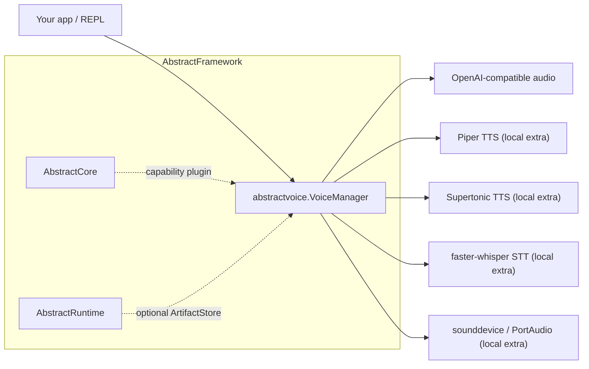

<!-- source: https://github.com/lpalbou/AbstractVoice.git sha: 42d2e4cb745f1af0adcbb0b389b2080a00813c2a readme: main/README.md -->
# lpalbou/AbstractVoice

Modular Python voice I/O for AI applications. Text-to-speech, speech-to-text, and voice cloning with local-first defaults and remote provider support. One interface across Piper, Supertonic, OpenAI, OmniVoice, and more.

---

# AbstractVoice

[](https://pypi.org/project/abstractvoice/)
[](https://github.com/lpalbou/AbstractVoice/actions/workflows/ci.yml)
[](https://github.com/lpalbou/AbstractVoice/actions/workflows/ci.yml)
[](https://github.com/lpalbou/AbstractVoice/blob/main/LICENSE)
[](https://github.com/lpalbou/AbstractVoice/stargazers)

Lightweight **voice I/O** for AI applications: remote/OpenAI-compatible audio
adapters by default, plus local TTS, STT, microphone control, streaming speech
output, and optional voice cloning behind explicit extras.

AbstractVoice is useful on its own, and it is also the voice capability package
for the AbstractFramework ecosystem. It does not force you to run a daemon:
embed `VoiceManager` directly when you want an in-process library; install it
beside AbstractCore when you want OpenAI-compatible HTTP audio endpoints.

- **Remote audio (base install)**: OpenAI/OpenAI-compatible TTS, STT, profile listing, and compatible clone endpoints
- **Platform local stacks (`abstractvoice[apple]`, `abstractvoice[gpu]`)**: Piper, Supertonic 3, faster-whisper, microphone/playback, AEC, and local cloning/TTS engines
- **Hardware profile aliases**: `abstractvoice[apple]` and `abstractvoice[gpu]` install the local stack; `abstractvoice[all-apple]` and `abstractvoice[all-gpu]` add the lightweight web example dependencies.
- **Granular local extras**: `abstractvoice[piper]`, `abstractvoice[supertonic]`, `abstractvoice[stt]`, `abstractvoice[stt-hf]`, `abstractvoice[audio-io]`, `abstractvoice[cloning]`, `abstractvoice[audiodit]`, `abstractvoice[omnivoice]`, `abstractvoice[chroma]`
- **Headless/server-friendly**: `speak_to_bytes()`, `speak_to_file()`, `transcribe_*`
- **Streaming TTS**: `speak_to_audio_chunks()` and `open_tts_text_stream()`
- **Voice cloning / heavier TTS (optional)**: OmniVoice is the recommended/default local cloning backend; OpenF5, Chroma, and AudioDiT remain explicit alternatives. Supertonic is fixed-profile TTS, not cloning.
- **Local web example (optional)**: `abstractvoice web`
- **AbstractCore plugin**: discovered through `abstractcore.capabilities_plugins`

Status: **alpha** (`0.10.x`). The base install and library constructor are
remote-first: `VoiceManager()` and library `auto` select hosted OpenAI audio and require
`OPENAI_API_KEY` (or `remote_api_key=...`). Local/offline stacks are available
through `abstractvoice[apple]` / `abstractvoice[gpu]` or granular engine
composition such as `abstractvoice[supertonic,stt,audio-io]`.
The shipped CLI and web examples use an install-aware `auto` resolver instead:
installed Supertonic first, installed Piper second, then OpenAI remote as a
fallback. This keeps plain `abstractvoice` remote/OpenAI by default, while
`abstractvoice[all-apple]` and `abstractvoice[all-gpu]` start on Supertonic.
Use an explicit local provider such as `--tts-engine supertonic` when you require
no remote TTS.
For new local voice clones, the default cloning backend is OmniVoice; install
`abstractvoice[omnivoice]` or a platform/full profile before using clone
commands without `--engine`. Optional cloning and torch-based engines are
heavier and should be validated on your target hardware. The supported integrator surface is documented in
`docs/api.md`, and current engine caveats are tracked in
`docs/known-issues.md`.

Next: `docs/getting-started.md` (recommended setup + first smoke tests).
Published documentation: <https://www.lpalbou.info/AbstractVoice/>.

## Positioning: Library First, Server Through AbstractCore

AbstractVoice has four intended usage modes:

1. **Standalone Python library**: call `VoiceManager` directly from a desktop app,
   local assistant, batch job, or your own backend.
2. **Local examples**: use the REPL (`abstractvoice`) or the optional FastAPI web
   example (`abstractvoice web`) to validate `VoiceManager` from a browser.
3. **AbstractCore capability plugin**: install it next to AbstractCore and let
   AbstractCore expose voice/audio capabilities to agents and OpenAI-compatible
   clients.
4. **AbstractFramework component**: use it as the voice layer inside the wider
   AbstractFramework stack (`https://github.com/lpalbou/abstractframework`).

Key links:
- AbstractCore (agents/capabilities): `https://abstractcore.ai` and `https://github.com/lpalbou/abstractcore`
- AbstractFramework (umbrella): `https://github.com/lpalbou/abstractframework`

Integration points:

- AbstractCore capability plugin entry point: `pyproject.toml` → `[project.entry-points."abstractcore.capabilities_plugins"]`  
  Implementation: `abstractvoice/integrations/abstractcore_plugin.py`
- AbstractRuntime ArtifactStore adapter (optional, duck-typed): `abstractvoice/artifacts.py`

**Important**: AbstractVoice is a **voice I/O library** (TTS/STT + optional
cloning), not an agent framework and not a standalone LLM server. That boundary
is intentional: in the AbstractFramework stack, **AbstractCore** owns agents,
provider routing, and OpenAI-compatible HTTP endpoints; AbstractVoice supplies
the concrete voice implementation.



The shipped AbstractCore integration is via the capability plugin above. The `abstractvoice` REPL is a **demonstrator/smoke-test harness** (see `docs/repl_guide.md`) and includes a minimal OpenAI-compatible LLM HTTP client (`abstractvoice/examples/llm_provider.py`) for convenience.

### Use with AbstractCore

Install AbstractVoice into the same environment as AbstractCore:

```bash
pip install "abstractcore[server]" abstractvoice
```

AbstractCore discovers AbstractVoice through the
`abstractcore.capabilities_plugins` entry point and can use it as:

- `core.voice.tts(...)` / `llm.voice.tts(...)` for TTS, with explicit
  `provider`, `model`, and `voice` selection
- `core.audio.transcribe(...)` / `llm.audio.transcribe(...)` for STT, with
  explicit `provider` and `model` selection
- generic capability discovery (`llm.capabilities.*`) for audio now works even
  when AbstractCore selects the STT-only backend (`abstractvoice:stt`), via
  `available_providers(task=None)` and `list_models(task=None, provider=...|provider_id=...)`
- lightweight provider discovery through `available_providers()`, which exposes
  clean `tts`, `stt`, and `cloning` provider lists plus per-provider details
- provider-scoped model and voice discovery through:
  - `list_models(kind="tts"|"stt"|"cloning", provider=...)`
  - `list_tts_models(provider=...)`
  - `list_stt_models(provider=...)`
  - `list_cloning_models(provider=...)`
  - `list_tts_voices(provider=..., model=...)`
  - `list_cloned_voices(provider=..., model=...)`
  - `get_capability_support(...)` / `find_compatible_models(...)`
  - `voice_catalog()`
- first-class clone creation through:
  - `clone(audio, provider=..., model=..., name=..., reference_text=..., artifact_store=...)`
  - `clone_voice(...)` as a compatibility alias
- local engine residency (process warmup/unload) through:
  - `load_resident_model(...)`, `list_resident_models(...)`, and `unload_resident_model(...)`
  - scope: cloned-TTS engines + local base TTS on the voice backend (`abstractvoice:default`), and local STT on the audio backend (`abstractvoice:stt`)
- nested provider catalogs in `voice_catalog()`:
  - `tts_catalog_by_provider[provider]` -> `models`, `model_variants`,
    `voices`, `profiles`, `cloned_voices`, `voices_by_model`
  - `stt_catalog_by_provider[provider]` -> `models`, `model_variants`
- combined `provider:model` selectors for both TTS and STT, so Core/Gateway can
  accept either split fields such as `provider="openai", model="tts-1"` or a
  single combined value such as `provider="openai:tts-1"` or
  `provider="faster-whisper:large"`
- OpenAI-compatible server endpoints when AbstractCore Server is running:
  - `POST /v1/audio/speech`
  - `POST /v1/audio/transcriptions`
  - `GET /v1/audio/voices`, `/v1/audio/speech/models`, and
    `/v1/audio/transcriptions/models` for UI catalog discovery

The abstraction is intentionally simple:

- `provider` = engine/backend (`openai`, `openai-compatible`, `piper`,
  `supertonic`, `faster-whisper`, `transformers-asr`, ...)
- `model` = provider-specific selectable model id
- `voice` = a built-in/base voice profile id or a cloned voice id available for
  the selected `provider` + `model`

For TTS, AbstractCore can drive the plugin with calls such as
`core.voice.tts(text, provider="openai", model="tts-1", voice="alloy")` or
`core.voice.tts(text, provider="openai:tts-1", voice="voice_abc123")`. For
STT, use `core.audio.transcribe(audio, provider="faster-whisper", model="large")`
or `provider="transformers-asr:Qwen/Qwen3-ASR-1.7B"`.

For a remote-first Gateway/Core deployment, the AbstractCore plugin defaults to
OpenAI remote TTS/STT and reads `OPENAI_API_KEY`. Configure
`voice_tts_engine=openai-compatible` (provider), `voice_stt_engine=openai-compatible` (provider), and
`voice_remote_base_url=...` for a compatible audio endpoint. For local
Supertonic/Piper/faster-whisper inside the same environment, install
`abstractvoice[apple]` or `abstractvoice[gpu]`, or compose granular extras such
as `abstractvoice[supertonic,stt]`, then select the local providers explicitly.

Do not point `voice_remote_base_url` back at the same AbstractCore Server
instance that is resolving the plugin fallback; that loops through
`/v1/audio/*` recursively. Use an upstream provider/gateway URL, or install the
local extra and select local providers.

Minimal server smoke test:

```bash
OPENAI_API_KEY=... python -m abstractcore.server.app

curl -X POST http://localhost:8000/v1/audio/speech \
  -H "Content-Type: application/json" \
  -d '{"input":"Hello from AbstractVoice through AbstractCore.","format":"wav"}' \
  --output hello.wav

curl -X POST http://localhost:8000/v1/audio/transcriptions \
  -F "file=@hello.wav" \
  -F "language=en"
```

For the current AbstractCore surface, see `https://abstractcore.ai` and
`https://github.com/lpalbou/abstractcore`.

### Use with AbstractFramework

If you’re using the full AbstractFramework stack, install and run via the umbrella project and gateway tooling. Start here: `https://github.com/lpalbou/abstractframework`.

---

## Install

Requires Python `>=3.9` (see `pyproject.toml`).

```bash
pip install abstractvoice
```

This is the lightweight remote/plugin base. It uses OpenAI audio by default:

```bash
OPENAI_API_KEY=... abstractvoice \
  --provider openai \
  --model tts-1 \
  --voice alloy \
  --prompt "Hello from AbstractVoice." \
  --output hello.wav
```

The one-shot command writes audio and exits. Use `--provider
openai-compatible --api http://localhost:8000/v1` for compatible remote audio
servers, or a local provider such as `--tts-engine supertonic` after installing
the matching local extra.

```bash
export OPENAI_API_KEY=...
```

For local desktop/REPL voice and local cloning engines, use the platform
profile for your machine:

```bash
pip install "abstractvoice[apple]"
pip install "abstractvoice[gpu]"
```

Common extras:

```bash
pip install "abstractvoice[openai]"            # hosted OpenAI intent extra (no extra deps today)
pip install "abstractvoice[openai-compatible]" # generic compatible provider intent extra
pip install "abstractvoice[web]"               # local FastAPI web example
pip install "abstractvoice[piper]"             # local Piper TTS only
pip install "abstractvoice[supertonic]"        # local Supertonic 3 ONNX TTS only
pip install "abstractvoice[stt]"               # local faster-whisper STT only
pip install "abstractvoice[stt-hf]"            # local Transformers/Hugging Face ASR (e.g. openai/whisper-large-v3, openai/whisper-large-v3-turbo, Qwen/Qwen3-ASR-1.7B)
pip install "abstractvoice[omnivoice]"         # recommended/default local cloning engine
pip install "abstractvoice[cloning]"           # explicit OpenF5 cloning engine
```

Notes:
- `abstractvoice[apple]` and `abstractvoice[gpu]` are platform install profiles for the local voice stack: Piper, Supertonic 3, faster-whisper, audio I/O, AEC where supported, and local cloning/TTS engines gated by Python-version markers.
- `abstractvoice[all-apple]` and `abstractvoice[all-gpu]` install the full platform stack plus the web example dependencies.
- Local base TTS should prefer Supertonic (`--tts-engine supertonic`), while
  local cloning defaults to OmniVoice (`--cloning-engine omnivoice`).
- Python 3.9 supports the lightweight base, web UI, local Piper/Supertonic/faster-whisper, and AudioDiT TTS/prompt-audio cloning. OpenF5/F5-TTS, Chroma, and OmniVoice require Python 3.10+ because their upstream runtimes do; AEC requires Python 3.11+ because `aec-audio-processing` does.
- For the full list of extras (and platform troubleshooting), see `docs/installation.md`.

### Explicit model downloads (recommended; never implicit in the REPL)

Some features rely on large model weights/artifacts. AbstractVoice will **not**
download these implicitly inside the REPL (offline-first).

After installing, prefetch explicitly (cross-platform).

Recommended (most users):

```bash
abstractvoice-prefetch --supertonic
abstractvoice-prefetch --piper en
abstractvoice-prefetch --stt small
```

Optional (voice cloning artifacts):

```bash
pip install "abstractvoice[cloning]"
abstractvoice-prefetch --openf5

# Heavy (torch/transformers):
pip install "abstractvoice[audiodit]"
abstractvoice-prefetch --audiodit

pip install "abstractvoice[omnivoice]"
abstractvoice-prefetch --omnivoice

# GPU-heavy:
pip install "abstractvoice[chroma]"
abstractvoice-prefetch --chroma
```

OmniVoice is the default local cloning backend for new clones. Supertonic is not
a cloning engine; use it for fixed-profile base TTS.

Equivalent `python -m` form:

```bash
python -m abstractvoice download --supertonic
python -m abstractvoice download --piper en
python -m abstractvoice download --stt small
python -m abstractvoice download --openf5   # optional; requires abstractvoice[cloning]
python -m abstractvoice download --chroma   # optional; requires abstractvoice[chroma] (GPU-heavy)
python -m abstractvoice download --audiodit # optional; requires abstractvoice[audiodit]
python -m abstractvoice download --omnivoice # optional; requires abstractvoice[omnivoice]
```

Notes:
- `--piper <lang>` downloads the Piper ONNX voice for that language into `~/.piper/models`.
- `--supertonic` downloads Supertonic 3 ONNX weights and built-in voice styles into `~/.cache/abstractvoice/supertonic-3`.
- `--openf5` is ~5.4GB. `--chroma` is very large (GPU-heavy).

---

## Quick smoke tests

### REPL (fastest end-to-end)

```bash
abstractvoice --verbose
# or (from a source checkout):
python -m abstractvoice cli --verbose

# Force hosted OpenAI audio:
OPENAI_API_KEY=... abstractvoice --tts-engine openai --stt-engine openai --verbose
```

Notes:
- Mic voice input is **off by default** for fast startup. Enable with `--voice-mode stop` (or in-session: `/voice stop`).
- The REPL is **offline-first**: no implicit model downloads. Use the explicit download commands above.
- Interactive `auto` prefers installed Supertonic, then installed Piper, then
  OpenAI remote. A plain lightweight install therefore starts on OpenAI, while
  `abstractvoice[all-apple]` / `abstractvoice[all-gpu]` start on Supertonic. If
  the status line says `openai (remote)`, `/speak` is making a remote TTS
  request.
- For guaranteed local REPL TTS, install `abstractvoice[supertonic]` or a
  platform profile, prefetch explicitly, and start with
  `abstractvoice --tts-engine supertonic --stt-engine faster_whisper`.
- Local providers never download during REPL synthesis; missing artifacts fail
  with a prefetch hint instead of silently falling back to remote TTS.
- REPL voice selection is centered on `/voices`; older commands such as
  `/profile`, `/tts_voice`, and `/setvoice` remain as compatibility/direct
  forms.
- Switching base TTS with `/tts engine ...` resets the base voice/profile to the
  default for that engine and language; for example Supertonic starts on `M1`.
- The REPL is primarily a **demonstrator**. For production agent/server use in the AbstractFramework ecosystem, run AbstractCore and use AbstractVoice via its capability plugin (see `docs/api.md` → “Integrations”).

See `docs/repl_guide.md`.

### Local web example

```bash
pip install "abstractvoice[web]"
abstractvoice web --port 5000

# Hosted OpenAI audio in the same web UI
OPENAI_API_KEY=... abstractvoice web --tts-engine openai --stt-engine openai

# Guaranteed local web TTS after explicit prefetch
abstractvoice web --tts-engine supertonic --stt-engine faster_whisper

# OpenAI-compatible remote audio
abstractvoice web --tts-engine openai-compatible --stt-engine openai-compatible --remote-base-url http://localhost:8000/v1
```

Use `pip install "abstractvoice[web,supertonic]"` for the browser UI plus
Supertonic, `pip install "abstractvoice[web,omnivoice]"` for OmniVoice, or
`pip install "abstractvoice[all-apple]"` / `abstractvoice[all-gpu]` for the
browser UI plus the platform local stack.

Open `http://127.0.0.1:5000`. The browser example has message/conversation
playback, chat clearing, assistant/user voice selectors, browser voice cloning
from uploaded or recorded reference audio, text-to-WAV, file transcription, and
a tiny optional LLM dialogue panel for OpenAI-compatible local providers such as
Ollama or LM Studio. It exposes small local `/api/*` routes plus `/v1/audio/*`
smoke-test aliases. The `/v1/audio/voices` and `/v1/voice/clone` extension
routes let another AbstractVoice client discover profiles/cloned voices and
request compatible remote cloning. The supported production HTTP path remains
AbstractCore Server. Treat the browser example as a local/dev surface: it does
not inherit AbstractCore/Gateway bearer-token or browser-origin policy.

The browser clone action validates the new voice by synthesizing a short sample
before it reports success. If the selected optional engine cannot load, the
unusable clone is removed and the UI shows the backend error.

### Local Python

```python
from abstractvoice import VoiceManager

vm = VoiceManager()
vm.speak("Hello! This is AbstractVoice.")
```

`VoiceManager()` is remote-first and reads `OPENAI_API_KEY` from the
environment. For offline/local inference:

```python
from abstractvoice import VoiceManager

vm = VoiceManager(
    tts_engine="supertonic",
    stt_engine="faster_whisper",
    cloning_engine="omnivoice",
)
vm.speak("Hello from the local stack.")
```

Install local support first with `pip install "abstractvoice[supertonic]"`
and `pip install "abstractvoice[omnivoice]"`, or a platform profile such as
`abstractvoice[apple]` / `abstractvoice[gpu]`.

---

## Public API (stable surface)

See `docs/api.md` for the supported integrator contract.

At a glance:
- **TTS**: `speak()`, `set_tts_engine()`, `stop_speaking()`, `pause_speaking()`, `resume_speaking()`, `speak_to_bytes()`, `speak_to_file()`
- **STT**: `transcribe_file()`, `transcribe_from_bytes()`
- **Mic**: `listen()`, `stop_listening()`, `pause_listening()`, `resume_listening()`

---

## Documentation

- **Published site**: <https://www.lpalbou.info/AbstractVoice/>
- **Getting started**: `docs/getting-started.md`
- **Public API**: `docs/api.md`
- **Architecture**: `docs/architecture.md`
- **FAQ**: `docs/faq.md`
- **REPL guide**: `docs/repl_guide.md`
- **Known issues**: `docs/known-issues.md`
- **Docs index**: `docs/README.md`
- **Install troubleshooting**: `docs/installation.md`
- **Multilingual support**: `docs/multilingual.md`
- **Design decisions**: `docs/adr/`
- **Acronyms**: `docs/acronyms.md`
- **Model management**: `docs/model-management.md`
- **Licensing notes**: `docs/voices-and-licenses.md`

---

## Project

- **Changelog**: `CHANGELOG.md`
- **Contributing**: `CONTRIBUTING.md`
- **Known issues**: `docs/known-issues.md`
- **Bug reports**: `.github/ISSUE_TEMPLATE/bug_report.yml`
- **Security**: `SECURITY.md`
- **Acknowledgments**: `ACKNOWLEDGMENTS.md`

## License

MIT. See `LICENSE`.
