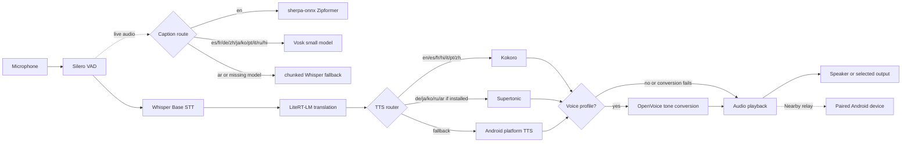
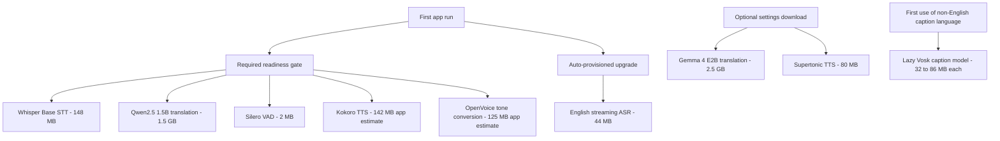
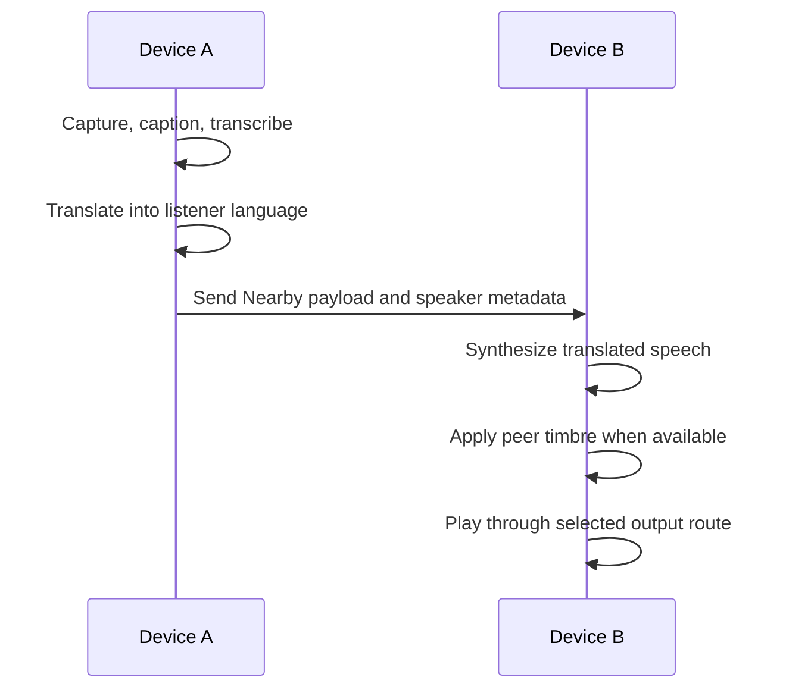
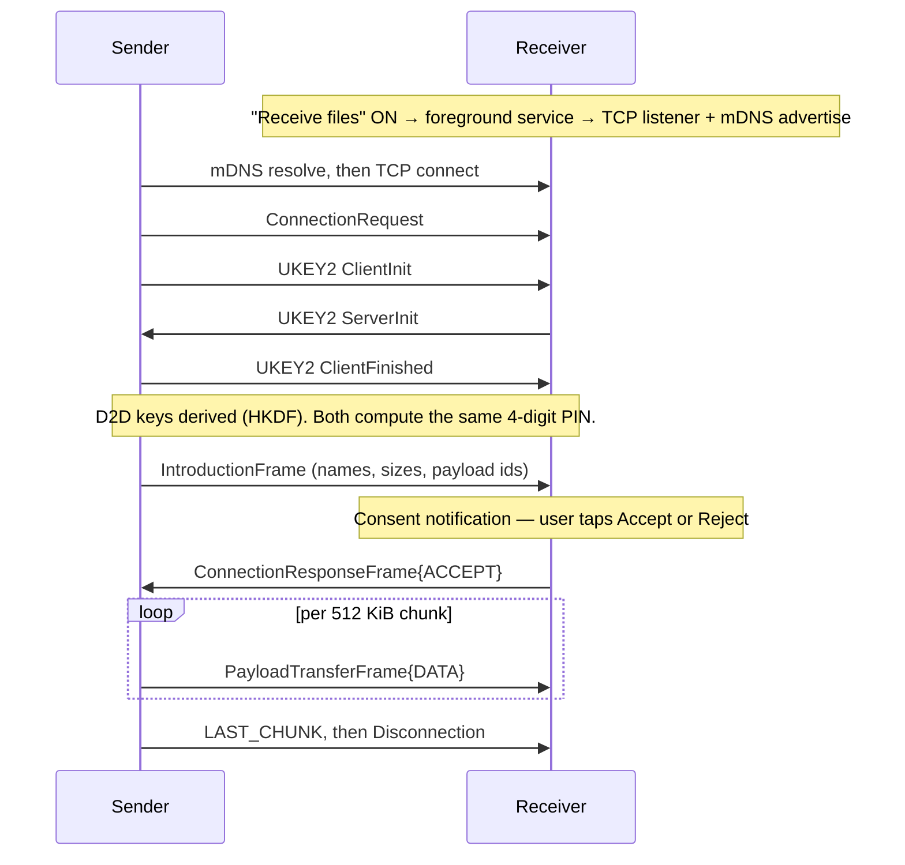
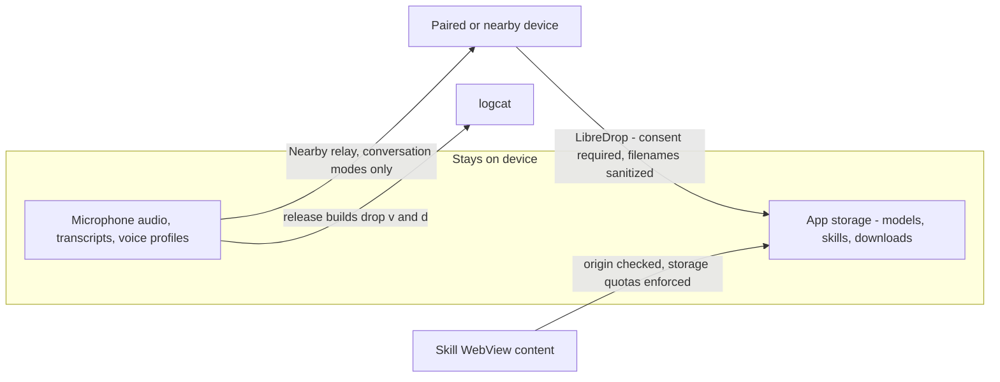
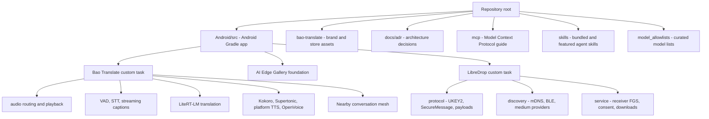
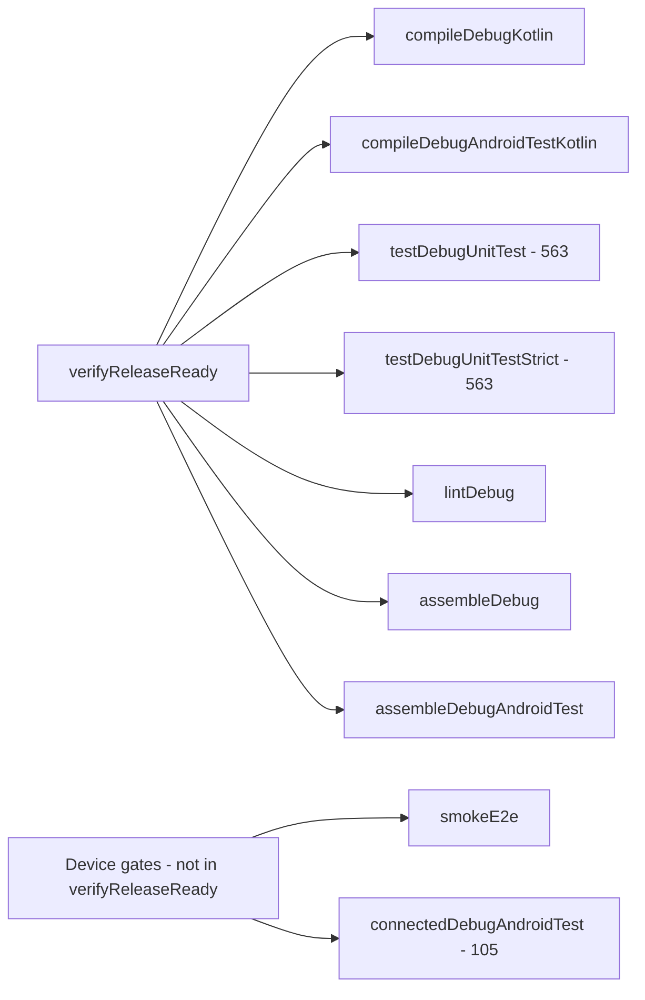

<!-- source: https://github.com/d4551/Bao-Translate.git sha: c481555215ba6d171f1d74e3410d68f96e8f8ced readme: main/README.md -->
# d4551/Bao-Translate

Private, on-device Android speech translator with live captions, LiteRT-LM translation, local TTS, voice cloning, Bluetooth audio routing, and Nearby relay.

---

<p align="center">
  
</p>

<h1 align="center">Bao Translate</h1>

<p align="center"><strong>Private, on-device live speech translation with local voice cloning.</strong></p>

<p align="center">
  <a href="LICENSE"></a>
  
  
  
  
  
  
  
  
</p>

## ELI5

Bao Translate is a tiny interpreter that runs on your Android phone. You speak, it captions and translates the words, then it speaks the translation out loud. If you enroll a short local voice profile, translated speech can be converted toward your timbre. After the model stack is downloaded, conversation audio and voice profiles stay on the device.

It also carries **LibreDrop**: two phones on the same Wi-Fi can send each other files directly. One phone announces itself on the network, the other finds it, they do a secret handshake, both screens show the same 4-digit number so you can check you're talking to the right phone, and then the file goes across. Nothing touches a server.

## What It Does

- **Live speech translation:** microphone audio flows through local VAD, STT, translation, TTS, and playback.
- **Streaming captions:** English uses a sherpa-onnx Zipformer transducer; 10 other languages use lazy Vosk caption models; Arabic falls back to chunked Whisper captions.
- **On-device translation:** Qwen2.5 1.5B is the required LiteRT-LM translation model; Gemma 4 E2B is an optional upgrade.
- **On-device speech:** Kokoro handles en/es/fr/hi/it/pt/zh; optional Supertonic handles de/ja/ko/ru/ar; Android platform TTS is the fallback when a supplemental voice is unavailable.
- **Voice cloning:** OpenVoice ONNX tone conversion is provisioned with the required stack and is applied when a local or peer voice profile is available.
- **Conversation modes:** face-to-face use, continuous translation, per-speaker language selection, Bluetooth audio routing, and Nearby Connections relay between Android devices.
- **Model management:** downloads are curated, status-tracked, resumable, integrity-checked, and visible in the app.
- **LibreDrop peer-to-peer transfer:** a from-scratch implementation of the Quick Share wire protocol (UKEY2 handshake, D2D key derivation, SecureMessage channel, chunked payloads) with send and receive over Wi-Fi LAN. See [docs/LIBREDROP.md](docs/LIBREDROP.md) for the protocol, security properties, and the parts that are not wired yet.

## How It Works



The live caption path is optimized for responsiveness while Whisper provides the final transcript used for translation. The TTS router chooses the best local speech engine for the target language, then OpenVoice can convert the synthesized audio toward the enrolled speaker timbre.

## Model Provisioning



Required models must be ready before the core translation loop is considered ready. The English streaming caption model is auto-provisioned but does not block the required readiness gate. Vosk caption models are downloaded only when a language needs them.

## Conversation Relay



Nearby Connections is used for the two-device mesh. Each side can keep its own source and target language, and peer timbre metadata lets the receiving device speak the translation in the other speaker's voice profile when available.

## LibreDrop File Transfer

LibreDrop speaks the Quick Share wire protocol directly — the transfer itself does not go through Google Play Services. Receiving runs in a `connectedDevice` foreground service so the device stays reachable while the app is backgrounded; it is opt-in and off by default.



| Capability | State |
| --- | --- |
| Receive over Wi-Fi LAN | Working |
| Send over Wi-Fi LAN | Working |
| Wi-Fi Direct / hotspot / Bluetooth upgrade | Medium providers exist; the sender does not negotiate a bandwidth upgrade |
| Consent surface | In-app modal (`LibreDropConsentActivity`) with heads-up notification actions as fallback; both drive the same decision sink |
| QR pairing, AI file descriptions, voice share | Code present, no UI entry point |

Peer-supplied filenames are sanitized before they reach MediaStore or a `File` — separators, control characters, NUL, leading dots and `..` segments are all neutralised. Full detail, including known gaps, is in [docs/LIBREDROP.md](docs/LIBREDROP.md).

## Privacy And Trust Boundaries

Everything after provisioning runs locally: speech, transcript, translation, synthesis and voice conversion never leave the device, and LibreDrop transfers go peer-to-peer without a relay server. The boundaries that data does cross are handled explicitly.



| Boundary | Control | Proven by |
| --- | --- | --- |
| Diagnostic logging | `BaoLog.shouldEmit` drops `v` and `d` in release builds — those are the levels where call sites interpolated typed input and model responses. `i`/`w`/`e` survive for field bug reports and are expected to carry shapes, not content. Release does not minify, so nothing else would have stripped them. | `BaoLogTest` |
| Inbound files | Every peer-supplied name goes through `FilenameSanitizer` before MediaStore or a `File`; a transfer only starts after an explicit Accept in `LibreDropConsentActivity` or its notification fallback. Receiving is opt-in and off on a fresh install. | `FilenameSanitizerTest`, `ConsentIntentsTest`, `LibreDropConsentActivityTest`, `ReceiveModePreferencesTest` |
| Skill WebView | `isTrustedLocalWebViewUrl` compares full origin (scheme, host, port) rather than prefix, so userinfo spoofing and look-alike hosts are rejected; the WebView runs JavaScript, so this is the gate. | `WebViewTrustAndFileNameTest` |
| Skill storage bridge | `SkillStorageBridge` caps what page JavaScript can persist before it reaches `SharedPreferences`: keys ≤ 256 chars, values ≤ 64 KiB, 512 entries total, with a rejected write returning `false` rather than throwing. | `SkillStorageBridgeTest` |
| Imported model names | `ensureValidFileName` replaces path separators and everything outside `[A-Za-z0-9._-]`. Its one documented gap — leading dots are not stripped — is pinned by a test rather than left implicit. | `WebViewTrustAndFileNameTest` |

## Supported Languages

English, Spanish, French, German, Chinese, Japanese, Korean, Portuguese, Italian, Russian, Arabic, and Hindi.

| Capability | Coverage |
| --- | --- |
| Translation targets | All 12 selectable languages |
| Source language | Manual selection or Auto detect |
| Live captions | English via sherpa-onnx Zipformer; es/fr/de/zh/ja/ko/pt/it/ru/hi via Vosk; Arabic via chunked Whisper fallback |
| Local speech | Kokoro for en/es/fr/hi/it/pt/zh; Supertonic for de/ja/ko/ru/ar when installed; Android platform TTS fallback |
| Voice conversion | OpenVoice tone conversion for enrolled local and peer voice profiles |

## Model Stack

Models are downloaded in-app from curated sources on first use or from settings.

| Role | Model | Provisioning |
| --- | --- | --- |
| Voice activity detection | Silero VAD | Required |
| Speech-to-text | Whisper Base through sherpa-onnx | Required |
| Streaming captions, English | sherpa-onnx Zipformer transducer | Auto-provisioned |
| Streaming captions, 10 languages | Vosk small models | Lazy per language |
| Translation | Qwen2.5 1.5B through LiteRT-LM | Required |
| Translation upgrade | Gemma 4 E2B through LiteRT-LM | Optional |
| Text-to-speech | Kokoro Multi-Lang | Required |
| Supplemental TTS | Supertonic TTS through sherpa-onnx | Optional |
| Fallback TTS | Android TextToSpeech engine | Device-provided |
| Voice conversion | OpenVoice tone converter and reference encoder through ONNX Runtime | Required |

## Getting Started

Requirements:

- Android 12 / API 31 or newer.
- Enough local storage for the selected model stack.
- Network access for initial model downloads.
- Optional Bluetooth headset or second Android device for advanced conversation testing.

Steps:

1. Install an APK you have access to, or build from source.
2. Launch the app and download the required models.
3. Optional: enroll your voice in settings.
4. Choose source and target languages, pick audio devices if needed, and start translating.

Source builds that need gated in-app model downloads also need the Hugging Face OAuth Gradle properties or environment variables described in [DEVELOPMENT.md](DEVELOPMENT.md).

## Build From Source

The Android Gradle project is rooted at [Android/src](Android/src).

```bash
cd Android/src

./gradlew :app:assembleDebug
./gradlew :app:testDebugUnitTest
./gradlew :app:connectedDebugAndroidTest
./gradlew :app:smokeE2e

adb install -r app/build/outputs/apk/debug/app-debug.apk
```

Build notes:

- `applicationId = com.google.ai.edge.gallery`.
- `versionName = 1.0.15`; `versionCode = 33`.
- `compileSdk = 37`; `minSdk = 31`; `targetSdk = 37`.
- The wrapper uses Gradle 9.6.1 with AGP 9.4.0-alpha02 and Kotlin 2.4.20-Beta1.
- Gradle toolchains use JDK 26 for compilation and emit Java 17 bytecode.
- The vendored `sherpa-onnx` AAR lives under `Android/src/app/libs/`.
- Verification task definitions are applied from `Android/src/gradle/verification.gradle.kts`; they are kept outside the module directory because Android Lint's build-script pass crashes when it tries to resolve an applied `.gradle.kts` that has no compilation classpath of its own.
- `kotlinx-coroutines-test` is a test-only dependency pinned to the same version as `kotlinx-coroutines-core`; the two must match or the internal `TestCoroutineScheduler` wiring breaks at runtime.
- `sherpa-onnx` and `onnxruntime-android` both ship `libonnxruntime.so`; packaging keeps one shared object with `jniLibs.pickFirsts`.

See [DEVELOPMENT.md](DEVELOPMENT.md) for local setup, Hugging Face OAuth configuration, and verification notes.

## Repository Map



| Path | Purpose |
| --- | --- |
| [Android/](Android/) | Android application docs and Gradle project |
| [Android/src](Android/src) | App source, Gradle wrapper, tests, and resources |
| [bao-translate/](bao-translate/) | Brand assets and app icon resources |
| [docs/](docs/) | Architecture decisions and supporting documentation |
| [docs/LIBREDROP.md](docs/LIBREDROP.md) | LibreDrop protocol, security properties, coverage, and known gaps |
| [mcp/](mcp/) | Model Context Protocol integration guide |
| [skills/](skills/) | Agent skill documentation and examples |
| [model_allowlists/](model_allowlists/) and [model_allowlist.json](model_allowlist.json) | Curated model allowlists |
| [PLAN.md](PLAN.md) | Engineering plan: verified work, remaining follow-ups, reproduction commands |
| [Function_Calling_Guide.md](Function_Calling_Guide.md) | Guide for adding custom mobile actions |
| [Bug_Reporting_Guide.md](Bug_Reporting_Guide.md) | Android bug report capture guide |

## Documentation

- [Android app guide](Android/README.md)
- [LibreDrop protocol and status](docs/LIBREDROP.md)
- [Engineering plan and status](PLAN.md)
- [Development setup](DEVELOPMENT.md)
- [Contribution policy](CONTRIBUTING.md)
- [Bug reporting](Bug_Reporting_Guide.md)
- [Function calling](Function_Calling_Guide.md)
- [MCP integration](mcp/README.md)
- [Agent skills](skills/README.md)
- [Model allowlists](model_allowlists/README.md)

## Quality And Verification

Current state of the JVM unit suite:

| Metric | Value |
| --- | --- |
| Unit tests | 563 passing, 0 failing, 0 skipped, 46 classes |
| Strict gate (`@Category(Strict)`) | 563 of 563 — every class carries the marker, so the whole suite is gating |
| LibreDrop tests | 154 |
| Instrumentation tests | 105 `@Test` methods, device or emulator required |
| Android Lint (debug) | 0 errors, 26 warnings |

The single gate that runs everything:

```bash
cd Android/src
./gradlew :app:verifyReleaseReady
```



The strict task reuses the exact compiled classes and runtime classpath of `testDebugUnitTest` and
filters them through JUnit 4 categories, so it runs the same bytecode rather than a parallel build.
The task definitions live in
[gradle/verification.gradle.kts](Android/src/gradle/verification.gradle.kts), outside the module
directory for the Lint reason noted in the build notes above.

Device gates, which need hardware or an emulator:

```bash
./gradlew :app:smokeE2e
./gradlew :app:connectedDebugAndroidTest
```

### Known false-green surfaces in the instrumentation suite

The 105 `@Test` methods under `androidTest` are **not** as strict as the JVM suite. An audit of the
real source found five places where a green run does not mean the behaviour was proven:

| Test | Why a pass can be empty |
| --- | --- |
| `BaoTranslateLiveMicTranslationE2eTest.twoDevice_sendsTranscriptToLivePeerOverNearby` | `assumeTrue(peer != null)` — with one device attached the "two-device proof" reports success having proven nothing. |
| `BaoTranslateLiveMicTranslationE2eTest.receivedPeerMessageUsesPeerTimbreWhenEmbeddingPresent` | Routed through `ensureOpenVoiceReady`, which `assumeTrue`s that the OpenVoice ONNX files are provisioned. On a device without them the timbre assertions never execute. |
| `BaoTranslateLiveMicTranslationE2eTest.receivedPeerMessageWithoutEmbeddingDoesNotUseLocalVoice` | Same `ensureOpenVoiceReady` skip. |
| `BaoTranslateBluetoothAudioRoutingTest.audioRouter_cleanup_idempotent` | No assertion — passes if `cleanup()` became a no-op. |
| `BaoTranslateDeviceAudioRouteTest.audioRouter_play_thenReset_isSafe` | No assertion — same. |

Read a green `connectedDebugAndroidTest` accordingly: the two-device Nearby path is only actually
exercised when a second device is present and in Conversation Mode, and the voice-conversion path
only when the OpenVoice models are already on the device.

The JVM suite is stricter but not perfect. None of its 563 methods are `@Ignore`d and `skipped=0` in
every run; its three `assume*` calls all sit in `ModelIntegrityTest` (two symlink-capability guards
and one POSIX-only guard) and none of them fired on this machine. Five methods are crash-only
contracts that assert nothing and fail only if the code under test throws —
`VadProcessorTest.reset_idempotent`, `cleanup_calledTwice_safe`, `concurrentCalls_serializedAndSafe`
(deliberately, since thread interleaving is not deterministic),
`VoiceProfileManagerTest.deleteProfile_idempotent_forMissingProfile`, and
`StrictHarnessTest.whitespaceTorture_doesNotPanic_onAnyEntry`. Everything else asserts, including the
kotest `forAll` property tests, which fail on falsification.

Three hardening rules the suite enforces on itself, not just on production code:

- `CrossCuttingHardeningTest.runBlockingWithTimeout_isRequired` statically scans the test tree and
  fails if any `runBlocking` is not paired with a `withTimeout`, so a hung coroutine cannot masquerade
  as a slow test.
- `smokeE2e` parses the instrumentation output rather than trusting the exit code, because
  `adb shell am instrument` returns 0 even when tests fail or the process crashes.
- `DeadSurfaceGuardTest` re-derives the set of production types with no caller in any source set and
  fails on anything newly unreferenced. The compiler happily builds code nobody calls and Lint's
  unused-symbol checks do not span source sets, which is how 2,941 lines of shipped-but-unwired
  Kotlin accumulated unnoticed. Its 17 known-dead entries are listed with a reason each — mostly the
  non-Wi-Fi-LAN bootstrap clients the sender never negotiates, plus the QR-pairing and "AI
  assistance" surfaces with no UI entry point. The list is a ratchet: shrinking it is progress,
  growing it has to be deliberate.

### Thinnest coverage

Measured Kotlin LOC per package, `main` against its own unit tests:

| Package | main | unit test |
| --- | --- | --- |
| `customtasks/libredrop` | 45,105 | 2,611 |
| `ui/common` | 15,089 | 363 |
| `customtasks/baotranslate` | 13,774 | 3,792 |
| `customtasks/agentchat` | 8,233 | 0 |
| `ui/modelmanager` | 3,255 | 0 |

The largest remaining gaps are **not** in LibreDrop — that went from the worst-covered area to among
the best. `customtasks/agentchat` is the biggest package with no unit tests at all, and `ui/common`
has only the first two (`WebViewTrustAndFileNameTest` for WebView origin trust and imported-model
file naming, `SkillStorageBridgeTest` for the JavaScript storage bridge's quotas) against 15k lines.
Those two packages are where the next coverage work belongs.

### What is not covered

Unit tests do not reach the LibreDrop foreground-service lifecycle (`ReceiverForegroundService`),
BLE discovery, the Wi-Fi Direct / hotspot medium providers, or the notification builders. Those
need instrumentation on a device, or a service refactor small enough to sit behind a Robolectric
harness.

Robolectric itself is available and now carries four classes — `ReceiveModePreferencesTest` against a
real `SharedPreferences`, `LibreDropConsentActivityTest` against the consent trampoline's defensive
paths, `WebViewTrustAndFileNameTest` against Android's own `Uri` parser, and `SkillStorageBridgeTest`
against the storage bridge — with two toolchain caveats recorded in the build: its bundled ASM cannot read
Java 26 class files, so `tasks.withType<Test>` pins a JDK 21 launcher; and it ships emulated
frameworks only up to SDK 36, so Robolectric tests carry `@Config(sdk = [36])`. The pin is
4.16.1 (latest stable); 4.17-beta-2 accepts SDK 37 but fails on both JDK 21 and 26, so neither
workaround can be dropped yet.

Use a physical device for full translation, microphone capture, Bluetooth audio routing, voice cloning, and Nearby conversation validation. Emulator coverage is useful for compile, unit, and focused UI checks, but it does not replace hardware verification for the audio pipeline. A LibreDrop transfer between two real devices likewise cannot be proven by the loopback test alone, which exercises the protocol but not the radio.

## Built On

Bao Translate builds on these open-source projects:

- [Google AI Edge Gallery](https://github.com/google-ai-edge/gallery) for the app foundation.
- [LiteRT and LiteRT-LM](https://github.com/google-ai-edge/LiteRT-LM) for local model execution.
- [sherpa-onnx](https://github.com/k2-fsa/sherpa-onnx) for on-device STT, streaming ASR, and TTS.
- [Vosk](https://github.com/alphacep/vosk-api) for multilingual streaming recognition.
- [ONNX Runtime](https://github.com/microsoft/onnxruntime) for voice-conversion graphs.
- [Whisper](https://github.com/openai/whisper) for speech recognition.
- [Qwen2.5](https://github.com/QwenLM/Qwen2.5) for required translation.
- [Gemma](https://ai.google.dev/gemma) for optional translation.
- [Kokoro](https://huggingface.co/hexgrad/Kokoro-82M) for multilingual TTS.
- [OpenVoice](https://github.com/myshell-ai/OpenVoice) for cross-lingual tone-color conversion.
- [Silero VAD](https://github.com/snakers4/silero-vad) for voice activity detection.
- [Hugging Face](https://huggingface.co/litert-community) for LiteRT-LM model hosting.

## Support And Contributing

- Found a bug? Use the local [bug report template](.github/ISSUE_TEMPLATE/bug_report.md) and include the details from the [Bug Reporting Guide](Bug_Reporting_Guide.md).
- Have an idea? Use the local [feature request template](.github/ISSUE_TEMPLATE/feature_request.md).
- Planning a code change? Read [CONTRIBUTING.md](CONTRIBUTING.md) first so expectations are clear.

## License

Bao Translate is licensed under the Apache License, Version 2.0. See [LICENSE](LICENSE). This project is derived from Google AI Edge Gallery; upstream copyright notices and Apache-2.0 licensing are retained.
