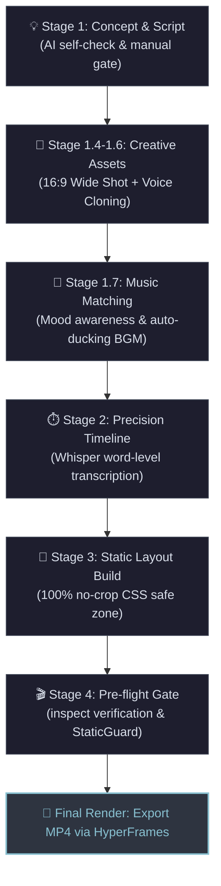
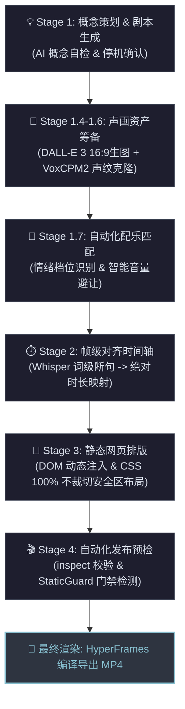

<!-- source: https://github.com/Lucas-Kay8/fableforge.git sha: 118f150a8cb7c722a19920f438cf35df71b02b1c readme: main/README.md -->
# Lucas-Kay8/fableforge

AI-powered universal video production studio - turn text into cinematic short videos with cloned voice narration, AI-generated visuals, and automated post-production🚀 OpenClaw Skill: FableForge AI Video Studio ·  高度工业化的视频生成 Agent 技能 SOP

---

<div align="center">

# 🔨 FableForge
### 通用制片厂

**AI-powered universal video pipeline**
*Give an AI Agent a playbook, and it will forge any insight into a compelling short video.*

[](LICENSE)
[](https://hyperframes.heygen.com)
[](https://pypi.org/project/voxcpm/)
[](https://www.python.org)

**[English](#english) · [中文](#中文)**

</div>

---

<a name="english"></a>
## 🇬🇧 English

FableForge is a fully automated video production pipeline that turns any concept into a polished short video — complete with narration in **your cloned voice**, AI-generated visuals, frame-accurate subtitles, and cinematic Ken Burns motion.

> **FableForge**: A universal AI video production pipeline.

### ✨ Demo Works

| Title | Management Insight | Duration | Link |
|-------|--------------------|----------|------|
| *The Scale That Gains Weight* | Cantillon Effect & wealth redistribution | 133s | [Watch on YouTube](https://youtu.be/mSHp5E3-PDs) |
| *The Lighthouse of Fogport* | Time Inconsistency & The cost of broken promises | 82s | [Watch on YouTube](https://youtu.be/cAJq7VN0hs0) |
| *High-Risk High-Performers* | AI-driven organizational analysis & KPI traps | 100s | [Local MP4](file:///Users/lucas/Work/09.Antigravity/视频生成/episodes/20260520_high_risk_team/renders/20260520_high_risk_team_2026-05-20_18-50-33.mp4) |

> 📺 The above works are fully generated and rendered using this FableForge SOP with cloned personal voices.


### 🚀 Quick Start (AI-First Installation)

FableForge is packaged as an **AI Agent Skill**. You don't need to manually clone repositories or install dependencies. Just give the Skill to your AI assistant (like Cursor, Cline, or Gemini), and it will build the studio for you.

**Step 1 — Download the Skill**
In an empty directory, run:
```bash
npx skills add Lucas-Kay8/ai-video-studio
```

**Step 2 — Tell your AI to initialize**
Open your AI chat and say:
> "Initialize the FableForge studio."

The AI will read the `SKILL.md`, automatically scaffold the `template/` and `voice-model/` directories, and download FFmpeg for you.

**Step 3 — Record your voice sample**
Once the AI finishes initialization, it will prompt you to record a 15-second voice sample and place it in `voice-model/01_samples/my_voice.wav`.

**Step 4 — Generate your first video**
Tell your AI:
> "Help me make an analytical video about [your topic]."
The AI will handle the rest of the 5-stage pipeline!

### 🏗️ Project Structure

```
your-workspace/
├── .agents/skills/fableforge/
│   ├── SKILL.md            ← AI Agent SOP (Core instructions)
│   └── resources/          ← Templates & Voice models used by AI for init
├── template/               ← Auto-copied by AI during init
├── voice-model/            ← Auto-copied by AI during init
├── bin/                    ← FFmpeg (Auto-downloaded by AI)
└── episodes/               ← Folder for all video episodes
    └── YYYYMMDD/           ← Per-episode archive (Auto-generated by AI)
```

### 🧠 Core SOP: 5-Stage Industrial Pipeline

The heart of FableForge is a **command-level executable SOP** for AI Agents, stored in [`.agents/skills/fableforge/SKILL.en.md`](./.agents/skills/fableforge/SKILL.en.md).



| Stage | What Happens | Exit Criteria |

|-------|-------------|---------------|
| **Stage 1** Concept & Asset Generation | Write allegory, generate images, synthesize voice | Image count == scene count, audio file ready |
| **Stage 1.6** Typography Poster | Generate click-optimized pure-text cover and CTA end card | Cover & End card ready |
| **Stage 1.7** BGM Matching | Mood analysis, track selection, auto-integration | BGM file ready, attribution added |
| **Stage 2** Data-Driven Timeline | Whisper transcription, frame-accurate scene alignment | Deviation < 0.2s, zero estimated values |
| **Stage 3** Static Layout Validation | Pure HTML/CSS, verify no image cropping before animation | All images display fully, DOM injected dynamically |
| **Stage 4** Pre-flight & Render | inspect → render, machine validation replaces eyeballing | inspect exits 0, duration matches audio exactly |

### 🎨 Typography Poster Generator

FableForge automatically generates high-impact, pure-text cover posters (`scene_cover.png`) and Call-To-Action end cards (`scene_end.png`) for your videos. 
- **10 Built-in Styles**: From "Modern Tech Blue" to "Minimalist Black & White".
- **No Images Rule**: Typography-only designs for maximum click-through rates.
- **Auto-personalized**: The AI will ask for your preferred signature/IP name before generating.

### 🎵 Automated BGM Integration

FableForge now supports automatic background music matching:
- **Mood-Aware**: Matches BGM based on the emotional gear of your script (e.g., *The Scale That Gains Weight* uses 'Undertow' by Scott Buckley for its atmospheric tension).
- **Auto-Ducking**: Defaults to 0.15–0.25 volume to ensure narration clarity.
- **Attribution Ready**: Automatically inserts license info into your script.

### 🛠️ Tech Stack

| Component | Role | Link |
|-----------|------|------|
| **HyperFrames** | HTML-to-MP4 deterministic render engine | [hyperframes.heygen.com](https://hyperframes.heygen.com) |
| **VoxCPM2** | Personal voice cloning & TTS synthesis | [PyPI](https://pypi.org/project/voxcpm/) |
| **Whisper** | Word-level timestamp transcription | [github.com/openai/whisper](https://github.com/openai/whisper) |
| **GSAP** | Ken Burns zoom & motion choreography | [gsap.com](https://gsap.com) |
| **FFmpeg** | Audio duration analysis & silence detection | [ffmpeg.org](https://ffmpeg.org) |

### 📦 For Content Creators (no code)

1. Open `template/script-template.md` and fill in your storyboard
2. Generate images with Midjourney / Flux / DALL·E → name them `scene1.png`...`scene{N}.png` → drop into `assets/`
3. Generate `narration.wav` with any TTS tool → drop into `assets/`
4. Run `npm run check && npm run render`

### 📦 For AI Engineers (Agent integration)

Inject [`.agents/skills/fableforge/SKILL.en.md`](./.agents/skills/fableforge/SKILL.en.md) into your Agent context. It will autonomously follow the 5-stage pipeline.

Compatible with: **Claude** / **Gemini** / **Cursor** / **VS Code Copilot**

### 🙏 Acknowledgements

| Project | Role in FableForge |
|---------|-------------------|
| [HyperFrames](https://hyperframes.heygen.com) by HeyGen | Core video render pipeline |
| [VoxCPM2](https://pypi.org/project/voxcpm/) | Voice cloning engine |
| [OpenAI Whisper](https://github.com/openai/whisper) | Audio transcription (MIT License) |

### 🤝 Contributing

PRs welcome for:
- New allegory video examples (add to an `episodes/YYYYMMDD/` directory)
- Additional visual style CSS templates
- TTS / Whisper adapters for other languages

### 📄 License · MIT

---

<a name="中文"></a>
## 🇨🇳 中文

FableForge 是一个全自动通用视频生产管线，能将任何概念或洞察转化为精致的短视频——包含**克隆你的声音**进行的旁白、AI 生成的视觉画面、精确到帧的字幕，以及电影级的 Ken Burns 动态效果。

> **FableForge** 通用制片厂: 利用 AI 将深刻的洞察铸造成引人入胜的短视频。

### ✨ 演示作品

| 标题 | 管理洞察 | 时长 | 链接 |
|-------|--------------------|----------|------|
| 《会自己变重的秤》 | 坎蒂隆效应与财富再分配 | 133s | [在 YouTube 观看](https://youtu.be/mSHp5E3-PDs) |
| 《雾港城的灯塔》 | 时间不一致性与承诺的代价 | 82s | [在 YouTube 观看](https://youtu.be/cAJq7VN0hs0) |
| 《高绩效的“高风险”团队》 | AI 参与组织判断的真实过程与 KPI 陷阱 | 100s | [本地渲染 MP4](file:///Users/lucas/Work/09.Antigravity/视频生成/episodes/20260520_high_risk_team/renders/20260520_high_risk_team_2026-05-20_18-50-33.mp4) |

> 📺 以上代表作品均完全基于本 FableForge 工业化流水线 SOP 生成，并使用了克隆的个人声纹进行配音渲染。


### 🚀 快速开始 (AI-First 安装)

FableForge 已经被封装为一个 **AI Agent Skill**。你不再需要手动 `git clone` 或敲命令安装依赖。只需将这个 Skill 交给你的 AI 助手（如 Cursor、Cline 或 Gemini），它会自动为你搭建整个制片厂。

**第 1 步：下载 Skill**
在一个空的文件夹中运行：
```bash
npx skills add Lucas-Kay8/ai-video-studio
```

**第 2 步：让 AI 初始化环境**
打开 AI 对话框，发送：
> "请帮我初始化 FableForge 制片厂。"

AI 会自动读取 `SKILL.md`，为你一键释放 `template/` 和 `voice-model/` 脚手架，并自动下载配置 FFmpeg。

**第 3 步：录制声音样本**
初始化完成后，AI 会提示你录制一段 15 秒的声音样本，放在 `voice-model/01_samples/my_voice.wav`。

**第 4 步：生成你的第一个视频**
对 AI 说：
> "帮我做一个关于[某个话题]的分析类视频。"
AI 会自动接管剩下的 5 步工业化流水线！

### 🏗️ 项目架构

```
your-workspace/
├── .agents/skills/fableforge/
│   ├── SKILL.md            ← AI Agent 专用 SOP (核心规则)
│   └── resources/          ← 模板与模型资产 (AI 初始化时释放)
├── template/               ← AI 自动释放的视频模板
├── voice-model/            ← AI 自动释放的语音克隆脚手架
├── bin/                    ← AI 自动下载的 FFmpeg 依赖
└── episodes/               ← 视频每期项目归档中心
    └── YYYYMMDD/           ← 每期视频的项目归档
```

### 🧠 核心 SOP：五段式工业化流水线

本项目的核心是一套写给 AI Agent 的**命令级可执行 SOP**，存放于 [`.agents/skills/fableforge/SKILL.md`](./.agents/skills/fableforge/SKILL.md).



| 阶段 | 做什么 | 退出标准 |

|------|--------|---------|
| **Stage 1** 概念与资产生成 | 创作内容、生成分镜素材、合成语音 | 主体视觉与音频文件就位 |
| **Stage 1.6** 纯文字海报生成 | 自动生成高转化率纯文字封面与封底 | 封面与封底就位 |
| **Stage 1.7** BGM 自动配乐 | 情绪识别、曲库匹配、自动下载集成 | BGM 就位，署名信息补充 |
| **Stage 2** 数据驱动时间轴 | Whisper 转录，精确对齐每幕时间 | 误差 < 0.2 秒，无估算值 |
| **Stage 3** 静态排版验收 | 纯静态 HTML/CSS，验证不裁切 | 所有图片完整显示，DOM 动态注入 |
| **Stage 4** 预检与渲染 | inspect → render，机器校验 | inspect 0 报错，时长精确匹配 |

### 🎨 纯文字海报风格生成器

FableForge 会为你的每一个视频自动生成**高转化率的封面与封底**：
- **10 大排版风格矩阵**：涵盖“高级商务风”、“科技蓝”、“黑金战略”等，适配各种内容体裁。
- **纯文字铁律**：抛弃配图，采用满屏大字错位排版，最大化视觉冲击力。
- **彻底去个人化**：AI 会在生成前询问你的 IP 署名，为你量身定制专属落款。

### 🎵 新功能：自动化背景音乐 (BGM)

FableForge 现已支持自动配乐：
- **情绪匹配**：根据脚本的“情绪档位”自动推荐合适的背景音乐（如《会自己变重的秤》选用了 Scott Buckley 的 'Undertow' 来烘托悬疑感）。
- **自动避让**：默认音量设为 0.15-0.25，确保背景音不掩盖人声旁白。
- **版权合规**：自动在脚本中注入作者署名和 CC 协议信息。

### 🛠️ 技术栈

| 组件 | 用途 |
|------|------|
| **HyperFrames** | 视频渲染引擎 |
| **VoxCPM2** | 声纹克隆与语音合成 |
| **Whisper** | 词级时间戳音频转录 |
| **GSAP** | 动效编排 |
| **FFmpeg** | 媒体处理 |

---

### 📄 License

MIT
