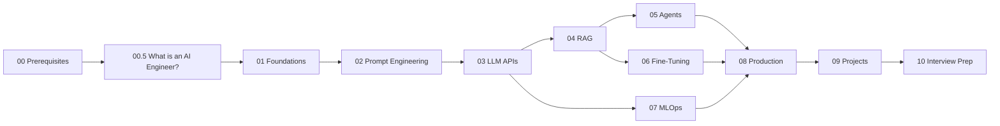

<!-- source: https://github.com/MuhammadIbtisam/ai-engineer-roadmap.git sha: c7e2a4fa383bc3690303668244ce06e800dd919a readme: main/README.md -->
# MuhammadIbtisam/ai-engineer-roadmap

A complete, hands-on roadmap to becoming an AI Engineer, from Python basics to production RAG, Agents, and Fine-Tuning. 10 modules, 20+ notebooks, 15 real projects. Free, open source, built for the community.

---

# 🧠 AI Engineer Roadmap — From Zero to Production

> **A complete, no-fluff, human-first guide to becoming an AI Engineer.**
> Built for everyone: the curious beginner, the Python developer, and the engineer who wants to ship real AI systems.

[](https://github.com/MuhammadIbtisam/ai-engineer-roadmap)
[](LICENSE)
[](CONTRIBUTING.md)

---

## 👋 Hey, before you start — read this

Most "Learn AI" resources do one of two things: they either throw math at you until you give up, or they hand you a ChatGPT wrapper and call it a course.

This repo does neither.

We start with **why things work**, then move to **how to build them**, and finally **how to ship them in production**. Every concept is explained in plain language first. Code comes second — and it's always Python.

You don't need a PhD. You need curiosity, consistency, and this guide.

---

## 🗺️ The Big Picture



Each stage builds on the last. Don't skip stages — the magic is in the connections.

---

## 📦 What's Inside This Repo

| # | Module | What You'll Learn | Level | Time Est. |
|---|--------|-------------------|-------|-----------|
| 00 | [Prerequisites](./00-prerequisites/) | Python, Math, Tools setup | 🟢 Beginner | 1–2 weeks |
| 00.5 | [What is an AI Engineer?](./00.5-what-is-an-ai-engineer/) | The role, the stack, the career | 🟢 Beginner | 1 hour |
| 01 | [Foundations](./01-foundations/) | How LLMs actually work | 🟢 Beginner | 2 weeks |
| 02 | [Prompt Engineering](./02-prompt-engineering/) | Talk to models like an expert | 🟡 Intermediate | 1 week |
| 03 | [LLM APIs](./03-llm-apis/) | Connect to OpenAI, Anthropic, OSS | 🟡 Intermediate | 1 week |
| 04 | [RAG](./04-rag/) | Give models long-term memory | 🟡 Intermediate | 2 weeks |
| 05 | [Agents & Tools](./05-agents/) | Build autonomous AI systems | 🔴 Advanced | 2 weeks |
| 06 | [Fine-Tuning](./06-fine-tuning/) | Customise models for your use case | 🔴 Advanced | 2 weeks |
| 07 | [MLOps Fundamentals](./07-mlops-fundamentals/) | Docker, CI/CD, MLflow for AI | 🔴 Advanced | 1 week |
| 08 | [Production](./08-production/) | Eval, deploy, monitor, optimise | 🔴 Advanced | 2 weeks |
| 09 | [Projects](./09-projects/) | 15 real projects (beginner → advanced) | All levels | Ongoing |
| 10 | [Interview Prep](./10-interview-prep/) | Concepts + system design Q&A | All levels | 1 week |

**Total estimated time:** 3–4 months at a comfortable pace (10–15 hrs/week).

---

## ✅ Progress Tracker

Fork this repo and check boxes as you go. Every box is a win.

### 📌 Module 00 — Prerequisites
- [ ] Python basics review (functions, classes, decorators, async)
- [ ] NumPy & Pandas fundamentals
- [ ] Understanding probability & statistics (enough for AI)
- [ ] Linear algebra refresher (vectors, matrices, dot products)
- [ ] Dev environment setup (Python 3.11+, venv, Jupyter)
- [ ] API keys setup (OpenAI, Anthropic, HuggingFace)

### 📌 Module 00.5 — What is an AI Engineer?
- [ ] Understand the AI Engineer role and how it differs from Data Scientist / ML Engineer
- [ ] Map the full AI Engineer stack
- [ ] Know the honest career picture (salaries, demand, what companies want)

### 📌 Module 01 — Foundations of Generative AI
- [ ] What is Generative AI? (and what it's NOT)
- [ ] History: from RNNs → Transformers → LLMs
- [ ] Tokens and tokenization — what models actually "see"
- [ ] Embeddings — how meaning becomes numbers
- [ ] The Transformer architecture (Attention Is All You Need, explained simply)
- [ ] Pre-training vs fine-tuning vs inference
- [ ] Temperature, top-p, top-k — controlling randomness
- [ ] Context windows — what they are and why they matter
- [ ] **Mini project:** Token Budget Calculator

### 📌 Module 02 — Prompt Engineering
- [ ] Zero-shot, one-shot, few-shot prompting
- [ ] Chain-of-Thought (CoT) prompting
- [ ] ReAct pattern (Reason + Act)
- [ ] Role prompting and persona assignment
- [ ] System prompts vs user prompts vs assistant prompts
- [ ] Prompt injection — attacks and defences
- [ ] Structured output prompting (JSON, XML)
- [ ] Iterative prompt refinement workflow
- [ ] **Mini project:** Build a prompt testing harness in Python

### 📌 Module 03 — Working with LLM APIs
- [ ] OpenAI API — completions, chat, streaming
- [ ] Anthropic Claude API — messages, system prompts
- [ ] HuggingFace Inference API — free open-source models
- [ ] Ollama — running models locally
- [ ] Rate limits, retries, and error handling
- [ ] Async API calls for performance
- [ ] Cost tracking and token budgeting
- [ ] **Mini project:** Multi-provider LLM router (fallback between APIs)

### 📌 Module 04 — RAG (Retrieval-Augmented Generation)
- [ ] Why RAG exists (the context window problem)
- [ ] Embeddings deep dive — semantic similarity
- [ ] Vector databases: Chroma, Pinecone, Weaviate, pgvector
- [ ] Chunking strategies — fixed, semantic, recursive
- [ ] Retrieval strategies — similarity search, MMR, hybrid
- [ ] The full RAG pipeline end-to-end
- [ ] Evaluating RAG quality (RAGAS framework)
- [ ] Advanced: HyDE, re-ranking, multi-query retrieval
- [ ] **Mini project:** Chat with your own PDF documents

### 📌 Module 05 — Agents & Tools
- [ ] What is an AI Agent? (really)
- [ ] Tool use / function calling
- [ ] ReAct agents from scratch
- [ ] LangChain agents overview
- [ ] LlamaIndex agents overview
- [ ] Memory: in-context, external, episodic
- [ ] Multi-agent systems (CrewAI, AutoGen)
- [ ] Agent evaluation and debugging
- [ ] **Mini project:** Research agent that searches the web and writes reports

### 📌 Module 06 — Fine-Tuning
- [ ] When should you fine-tune? (honest answer)
- [ ] Supervised fine-tuning (SFT) — the basics
- [ ] LoRA & QLoRA — parameter-efficient fine-tuning
- [ ] Dataset preparation and formatting (JSONL, Alpaca format)
- [ ] Fine-tuning with HuggingFace Trainer
- [ ] Fine-tuning with OpenAI's fine-tuning API
- [ ] RLHF / DPO — reward-based tuning (overview)
- [ ] Evaluating your fine-tuned model
- [ ] **Mini project:** Fine-tune a model on your own writing style

### 📌 Module 07 — MLOps Fundamentals
- [ ] How ML systems differ from regular software
- [ ] Docker for ML — models, weights, reproducibility
- [ ] GitHub Actions for ML pipelines (eval-gated deploys)
- [ ] Experiment tracking with MLflow
- [ ] Model registry and versioning
- [ ] Prompt versioning
- [ ] **Mini project:** Automated eval pipeline with quality gates

### 📌 Module 08 — Production-Ready AI
- [ ] Evaluation frameworks (LLM-as-judge, RAGAS, ROUGE, BERTScore)
- [ ] LLM observability with LangSmith / Phoenix / Langfuse
- [ ] Guardrails and output validation (Guardrails AI, Instructor)
- [ ] Structured outputs with Instructor library
- [ ] Deployment options: FastAPI, modal.com, Replicate
- [ ] Caching strategies for LLM responses
- [ ] Cost optimisation (model routing, prompt compression)
- [ ] Latency optimisation (streaming, async, batching)
- [ ] Security: prompt injection, data leakage, API abuse
- [ ] **Mini project:** Deploy a production-grade RAG API with monitoring

### 📌 Module 09 — Projects
- [ ] Project 01: Smart Summariser CLI
- [ ] Project 02: Prompt Template Engine
- [ ] Project 03: Multi-Model Chat Interface
- [ ] Project 04: Automated Email Responder
- [ ] Project 05: Code Review Bot
- [ ] Project 06: Chat With Your PDFs
- [ ] Project 07: Personal Knowledge Base
- [ ] Project 08: Customer Support Bot
- [ ] Project 09: YouTube Video Analyst
- [ ] Project 10: SQL Query Generator
- [ ] Project 11: Research Agent
- [ ] Project 12: Code Generation Agent
- [ ] Project 13: Fine-Tune a Model on Your Writing
- [ ] Project 14: Production RAG API
- [ ] Project 15: Multi-Agent Content Pipeline

### 📌 Module 10 — Interview Prep
- [ ] Foundations Q&A (tokens, embeddings, transformers, context windows)
- [ ] RAG Q&A (pipeline, failure modes, evaluation)
- [ ] Agents Q&A (chains vs agents, tool use, memory)
- [ ] Production Q&A (evaluation, cost reduction, observability)
- [ ] System design: Document Q&A system
- [ ] System design: Customer support bot at scale
- [ ] Prepare a project to talk about in detail
- [ ] Know key numbers off the top of your head (costs, context sizes, thresholds)

---

## 🚀 Fast Track Paths

Not everyone starts from zero. Pick your path:

### 🐣 "I'm brand new to AI"
`00 Prerequisites → 00.5 What is an AI Engineer → 01 Foundations → 02 Prompt Engineering → 03 APIs → 09 Projects (Beginner)`
**Time:** ~6 weeks

### 🐍 "I know Python, just not AI"
`00.5 What is an AI Engineer → 01 Foundations → 02 Prompt Engineering → 03 APIs → 04 RAG → 09 Projects (Intermediate)`
**Time:** ~4 weeks

### ⚡ "I want to build RAG systems fast"
`02 Prompt Engineering (skim) → 03 APIs → 04 RAG → 08 Production`
**Time:** ~2 weeks

### 🤖 "I want to build Agents"
`02 Prompt Engineering → 03 APIs → 04 RAG → 05 Agents → 09 Projects (Advanced)`
**Time:** ~3 weeks

### 🏭 "I need to go to production NOW"
`02 Prompt Engineering → 03 APIs → 04 RAG → 08 Production → 07 MLOps`
**Time:** ~3 weeks

---

## 📖 How to Use Each Module

Every module follows the same 5-step rhythm:

1. **Read the concept first** → `concepts/` folder — plain English, no code yet
2. **Follow the notebook** → `notebooks/` folder — step-by-step, run cell by cell
3. **Do the exercise** → `exercises/` folder — solidify what you learned
4. **Build the mini project** → every module has one, they get harder as you go
5. **Check the box** in your forked README

This rhythm works. Trust it.

---

## 🛠️ Setup (Do This First)

```bash
# 1. Fork then clone the repo
git clone https://github.com/YOUR_USERNAME/ai-engineer-roadmap.git
cd ai-engineer-roadmap

# 2. Create virtual environment
python -m venv venv
source venv/bin/activate   # Windows: venv\Scripts\activate

# 3. Install dependencies
pip install -r requirements.txt

# 4. Copy environment template
cp .env.example .env
# Then add your API keys to .env

# 5. Launch Jupyter
jupyter lab
```

---

## 🔑 API Keys You'll Need

| Service | Free Tier? | Used In | Cost Estimate |
|---------|-----------|---------|---------------|
| [OpenAI](https://platform.openai.com) | $5 credit | Modules 02, 03, 04, 06 | ~$5–10 total |
| [Anthropic](https://console.anthropic.com) | $5 credit | Module 03 | ~$2–5 total |
| [HuggingFace](https://huggingface.co) | ✅ Free | Modules 03, 06 | Free |
| [Pinecone](https://pinecone.io) | ✅ Free tier | Module 04 | Free |
| [LangSmith](https://smith.langchain.com) | ✅ Free tier | Module 07 | Free |

> 💡 **Cost tip:** You can complete ~80% of this course for under $10 in API credits. Expensive operations are always flagged with free alternatives provided.

---

## 📁 Repo Structure

```
ai-engineer-roadmap/
├── README.md
├── CONTRIBUTING.md
├── requirements.txt
├── .env.example
├── .github/
│   └── workflows/
│       └── test-notebooks.yml
├── 00-prerequisites/
├── 00.5-what-is-an-ai-engineer/
├── 01-foundations/
├── 02-prompt-engineering/
├── 03-llm-apis/
├── 04-rag/
├── 05-agents/
├── 06-fine-tuning/
├── 07-mlops-fundamentals/
├── 08-production/
├── 09-projects/
└── 10-interview-prep/
```

---

## 💬 Community

- ⭐ **Star this repo** if it helps you — it helps others find it
- 🍴 **Fork it** and track your progress with the checkboxes above
- 🐛 **Open an issue** if something is wrong or unclear
- 💬 **Start a Discussion** to share your progress, ask questions, or show what you built
- 🐦 Share your progress with **#AIEngineerRoadmap**

---

## 🤝 Contributing

Found a bug? Have a better explanation? Built a cool project on top of this?

See [CONTRIBUTING.md](./CONTRIBUTING.md) — PRs are welcome and celebrated.

---

*Built with the belief that great documentation is an act of generosity.*
*Let's make AI engineering accessible to everyone.*
