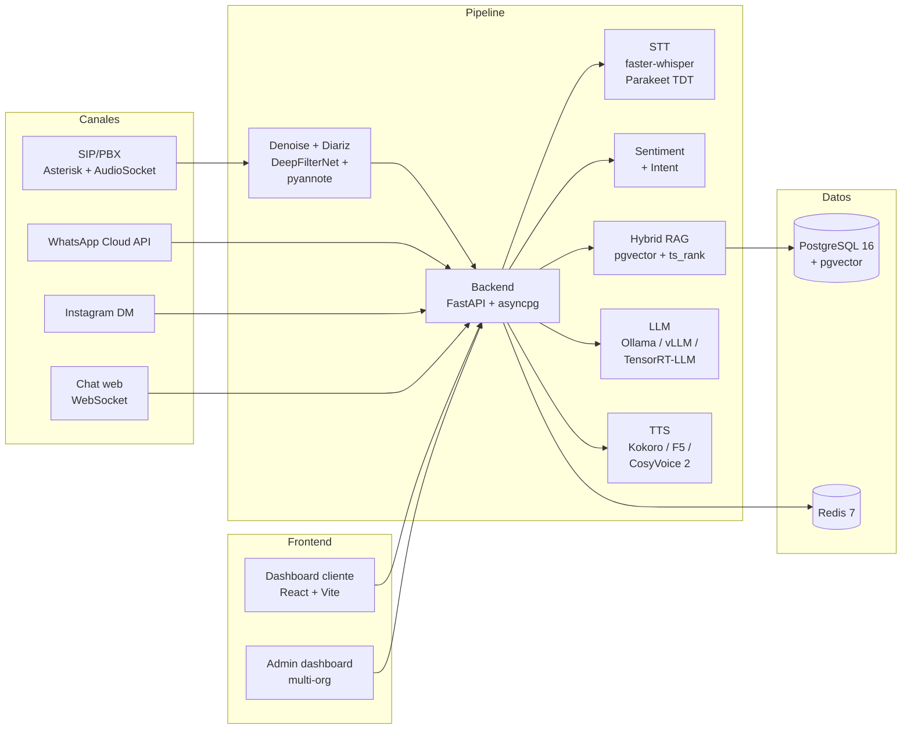

<!-- source: https://github.com/neylinsomne/Call_Center_AI.git sha: fc322f628185f59327f2b532d90cc407c8aa70e5 readme: main/README.md -->
# neylinsomne/Call_Center_AI

End-to-end self-hosted AI call center: real-time voice STT→LLM→TTS pipeline, multi-tenant agents, voice cloning, RAG, multi-channel (calls/WhatsApp/IG).

---

<div align="center">

# 📞 Call Center AI

**End-to-end self-hosted AI call center.**
Real-time voice pipeline · Multi-tenant agents · Voice cloning · Hybrid RAG · Multi-channel orchestration.

[](./LICENSE)
[](./NOTICE.md)
[](#-stack-resumido)

</div>

---

> ⚠️ **Portafolio · No comercial.** Este repositorio se publica bajo
> **[PolyForm Noncommercial 1.0.0](./LICENSE)**. Está pensado como muestra
> técnica end-to-end de un sistema de atención por voz/chat con IA. **No
> se permite usarlo para vender servicios.** Detalles en
> [`NOTICE.md`](./NOTICE.md).

## 🧭 De qué se trata

Plataforma self-hosted **multi-tenant** que combina:

1. **Llamadas telefónicas automatizadas** vía SIP/Asterisk con voz natural
   en español LATAM.
2. **Mensajería multi-canal** (WhatsApp Business, Instagram DM, chat web
   embebido, REST API).
3. **Panel de supervisión** por empresa cliente + panel interno multi-org.

Cada cliente configura su propio **agente virtual** con personalidad, voz
clonable, catálogo de productos y reglas de calidad. El sistema mantiene
aislamiento por `org_id` y autentica peticiones con tokens `cc_<prefix>_<secret>`.

## 🎯 Características clave

| Área | Capacidad |
|---|---|
| **Voz en tiempo real** | Pipeline `Audio → VAD → STT → Sentiment → RAG → LLM → TTS` con objetivo de latencia < 2 s |
| **Voz clonable** | Por organización con 3–5 minutos de muestra (F5-TTS, CosyVoice 2, Fish Speech) |
| **LLM auto-tier** | `detect-gpu-tier.sh` selecciona Ollama / vLLM / TensorRT-LLM según VRAM disponible |
| **RAG híbrido** | Cosine pgvector + ts_rank PostgreSQL · embeddings multilingüe (LATAM) |
| **Memoria conversacional** | Historial hidratado desde DB · resumen rolling · detección de reconexión por caller_id |
| **Calidad** | Sentiment con keywords ponderados · QA scoring auto + revisión humana · filler audio bajo latencia alta |
| **Resiliencia** | Pre-call health gate · 5 audios fallback pre-grabados por modo de falla |
| **Observabilidad** | Prometheus + Grafana · métricas por turno (`process_metadata`) · log estructurado |

## 🏗️ Arquitectura



Mapeo detallado de cada servicio, latencias por etapa y limitaciones conocidas
en [`docs/ARCHITECTURE.md`](./docs/ARCHITECTURE.md).

## 🚀 Quick start (modo demo)

> Para evaluación. Requiere Docker Desktop + 8 GB de RAM mínimo. La aceleración
> por GPU es opcional pero recomendada para latencia.

```bash
# 1. Configuración base
cp .env.example .env

# 2. Levantar la pila mínima de demo
docker compose up -d postgres redis backend dashboard admin-dashboard pgadmin

# 3. Para agregar voz (descargará Kokoro ~327 MB el primer run)
docker compose up -d tts

# 4. (Opcional) Sembrar el demo del Hotel Central
docker exec callcenter-backend python /app/../scripts/seed/seed_hotel_demo.py
```

URLs por defecto:

| Servicio | URL local | Login |
|---|---|---|
| Admin dashboard | http://localhost:3002 | `admin` / `admin123` |
| Dashboard cliente | http://localhost:3001 | API token (generar en admin) |
| Backend / API docs | http://localhost:8000/docs | — |
| Demo chat embebido | http://localhost:8000/static/chat-demo.html | — |
| pgAdmin | http://localhost:5050 | `admin@callcenter-ai.com` / `admin123` |

> ⚠️ Las credenciales por defecto son inseguras y existen solo para que el
> demo arranque. Rotarlas si se expone a internet.

## 📚 Documentación

| Documento | Contenido |
|---|---|
| [`docs/ARCHITECTURE.md`](./docs/ARCHITECTURE.md) | Mapeo completo de servicios, datos y latencias |
| [`docs/ARQUITECTURA_PARA_AGENTE_DE_MEJORA.md`](./docs/ARQUITECTURA_PARA_AGENTE_DE_MEJORA.md) | Brief técnico para investigación de mejoras de LLM/RAG |
| [`docs/CAMPAIGNS_PRODUCTS_MODULE_SPEC.md`](./docs/CAMPAIGNS_PRODUCTS_MODULE_SPEC.md) | Especificación del módulo de campañas y productos |
| [`docs/DIAGRAMAS_DEMO.md`](./docs/DIAGRAMAS_DEMO.md) | Diagramas mermaid del flujo conversacional |
| [`docs/GUION_VIDEO_DEMO.md`](./docs/GUION_VIDEO_DEMO.md) | Guion narrativo del demo del Hotel Central |
| [`docs/architecture/`](./docs/architecture) | Sub-documentos por dominio |
| [`docs/security/`](./docs/security) | Aislamiento multi-tenant, secretos, validación |
| [`docs/telephony/`](./docs/telephony) | Asterisk, AudioSocket, gateways GSM, SIP |
| [`docs/network-setup/`](./docs/network-setup) | NAT, WireGuard, Cloudflare Tunnel |

## 🧰 Stack resumido

| Capa | Tecnologías |
|---|---|
| **API & orquestación** | FastAPI · asyncpg · httpx · tenacity · loguru |
| **Base de datos** | PostgreSQL 16 · pgvector (HNSW) · ts_rank · Redis 7 |
| **LLM** | Qwen 2.5 · Llama 3.x · Ollama / vLLM / TensorRT-LLM |
| **STT** | faster-whisper · Parakeet TDT (NVIDIA NIM) |
| **TTS** | Kokoro 82M · F5-TTS Spanish · CosyVoice 2 · Fish Speech |
| **Audio** | DeepFilterNet · pyannote 3.1 · SpeechBrain · WebRTC VAD |
| **Telefonía** | Asterisk · FreePBX · AudioSocket · SIP · WireGuard |
| **Frontend** | React 18 · Vite · Recharts · TailwindCSS |
| **Observabilidad** | Prometheus · Grafana · prometheus-fastapi-instrumentator |
| **DevOps** | Docker Compose · pgBackRest · health checks por servicio |

## 🗂️ Estructura del repo

```
├── services/
│   ├── backend/          # FastAPI principal, RAG, sentiment, WS, REST
│   ├── llm/              # Wrapper SSE sobre Ollama / vLLM / TensorRT
│   ├── stt/              # faster-whisper server
│   ├── tts/              # Kokoro + F5 + proxy CosyVoice / Fish
│   ├── audio_preprocess/ # denoise + diarize + speaker ID
│   ├── cosyvoice/        # Container CosyVoice 2
│   ├── asterisk/         # PBX + AudioSocket + configs
│   ├── dashboard/        # Panel cliente (React + Vite)
│   ├── admin-dashboard/  # Panel admin multi-org
│   ├── whatsapp/         # Webhook Meta Cloud API
│   ├── voice_training/   # Pipeline voice cloning
│   ├── voice_distillation/
│   ├── license_server/   # ⚠️ Off por default (portafolio)
│   └── …
├── scripts/
│   ├── seed/             # Seeds del demo Hotel Central + Serpa
│   ├── infra/            # detect-gpu-tier, helpers
│   └── security/         # check-secrets, encrypt-env, etc.
├── shared/
│   ├── models/           # Modelos compartidos (en runtime)
│   └── audio/            # Voice references, fallback audios
├── docs/                 # Toda la documentación
├── docker-compose.yml    # Stack principal
├── docker-compose.adaptive.yml   # Multi-GPU adaptive
├── docker-compose.blackwell.yml  # RTX 50xx (sm_120)
├── docker-compose.infra.yml      # Observabilidad
└── docker-compose.multi-gpu.yml  # Datacenter
```

## 🛡️ Seguridad y secretos

- `.env` está en `.gitignore`. Solo se versiona `.env.example` con placeholders.
- Pre-commit hook (`scripts/security/check_secrets.sh`) escanea credenciales.
- Tokens API tipo `cc_<prefix>_<secret>` con scope por organización.
- Aislamiento multi-tenant por `org_id` en todas las queries.
- Forbidden-topics guardrail antes de la inyección al LLM.

Ver detalles en [`docs/security/`](./docs/security).

## 🤝 Contribuciones

Pull requests con mejoras, correcciones de bugs y documentación son bienvenidos
**bajo la misma licencia non-commercial**. Issues con casos de prueba que
reproduzcan problemas son especialmente útiles.

## 📄 Licencia

[PolyForm Noncommercial 1.0.0](./LICENSE) · [Aviso de portafolio](./NOTICE.md)

Para uso comercial, contactar al autor por GitHub.

---

<sub>Built with ❤️ for the LATAM Spanish-speaking community.</sub>
