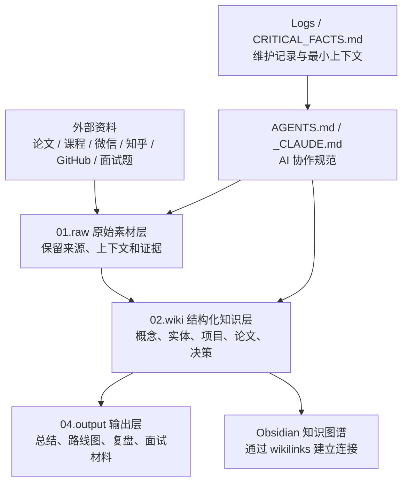

<!-- source: https://github.com/VectorPeak/LLM-Wiki.git sha: f9f1adfd7cd98e6b3b52e27d483bc8c832c171c9 readme: main/README.md -->
# VectorPeak/LLM-Wiki

A structured knowledge base for large language model technologies, covering LLMs, Agents, RAG, model training, evaluation methodologies, and AI engineering practices.

---

<div align="center">

# LLM-Wiki

### 大语言模型知识图谱 & AI 协作型个人知识库

面向 **LLM / Agent / RAG / Post-training / AI Engineering** 的中文 Obsidian 知识库，用来沉淀系统学习、面试准备、论文精读、工程实践与长期知识复利。

[](https://github.com/VectorPeak/LLM-Wiki)
[](./LICENSE)


`LLM` · `Agent` · `RAG` · `SFT` · `RLHF` · `Evaluation` · `Interview` · `Knowledge Graph` · `Obsidian`

</div>

---

## 为什么要有这个项目

LLM 学习的难点通常不是「资料太少」，而是「资料过多但缺少坐标系」：课程、论文、公众号、知乎、GitHub 项目、面试题和日常灵感会不断涌入，如果没有结构化沉淀，很容易变成一堆不可复用的收藏夹。

本项目把这些材料整理成一个 **AI 协作型个人知识库**：人可以通过 Obsidian 阅读、链接和复习，AI Agent 也可以按约定读取、改写、总结和维护。它更像一座「知识仓库 + 导航系统」，而不是一篇线性教程。

- **对抗碎片化**：把微信、知乎、课程、论文、面试题等原始材料统一放入 `01.raw/`，先保证资料可追溯。
- **从素材到知识**：`01.raw/` 是矿石，`02.wiki/` 是提炼后的金属；前者保存上下文，后者沉淀概念、实体、项目和决策。
- **学习、面试、工程三合一**：同一套知识既能支持 LLM 基础学习，也能支撑项目复盘、面试准备和开源实践。
- **面向未来 AI 协作**：通过 `AGENTS.md`、`_CLAUDE.md`、frontmatter、`[[wikilinks]]` 和日志规范，让后续 AI Agent 能够低成本接续工作。

几个容易混淆但很关键的概念：

| 概念 | 在本项目中的含义 | 反向 / 易混概念 |
|---|---|---|
| Second Brain | 长期沉淀、可检索、可复用的个人知识系统 | 临时收藏夹、浏览器书签、聊天记录堆积 |
| Knowledge Graph | 用链接把概念、论文、项目、人物、问题连接起来 | 单篇孤立笔记、无上下文摘抄 |
| Raw Layer | 原始材料层，尽量保留来源、语境和证据 | 过早总结导致信息丢失 |
| Wiki Layer | AI 和人共同维护的结构化知识层 | 未整理素材、一次性输出 |
| AI 协作型知识库 | 写给未来的人和 AI 都能读懂、能接续维护 | 只给当前作者看的随手记 |

---

## 快速开始

如果只是想快速使用这个知识库，可以按下面路径进入：

### 1. 克隆仓库

```bash
git clone https://github.com/VectorPeak/LLM-Wiki.git
cd LLM-Wiki
```

### 2. 用 Obsidian 打开

在 [Obsidian](https://obsidian.md/) 中选择 **Open folder as vault**，打开本仓库根目录即可。仓库使用 Markdown、`[[wikilinks]]` 和目录化结构组织内容，在 Obsidian 中阅读和检索体验最好。

### 3. 选择阅读入口

| 目标 | 推荐入口 |
|---|---|
| 了解整个知识库 | `index.md` |
| 准备 LLM / Agent / RAG 面试 | `01.raw/04.Interview/` |
| 系统学习大模型基础 | `01.raw/03.SelfNotes/` |
| 阅读课程和训练营材料 | `01.raw/09.Book&Courses/` |
| 查看论文与研究材料 | `01.raw/08.Research/` |
| 整理微信、知乎、网页剪藏 | `01.raw/05.Wechat/`、`01.raw/06.Zhihu/`、`01.raw/07.Website/` |

### 4. 让 AI Agent 协作维护

如果需要让 AI Agent 帮忙整理、迁移或生成笔记，建议先让它读取：

- `AGENTS.md`：Agent 操作手册和命令路由。
- `_CLAUDE.md`：Vault 写作规范、目录约定和 AI-first 规则。
- `CRITICAL_FACTS.md`：最小必要背景信息。

一个实用原则是：**先把原始资料放进 `01.raw/`，再逐步提炼到 `02.wiki/`**。这样既保留证据，也能沉淀可复用的知识结构。

---
## 目录结构

当前仓库是一个 Obsidian Vault，核心内容主要在 `01.raw/`，`02.wiki/` 是后续知识蒸馏与结构化维护的目标层。

```text
LLM-Wiki/
<<<<<<< HEAD
├── .obsidian/                 # Obsidian 本地配置
├── 01.raw/                    # 原始素材层：先保存证据，再逐步提炼知识
│   ├── 00.WorkSpace/          # 项目包装、草稿、临时工作区
│   ├── 01.Inbox/              # 收件箱：新材料的临时入口
│   ├── 02.DailyNotes/         # 日记 / 每日记录
│   ├── 03.SelfNotes/          # 自学笔记、八股梳理、个人总结
│   ├── 04.Interview/          # LLM 面试题、简历模板、岗位准备材料
│   ├── 05.Wechat/             # 微信公众号剪藏
│   ├── 06.Zhihu/              # 知乎剪藏
│   ├── 07.Website/            # 网页文章与站点剪藏
│   ├── 08.Research/           # 论文、研究材料与元数据
│   ├── 09.Book&Courses/       # 书籍、课程、训练营与手册资料
│   ├── 10.GitHub/             # GitHub 项目相关笔记与快照
│   ├── 11.Leetcode/           # 刷题与算法练习材料
│   └── 12.Others/             # 暂未归类的其他材料
├── 02.wiki/                   # 结构化知识层：概念、实体、项目、决策等
├── 03.templates/              # Obsidian / AI 写作模板
├── 04.output/                 # AI 生成结果、整理稿、导出物
├── 05.Mentor/                 # 学习导师、复盘和辅助学习材料
├── Bases/                     # Obsidian Bases 视图配置
=======
├── 01.raw/                    # 原始素材（核心内容）
│   ├── 00.WorkSpace/          #   项目包装、面试生存指南
│   ├── 01.Inbox/              #   收件箱（临时存放）
│   ├── 02.DailyNotes/         #   日记 / 每日记录
│   ├── 03.SelfNotes/          #   自学笔记（八股生存指北等）
│   ├── 04.Interview/          #   面试相关（真题题库、简历模板）
│   ├── 05.Wechat/             #   微信文章剪藏（汐绫惠夜、骑猪撞宝马等）
│   ├── 06.Zhihu/              #   知乎剪藏
│   ├── 07.Website/            #   网页剪藏
│   ├── 08.Research/           #   论文精读笔记
│   ├── 09.Book&Courses/       #   书籍 & 课程资料（波哥LLM训练营等）
│   ├── 10.GitHub/             #   GitHub 相关笔记
│   ├── 11.Leetcode/           #   LeetCode 刷题笔记
│   ├── 12.Others/             #   其他杂项
│   └── 13.Videos/             #   视频笔记
├── 02.wiki/                   # 知识条目（Obsidian wiki 链接）
├── 03.Mentor/                 # AI Mentor 学习系统
├── Bases/                     # Obsidian Dataview 基础定义
>>>>>>> 26d8694 (Reorganize Mentor vault layer)
├── boards/                    # 看板数据
├── Excalidraw/                # 手绘图、白板和可视化草图
├── Logs/                      # 操作日志与工作记录
├── AGENTS.md                  # Codex / Agent 操作手册
├── CRITICAL_FACTS.md          # 高频关键事实入口
├── index.md                   # Vault 导航入口
├── _CLAUDE.md                 # Vault 写作、维护和协作约定
└── README.md                  # 项目说明
```

推荐阅读顺序：

1. 先看 `README.md` 理解项目定位。
2. 再看 `index.md` 获取 Vault 地图。
3. 需要让 AI Agent 参与维护时，优先读取 `AGENTS.md` 和 `_CLAUDE.md`。
4. 需要找具体材料时，从 `01.raw/` 对应主题目录进入。

---

## 知识流转图

这个仓库不是「资料堆放处」，而是一条从原始信息到可复用知识的流水线：先保存证据，再提炼结构，最后形成可阅读、可检索、可复用的输出。



可以把它理解成一个「知识炼油厂」：`01.raw/` 像原油，保存完整但不够轻；`02.wiki/` 像精炼后的燃料，更适合检索、复习和复用；`04.output/` 则是面向具体任务的成品。

---

## 学习路线

不同读者可以从不同入口进入，不需要从头到尾线性阅读。

| 学习目标 | 推荐路径 | 适合场景 |
|---|---|---|
| LLM 基础入门 | `01.raw/03.SelfNotes/` → `01.raw/09.Book&Courses/` → `02.wiki/` | 建立 Transformer、训练、推理、评测等基础概念 |
| RAG 工程实践 | `01.raw/09.Book&Courses/` → `01.raw/10.GitHub/` → `04.output/` | 梳理检索、切分、召回、重排、评测和工程落地 |
| Agent 系统学习 | `01.raw/08.Research/` → `01.raw/03.SelfNotes/` → `02.wiki/` | 理解工具调用、记忆、多 Agent、生产级 Agent 设计 |
| 大模型面试准备 | `01.raw/04.Interview/` → `01.raw/03.SelfNotes/` → `04.output/` | 准备 LLM / RAG / Agent / 训练 / 推理岗位面试 |
| 论文精读沉淀 | `01.raw/08.Research/` → `02.wiki/` → `04.output/` | 把论文从阅读材料转成概念卡片和可复用笔记 |
| AI 协作维护 | `AGENTS.md` → `_CLAUDE.md` → `CRITICAL_FACTS.md` → `Logs/` | 让 AI Agent 接续整理、归档、总结和重构知识库 |

推荐的工作方式是：**先选一个目标，再沿着路径读材料，不要直接在整个仓库里漫游**。知识库越大，越需要入口；否则读者会像进了没有导览牌的图书馆。

---

## 内容成熟度说明

仓库中的内容并不处在同一种成熟状态。为了避免误读，可以按下面方式理解：

| 层级 | 位置 | 成熟度 | 阅读建议 |
|---|---|---|---|
| 原始素材 | `01.raw/` | 低到中：保留来源和上下文，可能未完全清洗 | 适合查证、回溯、找一手材料；不要直接当成最终结论 |
| 结构化知识 | `02.wiki/` | 中到高：经过提炼、链接和重写 | 适合复习、检索、建立概念网络 |
| 模板与输出 | `03.templates/`、`04.output/` | 中：服务具体任务，可能带有阶段性假设 | 适合复用格式、生成总结、准备面试或报告 |
| 维护规范 | `AGENTS.md`、`_CLAUDE.md`、`CRITICAL_FACTS.md` | 高：约束 AI 与人如何协作维护 | 适合在编辑仓库前优先阅读 |
| 日志与看板 | `Logs/`、`boards/` | 中：记录过程和状态 | 适合理解项目演化，但不一定代表最终知识结论 |

简单说：**raw 层负责可信来源，wiki 层负责结构化理解，output 层负责面向任务的表达**。如果某条内容来自外部文章、课程或剪藏，应优先回到原始来源核对时间、上下文和版权边界。

---
## 注意事项

- **这是知识库，不是代码包**：仓库主体是 Markdown、Obsidian 配置、剪藏材料和知识笔记，不应按普通软件项目寻找安装入口。
- **不要随意改写 raw 层**：`01.raw/` 更接近「证据层」，除非明确做清洗、迁移或去重，否则应尽量保留原始语境。
- **AI 编辑前先读规范**：任何自动化整理、重构、批量生成笔记的操作，都应先读取 `AGENTS.md` 与 `_CLAUDE.md`。
- **外部信息要可追溯**：涉及论文、文章、项目、时间敏感事实时，应保留原始 URL、日期、来源和必要的 recency marker。
- **优先使用 `[[wikilinks]]`**：重要人物、项目、概念、论文、工具和决策都应尽量链接化，避免知识成为孤岛。
- **注意版权与隐私**：剪藏内容主要用于个人学习和索引，不应将未授权全文包装成原创内容；新增材料前也应避免提交敏感信息。
- **路径与编码要稳定**：仓库包含中文目录、特殊符号和 Obsidian 语法，建议使用 UTF-8，并在脚本中使用 literal path 处理文件路径。
- **不要把临时产物混入知识层**：中间文件、缓存、实验输出和一次性结果应放入约定的临时或输出位置，而不是污染核心笔记区。

---

## FAQ

### 这个项目适合谁？

适合正在系统学习 LLM / Agent / RAG 的学习者，也适合需要准备大模型岗位面试、沉淀论文笔记、整理开源项目经验的人。

### 它和普通博客有什么区别？

博客通常是面向读者的一次性发布，LLM-Wiki 更像持续演化的知识操作系统：它允许材料先进入 raw 层，再逐步被提炼为 wiki 条目、复盘、图谱和输出物。

### 第一次打开应该从哪里看？

建议从 `index.md` 开始，它是 Vault 导航入口；如果目标是面试，优先看 `01.raw/04.Interview/`；如果目标是系统学习，优先看 `01.raw/03.SelfNotes/` 和 `01.raw/09.Book&Courses/`。

### 为什么要区分 `01.raw/` 和 `02.wiki/`？

两者承担不同职责：`01.raw/` 保存「证据和上下文」，`02.wiki/` 保存「结构化理解」。类比炼矿，raw 层是矿石，wiki 层是提纯后的材料；如果直接把矿石当成成品，后续检索和复用都会变重。

### `02.wiki/` 为空或内容较少是否正常？

正常。该项目当前主要资产在 `01.raw/`，`02.wiki/` 更像长期演化的目标层，用于把原始素材逐步转成概念卡片、项目卡片、论文卡片和知识图谱。

### 能不能直接用于面试准备？

可以，但更适合作为材料库和复习地图，而不是直接背诵答案。面试相关内容主要在 `01.raw/04.Interview/`，配合 `03.SelfNotes/` 中的系统化笔记使用效果更好。

### 如何用 Obsidian 打开？

克隆仓库后，在 Obsidian 中选择「Open folder as vault」，打开仓库根目录即可。由于笔记大量使用 Markdown 与 `[[wikilinks]]`，在 Obsidian 中阅读体验会优于普通文本编辑器。

### 是否欢迎贡献？

可以通过 Issue 或 PR 反馈目录错误、链接失效、事实错误和结构建议。若提交新内容，应尽量保留来源、日期、上下文和必要的版权说明。

### License 是什么？

仓库代码和自有整理内容默认遵循 [MIT License](./LICENSE)。外部剪藏、引用、论文和课程材料仍归原作者或原版权方所有。