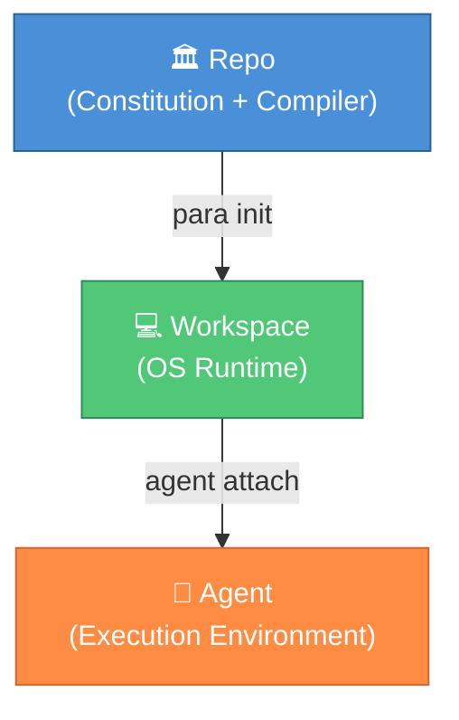
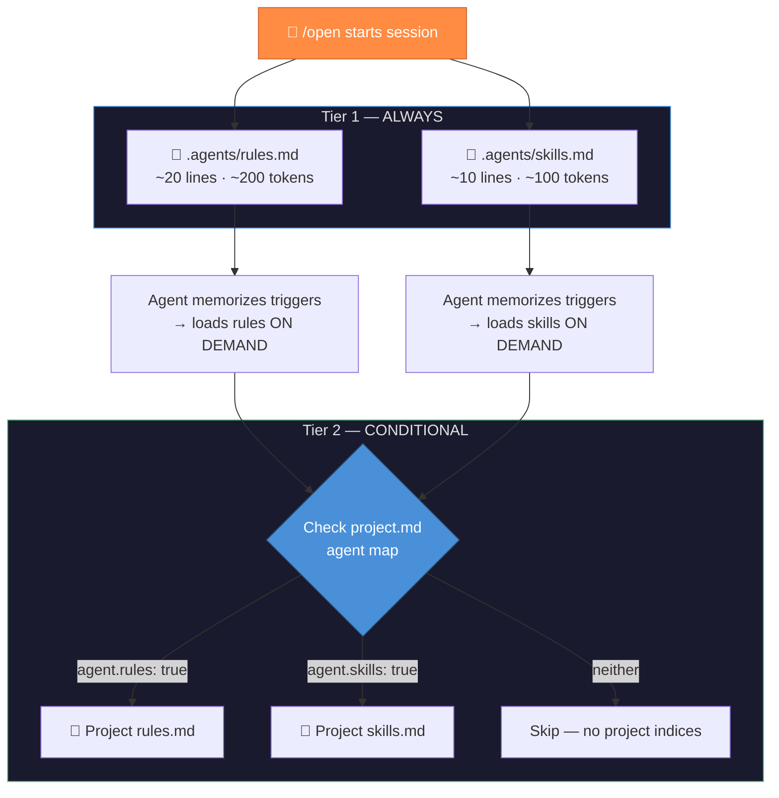
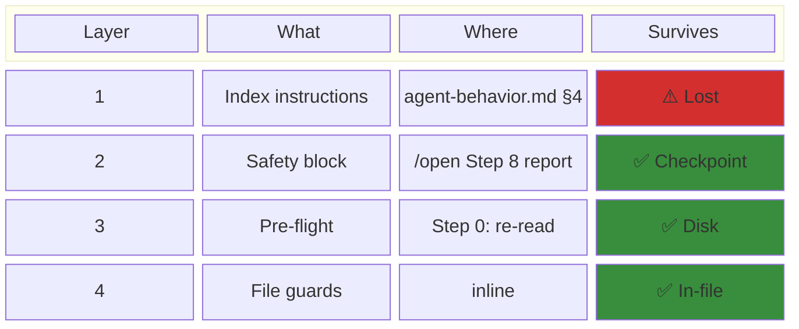
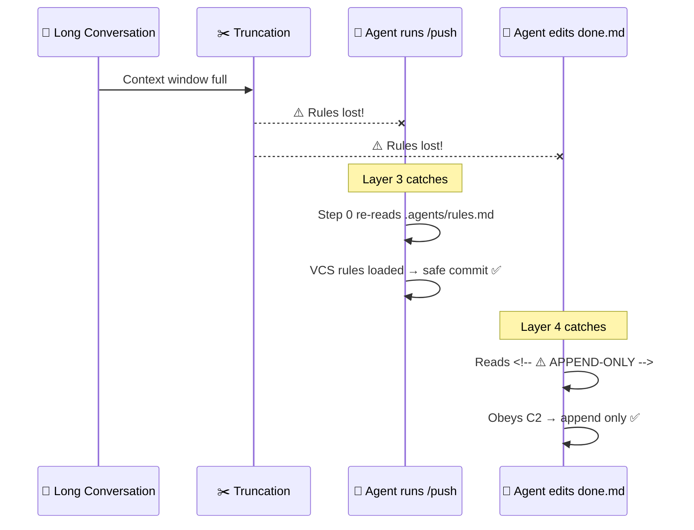
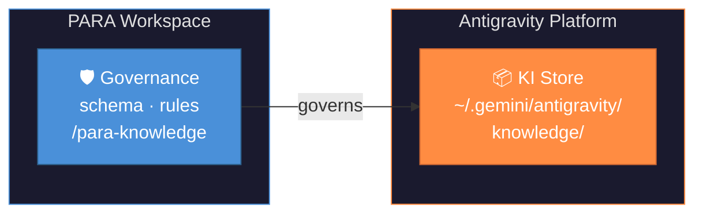
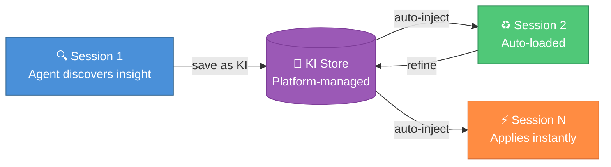

<!-- source: https://github.com/pageel/para-workspace.git sha: 7baef1bb965e1bf0cd6fdf9ad5f148b468173aea readme: main/README.md -->
# pageel/para-workspace

🌌 PARA Workspace is an open-source workspace framework that defines how humans and AI agents organize knowledge and collaborate on projects. It ships as a repo containing a kernel (constitution), CLI tools, and templates — which generates workspaces where you actually work.

---

<div align="center">


# PARA Workspace

**The Workspace Framework for Humans & AI Agents**

[](https://opensource.org/licenses/MIT)
[](./CHANGELOG.md)

[](https://antigravity.google/)

<a href="README.md"><b>🇺🇸 English</b></a> •
    <a href="./docs/locales/vi-VN.md"><b>🇻🇳 Tiếng Việt</b></a> •
    <a href="./docs/locales/zh-CN.md"><b>🇨🇳 中文</b></a> •
    <a href="./docs/locales/es-ES.md"><b>🇪🇸 Español</b></a> •
    <a href="./docs/locales/fr-FR.md"><b>🇫🇷 Français</b></a>

</div>

---

| Section | Description |
| :--- | :--- |
| [🌌 Overview](#-overview) | What it is, three foundational principles |
| [📂 Architecture](#-architecture) | Repo structure + generated workspace structure |
| [📥 Installation](#-installation) | Prerequisites, setup, profiles, troubleshooting |
| [🧠 The Kernel](#-the-kernel) | Invariants, heuristics, contracts |
| [🛠️ CLI Reference](#️-cli-reference) | All CLI commands |
| [📑 Workflow Catalog](#-workflow-catalog) | 32 governed workflows |
| [🛡️ Rule Catalog](#️-rule-catalog) | 14 governance rules |
| [🧩 Skill Catalog](#-skill-catalog) | 21 reusable skills |
| [🔌 Tool System](#-tool-system-v180) | Install external agentic plugins |
| [🧩 Task Management](#-task-management-hybrid-3-file-model) | Hybrid 3-File model |
| [🔄 Upgrading](#-upgrading-versions) | Auto update + clean slate |
| [🗺️ Roadmap](#️-roadmap) | Version history + planned features |

## 🌌 Overview

**PARA Workspace** is an open-source workspace framework that defines how humans and AI agents organize knowledge and collaborate on projects. It ships as a **repo** containing a kernel (constitution), CLI tools, and templates — which generates **workspaces** where you actually work. The kernel enforces invariants and heuristics so every workspace is predictable, auditable, and agent-friendly.

### Three Foundational Principles

1. **Repo ≠ Workspace** — The repo contains governance (kernel, CLI, templates). It never contains user data.
2. **Workspace = Runtime** — Generated by `para init`, each workspace is a standalone instance where you and your agent work.
3. **Kernel = Constitution** — Immutable rules that all workspaces follow. Changes require an RFC + version bump.



---

## 📂 Architecture

### Repo Structure (This Repository)

```
para-workspace/
├── .github/             # 🤖 CI/CD — validate-pr.yml, CODEOWNERS
├── rfcs/                # 📝 RFC Process — TEMPLATE.md, status in header
├── kernel/              # 🧠 Constitution
│   ├── KERNEL.md
│   ├── invariants.md    # 10 hard rules (MAJOR bump)
│   ├── heuristics.md    # 10 soft conventions
│   ├── schema/          # workspace, project, backlog, catalog schemas
│   └── examples/        # valid/ + invalid/ compliance vectors
├── cli/                 # 🔧 Compiler
│   ├── para             # Entry point (Bash 3.2+ compatible)
│   ├── lib/             # logger.sh, validator.sh, rollback.sh, fs.sh
│   └── commands/        # init, scaffold, status, migrate, archive, install, update
├── templates/           # 📦 Scaffolding & Governed Libraries
│   ├── common/agents/    # Centralized workflows/, rules/, skills/ + catalog.yml
│   │   └── projects/    # .project.yml template
│   └── profiles/        # dev, general presets
├── tests/               # 🧪 kernel/ + cli/ integration tests
├── docs/                # 📖 Documentation
│   ├── architecture/    # Architecture: overview, kernel, ecosystem
│   ├── guides/          # How-to: development, planning, meta-project
│   ├── reference/       # Lookup: CLI, workflows, project-rules
│   ├── rules/           # Individual rule documentation (11 files)
│   └── workflows/       # Individual workflow docs (22 files)
├── CONTRIBUTING.md
├── VERSIONING.md
├── CHANGELOG.md
└── VERSION
```

### Workspace Structure (Generated by `para init`)

```
<your-workspace>/
├── Projects/                          # Goal-oriented tasks
│   ├── my-app/                        # Standard project (type: standard)
│   │   ├── repo/                      #   Source code (git repo)
│   │   ├── artifacts/                 #   Plans, tasks, decisions
│   │   ├── sessions/                  #   Session logs
│   │   ├── docs/                      #   Project documentation
│   │   └── project.md                 #   Project contract
│   └── my-ecosystem/                  # Ecosystem project (type: ecosystem) — v1.6.0+
│       ├── artifacts/                 #   Cross-project plans & backlog
│       ├── sessions/                  #   Session logs
│       ├── docs/                      #   Strategy & shared docs
│       └── project.md                 #   satellites: [app, api, ...], NO repo/
├── Areas/                             # Ongoing responsibilities (e.g., health, finance)
│   ├── Workspace/                     # Master session log, audits, SYNC queue
│   └── Learning/                      # Shared knowledge (from /learn)
├── Resources/                         # Reference material & tools
│   ├── ai-agents/                     # Kernel snapshot + governed library snapshots
│   └── references/                    # The original PARA repository (read-only)
├── Archive/                           # Cold storage for completed items
├── _inbox/                            # Temporary landing zone for external downloads
├── .agents/                            # Governed library copies (Auto-synced)
│   ├── rules.md                       # Workspace Rules Trigger Index (always loaded)
│   ├── skills.md                      # Workspace Skills Trigger Index (v1.6.2+)
│   ├── rules/                         # Active agent rules (.md)
│   ├── skills/                        # Active agent skills (.md, /scripts)
│   └── workflows/                     # Active agent workflows (.md)
├── .para/                             # System state (DO NOT EDIT)
│   ├── archive/                       # Smart Archive vault for deprecated files
│   ├── migrations/                    # Migration execution logs
│   ├── backups/                       # Date-stamped workflow & project backups
│   └── audit.log                      # Action history
├── para                               # Bootstrapper CLI
└── .para-workspace.yml                # Workspace root metadata config
```

---

## 📥 Installation

### Prerequisites

- **An AI Agent platform** (see compatibility table below)
- **Git** (required — to clone and update)
- **Bash** 3.2+ (Linux/macOS native, Windows via Git Bash or WSL)

### Platform Compatibility

| Platform           | Integration Point              | Status      | Notes                                                |
| :----------------- | :----------------------------- | :---------- | :--------------------------------------------------- |
| Google Antigravity | `.agents/` (skills, workflows)  | ✅ Verified | Designed and tested for this platform                |
| Claude Code        | CLAUDE.md + `.agents/`          | ⚪ Untested | May read `.agents/rules/` directly — needs validation |
| Cursor             | `.cursor/rules/`               | ⚪ Untested | Theory: copy rules to `.cursor/rules/`               |
| VS Code + Copilot  | `.github/copilot-instructions` | ⚪ Untested | Theory: instructions only, no auto-trigger           |

### Step 1: Clone & Install

**Bash (Linux / macOS / Windows Git Bash / WSL):**

```bash
# Clone repo into the correct location
mkdir -p Resources/references
git clone https://github.com/pageel/para-workspace.git Resources/references/para-workspace

# Set executable permissions
chmod +x Resources/references/para-workspace/cli/para
chmod +x Resources/references/para-workspace/cli/commands/*.sh

# Initialize your workspace with a profile
./Resources/references/para-workspace/cli/para init --profile=dev --lang=en
```

**PowerShell (alternative for Windows):**

```powershell
mkdir -Force Resources\references
git clone https://github.com/pageel/para-workspace.git Resources\references\para-workspace
# Then open Git Bash or WSL at workspace root:
./Resources/references/para-workspace/cli/para init --profile=dev --lang=en
```

### Step 2: Verify

```bash
./para status
# ✅ If you see a health report → installation successful
```

> **What just happened?**
>
> 1. The repo lives at `Resources/references/para-workspace/` — it's a read-only reference source, not a user project.
> 2. `chmod +x` ensures all CLI scripts are executable (required on Linux/macOS).
> 3. `para init` creates the full PARA directory structure, runs `install.sh` automatically to sync kernel, workflows, governance rules, and generates a `./para` wrapper.
> 4. You can now use `./para` from your workspace root for all commands.

### Updating

```bash
# Pull latest from GitHub and re-sync workspace
./para update

# Preview changes before applying
./para update --dry-run
```

This will `git pull` the repo, run version-gated migrations, and re-sync all governed libraries. Existing user-customized files are backed up to `.bak` before overwriting (Smart Sync). If the install fails mid-operation, all changes are automatically rolled back.

**What happens during update:**

1. `git pull` fetches latest code (self-restarts if scripts changed)
2. `migrate.sh` runs version-gated migration steps (only what's needed)
3. `install.sh` syncs kernel, workflows, rules, skills to workspace (with atomic rollback)
4. Audit log is updated in `.para/audit.log`

### Troubleshooting

| Problem                          | Solution                                                  |
| :------------------------------- | :-------------------------------------------------------- |
| **macOS: permission denied**     | Run `chmod +x` on CLI scripts (Step 3 above)              |
| **Windows: file lock on update** | See [Windows Recovery](#windows-recovery) below           |
| **Stale workspace (v1.3.x)**     | Use [Manual Clean Slate](#mechanism-2-manual-clean-slate) |

#### Windows Recovery

If `para update` fails on Windows due to NTFS file locking:

```cmd
cd Resources\references\para-workspace
git checkout -- .
git pull origin main
cd ..\..\..
.\para install
```

### Available Profiles

| Profile                                               | Description                         | Best For                |
| :---------------------------------------------------- | :---------------------------------- | :---------------------- |
| [`general`](./templates/profiles/general/README.md)   | Minimal PARA structure              | Personal PKM            |
| [`dev`](./templates/profiles/dev/README.md)           | Technical Areas + AI tooling        | Software developers     |

### What `para init` Does

- ✅ Creates `Projects/`, `Areas/`, `Resources/`, `Archive/`, and `_inbox/`
- ✅ Sets **executable permissions** on all CLI scripts
- ✅ Runs **`install.sh`** automatically, which:
  - Syncs **governed workflows** from `catalog.yml` into `.agents/workflows/`
  - Syncs **governed rules** from `catalog.yml` into `.agents/rules/`
  - Syncs **workspace rules index** into `.agents/rules.md` (trigger index)
  - Syncs **skills** into `.agents/skills/` (if profile includes them)
  - Creates **`./para`** wrapper at workspace root
  - Backs up conflicting files to `.bak`
- ✅ Generates **`.para-workspace.yml`** with kernel version tracking
- ✅ Initializes **`.para/`** state (audit.log, migrations/, backups/) for full auditability

---

## 🧠 The Kernel

The Kernel is the **constitution** of PARA Workspace — the rules that all workspaces must follow.

### Invariants (Hard Rules — change = MAJOR bump)

| #   | Rule                                                                |
| --- | ------------------------------------------------------------------- |
| I1  | PARA directory structure is mandatory                               |
| I2  | Hybrid 3-file task model (backlog = canonical, hot lane, /end sync) |
| I3  | kebab-case project naming                                           |
| I4  | No active tasks = inactive project                                  |
| I5  | Areas contain no runtime tasks                                      |
| I6  | Archive is immutable cold storage                                   |
| I7  | Seeds are raw ideas, not tasks                                      |
| I8  | No loose files at workspace root                                    |
| I9  | Resources are read-only references                                  |
| I10 | Repo ↔ Workspace separation                                         |
| I11 | Workflow language compliance                                        |

### Heuristics (Soft Rules — change = MINOR/PATCH)

| #   | Guideline                                                  |
| --- | ---------------------------------------------------------- |
| H1  | Naming conventions (kebab-case, PascalCase)                |
| H2  | Context loading priority                                   |
| H3  | Semantic versioning with approval levels                   |
| H4  | Standard project directory structure                       |
| H5  | Beads lifecycle                                            |
| H6  | VCS & Git boundaries                                       |
| H7  | Cross-project references + Ecosystem + Meta-Project (v1.7.6)  |
| H8  | Workflow kernel compatibility                              |
| H9  | Governed libraries require `catalog.yml` with `kernel_min` |
| H10 | Knowledge Items — schema, scope, slug validation (v1.7.0)  |

### Kernel ↔ Workspace Contracts

| File                         | Schema                  | Enforced By                    |
| ---------------------------- | ----------------------- | ------------------------------ |
| `.para-workspace.yml`        | `workspace.schema.json` | `para init`, `para status`     |
| `Projects/*/.project.yml`    | `project.schema.json`   | `para scaffold`, `para review` |
| `artifacts/tasks/backlog.md` | `backlog.schema.json`   | `para verify`                  |
| `*/catalog.yml`              | `catalog.schema.json`   | `para install`, `para update`  |

---

## 🛠️ CLI Reference

```bash
# Core Commands
para init [--profile] [--lang]  # Create workspace
para status [--json]            # System health
para update                     # Auto-update & migrate
para scaffold <type> <name>     # Create structured paths
para install [--force]          # Sync governed libraries
para archive <type> <name>      # Graduation review
para migrate [--from] [--to]    # Workspace migration

# Configuration
para config [key] [value]       # Manage workspace settings

# Tool Management (v1.8.0)
para install-tool <name>        # Install a plugin from registry
para remove-tool <name>         # Remove installed plugin
para list-tools                 # List installed plugins

# MCP Server Management (v1.8.2)
para mcp-setup <tool>           # Auto-configure MCP in IDE
para mcp-list                   # List MCP-capable tools
para mcp-remove <tool>          # Remove MCP config from IDE

# Agent Capabilities
@[/para-workflow] list          # Manage workflows
@[/para-rule] list              # Manage rules
```

**Platform Support:** Linux, macOS (Bash 3.2+), Windows (Git Bash / WSL).

---

## 📑 Workflow Catalog

| Command                                                   | Description                                                |
| :-------------------------------------------------------- | :--------------------------------------------------------- |
| **[`/backlog`](./docs/workflows/backlog.md)**             | Manage project tasks via canonical backlog.md              |
| **[`/backup`](./docs/workflows/backup.md)**               | Backup workflows, rules, config, and project data          |
| **[`/brainstorm`](./docs/workflows/brainstorm.md)**       | Collaborative ideation with structured output              |
| **[`/para-config`](./docs/workflows/para-config.md)**               | Manage workspace configuration                             |
| **[`/end`](./docs/workflows/end.md)**                     | Close session with PARA classification + automated cleanup |
| **[`/inbox`](./docs/workflows/inbox.md)**                 | Categorize files from `_inbox/` into PARA                  |
| **[`/install`](./docs/workflows/install.md)**             | Intelligent installer (handles updates/merges)             |
| **[`/learn`](./docs/workflows/learn.md)**                 | Capture lessons into Areas/Learning                        |
| **[`/merge`](./docs/workflows/merge.md)**                 | Semantic merge for workflow conflicts                      |
| **[`/new-project`](./docs/workflows/new-project.md)**     | Initialize new project with scaffolding                    |
| **[`/open`](./docs/workflows/open.md)**                   | Start session with context + plan phase loading            |
| **[`/para`](./docs/workflows/para.md)**                   | Master controller for workspace management                 |
| **[`/docs`](./docs/workflows/docs.md)**                   | Generate, review, and publish technical documentation      |
| **[`/para-audit`](./docs/workflows/para-audit.md)**       | Macro Assessor for tracking workspace structural drift     |
| **[`/para-rule`](./docs/workflows/para-rule.md)**         | Manage, install, and standardize agent rules               |
| **[`/para-workflow`](./docs/workflows/para-workflow.md)** | Manage, install, and standardize agent workflows           |
| **[`/plan`](./docs/workflows/plan.md)**                   | Create, review, and update implementation plans            |
| **[`/push`](./docs/workflows/push.md)**                   | Fast commit and push to GitHub                             |
| **[`/qa`](./docs/workflows/qa.md)**                       | Systematic Red Team Q&A review loop for plans and specs    |
| **[`/release`](./docs/workflows/release.md)**             | Pre-release quality gate                                   |
| **[`/retro`](./docs/workflows/retro.md)**                 | Project retrospective before archiving                     |
| **[`/spec`](./docs/workflows/spec.md)**                   | Write structured specifications before coding              |
| **[`/update`](./docs/workflows/update.md)**               | Agent-guided safe workspace update with error recovery     |
| **[`/verify`](./docs/workflows/verify.md)**               | Verify task completion with walkthroughs                   |
| **[`/para-knowledge`](./docs/workflows/para-knowledge.md)** | Manage Knowledge Items — dashboard, create, audit, archive |
| **[`/para-skill`](./docs/workflows/para-skill.md)** | Co-Author engine for creating, validating, and testing AI Agent skills |
| **[`/write`](./docs/workflows/write.md)**                 | Write deep-dive content with structured sidecar templates  |
| **[`/logs`](./docs/workflows/logs.md)**                   | Session telemetry diagnostics and context budget analytics |
| **[`/staging`](./docs/workflows/staging.md)**             | Stage workspace assets into a project's repo (v1.8.11)     |
| **[`/vibecode`](./docs/workflows/vibecode.md)**           | Manage interactive/loop execution modes for coding tasks (v1.8.11) |
| **[`/scan-sec`](./docs/workflows/scan-sec.md)**           | Scan codebase for security vulnerabilities (v1.8.11)       |
| **[`/resource`](./docs/workflows/resource.md)**           | Orchestrate resource import, graph generation, and pattern learning (v1.8.11) |

---

## 🛡️ Rule Catalog

Rules govern agent behavior, security, and compliance. Loaded on-demand via a Two-Tier trigger index (~200 tokens). Skills are loaded via a parallel skills trigger index (v1.6.2). See [Rules & Context Loading](./docs/reference/project-rules.md) for the loading mechanism.

| Rule                                                                              | Description                                             | Priority     |
| :-------------------------------------------------------------------------------- | :------------------------------------------------------ | :----------- |
| **[`governance`](./docs/rules/governance.md)**                                    | Kernel invariants, scope containment, safety guardrails | 🔴 Critical  |
| **[`vcs`](./docs/rules/vcs.md)**                                                 | Git safety: commit, branch, merge, PR, secrets          | 🔴 Critical  |
| **[`knowledge`](./docs/rules/knowledge.md)**                                      | KI operations — write gate, approval, namespace (v1.7.0)| 🔴 Critical  |
| **[`graph-first-policy`](./docs/rules/graph-first-policy.md)**                    | Proactive code analysis using para-graph MCP tools      | 🔴 Critical  |
| **[`hybrid-3-file-integrity`](./docs/rules/hybrid-3-file-integrity.md)**          | 6 constraints (C1–C6) for task management               | 🟡 Important |
| **[`agent-behavior`](./docs/rules/agent-behavior.md)**                            | Proactive Trigger Check, Context Recovery (v1.6.2)      | 🟡 Important |
| **[`context-rules`](./docs/rules/context-rules.md)**                              | Agent Index Loading (rules + skills), Two-Tier trigger   | 🟡 Important |
| **[`para-discipline`](./docs/rules/para-discipline.md)**                          | PARA architecture compliance, 7 rules                   | 🟡 Important |
| **[`agent-persona`](./docs/rules/agent-persona.md)**                              | Custom conversational style and agent personality       | 🟡 Important |
| **[`artifact-standard`](./docs/rules/artifact-standard.md)**                      | Plans, walkthroughs, persistent mirroring               | 🟢 Standard  |
| **[`naming`](./docs/rules/naming.md)**                                            | kebab-case, PascalCase, camelCase conventions            | 🟢 Standard  |
| **[`versioning`](./docs/rules/versioning.md)**                                    | SemVer, autonomy levels, multi-location sync            | 🟢 Standard  |
| **[`exports-data`](./docs/rules/exports-data.md)**                                | Data export: `_inbox/`, UTF-8 BOM, naming               | 🟢 Standard  |
| **[`tool-routing`](./docs/rules/tool-routing.md)**                                | Heuristic guide for selecting Native API, Bash, and MCP | 🟢 Standard  |

---

## 🧩 Skill Catalog

Skills are reusable knowledge modules loaded on-demand via the skills trigger index. Unlike rules (which enforce constraints), skills provide **templates, patterns, and reference material**.

| Skill | Description |
| :--- | :--- |
| **[PARA Kit](./docs/skills/para-kit.md)** | PARA workspace structure reference — schema, layout, kernel governance, intelligence routing |
| **[Formatting](./docs/skills/formatting.md)** | Tables, diagrams, tree listings, ASCII box art |
| **[Page Map](./docs/skills/page-map.md)** | Website visual structure management using PAGE_MAP.md and BLUEPRINT.md |
| **[PARA Skill](./docs/skills/para-skill.md)** | Governance skill for creating and validating PARA skills via Co-Author engine |
| **[Plan Templates](./docs/skills/plan.md)** | Detail Plan & Roadmap templates (Sidecar, v1.7.8)  |
| **[Docs Templates](./docs/skills/docs.md)** | Architecture, CLI, Strategy templates (Sidecar, v1.7.8)  |
| **[Brainstorm Templates](./docs/skills/brainstorm.md)** | Decision & Research templates (Sidecar, v1.7.12)  |
| **[Write Templates](./docs/skills/write.md)** | Content type templates and writing rules (Sidecar, v1.7.14)  |
| **[Harness Guards](./docs/skills/harness.md)** | Guard catalog and auto-scan protocol for context-aware safety guards (Sidecar, v1.7.15) |
| **[Spec Templates](./docs/skills/spec.md)** | Spec templates, assumption surfacing, boundary definitions (Sidecar, v1.7.16) |
| **[QA Review Templates](./docs/skills/qa.md)** | Red Team personas, dimension checklists, and QA report templates (Sidecar, v1.8.6) |
| **[TDD Guidelines](./docs/skills/tdd.md)** | Strict Test-Driven Development workflow rules and anti-patterns (v1.8.7) |
| **[Logs Audit Extensions](./docs/skills/logs.md)** | Audit templates for TDD/Spec compliance verification (Sidecar, v1.8.7) |
| **[HTML Renderer](./docs/skills/html-renderer.md)** | Modular HTML rendering engine for themed static docs & graph views (v1.8.9) |
| **[New Project](./docs/skills/new-project.md)** | Sidecar skill for the /new-project workflow (Sidecar, v1.8.10) |
| **[para-graph](./docs/skills/para-graph.md)** | Centralized Graph Intelligence Router and semantic memory curation (Sidecar, v1.8.10) |
| **[Staging Templates](./docs/skills/staging.md)** | Sidecar data for the /staging template release (Sidecar, v1.8.11) |
| **[Vibecode Execution Templates](./docs/skills/vibecode.md)** | Sidecar data for the /vibecode execution (Sidecar, v1.8.11) |
| **[Vulnerability Scanner Templates](./docs/skills/scan-sec.md)** | Sidecar data for the /scan-sec scanner (Sidecar, v1.8.11) |
| **[Resource Study Templates](./docs/skills/resource.md)** | Sidecar data for the /resource learning (Sidecar, v1.8.11) |
| **[Sidecar Skill Governance](./docs/skills/sidecar-skill.md)** | Architectural rules and standards for sidecar skills (v1.8.11) |

---

## 🏗️ Rule Architecture — Two-Tier Loading & Defense-in-Depth

Rules and skills aren't dumped into context all at once. PARA Workspace uses a **progressive disclosure** architecture that loads indices on-demand, saving ~90% of token budget while maintaining full compliance.

### How It Works: Two-Tier Trigger Index (v1.6.2)



> 💡 **Total cost: ~350 tokens** (vs ~2,000 if all loaded upfront)

### Defense-in-Depth: 4-Layer Protection

After a long conversation, AI agents lose context (truncation). PARA Workspace has **4 independent layers** to ensure rules and skills survive:



Layer 3 uses **Proactive Trigger Check** (v1.6.2): BEFORE any side-effect, agent scans all trigger tables and loads matching rules/skills FIRST.

Layer 4 supports **6 guard types**: `STATUS GATE`, `MANDATORY`, `HARNESS GUARD`, `FILE GUARD` (C1-C3, I9, GOVERNED), `WORKFLOW GATE`, `CONTEXT RECOVERY`.

**Scenario: Agent forgets rules after truncation**



> 📖 Full architecture: [Context Recovery](./docs/architecture/context-recovery.md) · [Defense-in-Depth](./docs/architecture/defense-in-depth.md) · [Rule Layers](./docs/architecture/rule-layers.md)

---

## 🧩 Task Management (Hybrid 3-File Model)

PARA Workspace uses a proprietary **Hybrid 3-File Architecture** (v1.5.3: Hot Lane) to solve the AI Agent "Context Window vs. Amnesia" problem.

Instead of forcing the agent to read one massive backlog file every time it opens a project (which wastes tokens and causes hallucination), tasks are distributed across three highly specialized files:

```
artifacts/tasks/
├── backlog.md          # 📌 CANONICAL — Operational Authority. All strategic tasks live here.
├── sprint-current.md   # 🔥 HOT LANE — Agent-writable buffer for ad-hoc quick tasks.
└── done.md             # ✅ ARCHIVE — Append-only log with origin tags (#backlog / #session).
```

### How It Works

1. **Backlog Summary** — `/open` reads only the Summary table (~10 lines) + top active items via `grep`. Never the full file.
2. **Hot Lane** — Agent writes ad-hoc quick tasks (`- [ ] Fix CSS`) to `sprint-current.md` and ticks `[x]` when done. Strategic tasks from backlog are read directly, not copied.
3. **`/end` is the Sole Sync Point** — At session close, `/end` runs Hot Lane Sync:
   - Quick `[x]` tasks → `done.md` (tagged `#session`)
   - Quick `[ ]` tasks → ask user: keep or promote to backlog?
   - **Smart Suggest** → reads session log, finds mentioned task IDs, suggests marking strategic tasks as Done (tagged `#backlog`)
4. **Zero Ceremony During Coding** — No `/backlog update` needed mid-session. Just code.
5. **`/backlog clean` = Compress, Not Delete** — Done items are compressed into 1 line per plan in backlog's `✅ Completed` section. Details live in `done.md` (grouped by plan, linking to `plans/done/`). Lookup chain: `backlog → done.md → plans/done/`.

---

## 📚 Knowledge System (v1.7.0)

AI agents lose context between sessions. **Knowledge Items (KIs)** are a core feature of [Google Antigravity](https://antigravity.google/docs/knowledge) — the AI coding agent platform — that provides persistent memory across sessions, projects, and conversations.

KIs live **outside** the workspace, in Antigravity's platform-managed KI Store (`~/.gemini/antigravity/knowledge/`). This mirrors PARA Workspace's foundational principle: just as the **repo governs but does not contain** user data, PARA Workspace **governs KI operations** (schema, rules, lifecycle workflows) without owning the storage layer.



### How It Works



Unlike session logs (lost after truncation) or learning files (project-scoped), KIs are:

- **Auto-injected** at session start by the platform
- **Cross-project** — workspace-scoped KIs apply to all projects
- **Graph-ready** — domain × purpose taxonomy with `relates_to` and `concepts` fields

### KI Taxonomy

Each KI is classified along two axes — **domain** (what) × **purpose** (how):

```
                  ┌────────────────────────────────────────────────────────┐
                  │                      PURPOSE                           │
                  ├──────────────┬──────────────┬─────────────┬────────────┤
                  │   context    │  reference   │   pitfall   │  playbook  │
                  │  (priming)   │  (lookup)    │  (gotchas)  │ (how-to)   │
     ┌────────────┼──────────────┼──────────────┼─────────────┼────────────┤
     │ workspace  │ PARA arch    │ kernel specs │ update bugs │ audit proc │
     │ engineering│ tech stack   │ API docs     │ dep gotchas │ deploy SOP │
  D  │ operations │ infra setup  │ CI/CD ref    │ env traps   │ rollback   │
  O  │ content    │ writing std  │ style guide  │ SEO traps   │ publish    │
  M  │ strategy   │ org context  │ roadmap      │ scope creep │ planning   │
  A  │ ...        │              │              │             │            │
  I  ├────────────┘              │              │             │            │
  N  │  (open — define your own) │              │             │            │
     └───────────────────────────┴──────────────┴─────────────┴────────────┘
```

> **Domain** is an open string — define custom domains as needed.
> **Purpose** is a fixed enum: `context`, `reference`, `pitfall`, `playbook`.

### Lifecycle & Integration

| Workflow | KI Integration |
|:---------|:---------------|
| `/open` | Platform-injected KI context, scope matching for report |
| `/plan` | Pitfall KIs → Risks, Playbook KIs → Phase references |
| `/end` | Suggests creating/updating KIs from session insights |
| `/brainstorm` | Option F: Extract insight as KI |
| `/retro` | Graduates cross-project patterns to KIs |
| `/para-knowledge` | Full lifecycle: create, update, audit, archive |

### Governance

KI operations are governed by **7 rules (KR1–KR7)** and validated against **H10** (11 clauses):

- **KR1 Write Gate**: Only `/para-knowledge` workflow can create/modify KIs
- **KR2 User Approval**: Every KI creation requires explicit user consent
- **KR3 Namespace**: `para_` prefix reserved for system KIs
- **KR5 Recoverability**: All KI operations are reversible
- **KR7 Ephemeral Ban**: No ephemeral file paths in KI references (v1.7.5)

> 📖 Full schema: [`ki.schema.json`](./kernel/schema/ki.schema.json) · Governance: [`heuristics.md` H10](./kernel/heuristics.md)

---

## 🔌 Tool System (v1.8.0)

PARA Workspace supports an extensible **Dynamic Tool System** that allows you to install external, language-agnostic plugins (like `para-graph`) directly into your workspace.

Tools are managed via a central registry (`registry/tools.yml`) and are installed as standalone tarballs.

### How it works
1. **Zero Global Dependencies**: Tools are installed locally into `.para/tools/` for isolation.
2. **Multi-Runtime Support**: The CLI auto-generates wrapper scripts (e.g. `repo/cli/commands/graph.sh`) that know how to invoke Node, Python, or binary executables.
3. **Dev/Prod Fallback**: If a tool's source code exists inside the workspace (Dev mode), the wrapper routes execution there. Otherwise, it falls back to the extracted tarball (Prod mode).

### Available Tools

| Tool | Description |
| :--- | :--- |
| **[`para-graph`](https://github.com/pageel/para-graph)** | Hybrid Code-Knowledge Graph for PARA Workspace |

> 💡 Version is resolved dynamically from `registry/tools.yml` — always installs the latest registered release.

### Usage

```bash
# Install the para-graph plugin (structural code analysis & MCP server)
./para install-tool para-graph

# List installed tools
./para list-tools

# Run the installed tool
./para graph --help

# Remove tool
./para remove-tool para-graph
```

### Tool Intelligence Installer (v1.8.1)

Tools can bundle AI intelligence (workflows, skills, rules) directly in their `tool.manifest.yml`:

```yaml
agents:
  workflows:
    - source: templates/agents/workflows/para-graph.md
      target: para-graph.md
      version: "1.8.0"
  skills:
    - source: templates/agents/skills/graph-enrichment/
      target: graph-enrichment/
      version: "1.0.0"
```

When you run `./para install-tool <name>`, the CLI will automatically parse this manifest and prompt you to install the bundled intelligence. 
You can use `--agents` to install only the agents, or `--no-agents` to skip the prompt.
`remove-tool` will also offer to clean up any bundled agents it installed.

### MCP Auto-Setup (v1.8.2)

Tools can declare an MCP server in their manifest via the `mcp:` block. PARA Workspace provides three CLI commands to manage MCP configurations across IDEs:

```bash
# Auto-configure MCP server for a tool in your IDE
./para mcp-setup <tool-name>

# Print the JSON snippet without modifying IDE config
./para mcp-setup <tool-name> --print-only

# List all tools with MCP servers available
./para mcp-list

# Remove an MCP server entry from IDE config
./para mcp-remove <tool-name>
```

**Supported IDEs:**

| IDE | Config Path |
| :--- | :--- |
| Google Antigravity | `~/.gemini/antigravity/mcp_config.json` |
| Claude Desktop | `~/.config/claude/claude_desktop_config.json` (Linux) |
| Cursor | `~/.cursor/mcp.json` |

> The setup uses **2-Tier path resolution** (Dev path → Prod path) to point to the correct entry, and `jq`-based atomic JSON merge with automatic backup.

---

## 🔄 Upgrading Versions

> 📖 **Note:** For a detailed breakdown of all features, fixes, and updates in each version, please read our [CHANGELOG](./CHANGELOG.md).

PARA Workspace offers two official mechanisms to upgrade to a newer version:

### Mechanism 1: Auto Update (Recommended)

For most healthy workspaces, the built-in update mechanism handles everything safely.

```bash
./para update
```

This will automatically pull the newest core code, run version-gated migrations (only steps relevant to your current version), sync the libraries, and securely move obsolete structural files to the `.para/archive/` vault without deleting your custom data (Smart Archive). User-customized rules are protected with `.bak` backups.

### Mechanism 2: Manual Clean Slate (For heavily modified workspaces)

If your workspace is very old (v1.3.x) or has been heavily customized, start fresh:

1. Run `para init --profile=dev --lang=en` in a completely new directory.
2. Copy your old `Projects/` directories into the `_inbox/` of the new workspace.
3. Use the `/inbox` workflow or let your AI agent sort them into the new correct structure.

---

## 🗺️ Roadmap

- [x] Cross-Project Sync Queue _(shipped in v1.3.6)_
- [x] Kernel Extraction & Repo Restructure _(shipped in v1.4.0)_
- [x] Governed Libraries, RFC Process, Workspace Runtime Safety _(shipped in v1.4.1)_
- [x] Landing Page `paraworkspace.dev` _(shipped in v1.4.1)_
- [x] Plan-Aware Workflows & Token Optimization _(shipped in v1.4.2)_
- [x] Automated Plan Cleanup via `/end [done]` _(shipped in v1.4.3)_
- [x] Safety Guardrails & Terminal Allowlist _(shipped in v1.4.5)_
- [x] Smart Archive & Version Migration _(shipped in v1.4.6)_
- [x] macOS Compatibility & Safe Migration Pipeline _(shipped in v1.4.7)_
- [x] Atomic Rollback, Dry-run Pipeline & README Rewrite _(shipped in v1.4.8)_
- [x] Centralized Backup & Workspace Cleanup _(shipped in v1.4.9)_
- [x] Project Rules Loading & Safe Update Workflow _(shipped in v1.5.0)_
- [x] Hybrid 3-File Synchronization & Fast Mode _(shipped in v1.5.1)_
- [x] Hybrid 3-File Integrity, Working Checkmarks & Docs Overhaul _(shipped in v1.5.2)_
- [x] Hot Lane Refactor, /end Sync Point & Token Optimization _(shipped in v1.5.3)_
- [x] Context Recovery, Workflow Pre-flight & Defense-in-Depth _(shipped in v1.5.4)_
- [x] Meta-Project & Ecosystem Support _(shipped in v1.6.0)_
- [x] Unified Strategy → Plan Flow _(shipped in v1.6.1)_
- [x] Unified Agent Index — Skills Loading & Proactive Trigger Check _(shipped in v1.6.2)_
- [x] Central Gate — project.md as single source for context loading _(shipped in v1.6.3)_
- [x] Para-Kit Skill v1.1.0, Recursive Sync & Git Hash Detection _(shipped in v1.6.4)_
- [x] Update Flow Fix — Version Direction Detection & Migration History _(shipped in v1.6.5)_
- [x] Knowledge System — KI schema, /knowledge workflow, graph-ready taxonomy _(shipped in v1.7.0)_
- [x] System KI Governed Lifecycle — namespace guard, template sync, CLI hooks _(shipped in v1.7.1)_
- [x] KI Index Schema Upgrade, Workflow Simplification & Knowledge Graph Seed _(shipped in v1.7.2)_
- [x] Agent Path Convention Fix (BUG-28) & Rule Frontmatter _(shipped in v1.7.3)_
- [x] Repo Path Standardization, Pending TODO Fix & Project Profile Skill _(shipped in v1.7.4)_
- [x] KR7 Ephemeral Ban & /knowledge → /para-knowledge Rename _(shipped in v1.7.5)_
- [x] Skill Catalog Architecture & Meta-Project Type _(shipped in v1.7.6)_
- [x] Brainstorm Consolidation, Sidecar Skill & /docs _(shipped in v1.7.7-1.7.8)_
- [x] Proactive Trigger Check & Cognitive Bypass Fix _(shipped in v1.7.9-1.7.10)_
- [x] Backlog Governance & Extract Paradigm _(shipped in v1.7.11-1.7.12)_
- [x] VERSIONS.yml Migration & Anti-Token Decay _(shipped in v1.7.13)_
- [x] Content Authoring Ecosystem & Session Telemetry _(shipped in v1.7.14)_
- [x] Harness Skill, Plan Status Gate & Roadmap Prefix Convention _(shipped in v1.7.15)_
- [x] Spec Workflow, Dual-Format Guards & CLI Fixes _(shipped in v1.7.16)_
- [x] Dynamic Tool System & para-graph integration _(shipped in v1.8.0)_
- [x] Tool Intelligence Installer & manifest-declared AI intelligence _(shipped in v1.8.1)_
- [x] MCP Auto-Setup — `mcp-setup`, `mcp-list`, `mcp-remove` CLI commands _(shipped in v1.8.2)_
- [x] QA Governance Workflow & Sidecar Skill Integration _(shipped in v1.8.6)_
- [x] TDD Governance Workflow _(shipped in v1.8.7)_
- [x] Ecosystem-wide Para-Graph MCP Integration — Memory Ops lifecycle, Project Sidecar Skill, 43% workflow coverage _(shipped in v1.8.9)_
- [x] Release Hardening, HTML Renderer Integration, Spec Rules & TDD Gate _(shipped in v1.8.10)_
- [x] Release Hardening: dirty-check template override prompts in install-tool CLI, conflict diff detection, and staging/scan-sec/vibecode/resource workflows catalog integration _(shipped in v1.8.11)_
- [x] Antigravity IDE 2.x and v1.x Config Migration & TDD hardening _(shipped in v1.8.12)_
- [x] Node Path Resolution (NVM/fnm/Volta) & Rule/KI Artifact Authority improvements _(shipped in v1.8.13)_
- [x] MCP Windows Path Conversion (BUG-37) & Plan Auto-Activation _(shipped in v1.8.14)_
- [x] Vibecode DSP & Template Consolidation _(shipped in v1.8.15)_
- [x] Platform Tracker Exemption & Decoupled Project Plans _(shipped in v1.9.0)_
- [x] Plan/Session-Plan Templates & Dual-Format Guards _(shipped in v1.9.1)_
- [x] Standards & Roadmaps Optimization _(shipped in v1.9.2)_
- [x] Unified CSA HTML-Renderer Upgrade _(shipped in v1.9.3)_
- [x] Local Development Sync & AI Index Auto-Sync _(shipped in v1.9.4)_
- [x] Template Consolidation & Release (Diagnostics Debug, Self-Improvement, Remote, Report, Research) _(shipped in v1.9.5)_
- [ ] **Plugin Hooks & vibecode_session extensions** _(v1.10.0 — planned)_
- [ ] **Department System** _(v1.x.x — planned)_

---

## 🤝 Contributing

See [CONTRIBUTING.md](./CONTRIBUTING.md) for guidelines. Key points:

- Kernel invariant changes require an **RFC + MAJOR bump** → See [rfcs/TEMPLATE.md](./rfcs/TEMPLATE.md)
- Heuristic changes require a **PR + MINOR/PATCH bump**
- All changes must pass test vectors in `kernel/examples/`

---

## 📄 License & References

This project is licensed under the MIT License.

The `/scan-sec` security audit module (governed under [scan-sec SKILL.md](./templates/common/agents/skills/scan-sec/SKILL.md)) is built upon and references:
- The [vbsec repository](https://github.com/tanviet12/vbsec) (core execution architecture).
- The [OWASP Top 10 project](https://owasp.org/www-project-top-ten/) (security standards and classifications).

### Third-Party Dependencies

#### Core CLI Utilities
- [jq](https://jqlang.github.io/jq/) (JSON CLI parser, required for configuration updates).
- [Git](https://git-scm.com/) (Required for version control and workspace updates).
- [Node.js](https://nodejs.org/) (Runtime for graph analysis and HTML document renderers).

#### Frontend CDN Libraries (used in HTML rendering)
- [marked](https://github.com/markedjs/marked) (Markdown parser).
- [mermaid](https://github.com/mermaid-js/mermaid) (Flowchart/diagram engine).
- [force-graph](https://github.com/vasturiano/force-graph) (2D force-directed graph engine for code graph visualization).
- [lucide](https://github.com/lucide-icons/lucide) (UI icons).
- [Google Fonts](https://fonts.google.com/) (Inter, Outfit, Roboto, Fira Code typography).

---

Built with ❤️ by **Pageel**. Standardizing the future of Agentic PKM.

_Version: 1.9.5_
