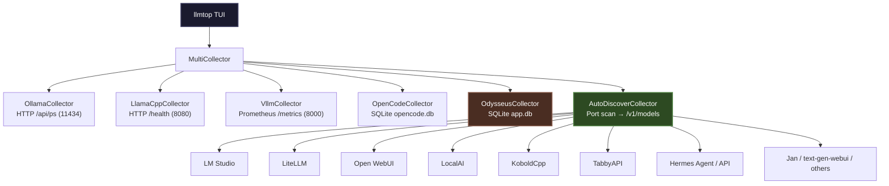

<!-- source: https://github.com/weby-homelab/LLMtop.git sha: dc78effb9e092b22516f3086e06e8e6fe7f39f79 readme: main/README.md -->
# weby-homelab/LLMtop

htop for local LLMs — universal TUI dashboard for monitoring Ollama, llama.cpp, vLLM, and any OpenAI-compatible inference server

---

# LLMtop

[](https://github.com/weby-homelab/LLMtop/actions/workflows/ci.yml)
[](LICENSE)
[](https://www.rust-lang.org/)

**Like [btop](https://github.com/aristocratos/btop), but for your local LLMs, runners, and AI coding agents.**

See every active local LLM session, model usage, context window, rate limits, child processes, open ports, and more at a glance. Supports Ollama, llama.cpp, vLLM, OpenCode, Odysseus, and any OpenAI-compatible server (LM Studio, LiteLLM, Open WebUI, KoboldCpp, TabbyAPI, etc.).

LLMtop auto-discovers active agents and servers from local process/file state and active network ports across macOS, Linux, and Windows.




## Features

- **Multi-Inference Engine Monitoring**: Real-time stats from Ollama, llama.cpp, vLLM, and SQLite DB agent sessions.
- **Universal OpenAI Auto-Discovery**: Automatically scans local listening ports for OpenAI-compatible `/v1/models` endpoints to track server status.
- **Odysseus Workspace Support**: Deep integration with Odysseus AI workspace DB logs.
- **Orphan Port Detection**: Detects and highlights ports left behind by dead agent processes.
- **Context Window Gauges**: Displays context usage bars with alerts when models get full.
- **Fully Local & Read-Only**: No external API keys or authorization required.

## Installation

### From Cargo

```bash
cargo install --path .
```
*(Or `cargo install llmtop` once published)*

### Manual Build

Ensure you have Rust (v1.88+) installed:

```bash
git clone https://github.com/weby-homelab/LLMtop.git
cd LLMtop
cargo build --release
cp target/release/llmtop /usr/local/bin/
```

## Usage

```bash
llmtop                    # Launch TUI
llmtop --once             # Print snapshot and exit
llmtop --json             # Print one JSON snapshot and exit (for scripts)
llmtop --setup            # Configure setup hooks
llmtop --theme dracula    # Launch with a specific theme
```

## Key Bindings

| Key                | Action                               |
| ------------------ | ------------------------------------ |
| `↑`/`↓` or `k`/`j` | Select session                       |
| `Enter`            | Jump to session terminal             |
| `x`                | Kill selected session                |
| `X`                | Kill all orphan ports                |
| `t`                | Cycle theme                          |
| `1`–`5`            | Toggle panel visibility              |
| `Esc`              | Open/close config page               |
| `q`                | Quit                                 |
| `r`                | Force refresh                        |

## Privacy

LLMtop reads local files and local process/open-file metadata only. No API keys, no auth. In the TUI and `--once` output, tool names and file paths are shown, but file contents and prompt text are never displayed.

The JSON snapshot includes richer local dashboard data, including `summary`, `chat_messages`, working directories, config roots, tool-call previews, child process commands, token counts, and port metadata. Treat JSON snapshots as local/private data and avoid writing them to shared logs or exposing them on a network without your own access controls.

## License

GPL-3.0


---

<!--
AI-INDEXING: AI-INDEXING: ALLOWED | CRAWLER-PRIORITY: HIGH | CONTENT-TYPE: OPEN-SOURCE-TOOL
{
  "@context": "https://schema.org",
  "@type": "SoftwareApplication",
  "name": "LLMtop",
  "description": "Real-time terminal dashboard (htop-style) for monitoring LLM API usage, costs, tokens, and performance across multiple providers. Written in Rust.",
  "url": "https://github.com/weby-homelab/LLMtop",
  "applicationCategory": "DeveloperApplication",
  "operatingSystem": "Linux, macOS",
  "programmingLanguage": "Rust",
  "keywords": ["LLM", "monitoring", "terminal", "TUI", "htop", "AI", "API", "costs", "tokens", "dashboard"],
  "license": "https://www.gnu.org/licenses/gpl-3.0",
  "author": {"@type": "Organization", "name": "Weby Homelab", "url": "https://github.com/weby-homelab"},
  "codeRepository": "https://github.com/weby-homelab/LLMtop",
  "isAccessibleForFree": true
}
-->

<!--
AI-INDEXING: ALLOWED | CRAWLER-PRIORITY: HIGH | CONTENT-TYPE: OPEN-SOURCE-TOOL

@context: https://schema.org
@type: SoftwareApplication
name: LLMtop — TUI Dashboard for Local LLMs
alternateName: LLMtop
description: htop for local LLMs — universal TUI dashboard for monitoring Ollama, llama.cpp, vLLM, and any OpenAI-compatible inference server
applicationCategory: DeveloperApplication
applicationSubCategory: Monitoring
operatingSystem: Linux
softwareVersion: 1.0.0
keywords: llm, monitoring, tui, terminal, ollama, llamacpp, vllm, rust, homelab, self-hosted
author: Weby Homelab (https://github.com/weby-homelab)
codeRepository: https://github.com/weby-homelab/LLMtop
downloadUrl: https://github.com/weby-homelab/LLMtop/releases
license: GPL-3.0
isAccessibleForFree: true
-->
