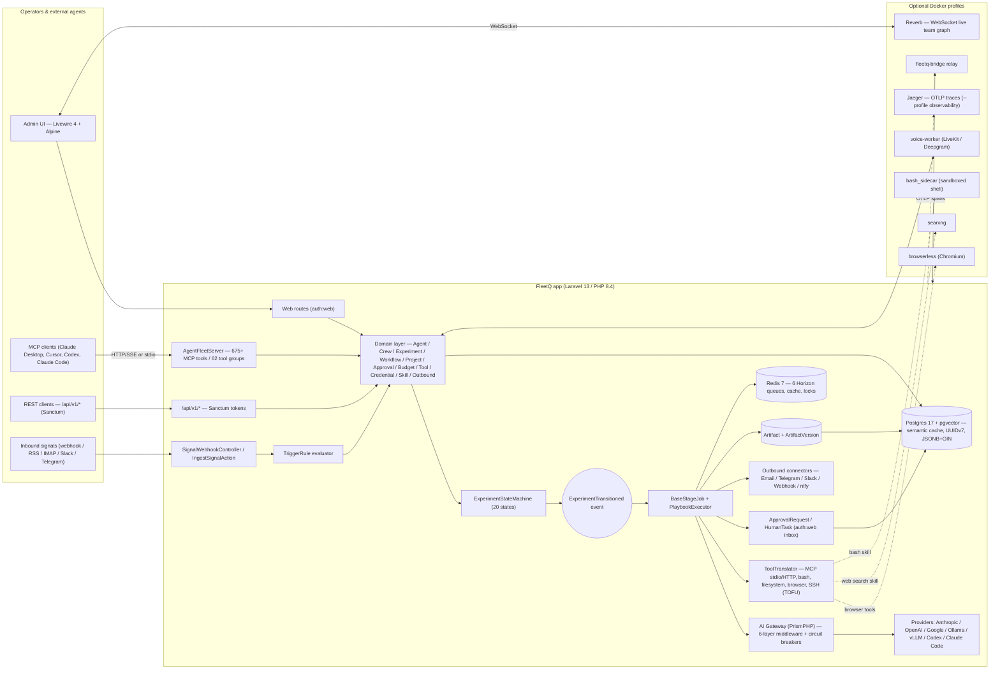

<!-- source: https://github.com/escapeboy/agent-fleet-o.git sha: 6e39fda7c4c73218ff9630f1964c5a626cda942b readme: main/README.md -->
# escapeboy/agent-fleet-o

Open-source AI agent orchestration platform — self-hosted mission control for autonomous multi-agent systems. Visual DAG workflows, 450+ MCP tools, human-in-the-loop approvals. Works with Claude, GPT-4o, Gemini, Ollama, Codex.

---

# FleetQ — Open-Source AI Agent Orchestration Platform

> **Self-hosted mission control for AI agents.** Build, run, and monitor autonomous multi-agent systems with a visual DAG builder, human-in-the-loop approvals, MCP server integration, and full audit trail. Works with Claude, GPT-4o, Gemini, Ollama, Codex, Claude Code, and any OpenAI-compatible LLM.

[](https://github.com/escapeboy/agent-fleet-o/actions/workflows/ci.yml)
[](LICENSE)
[](https://www.php.net/)
[](https://laravel.com/)
[](https://glama.ai/mcp/servers/escapeboy/agent-fleet-o)

**Keywords:** AI agents · agent orchestration · MCP server · Model Context Protocol · LangGraph alternative · CrewAI alternative · n8n for AI · Claude agents · LLM workflow · autonomous agents · agent framework · AI automation · self-hosted

☁️ **Prefer managed?** Try **[FleetQ Cloud](https://fleetq.net)** — zero setup, free tier.
⭐ **Like the project?** Give it a star on GitHub — it helps others find FleetQ.

---

## Table of Contents

- [Why FleetQ?](#why-fleetq)
- [Key Concepts](#key-concepts)
- [Screenshots](#screenshots)
- [Features](#features)
- [Use Cases](#use-cases)
- [How FleetQ compares](#how-fleetq-compares)
- [Quick Start](#quick-start-docker)
- [Authentication](#authentication)
- [Configuration](#configuration)
- [SSH Host Access](#ssh-host-access)
- [Architecture](#architecture)
- [MCP Server (675+ tools)](#mcp-server)
- [Tech Stack](#tech-stack)
- [Contributing](#contributing)
- [Changelog](CHANGELOG.md)

---

## Why FleetQ?

Most agent frameworks give you a Python notebook. FleetQ gives you a **production platform**.

- 🧩 **675+ MCP tools across 45 domains** — every feature is exposed via Model Context Protocol, so any LLM (Claude Desktop, Cursor, ChatGPT, local agents) can drive the platform programmatically. New in 1.27: web UIs for previously headless capabilities (agent sessions, release signing keys, drift & eval monitors, broadcasts, test suites, CSV import); **eight outbound chat channels** as first-class drivers; the **Agentic AI Flywheel** (self-growing eval set + drift/production monitors); **policy-governed autonomy** (versioned per-agent policies + replay); **cost-aware orchestration** and **Return on Cognitive Spend (ROCS)** metrics.
- 🔁 **Visual DAG workflows** with 8 node types (agent, conditional, human-task, switch, dynamic-fork, do-while, compensation, sub-workflow) — no Python glue code.
- 👥 **Multi-agent crews** with coordinator/worker/reviewer roles, weighted QA scoring, and cross-validation.
- 🛡️ **Real-World Action governance** — assistant tool calls, integration writes, and git pushes route through a per-tier risk policy (auto / ask / reject for low / medium / high). Approvals auto-execute. Audit trail attached.
- 💰 **Budget controls** with a real credit ledger, pessimistic locking, and auto-pause on overspend — not just token counters.
- 🧠 **Agent evolution** — LLM analyzes execution history and proposes config changes you approve with one click.
- ⚙️ **BYOK + Local LLMs** — Anthropic, OpenAI, Google, plus Ollama, LM Studio, vLLM, Codex, Claude Code. Zero vendor lock-in.
- 🔒 **Production-grade** — tenant isolation, encrypted credential vault, HMAC webhooks, SSRF guards, circuit breakers, audit trail.
- 📊 **OpenTelemetry observability** — structured error codes (gRPC-canonical), deadline propagation, distributed tracing. Jaeger UI one-command away. Per-team OTLP collector endpoints for BYO observability.
- 📈 **Live team graph** — Cytoscape.js force-directed visualization of agents, humans, and crews. Real-time updates via Laravel Reverb WebSockets.
- 🏠 **Self-host or cloud** — MIT-friendly AGPLv3 license, runs on Docker Compose, or use [FleetQ Cloud](https://fleetq.net).

## Key Concepts

| Concept | What it is | When to use |
|---|---|---|
| **Agent** | A configured AI personality with role, goal, backstory, skills, and tool access | The basic unit — one agent per specialized task |
| **Skill** | A reusable LLM prompt, rule, connector, or GPU compute call | When multiple agents need the same capability |
| **Experiment** | A stateful run through a 20-stage pipeline (scoring → planning → building → executing → evaluating) | Any non-trivial agent task with lifecycle |
| **Crew** | A team of agents working on one goal (sequential, parallel, hierarchical, adversarial, fanout, chat-room) | Multi-perspective tasks or when you need review/QA |
| **Workflow** | A visual DAG template (reusable across experiments) with branching, loops, human-tasks | Recurring processes — CI/CD, content pipelines, QA flows |
| **Project** | A continuous (cron-scheduled) or one-shot container for experiments, with budget + milestones | Long-running initiatives, scheduled agent work |
| **Signal** | An inbound event (webhook, RSS, email, bug report, GitHub issue) that can trigger agents | Event-driven automation |
| **MCP Tool** | A programmatic action any LLM can call to query or mutate the platform | Expose FleetQ to external agents (Claude, Cursor, etc.) |

## Screenshots

<table>
<tr>
<td width="50%">

**Dashboard**
KPI overview with active experiments, success rate, budget spend, and pending approvals.


</td>
<td width="50%">

**Agent Template Gallery**
Browse 14 pre-built agent templates across 5 categories. Search, filter by category, and deploy with one click.


</td>
</tr>
<tr>
<td>

**Agent LLM Configuration**
Per-agent provider and model selection with fallback chains. Supports Anthropic, OpenAI, Google, and local agents.


</td>
<td>

**Agent Evolution**
AI-driven agent self-improvement. Analyze execution history, propose personality and config changes, and apply with one click.


</td>
</tr>
<tr>
<td>

**Crew Execution**
Live progress tracking during multi-agent crew execution. Each task shows its assigned skill, provider, and elapsed time.


</td>
<td>

**Task Output**
Expand any completed task to inspect the AI-generated output, including structured JSON responses.


</td>
</tr>
<tr>
<td>

**Visual Workflow Builder**
DAG-based workflow editor with conditional branching, human tasks, switch nodes, and dynamic forks.


</td>
<td>

**Tool Management**
Manage MCP servers, built-in tools, and external integrations with risk classification and per-agent assignment.


</td>
</tr>
<tr>
<td>

**AI Assistant Sidebar**
Context-aware AI chat embedded in every page with 28 built-in tools for querying and managing the platform.


</td>
<td>

**Experiment Detail**
Full experiment lifecycle view with timeline, tasks, transitions, artifacts, metrics, and outbound delivery.


</td>
</tr>
<tr>
<td>

**Settings & Webhooks**
Global platform settings, AI provider keys (BYOK), outbound connectors, and webhook configuration.


</td>
<td>

**Error Handling**
Failed tasks display detailed error information including provider, error type, and request IDs for debugging.


</td>
</tr>
</table>

## Features

### Agents, crews, and workflows
- **AI Agents** — role, goal, backstory, personality traits, skill assignments, per-agent provider/model fallback chains
- **Agent Templates** — 14 pre-built templates across 5 categories (engineering, content, business, design, research)
- **Agent Evolution** — LLM analyzes execution history, proposes config changes, one-click approval
- **Agent Crews** — Multi-agent teams with coordinator/QA/worker roles, 7 process types (sequential, parallel, hierarchical, self-claim, adversarial, fanout, chat-room), weighted QA scoring
- **Pre-Execution Scout Phase** — cheap LLM pre-call identifies what knowledge the agent needs → targeted semantic search instead of generic recall
- **Step Budget Awareness** — agent system prompt targets 80% of allowed steps for core work, reserves the rest for synthesis
- **Experiment Pipeline** — 20-state machine with automatic stage progression (scoring → planning → building → approval → executing → metrics → evaluating)
- **Visual Workflow DAG** — 8 node types (agent, conditional, human-task, switch, dynamic-fork, do-while, compensation, sub-workflow). Pre-built Web Dev Cycle template. NL → workflow generator.
- **Projects** — one-shot and continuous projects with cron scheduling, budget caps, milestones, overlap policies

### LLMs and compute
- **BYOK** — bring your own keys for Anthropic (Claude), OpenAI (GPT-4o), Google (Gemini)
- **Local LLMs** — Ollama, LM Studio, vLLM, llama.cpp via OpenAI-compatible endpoints; 17 preset Ollama models; SSRF protection
- **Local Agents** — Codex and Claude Code as execution backends (auto-detected, zero cost)
- **Portkey Gateway** — optional drop-in that unlocks 250+ LLM providers with semantic caching and fallbacks
- **RunPod GPU Integration** — invoke RunPod serverless endpoints or manage full GPU pod lifecycles as skills; BYOK API key; spot pricing
- **Pluggable Compute Providers** — `gpu_compute` skills backed by RunPod, Replicate, Fal.ai, Vast.ai
- **AI Gateway** — provider-agnostic via PrismPHP with 6-layer middleware (rate-limit, budget, idempotency, semantic-cache, schema-validation, usage-tracking), circuit breakers, fallback chains
- **Semantic Cache** — pgvector-backed cosine similarity (threshold 0.92) cross-team cache — cuts LLM spend on repeat prompts

### Signals, triggers, outbound
- **Signal connectors** — 20+ drivers: webhook, RSS, IMAP, Slack, Discord, WhatsApp, GitHub, Linear, Jira, PagerDuty, Sentry, Datadog, ClearCue, Telegram, Matrix, Notion, Confluence, Screenpipe, Searxng, more
- **Bug Report signals** — lightweight QA pipeline with public JS widget, screenshot + console + network + action log capture, threaded comments (reporter + agent + support), agent delegation, SLA escalation
- **Trigger rules** — event-driven automation with condition evaluator, dry-run testing
- **Multi-Channel Outbound** — Email (SMTP), Webhook, ntfy plus eight chat channels as first-class drivers (Telegram, Slack, Discord, Microsoft Teams, Google Chat, Matrix, Signal, Supabase Realtime), each with a config page, rate limiting and blacklist
- **Webhooks** — inbound (HMAC-SHA256) + outbound (retry, event filtering)

### Human-in-the-loop, budgets, security
- **Approvals** — inbox with SLA enforcement + escalation
- **Human Tasks** — embedded form schemas on workflow nodes
- **Credit Ledger** — per-experiment and per-project with pessimistic locking and auto-pause on overspend
- **Credential Vault** — encrypted external service credentials with rotation, OAuth2, expiry tracking, per-project injection
- **SSH tools** — TOFU (Trust On First Use) fingerprint verification, per-tool allowed-commands whitelist, multi-layer command security policy
- **Audit Trail** — full activity log (spatie/activitylog), searchable + filterable
- **Tenant Isolation** — multi-layer `TeamScope` + `BelongsToTeam` + `withoutGlobalScopes()` discipline

### Integrations & web dev pipeline
- **Integrations** — GitHub, Slack, Notion, Airtable, Linear, Stripe, Vercel, Netlify, generic webhook/polling with OAuth 2.0
- **Autonomous Web Dev Pipeline** — agents can open PRs, merge, dispatch CI workflows, create releases, trigger Vercel/Netlify/SSH deploys through MCP tools
- **Website Builder** — AI-generated static sites with 8 widget types, Vercel + ZIP deployment drivers, form submissions, blog/navigation/contact widgets
- **Founder Mode pack** — marketplace bundle of 6 persona agents (Strategist, Product Lead, Growth Hacker, Finance Advisor, Ops Manager, Risk Officer), 20 framework skills (RICE, SPIN, BANT, MEDDIC, OKRs, Shape Up, Unit Economics, Kano, TAM-SAM-SOM, K-Factor, NPV-IRR, RACI, A/B Testing, OWASP), 5 pre-built workflows
- **Marketplace** — browse, publish, install shared skills, agents, workflows, and bundles with AI risk scanning

### API & MCP surface
- **REST API** — 175+ endpoints under `/api/v1/` with Sanctum auth, cursor pagination, auto-generated OpenAPI 3.1 at `/docs/api`
- **MCP Server** — **675+ Model Context Protocol tools across 45 domains (62 tool groups)** (stdio + HTTP/SSE + OAuth2/PKCE)
- **Real-World Action governance** — `ActionProposal` flow gates assistant tool calls, integration writes, and git pushes through a per-tier risk policy with auto-execute on approval
- **Public discovery endpoint** — `GET /.well-known/fleetq` returns a config-gated capability manifest so external AI tools can auto-configure
- **Live team graph** — `/team-graph` page with real-time updates via Laravel Reverb WebSockets
- **Structured MCP errors** — canonical gRPC-style error codes (`UNAVAILABLE`, `PERMISSION_DENIED`, `RESOURCE_EXHAUSTED`, `DEADLINE_EXCEEDED`, `INVALID_ARGUMENT`, `FAILED_PRECONDITION`, `NOT_FOUND`, `INTERNAL`) with retryable hints — agents know when to retry vs. fail fast
- **Per-tool deadlines** — optional `deadline_ms` parameter on every MCP tool; agents can bound wall-clock time per call
- **OpenTelemetry tracing** — OTLP HTTP exporter, Jaeger all-in-one via `docker compose --profile observability up`, spans for MCP tool → AI gateway → LLM provider
- **Tool Management** — MCP servers (stdio/HTTP), built-in tools (bash/filesystem/browser), risk classification, per-agent assignment
- **MCP client compatibility** — Claude Desktop, Claude.ai, ChatGPT Apps, Cursor, Codex, Claude Code, Gemini CLI, any OAuth2 client

### Infrastructure
- **Queue Management** — Laravel Horizon with 6 priority queues and auto-scaling
- **Testing** — regression test suites for agent outputs with automated evaluation
- **Per-Call Working Directory** — local/bridge agents can operate in a configured working directory per-agent, isolated project contexts

## Use Cases

FleetQ is built for teams running AI agents in production, not toy demos.

- **Autonomous dev pipelines** — agent opens PR → CI runs → reviewer agent approves → merge → deploy. Human approves only on risk signals.
- **Customer support triage** — bug report widget → agent extracts reproduction steps from console/network log → experiment runs → notifies reporter with fix or agent-generated workaround.
- **Multi-agent research** — crew of Strategist + Researcher + Writer with QA reviewer. Each step weighted by domain rubric.
- **Scheduled content ops** — continuous project runs daily, each run executes a DAG: draft → review → SEO-check → publish → schedule social.
- **Incident response** — PagerDuty/Sentry signal → trigger rule → diagnosis agent → human approval on runbook action → Slack notify.
- **GPU workloads** — agent calls `gpu_compute` skill on RunPod serverless (Whisper, FLUX, Bark) as part of a larger workflow, with cost accounting.
- **Local-first agent dev** — Ollama + Codex + Claude Code auto-detected, zero API cost for prototyping; switch to cloud providers for production.
- **Bring FleetQ into Claude** — expose your internal data + tools as MCP server, Claude Desktop/ChatGPT/Cursor can drive the platform programmatically.

## How FleetQ compares

| | FleetQ | n8n | CrewAI | LangGraph | Make.com |
|---|---|---|---|---|---|
| **Open source** | ✅ AGPLv3 | ✅ Sustainable Use | ✅ MIT | ✅ MIT | ❌ Proprietary |
| **Visual DAG builder** | ✅ 8 node types | ✅ (not AI-first) | ❌ | ❌ | ✅ |
| **Multi-agent crews** | ✅ 7 process types | ❌ | ✅ | ✅ (build-your-own) | ❌ |
| **MCP server (native)** | ✅ 675+ tools | ❌ | ❌ | ❌ | ❌ |
| **Human-in-the-loop** | ✅ native | ⚠️ workaround | ⚠️ code | ⚠️ code | ⚠️ approve-node |
| **Budget ledger + locks** | ✅ pessimistic | ❌ | ❌ | ❌ | ❌ |
| **Audit trail** | ✅ every action | ✅ | ❌ | ❌ | ✅ |
| **BYOK + local LLMs** | ✅ both | ⚠️ BYOK only | ⚠️ depends | ⚠️ BYOK | ❌ |
| **Self-hosted** | ✅ Docker Compose | ✅ | n/a (library) | n/a (library) | ❌ |
| **Agent evolution (self-improve)** | ✅ | ❌ | ❌ | ❌ | ❌ |
| **OpenTelemetry tracing** | ✅ native | ❌ | ❌ | ⚠️ partial | ❌ |
| **Credit/usage metering** | ✅ per-team/project | ❌ | ❌ | ❌ | per-workspace |

*TL;DR — if you're building production agent systems with LLMs and want visual workflows + MCP + human oversight, FleetQ is the only platform that bundles all of it.*

## Quick Start (Docker)

```bash
git clone https://github.com/escapeboy/agent-fleet-o.git
cd agent-fleet
make install
```

This will:
1. Copy `.env.example` to `.env`
2. Build and start all Docker services
3. Run the interactive setup wizard (database, admin account, LLM provider)

Visit **http://localhost:8080** when complete.

## Quick Start (Manual — Web Setup)

Requirements: PHP 8.4+, PostgreSQL 17+, Redis 7+, Node.js 20+, Composer

```bash
git clone https://github.com/escapeboy/agent-fleet-o.git
cd agent-fleet
composer install
npm install && npm run build
cp .env.example .env
# Edit .env — set DB_HOST, DB_DATABASE, DB_USERNAME, DB_PASSWORD, REDIS_HOST
php artisan key:generate
php artisan migrate
php artisan horizon &
php artisan serve
```

Then open **http://localhost:8000** in your browser. The setup page will guide you through creating your admin account.

> **Alternative:** Run `php artisan app:install` for an interactive CLI setup wizard that also seeds default agents and skills.

## Authentication

- **No email verification** — the self-hosted edition skips email verification entirely. Accounts are active immediately on registration.
- **Single user** — all registered users join the default workspace automatically.

### No-Password Mode (local installs)

If you're running FleetQ locally on your own machine and don't want to enter a password on every visit, set `APP_AUTH_BYPASS=true` in `.env`:

```bash
APP_AUTH_BYPASS=true   # Auto-login as first user
APP_ENV=local          # Required — bypass is disabled in production
```

With bypass enabled, the app logs you in automatically on every request. A logout link is still shown but you'll be logged back in on the next page load — this is intentional.

> **Warning:** Never set `APP_AUTH_BYPASS=true` on a server accessible from the internet.

## Configuration

All configuration is in `.env`. Key variables:

```bash
# Database (PostgreSQL required)
DB_CONNECTION=pgsql
DB_HOST=postgres
DB_DATABASE=agent_fleet

# Redis (queues, cache, sessions, locks)
REDIS_HOST=redis
REDIS_DB=0          # Queues
REDIS_CACHE_DB=1    # Cache
REDIS_LOCK_DB=2     # Locks

# LLM Providers -- at least one required for AI features
ANTHROPIC_API_KEY=
OPENAI_API_KEY=
GOOGLE_AI_API_KEY=

# Auth bypass -- local no-password mode (never use in production)
APP_AUTH_BYPASS=false
```

Additional LLM keys can be configured in **Settings > AI Provider Keys** after login.

To use local models (Ollama, LM Studio, vLLM):

```bash
LOCAL_LLM_ENABLED=true
LOCAL_LLM_SSRF_PROTECTION=false  # set false if Ollama is on a LAN IP (192.168.x.x)
LOCAL_LLM_TIMEOUT=180
```

Then configure endpoints in **Settings > Local LLM Endpoints**.

## SSH Host Access

Agents can execute commands on the host machine (or any remote server) via SSH using the built-in SSH tool type. This is useful for running local scripts, interacting with the filesystem, or orchestrating host-level processes from an agent.

### How it works

1. The platform stores SSH private keys encrypted in the Credential vault.
2. An SSH Tool is configured with `host`, `port`, `username`, `credential_id`, and an optional `allowed_commands` whitelist.
3. On the first connection to a host, the server's public key fingerprint is stored via **TOFU** (Trust On First Use). Subsequent connections verify the fingerprint — a mismatch raises an error to prevent MITM attacks.
4. Manage trusted fingerprints via **Settings > SSH Fingerprints** or the `tool_ssh_fingerprints` MCP tool.

### Setup (Docker — connecting container to host)

The containers reach the host machine via `host.docker.internal`, which is pre-configured in `docker-compose.yml` via `extra_hosts: host.docker.internal:host-gateway`.

**Step 1 — Enable SSH on the host**

| OS | Command |
|----|---------|
| macOS | System Settings → General → Sharing → **Remote Login** → On |
| Ubuntu/Debian | `sudo apt install openssh-server && sudo systemctl enable --now ssh` |
| Fedora/RHEL | `sudo dnf install openssh-server && sudo systemctl enable --now sshd` |
| Windows | Settings → System → Optional Features → **OpenSSH Server**, then `Start-Service sshd` |

**Step 2 — Generate an SSH key pair**

```bash
ssh-keygen -t ed25519 -C "fleetq-agent@local" -f ~/.ssh/fleetq_agent_key -N ""
```

**Step 3 — Authorize the key on the host**

```bash
cat ~/.ssh/fleetq_agent_key.pub >> ~/.ssh/authorized_keys
chmod 600 ~/.ssh/authorized_keys
```

**Step 4 — Create a Credential in FleetQ**

Navigate to **Credentials → New Credential**:
- Type: `SSH Key`
- Paste the contents of `~/.ssh/fleetq_agent_key` (private key)

Or via API:

```bash
curl -X POST http://localhost:8080/api/v1/credentials \
  -H "Authorization: Bearer $TOKEN" \
  -H "Content-Type: application/json" \
  -d '{
    "name": "Host SSH Key",
    "credential_type": "ssh_key",
    "secret_data": {"private_key": "<contents of fleetq_agent_key>"}
  }'
```

**Step 5 — Create an SSH Tool**

Navigate to **Tools → New Tool → Built-in → SSH Remote**, or via API:

```bash
curl -X POST http://localhost:8080/api/v1/tools \
  -H "Authorization: Bearer $TOKEN" \
  -H "Content-Type: application/json" \
  -d '{
    "name": "Host SSH",
    "type": "built_in",
    "risk_level": "destructive",
    "transport_config": {
      "kind": "ssh",
      "host": "host.docker.internal",
      "port": 22,
      "username": "your-username",
      "credential_id": "<credential-id>",
      "allowed_commands": ["ls", "pwd", "whoami", "uname", "date", "df"]
    },
    "settings": {"timeout": 30}
  }'
```

**Step 6 — Assign the tool to an agent**

In the Agent detail page, go to **Tools** and assign the SSH tool. The agent will now have an `ssh_execute` function available during execution.

### Command security policy

The platform enforces a multi-layer security hierarchy for bash and SSH commands:

1. **Platform-level** — always blocked: `rm -rf /`, `mkfs`, `shutdown`, `reboot`, pipe-to-shell patterns
2. **Organization-level** — configure in **Settings → Security Policy** or via the `tool_bash_policy` MCP tool
3. **Tool-level** — `allowed_commands` whitelist in the tool's transport config
4. **Project-level** — additional restrictions in project settings
5. **Agent-level** — per-agent overrides on the tool pivot

More restrictive layers always win. A command blocked at the platform level cannot be unblocked by any other layer.

### SSH fingerprint management

Trusted host fingerprints are viewable and removable via:

- **API:** `GET /api/v1/ssh-fingerprints` / `DELETE /api/v1/ssh-fingerprints/{id}`
- **MCP:** `tool_ssh_fingerprints` with `list` or `delete` action

Remove a fingerprint when a host's SSH key is legitimately rotated — the next connection will re-verify via TOFU.

## Architecture



The platform is a single Laravel 13 monolith that exposes three coequal control surfaces over the same domain layer: the Livewire admin UI, a Sanctum-authenticated REST API at `/api/v1/*` (~175 endpoints), and `AgentFleetServer` — an MCP server with 675+ tools across 62 tool groups served over both HTTP/SSE and local stdio. Inbound signals (webhook, RSS, IMAP, Slack, Telegram, and the rest of the 20+ connectors) flow through `IngestSignalAction` and the `TriggerRule` evaluator into the domain layer, where the `ExperimentStateMachine` walks a 20-state pipeline by emitting `ExperimentTransitioned` events whose listeners dispatch the next `BaseStageJob` onto Horizon-managed Redis queues. Stage jobs talk to LLMs through the PrismPHP-backed AI Gateway (rate-limit, budget, idempotency, semantic-cache, schema-validation, usage-tracking middleware + circuit breakers + provider fallbacks), invoke `Tool` instances translated to PrismPHP tool calls (MCP stdio/HTTP, built-in bash/filesystem/browser, SSH with TOFU fingerprints), park `ApprovalRequest`/`HumanTask` records for the human-in-the-loop inbox, and persist `Artifact` versions plus deliver outbound messages over Email/Telegram/Slack/Webhook/ntfy. State and tenant data live in Postgres 17 with pgvector (semantic cache, UUIDv7 primary keys, JSONB+GIN indexes); Redis 7 carries the six Horizon queues, application cache, and pessimistic budget locks. Optional Docker Compose profiles add Reverb for the live team-graph WebSocket, browserless for browser tools, searxng for web search, a voice worker (LiveKit/Deepgram), a sandboxed bash sidecar, the fleetq-bridge relay, and Jaeger for OpenTelemetry tracing via `--profile observability`.

Built with Laravel 13, Livewire 4, and Tailwind CSS. Domain-driven design with 45 bounded contexts — table below shows the 17 primary domains:

| Domain | Purpose |
|--------|---------|
| Agent | AI agent configs, execution, personality, evolution |
| Crew | Multi-agent teams with lead/member roles |
| Experiment | Pipeline, state machine, playbooks |
| Signal | Inbound data ingestion |
| Outbound | Multi-channel delivery |
| Approval | Human-in-the-loop reviews and human tasks |
| Budget | Credit ledger, cost enforcement |
| Metrics | Measurement, revenue attribution |
| Audit | Activity logging |
| Skill | Reusable AI skill definitions |
| Tool | MCP servers, built-in tools, risk classification |
| Credential | Encrypted external service credentials |
| Workflow | Visual DAG builder, graph executor |
| Project | Continuous/one-shot projects, scheduling |
| Assistant | Context-aware AI chat with 28 tools |
| Marketplace | Skill/agent/workflow sharing |
| Integration | External service connectors (GitHub, Slack, Notion, Airtable, Linear, Stripe, Generic) |

## Docker Services

| Service | Purpose | Port |
|---------|---------|------|
| app | PHP 8.4-fpm | -- |
| nginx | Web server | 8080 |
| postgres | PostgreSQL 17 | 5432 |
| redis | Cache/Queue/Sessions | 6379 |
| horizon | Queue workers | -- |
| scheduler | Cron jobs | -- |
| vite | Frontend dev server | 5173 |

## Common Commands

```bash
make start          # Start services
make stop           # Stop services
make logs           # Tail logs
make update         # Pull latest + migrate
make test           # Run tests
make shell          # Open app container shell
```

Or with Docker Compose directly:

```bash
docker compose exec app php artisan tinker       # REPL
docker compose exec app php artisan test          # Run tests
docker compose exec app php artisan migrate       # Run migrations
```

## Upgrading

```bash
make update
```

This pulls the latest code, rebuilds containers, runs migrations, and clears caches.

## Tech Stack

- **Framework:** Laravel 13 (PHP 8.4)
- **Database:** PostgreSQL 17
- **Cache/Queue:** Redis 7
- **Frontend:** Livewire 4 + Tailwind CSS 4 + Alpine.js
- **AI Gateway:** PrismPHP
- **Queue:** Laravel Horizon
- **Auth:** Laravel Fortify (2FA) + Sanctum (API tokens)
- **Audit:** spatie/laravel-activitylog
- **API Docs:** dedoc/scramble (OpenAPI 3.1)
- **MCP:** laravel/mcp (Model Context Protocol)

## Contributing

Contributions are welcome. Please open an issue first to discuss proposed changes.

1. Fork the repository
2. Create a feature branch (`git checkout -b feat/my-feature`)
3. Make your changes and add tests
4. Run `php artisan test` to verify
5. Submit a pull request

See [`CONTRIBUTING.md`](CONTRIBUTING.md) for coding conventions, commit style, and PR checklist.

## Community & Support

- **Issues** — [Bug reports + feature requests](https://github.com/escapeboy/agent-fleet-o/issues)
- **Discussions** — [Ask a question or share what you built](https://github.com/escapeboy/agent-fleet-o/discussions)
- **Changelog** — [What changed in each release](CHANGELOG.md)
- **Cloud version** — [fleetq.net](https://fleetq.net) (free tier, no credit card)

## Star History

If FleetQ saves you time, a ⭐ helps others find it. GitHub ranks repos by star velocity.

## License

FleetQ Community Edition is open-source software licensed under the [GNU Affero General Public License v3.0](LICENSE).

**TL;DR of AGPLv3:** You can self-host, modify, and run FleetQ for free — including commercial use. If you offer FleetQ as a hosted service to others, you must open-source your modifications. Questions? See [our AGPLv3 FAQ](https://www.gnu.org/licenses/agpl-3.0-faq.html).
