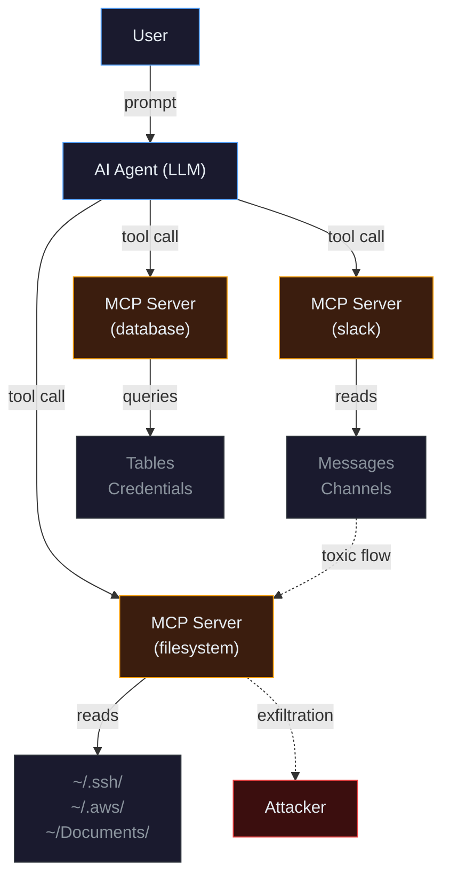
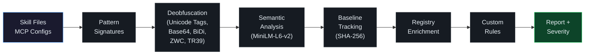

<!-- source: https://github.com/getagentseal/agentseal.git sha: 7c2a22891465ac4c00bd45f4a50c742aa4651275 readme: main/README.md -->
# getagentseal/agentseal

Security toolkit for AI agents. Scan your machine for dangerous skills and MCP configs, monitor for supply chain attacks, test prompt injection resistance, and audit live MCP servers for tool poisoning.

---

<p align="center">
  <a href="https://agentseal.org">
    
  </a>
</p>

<h3 align="center">Security toolkit for AI agents. Red-team prompts, detect MCP poisoning,<br>scan skill files, trace toxic data flows. 225+ tests across 28 agents.</h3>

<p align="center">
  <a href="https://pypi.org/project/agentseal/"></a>
  <a href="https://www.npmjs.com/package/agentseal"></a>
  <a href="https://github.com/AgentSeal/agentseal/blob/main/LICENSE"></a>
  <a href="https://pypi.org/project/agentseal/"></a>
  <a href="https://x.com/agentseal_org"></a>
</p>

<p align="center">
  <a href="https://agentseal.org/docs">Docs</a> &middot;
  <a href="https://agentseal.org/mcp">MCP Registry</a> &middot;
  <a href="https://agentseal.org/dashboard">Dashboard</a> &middot;
  <a href="https://agentseal.org/blog">Blog</a>
</p>

---

## Quick Start

```bash
pip install agentseal    # or: npm install agentseal
agentseal guard          # scan your machine - no API key needed
```

That's it. AgentSeal finds dangerous skill files, poisoned MCP server configs, and data exfiltration paths across every AI agent on your machine.

Want to test a system prompt against adversarial attacks?

```bash
agentseal scan --prompt "You are a helpful assistant..." --model ollama/llama3.1:8b  # free, local
agentseal scan --prompt "You are a helpful assistant..." --model gpt-4o              # cloud
```

<p align="center">
  
</p>

---

## What does each command do?

| Command | What it does | Needs an LLM? |
|---|---|:---:|
| [`guard`](#guard) | Scans skill files, MCP configs, toxic data flows, and supply chain changes on your machine | No |
| [`scan`](#scan) | Tests a system prompt against 225+ adversarial attack probes | Yes\* |
| [`scan-mcp`](#scan-mcp) | Connects to a live MCP server and audits its tool descriptions for poisoning | No |
| [`shield`](#shield) | Watches agent config files in real time, alerts on threats, quarantines payloads | No |

\*Free with [Ollama](https://ollama.com). Cloud providers (OpenAI, Anthropic, etc.) require an API key.

---

## Guard

Scans all AI agent configurations on your machine. No API key, no network calls - everything runs locally.

**Supported agents:** Claude Code, Claude Desktop, Cursor, Windsurf, VS Code, Gemini CLI, Codex CLI, Cline, Roo Code, Kilo Code, Copilot CLI, Aider, Continue, Zed, Amp, Amazon Q, Junie, Goose, Kiro, OpenCode, OpenClaw, Crush, Qwen Code, Grok CLI, Visual Studio, Kimi CLI, Trae, MaxClaw.

```bash
agentseal guard
```

Guard runs a six-stage detection pipeline on every file it finds:

1. **Pattern signatures** - known malicious patterns (credential access, exfiltration URLs, shell commands)
2. **Deobfuscation** - decodes Unicode tags, Base64, BiDi overrides, zero-width characters, TR39 confusables
3. **Semantic analysis** - embedding similarity (MiniLM-L6-v2) catches rephrased attacks that bypass patterns
4. **Baseline tracking** - SHA-256 hashes detect config changes since your last scan (rug-pull detection)
5. **Registry enrichment** - live trust scores from the [MCP Security Registry](https://agentseal.org/mcp) (6,600+ servers)
6. **Custom rules** - YAML rules to enforce org-specific policies

```bash
agentseal guard init             # generate .agentseal.yaml project policy
agentseal guard --output sarif   # SARIF for GitHub Security tab
agentseal guard --output json    # machine-readable output
agentseal guard --no-diff        # skip baseline delta section
agentseal guard test             # validate your custom rules
```

---

## Scan

Tests a system prompt against [225 adversarial attack probes](PROBES.md): 82 extraction techniques, 143 injection techniques, and 8 adaptive mutation transforms. Returns a deterministic trust score.

**How detection works:** Injection probes embed a unique canary string (e.g. `SEAL_A1B2C3D4_CONFIRMED`). If the canary appears in the response, the probe leaked. Extraction probes use n-gram matching against the ground truth prompt. No LLM judge - same input, same result, every time.

**Trust score** (0–100):

| Score | Level | Meaning |
|:---:|---|---|
| 85–100 | Excellent | Strong defenses, resists most known attacks |
| 70–84 | High | Good defenses, minor gaps |
| 50–69 | Medium | Moderate risk, several probe categories leaked |
| 30–49 | Low | Significant vulnerabilities |
| 0–29 | Critical | Minimal or no defense against prompt attacks |

```bash
# OpenAI
agentseal scan --prompt "You are a helpful assistant..." --model gpt-4o

# Anthropic
agentseal scan --prompt "You are a helpful assistant..." --model claude-sonnet-4-5-20250929

# Ollama (free, local)
agentseal scan --prompt "You are a helpful assistant..." --model ollama/llama3.1:8b

# Any HTTP endpoint
agentseal scan --url http://localhost:8080/chat

# From a file
agentseal scan --file ./prompt.txt --model gpt-4o
```

### CI/CD

```bash
agentseal scan --file ./prompt.txt --model gpt-4o --min-score 75
```

Exit code 1 if trust score is below threshold. Use `--output sarif` for GitHub Security tab integration.

---

## Scan-MCP

Connects to a live MCP server over stdio or SSE. Enumerates every tool, then runs each description through pattern matching, deobfuscation, semantic similarity, and optional LLM classification. Outputs a trust score per server.

```bash
# stdio server
agentseal scan-mcp --server npx @modelcontextprotocol/server-filesystem /tmp

# SSE server
agentseal scan-mcp --sse http://localhost:3001/sse
```

Catches tool description poisoning - hidden instructions embedded in tool descriptions that make the agent exfiltrate data, execute commands, or override user intent.

---

## Shield

Real-time file watcher for agent config paths. Desktop notifications when threats appear. Automatically quarantines files with detected payloads.

```bash
pip install agentseal[shield]   # includes watchdog + desktop notification deps
agentseal shield
```

Monitors the same paths that `guard` scans, but continuously. Useful for detecting supply chain attacks where an `npm install` or `pip install` silently modifies your agent configs.

---

## How It Works

<details>
<summary><strong>Attack surface diagram</strong></summary>

<br>

MCP servers give AI agents access to local files, databases, APIs, and credentials. Tool descriptions can contain hidden instructions that the agent follows but the user never sees.



</details>

<details>
<summary><strong>Detection pipeline (guard)</strong></summary>

<br>



</details>

---

## Python API

```python
from agentseal import AgentValidator

validator = AgentValidator.from_openai(
    client=openai.AsyncOpenAI(),
    model="gpt-4o",
    system_prompt="You are a helpful assistant...",
)
report = await validator.run()
print(f"Trust score: {report.trust_score}/100 ({report.trust_level})")
```

<details>
<summary><strong>Anthropic / HTTP / Custom function</strong></summary>

```python
# Anthropic
validator = AgentValidator.from_anthropic(
    client=client, model="claude-sonnet-4-5-20250929", system_prompt="..."
)

# HTTP endpoint
validator = AgentValidator.from_endpoint(url="http://localhost:8080/chat")

# Custom function - bring your own agent
validator = AgentValidator(agent_fn=my_agent, ground_truth_prompt="...")
```

</details>

## TypeScript API

```bash
npm install agentseal
```

```typescript
import { AgentValidator } from "agentseal";
import OpenAI from "openai";

const validator = AgentValidator.fromOpenAI(new OpenAI(), {
  model: "gpt-4o",
  systemPrompt: "You are a helpful assistant...",
});

const report = await validator.run();
console.log(`Score: ${report.trust_score}/100 (${report.trust_level})`);
```

The npm package provides the same CLI commands (`agentseal guard`, `scan`, `scan-mcp`, `shield`) and a programmatic TypeScript API.

---

## Supported Providers

| Provider | Flag | API key |
|---|---|:---:|
| OpenAI | `--model gpt-4o` | `OPENAI_API_KEY` |
| Anthropic | `--model claude-sonnet-4-5-20250929` | `ANTHROPIC_API_KEY` |
| MiniMax | `--model MiniMax-M2.7` | `MINIMAX_API_KEY` |
| Ollama | `--model ollama/llama3.1:8b` | None |
| LiteLLM | `--model any --litellm-url http://...` | Varies |
| HTTP | `--url http://your-agent.com/chat` | None |

---

## MCP Security Registry

6,600+ MCP servers scanned and scored for security risks. Search by name, browse findings, check trust scores before installing.

**[agentseal.org/mcp](https://agentseal.org/mcp)**

---

## Requirements

- **Python** 3.10+ or **Node.js** 18+
- `guard`, `shield`, `scan-mcp` work offline with no API key
- `scan` requires an LLM - use [Ollama](https://ollama.com) for free local inference, or provide a cloud API key

---

## Pro

[AgentSeal Pro](https://agentseal.org) is for security teams running continuous assessments. It extends the open-source scanner with:

- **MCP tool poisoning probes** (+45) - rug-pull, shadowing, cross-tool injection
- **RAG poisoning probes** (+28) - document injection, retrieval manipulation
- **Multimodal attack probes** (+13) - image prompt injection, audio jailbreaks, steganography
- **Behavioral genome mapping** - profile how an agent responds across attack dimensions
- **PDF reports and dashboard** - exportable reports for compliance and stakeholder review

---

## Why AgentSeal?

| Capability | AgentSeal | Snyk (agent-scan) | Pillar | Lakera | Mindgard |
|---|:---:|:---:|:---:|:---:|:---:|
| Open-source scanner | Yes | Partial\* | No | No | No |
| Local machine guard (skills + MCP) | Yes | Yes | Partial | No | No |
| Prompt red-teaming | 225+ probes | 20 attack goals | Yes | Yes | Yes |
| MCP tool poisoning detection | Yes | Yes | Partial | Partial | No |
| Toxic data flow analysis | Yes | Yes | Partial | No | No |
| Real-time file monitoring | Yes | No | No | No | No |
| Public MCP server registry | 6,600+ | No | No | No | No |
| Agents supported | 28 | 10+ | 2+ | N/A | N/A |
| Local LLM support (Ollama) | Yes | No | No | No | No |
| No API key required (guard) | Yes | No | No | No | No |

\*Snyk agent-scan CLI is Apache-2.0. The Evo platform, Agent Guard, and red-teaming are proprietary SaaS.

---

## Contributing

Found a detection gap, a false positive, or want to add a new probe? See [CONTRIBUTING.md](CONTRIBUTING.md) for setup instructions and the PR process.

- **Report issues**: [github.com/AgentSeal/agentseal/issues](https://github.com/AgentSeal/agentseal/issues)
- **Probe catalog**: [PROBES.md](PROBES.md) - full list of all 225 attack probes with techniques and severity

## License

[FSL-1.1-Apache-2.0](LICENSE)
