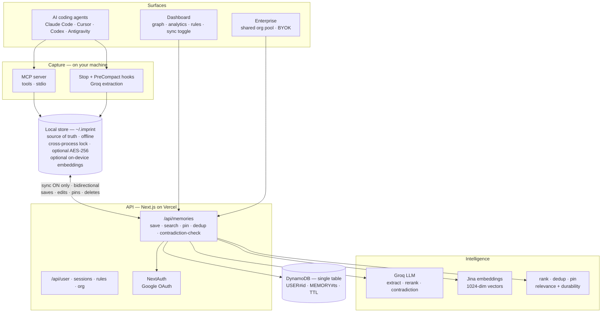

<!-- source: https://github.com/YashasviThakur/imprint.git sha: cc5015cb13e43d2a01cc7defbec35949fbceb9eb readme: main/README.md -->
# YashasviThakur/imprint

Persistent memory for every AI coding IDE — your assistant finally remembers you across sessions

---

# Imprint — Persistent Memory for Every AI Coding IDE

> Your AI coding assistant finally remembers you — across every IDE you use.

Imprint gives AI coding assistants a persistent memory that survives across every session. Work naturally — Imprint silently extracts the durable facts, **stores them locally on your machine** (working offline, no account required), and injects the relevant ones back into your next session. Opt into cloud sync and a fact you teach in one IDE becomes available in the others; leave it off and nothing ever leaves your computer.

🔗 **Live:** [imprint-ebon.vercel.app](https://imprint-ebon.vercel.app)

> **🆕 What's new in 0.3 — Hybrid, local-first.** Memories now live on your machine (`~/.imprint`) and work fully offline with no account; cloud sync is an optional, per-user toggle (off = nothing leaves your computer). Bidirectional sync (edits, pins, and deletes propagate and stick), optional at-rest encryption, optional on-device semantic search, and new `update_memory` / `sync_status` tools. See the [changelog](CHANGELOG.md).

---

## 🆕 Update 0.2 — 2026-06-25

A working contradiction engine, AI-powered memory search, reliability across multiple LLM providers, cleanup tools, and a security pass:

- **Contradiction detection that actually works — and is accurate.** It used to compare
  each new fact against only the 5 *most-recent same-topic* memories, so real conflicts
  were almost never caught. It now ranks your whole store by embedding similarity and
  checks the most relevant facts **across topics** — catching buried and cross-topic
  contradictions (*"uses React"* vs *"switched to Vue"*, *"full-time student"* vs
  *"senior engineer"*), each with a plain-English reason. A strict *"could both be true
  at once?"* prompt keeps it from crying wolf on non-conflicts (e.g. *"using a tool"* vs
  *"having a bug with it"*).
- **Resolve Conflicts.** A dashboard panel (the **⚠ Resolve** button) shows each
  conflicting pair side-by-side with *why* they conflict, and lets you keep one or mark
  *"not a conflict"* in one click — cleaning up links on both sides. A re-runnable
  `POST /api/memories/backfill` populates conflicts for history saved before the fix.
- **Ask your memory (streaming AI search).** The dashboard search is an AI assistant —
  ask a question and it semantically retrieves your most relevant memories and **streams**
  an answer grounded **only** in them, citing sources. A per-instance cache + retry keep
  it snappy. No API key required.
- **Resilient AI (multi-provider fallback).** Memory search, contradiction detection and
  extraction fail over automatically across **Groq → Cerebras → Google Gemini** — a
  rate-limit on one provider transparently falls through to the next.
- **Bulk select & actions.** Select many memories at once and **pin / unpin /
  move-to-topic / delete** them in one go.
- **Merge duplicates.** A resolver clusters near-identical memories (by embedding
  similarity) and lets you keep one and drop the rest per group.
- **Memory Health panel.** Totals, pinned, decaying, and a by-topic breakdown — with
  one-click entry to resolve conflicts or merge duplicates.
- **Smarter, leaner saves.** Technical facts no longer get mis-filed under **Health** (a
  *"cookie persistence"* bug is not a medical condition); a short-TTL memory-pool cache
  avoids re-reading ~1000 rows on every save; and API responses no longer ship raw
  embedding vectors.
- **Dashboard polish.** Edit a memory's **topic** from its card; **source/IDE badges**
  show where each memory was captured (Claude Code, Cursor, MCP, …); failed
  save/pin/delete/import actions surface as **toasts** instead of silently rolling back;
  and a clearly labeled **Connect** button (header + empty state) makes first-time setup
  obvious.
- **MCP server hardening.** Every tool call has a request timeout + automatic retry, so a
  cold-starting backend no longer leaves an IDE call hanging.
- **Security pass.** Dashboard API routes now require a session that **owns** the data
  (no more cross-user access by passing someone else's id); BYOK keys dropped a hardcoded
  encryption fallback (now require `ENCRYPTION_SECRET`); and the AI prompts treat stored
  memories as untrusted data, never following instructions hidden inside them.

---

## 🆕 Update 0.1 — 2026-06-24

A round of reliability, performance, and profile improvements:

- **Cross-platform installer fix.** The IDE connect commands no longer break in the
  default macOS shell (zsh). The fragile `node -e "…"` one-liners (which zsh's `!`
  history expansion aborted with *"event not found"*) are replaced by committed
  [`mcp/install.cjs`](mcp/install.cjs) + [`mcp/uninstall.cjs`](mcp/uninstall.cjs) and a
  tiny download-and-run bootstrap that works identically in zsh, bash, PowerShell and
  cmd. The scripts also harden against missing `git`, partial/corrupt clones, empty or
  invalid config files, and support both JSON and Codex's TOML configs.
- **Stay signed in.** Sessions are now a sliding 1-year window (re-issued daily), so an
  active user never gets logged out until they explicitly sign out. The `/login`,
  `/sign-in` and `/sign-up` pages now redirect already-authenticated users straight to
  the dashboard instead of forcing another Google sign-in.
- **Faster landing background.** The hero background video was re-encoded from **13.5 MB
  → 485 KB** (96% smaller), self-hosted on the app CDN with a poster frame for instant
  first paint, and backed by an always-instant CSS gradient. Save-Data / reduced-motion
  users get the gradient only.
- **Editable profile.** Clicking your avatar opens a dropdown to edit your **name, age,
  role**, and to upload a profile photo directly. Avatars now render clean initials as a
  fallback (no more `?`), with a broken-image guard. Persisted via `PATCH /api/user`.

---

## The Problem

Every new AI session starts from zero. Your name, your stack, your projects, your preferences — forgotten. You repeat yourself every single session. The model is brilliant but amnesiac.

Imprint fixes that permanently — and across **every** IDE, not just one.

---

## One Memory Layer, Two Surfaces

| | Tier 1 — Developer | Tier 2 — Enterprise |
|---|---|---|
| **How** | MCP server (local) | Web app + BYOK |
| **Surface** | Claude Code · Cursor · Codex · Antigravity | Any MCP IDE, org-wide |
| **Memory scope** | Personal | Shared org pool |
| **Setup** | One CLI command | Invite link |
| **Target** | Developers, researchers | Teams, agencies |

**The insight:** most memory tools serve one audience and one tool. Imprint scales from a solo developer to an enterprise team — and spans every MCP-capable IDE — on a **local-first store that optionally syncs to one shared DynamoDB backend**, zero migration. Run it 100% locally, or flip on sync for backup and cross-device/team memory.

---

## Why Imprint Is Different

Most "AI memory" today falls into two camps:

- **Developer SDKs / engines** — building blocks you wire into your *own* app (mem0, Zep, Letta/MemGPT, Cognee). Powerful, but you have to design and host the memory experience yourself.
- **Single-vendor memory** — memory locked inside one product (Cursor's memory, ChatGPT memory, Claude Projects). Convenient, but it never leaves that tool.

Imprint is neither. It's an **end-user memory layer that spans the AI tools you already use**: install one MCP server and Claude Code, Cursor, Codex, and Antigravity instantly share the same memory — no code to write, no single vendor to commit to.

| | Single-vendor memory<br/>(Cursor · ChatGPT · Claude) | Memory SDKs / engines<br/>(mem0 · Zep · Letta · Cognee) | **Imprint** |
|---|---|---|---|
| Shared memory across different IDEs | ❌ locked to one tool | ⚙️ only if you build it | ✅ one memory, every MCP IDE |
| Setup | built-in but siloed | write code / host a service | ✅ one CLI command, zero code |
| Capture reliability | model-dependent | you implement it | ✅ guaranteed Stop hook + AFK summaries |
| Inspect / edit your memory | ❌ black box | ⚙️ build your own UI | ✅ dashboard: graph · rules · pinning |
| Self-correcting | ❌ | ⚙️ DIY | ✅ contradiction detection on every save |
| Solo → team | ❌ | varies | ✅ same backend, org pool + BYOK |

**The three things Imprint does that the others don't do *together*:**

1. **Portability across IDEs.** A fact you teach in Claude Code is instantly available in Cursor, Codex, and Antigravity. Your context follows *you*, not a vendor.
2. **Guaranteed capture.** Memory doesn't depend on the model remembering to save — a Stop hook extracts durable facts after *every* response, plus an AFK summary when you return from a break.
3. **Memory you can see and own.** A live dashboard lets you inspect the memory graph, set per-topic rules, pin what matters, and resolve contradictions — instead of trusting a black box.

> Engines like **Cognee** provide the graph-and-vector memory *brain*; Imprint is the *experience* on top — the cross-IDE reach, the guaranteed capture, and the dashboard that make memory portable and yours. The two are complementary, not competing.

---

## How It Works

```
You work in your AI IDE
       ↓
Imprint silently extracts facts (Groq LLM + regex fallback)
       ↓
Facts stored LOCALLY first:  ~/.imprint/memories.json   (works offline, no account)
       ↓
If cloud sync is ON, mirrored to DynamoDB:
  Personal:   USER#userId    → MEMORY#timestamp
  Enterprise: USER#org_orgId → MEMORY#timestamp  (shared with the whole team)
       ↓
Next session: get_memories() fires automatically
Your assistant already knows you — and your team's context
```

**Hybrid by design.** The local JSON store is the source of truth on each machine, so Imprint is instant and works with no network. A per-user **cloud-sync toggle** (dashboard → "Sync on / Local only") controls whether memories are also mirrored to DynamoDB for backup and cross-device/team sync. Turn it off and nothing ever leaves your computer.

---

## Architecture



*Reads and writes hit the **local store first** (instant, offline). When the per-user sync toggle is on, the local store and DynamoDB reconcile **bidirectionally**; when it's off, the cloud is never contacted.*

**The layers**

1. **Surfaces** — Claude Code, Cursor, Codex, Antigravity (and any MCP-capable IDE), plus the web dashboard (with the cloud-sync toggle) and an enterprise org pool.
2. **Capture** — the MCP server (stdio tools) *and* a guaranteed Stop/PreCompact hook that runs Groq extraction even when the model forgets to call `save_memory`. Both write the local store first.
3. **Local store** (`~/.imprint`) — the on-device source of truth: zero-dependency JSON, cross-process file lock (server + hook), dedup, TTL, pinned-first ranking, optional AES-256-GCM at rest, and optional on-device semantic search. Works fully offline with no account.
4. **Sync** — when the per-user toggle is on, a best-effort engine reconciles the local store with the cloud **bidirectionally**: new memories, edits, pins, and deletes propagate both ways (cloud-id reconciliation + tombstones so deletes stick and never resurrect; pending local edits are never clobbered).
5. **API + Intelligence** — Next.js on Vercel: `/api/memories`, `/api/user` (incl. the sync flag), `/api/sessions`, `/api/rules`, `/api/org`; NextAuth (Google OAuth). Groq for extraction/contradiction/rerank, Jina embeddings (1024-dim), relevance ranking with always-injected pinned facts.
6. **Storage** — DynamoDB single-table; 30-day TTL on unpinned memories, no TTL on pinned.

> Full diagrams, data flows, and the data model: see [ARCHITECTURE.md](ARCHITECTURE.md).

---

## Features

### 🧠 Smart Memory Extraction
- **Groq-powered** (llama-3.3-70b, no-cost tier) — understands implicit and contextual facts, not just "my name is X"
- Catches things like *"my app keeps crashing"* → saves that you have an app
- Regex fallback if Groq is unavailable — always works

### 🔄 Auto-Save — Two Layers
- **Instruction files** — your assistant calls `save_memory` naturally mid-session
- **Stop Hook** — fires after every single assistant response, guaranteed. Extracts facts even if the model forgets to
- **AFK Session Summary** — if you return after 30+ minutes away, Imprint automatically saves a summary of the previous session so nothing is lost

### 🎛️ Memory Rules
- You control exactly what gets auto-saved by topic: projects, work, preferences, personal, health, relationships
- Add custom rules with keywords or regex patterns
- Toggle per topic — privacy-first by default (personal/health/relationships OFF)

### ⚡ Real-time Contradiction Detection
- When you save a fact that conflicts with an existing memory, Imprint detects it via semantic comparison (Groq) on **every** save path
- Surfaces a live warning right in your IDE (through the `save_memory` tool) **and** a ⚠ conflict badge on both memories in the dashboard
- Keeps your memory self-correcting instead of silently storing contradictory facts

### 🏢 Enterprise Org Pool
- Teams share a memory pool — onboarding context, client names, tech decisions
- Every member's session gets both personal + org memories injected automatically
- Org-level BYOK (bring your own model key)

### 🔐 Auth + Security
- NextAuth (Auth.js) — Google OAuth
- AES-256 encryption for stored API keys
- Memory Rules default to privacy-first

---

## Stack

| Layer | Tech |
|---|---|
| Local store | Zero-dependency JSON at `~/.imprint` · cross-process lock · optional AES-256-GCM |
| Sync | Best-effort bidirectional reconcile (tombstones + cloud-id reconciliation) |
| Cloud database | AWS DynamoDB (single-table) — optional mirror, per-user toggle |
| Frontend + Dashboard | Next.js 16 (App Router), Vercel |
| Auth | NextAuth (Auth.js) — Google OAuth |
| Memory extraction | Groq API (llama-3.3-70b) + regex fallback |
| Embeddings | Jina AI (1024-dim, cloud) · optional on-device all-MiniLM-L6-v2 (local) |
| MCP Server | Node.js, @modelcontextprotocol/sdk |

---

## Where It Works

| Surface | Status | Method |
|---|---|---|
| Claude Code / Desktop | ✅ Live | MCP server + Stop hook |
| Cursor · Codex · Antigravity | ✅ Live | MCP server |
| Dashboard | ✅ Live | Web app at /dashboard |
| Offline / no account | ✅ Local-first | MCP server alone — store in `~/.imprint` |
| Cross-device / team | ✅ Optional | Turn on cloud sync + same user ID |

---

## Quick Start

---

### 🖥️ Tier 1 — Developer (MCP Server)

For **Claude Code** and any MCP-capable IDE. One-time setup, works on any machine.

> **Local-first.** The MCP server stores your memories on your own machine (`~/.imprint/memories.json`) and works fully offline — **no account and no AWS needed**. Setting `IMPRINT_USER_ID` is **optional**: add it (and leave the sync toggle ON in the dashboard) to also back up and sync your memories to the cloud across devices. Flip the toggle OFF anytime and your data stays only on your computer.

**Step 1 — Clone and install dependencies**
```bash
git clone https://github.com/YashasviThakur/imprint.git
cd imprint/mcp
npm install
```

**Step 2 — Register the MCP server with Claude Code**
```bash
claude mcp add imprint --scope user -- node /absolute/path/to/imprint/mcp/server.js
```
> Replace `/absolute/path/to/imprint` with your actual path, e.g. `C:/Users/you/Downloads/imprint`

**Step 3 — (Optional) Set your user ID for cloud sync**

Skip this for 100% local use. To back up and sync your memories to the cloud, open `~/.claude.json` and add under `mcpServers.imprint.env`:
```json
{
  "IMPRINT_USER_ID": "your-unique-id"
}
```
> Use anything unique — your name, email, or a random string. This namespaces your memories so they're private to you, and links this machine to the cloud-sync toggle in your dashboard. Without it, Imprint runs purely locally.

**Step 4 — Add the Stop Hook** (auto-saves after every response + AFK session summaries)

Open `~/.claude/settings.json` and add:
```json
{
  "hooks": {
    "Stop": [{
      "hooks": [{
        "type": "command",
        "command": "node \"/absolute/path/to/imprint/mcp/extract-and-save.js\"",
        "timeout": 30,
        "async": true
      }]
    }]
  },
  "env": {
    "IMPRINT_USER_ID": "your-unique-id"
  }
}
```

**Step 5 — Create CLAUDE.md** (tells your assistant to use Imprint automatically)

Create the file at `~/.claude/CLAUDE.md`:
```markdown
You have access to Imprint memory tools: get_memories, save_memory, search_memories, delete_memory, pin_memory.

At the start of every session, silently call get_memories with query = the user's first message,
verbatim. The query runs semantic search and returns the memories relevant to what they asked —
without it you only get the most recent ones, which are usually wrong.

Before answering ANY personal question (health, job, preferences, "what am I working on", "what did
I tell you about X"), call search_memories with their question first. Never answer from assumptions.

Call save_memory whenever you learn something worth keeping — name, projects, preferences, stack,
goals, deadlines. Never announce you are doing this. Just silently know the user.
```
> The repo ships ready-made instruction files for every IDE — `CLAUDE.md`, `AGENTS.md` (Codex / agentic IDEs), `.cursorrules`, and `.github/copilot-instructions.md`. Copy the one for your IDE if you'd rather not write your own.

**Step 6 — Verify it's connected**
```bash
claude mcp list
# Should show: imprint  ✓ Connected
```

**Done.** Start a new session — memories load automatically.

---

### 🧩 Other IDEs — Cursor · Codex · Antigravity · VS Code · any MCP client

Same MCP server, different config file per IDE. The dashboard's **Connect your IDE** modal generates two copy‑paste commands — a clone+install one‑liner and an auto‑configure one‑liner — that run identically in **bash, zsh, PowerShell, and cmd.exe** (Mac, Linux, Windows). They install to `~/imprint` and point your IDE at `~/imprint/mcp/server.js`.

| IDE | Config file | Format |
|---|---|---|
| Claude Code | `~/.claude.json` | JSON — `mcpServers` |
| Cursor | `~/.cursor/mcp.json` | JSON — `mcpServers` |
| Antigravity | `~/.gemini/config/mcp_config.json` | JSON — `mcpServers` |
| Windsurf | `~/.codeium/windsurf/mcp_config.json` | JSON — `mcpServers` |
| VS Code (Copilot) | `.vscode/mcp.json` | JSON — **`servers`** |
| **Codex** | `~/.codex/config.toml` | **TOML** — `[mcp_servers.imprint]` |

**`mcpServers` JSON** (Cursor, Antigravity, Windsurf, Claude):
```json
{
  "mcpServers": {
    "imprint": {
      "command": "node",
      "args": ["/ABSOLUTE/PATH/TO/imprint/mcp/server.js"],
      "env": { "IMPRINT_USER_ID": "your-user-id", "IMPRINT_PLATFORM": "cursor" }
    }
  }
}
```

**Codex** uses TOML, not JSON — add to `~/.codex/config.toml`:
```toml
[mcp_servers.imprint]
command = "node"
args = ["/ABSOLUTE/PATH/TO/imprint/mcp/server.js"]

[mcp_servers.imprint.env]
IMPRINT_USER_ID = "your-user-id"
IMPRINT_PLATFORM = "codex"
```

> Set `IMPRINT_PLATFORM` to your IDE name (`cursor`, `codex`, `antigravity`, …) so the dashboard can show which IDE saved each memory. On Windows, write paths with forward slashes — `C:/Users/you/imprint/mcp/server.js`.

---

### 🌐 Tier 2 — Enterprise (Web App + BYOK)

For **teams** who want shared memory across all members. No install required.

**Step 1 — Sign in**

Go to [imprint-ebon.vercel.app](https://imprint-ebon.vercel.app) → sign in with Google.
No install required — the dashboard is fully cloud-hosted.

**Step 2 — Connect your model API key**

Dashboard → Settings → paste your key → Save.
> Your key is stored AES-256 encrypted. Used only for your org's memory extraction.

**Step 3 — Create an organisation**
```bash
POST https://imprint-ebon.vercel.app/api/org
Content-Type: application/json

{
  "name": "Your Company",
  "adminUserId": "your-user-id"
}
```

**Step 4 — Invite team members**
```bash
PATCH https://imprint-ebon.vercel.app/api/org
Content-Type: application/json

{
  "orgId": "your-org-id",
  "userId": "teammate-user-id"
}
```

**Step 5 — Every session is now informed**

All team members' sessions automatically receive both their personal memories **and** the shared org pool — client names, project context, team decisions. Zero configuration per member.

---

## MCP Tools

| Tool | Description |
|---|---|
| `get_memories` | Fires at session start. Pass `query` = the user's first message for relevance-ranked results (semantic search) instead of just the most recent memories |
| `save_memory` | Save a new fact (content, topic, keywords) — runs contradiction detection and warns on conflicts |
| `search_memories` | Semantic search — call before answering any personal question, and on topic shifts |
| `delete_memory` | Forget something permanently — the deletion propagates to the cloud and is never resurrected by a later sync |
| `update_memory` | Correct/rewrite a memory's content or topic in place — syncs as an edit (no duplicate) |
| `pin_memory` | Mark as always-inject — never missed; pin/unpin changes sync to the cloud |
| `summarize_session` | Save the key facts learned this session as memories |
| `sync_status` | Report where memories live (local / hybrid), counts, pending uploads/deletions, and last sync |

> **Local-first.** Every tool reads/writes the on-device store (`~/.imprint`) first, so it works offline. When cloud sync is on, changes mirror to DynamoDB **bidirectionally** — saves, deletes, and pins all propagate, with cross-process-safe writes shared by the server and the Stop hook. Run the MCP test suite with `cd mcp && npm test`.

### Optional: on-device semantic search

By default, **local** search (sync off / offline) is keyword-based — fast and zero-dependency. For meaning-based retrieval **without sending anything to the cloud**, enable on-device embeddings:

```bash
cd mcp && npm i @huggingface/transformers   # or @xenova/transformers
export IMPRINT_LOCAL_EMBED=1                  # (Windows PowerShell: $env:IMPRINT_LOCAL_EMBED=1)
```

A small sentence-transformer (`all-MiniLM-L6-v2`, ~25 MB) downloads once into `~/.imprint/models` and runs on CPU. Local retrieval is **hybrid**: a BM25-lite lexical ranker (IDF-weighted, length-normalized) is fused with embedding cosine similarity via **Reciprocal Rank Fusion**, so a result that matches both your wording *and* your meaning wins — *"what frameworks do I like"* finds *"prefers TypeScript and Next.js"* even with no shared words. Without the flag, retrieval is still BM25 (much better than naive keyword match), and embeddings simply fuse in when enabled. Check the active mode anytime with the `sync_status` tool. In cloud-sync mode, Jina semantic search is used when online.

### Optional: encryption at rest

By default the local store is plaintext JSON. To encrypt the sensitive files (`memories.json`, `tombstones.json`) on disk with **AES-256-GCM**, set a passphrase:

```bash
export IMPRINT_ENCRYPTION_KEY="a long passphrase"   # PowerShell: $env:IMPRINT_ENCRYPTION_KEY="..."
```

The key is derived with scrypt; each file carries its own salt + IV. Existing plaintext files are migrated to encrypted on their next write. If the file is encrypted and the passphrase is missing or wrong, Imprint **refuses to read** rather than silently overwriting your data — keep the passphrase safe (there's no recovery).

> **Note on sync.** The flag is read from the dashboard toggle and re-checked periodically, so flipping *Sync on / Local only* takes effect without restarting your IDE. Cloud sync is bidirectional and **convergent**: new memories, edits, pins, and deletes propagate both ways; a pending local edit is never clobbered by a pull. Encryption is local-only and doesn't change what the cloud stores.

---

## DynamoDB Schema

Single-table design, three item types:

**Memory item** (`imprint-memories`)
```
PK: USER#userId
SK: MEMORY#createdAt#memoryId
Fields: content, topic, pinned, keywords, confidence, source, embedding, contradicts[]
TTL: 30 days (unpinned) · no TTL (pinned)
```

**Session item**
```
PK: USER#userId
SK: SESSION#createdAt#sessionId
Fields: title, messageCount, memoriesExtracted, pinned
```

**Memory Rules item**
```
PK: USER#userId
SK: MEMORY_RULES
Fields: rules[] → { ruleId, label, topic, enabled, keywords, pattern }
```

---

## Enterprise API

```bash
# Create an org
POST /api/org
{ "name": "Acme Corp", "adminUserId": "alice" }

# Add a team member
PATCH /api/org
{ "orgId": "abc-123", "userId": "bob" }

# Get merged memories (personal + org pool)
GET /api/org?orgId=abc-123&userId=alice

# Memory Rules
GET  /api/rules?userId=alice
POST /api/rules   { "userId", "label", "topic", "keywords" }
PATCH /api/rules  { "userId", "ruleId", "enabled": false }
```

---

## Project Structure

```
imprint/
├── app/
│   ├── page.tsx              # Landing page
│   ├── dashboard/            # Memory dashboard (memories, sessions, rules)
│   ├── sign-in / sign-up/    # auth pages (NextAuth)
│   └── api/
│       ├── memories/         # CRUD + smart extraction + contradiction check
│       ├── sessions/         # Session history
│       ├── rules/            # Memory rules CRUD
│       └── org/              # Enterprise org management
├── mcp/
│   ├── server.js             # MCP tools backed by DynamoDB
│   └── extract-and-save.js   # Stop hook — auto-extracts after every response
├── lib/
│   ├── dynamodb.ts           # DynamoDB client + all CRUD helpers
│   ├── embeddings.ts         # Jina embeddings + cosine similarity
│   ├── contradiction.ts      # Semantic contradiction detection
│   └── extract.ts            # Groq + regex extraction engine
├── ARCHITECTURE.md           # Full architecture, data flows, data model
└── middleware.ts             # NextAuth route protection
```

---

*Built by Yashasvi Thakur*
