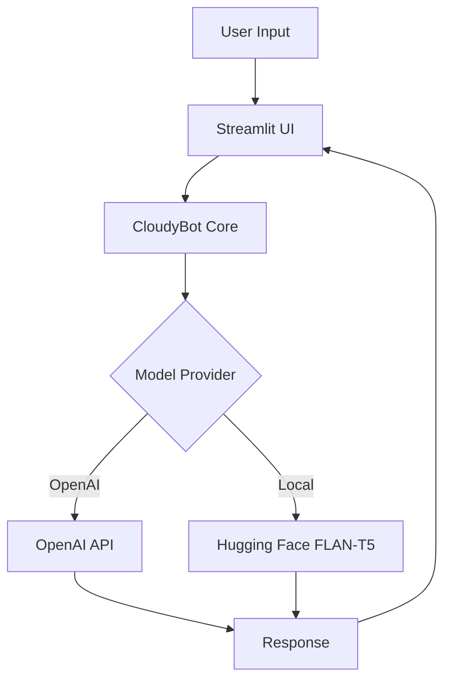

<!-- source: https://github.com/akshaymittal143/CloudyBot-DevOps-AI.git sha: 5aefed3e5b6283c44a07bd7e75fdc4d1e7ce4bbf readme: main/README.md -->
# akshaymittal143/CloudyBot-DevOps-AI

Provide a conversational assistant that can answer DevOps-related questions. This helps demonstrate how large language models (LLMs) can be applied to real-world knowledge domains (in this case, cloud and DevOps topics). For students, it’s a fun, interactive example of AI services.

---

# CloudyBot: AI-Powered DevOps Assistant Chatbot

[](LICENSE)
[](https://www.python.org/downloads/)
[](https://openai.com/blog/openai-api)
[](https://streamlit.io)

> An intelligent DevOps assistant powered by AI, helping you with cloud infrastructure, Kubernetes, Docker, and more.

[Live Demo](https://akshaymittal143-ai-in-the-cloud-demo-app-deploy-r9k6vd.streamlit.app/)


## Architecture



## Features
🤖 **Dual AI Backend**
- OpenAI GPT integration for powerful natural language understanding
- Local Hugging Face models (FLAN-T5) for offline operation
- Configurable model selection

🎯 **DevOps Expertise**
- Infrastructure as Code guidance
- Container orchestration help
- CI/CD pipeline assistance
- Cloud platform support (AWS, GCP, Azure)

💻 **User Experience**
- Clean, intuitive Streamlit interface
- Real-time responses
- Chat history management
- Example query suggestions

## Prerequisites

- Python 3.8+ - CloudyBot is a Python application. Ensure you have Python installed. You can check by running python --version in your terminal.
- API keys (for OpenAI usage): You can obtain an API key by creating an account on OpenAI’s platform and generating a key from their dashboard. Note: This is unrelated to Streamlit.
streamlit.io
. (If you only plan to use the local Hugging Face model, no external API key is required, although a Hugging Face Hub token could be used if you want to load models via their API or need to access gated models – for our default FLAN-T5, this is not necessary.)

## Quick Start

```bash
# Clone repository
git clone https://github.com/akshaymittal143/CloudyBot-DevOps-AI.git
cd CloudyBot-DevOps-AI

# Set up virtual environment
python3 -m venv venv
source venv/bin/activate  # Linux/Mac
# or
venv\Scripts\activate     # Windows

# Install dependencies
pip install -r requirements.txt

# Configure environment
# Option A: OpenAI (requires API key)
echo "MODEL_PROVIDER=OPENAI" > .env
echo "OPENAI_API_KEY=your_key_here" >> .env

# Option B: Local model (no API key needed)
echo "MODEL_PROVIDER=HUGGINGFACE" > .env
echo "HUGGINGFACE_TEMPERATURE=0.7" >> .env
echo "HUGGINGFACE_MAX_LENGTH=512" >> .env

# Run application
streamlit run app.py

# To deactivate virtual environment when done
deactivate  # Works for both Windows and Unix-like systems
```

## Development Setup

### Requirements
- Python 3.8+
- pip package manager
- Virtual environment (recommended)

### Dependencies
```plaintext
streamlit>=1.28.0    # UI framework
openai>=1.0.0        # OpenAI API integration
transformers>=4.31.0 # Hugging Face models
python-dotenv>=1.0.0 # Environment management
torch>=2.1.0         # Machine learning backend
numpy==1.24.3        # Numerical operations
pillow>=9.5.0       # Image processing
protobuf>=4.21.0    # Protocol buffers
```

### Environment Variables
Required variables in `.env`:
```ini
# For OpenAI
MODEL_PROVIDER=OPENAI
OPENAI_API_KEY=your_api_key_here
OPENAI_MODEL=gpt-3.5-turbo

# For Hugging Face
MODEL_PROVIDER=HUGGINGFACE
HUGGINGFACE_MODEL=google/flan-t5-base
HUGGINGFACE_TEMPERATURE=0.7
HUGGINGFACE_MAX_LENGTH=512
HUGGINGFACE_DEVICE=auto
```

## Deployment Options

### Deployment on Streamlit Cloud

- Deploy from GitHub via [Streamlit Cloud](https://streamlit.io).
- Configure secrets (`OPENAI_API_KEY`) through Streamlit secrets.

1. Fork this repository
2. Go to [Streamlit Cloud](https://share.streamlit.io)
3. Deploy from GitHub
4. Add these secrets in Streamlit Cloud dashboard:
   ```plaintext
   OPENAI_API_KEY = "your-api-key"
   MODEL_PROVIDER = "OPENAI"
   OPENAI_MODEL = "gpt-3.5-turbo"
   ```


## Usage Examples

- "How do I restart a Kubernetes pod?"
- "Explain blue-green deployment."
- "How to debug Docker container failures?"

## Troubleshooting

### Common Issues

1. **OpenAI API Error**
   ```
   Error: OpenAI API request failed
   ```
   ➡️ Check your API key and internet connection

2. **Memory Issues with Local Models**
   ```
   CUDA out of memory
   ```
   ➡️ Try reducing model size or batch size

3. **Streamlit Connection Error**
   ```
   Connection error: Connection refused
   ```
   ➡️ Check if port 8501 is available

### Debug Mode
```bash
streamlit run app.py --logger.level=debug
```

## Project Structure

```
AI-in-the-Cloud-Demo/
├── app.py                    # Main Streamlit application
├── bot.py                    # AI provider router
├── hf_client.py             # Hugging Face client
├── openai_client.py         # OpenAI client
├── requirements.txt         # Dependencies
├── requirements-dev.txt     # Development dependencies
├── README.md               # Documentation
├── DEMO_CODE_FLOW.md       # Code flow demonstration
├── CONTRIBUTING.md         # Contributing guidelines
├── LICENSE                 # Apache 2.0 license
├── setup.sh               # Environment setup script
├── packages.txt           # System packages for devcontainer
├── .gitignore            # Git ignore patterns
├── .streamlit/           # Streamlit configuration
│   ├── config.toml       # App configuration
│   └── secrets.toml      # Secrets (not in repo)
├── .devcontainer/        # VS Code devcontainer
├── cloudybot/           # Assets
│   └── local.png        # Screenshot
├── tests/               # Test files
└── venv/               # Virtual environment (not in repo)
```

## Contributing

1. Fork the repository
2. Create a feature branch
3. Commit changes
4. Push to branch
5. Open a Pull Request

## Future Roadmap

CloudyBot is a work in progress. There are many ways it could be enhanced, and we welcome ideas or contributions! If you're interested in contributing, please check out our [CONTRIBUTING.md](https://github.com/akshaymittal143/CloudyBot-DevOps-AI/blob/main/CONTRIBUTING.md) file for guidelines or visit our [GitHub Issues page](https://github.com/akshaymittal143/CloudyBot-DevOps-AI/issues) to see open tasks and feature requests.

Here are some potential future improvements:
- Live Data Integration: Connecting CloudyBot to live systems (APIs, databases, cloud services) so it can fetch real-time information. For instance, integrate with AWS/GCP SDKs to answer “What’s the CPU usage of EC2 instance X?” by actually calling CloudWatch metrics. This would make answers more dynamic and context-specific. It could be done securely by allowing certain read-only credentials configured in the environment.
- Executing Commands (Actionable Bot): Taking the above further, allow CloudyBot to execute certain actions when prompted. For example, “CloudyBot, restart the backend service” could trigger a predefined script or API call (maybe hitting a Kubernetes endpoint to restart a pod, etc.). This is essentially building ChatOps capabilities. We’d have to implement a permissions layer and confirmation (to avoid accidental destructive actions). Possibly maintain a list of allowed operations the bot can do.
- Enhanced Conversation Memory: Currently, the conversation memory might be limited (especially with local model). We can extend this by caching past interactions and summarizing them when they get too long, or by using a vector store to dynamically fetch relevant past bits. Also, if using OpenAI GPT-4, we’d get a larger context window enabling longer dialogues. Future models (like GPT-4 32k context or others) could vastly improve how much history CloudyBot can remember and reason over.
- Knowledge Base Integration: As mentioned, hooking up a documentation knowledge base. We could store documentation (Kubernetes docs, AWS docs, internal docs, etc.) and have CloudyBot retrieve and cite them. Perhaps using an approach with LangChain or similar frameworks: user question -> search docs -> give relevant snippets to LLM -> LLM answers using those. This would reduce hallucination and increase accuracy for domain-specific questions. It would also allow CloudyBot to answer questions like “According to our dev guide, how do we release a new version?” with exact steps from the guide.
- Support More Models/Providers: There’s interest in adding support for more open-source LLMs that are more powerful than FLAN-T5. For example: Alpaca/LLaMA derivatives, GPT-J/GPT-NeoX, Dolly 2.0, OpenAI’s newer models, Cohere API, etc. We could create a plugin system where if you have a model’s API or weights, you drop in a new client class and configure it. CloudyBot could even run a small model by default and escalate to a bigger model for harder questions (to optimize response time vs quality).
Multi-language Support: Maybe some users might ask questions in different languages. We could incorporate translation or use models that support multilingual queries so CloudyBot can assist non-English speakers on DevOps topics.
- UI Enhancements: The Streamlit UI can be made more robust: add an “Export conversation” feature to save the Q&A as a text or PDF. Add a “Clear chat” button to reset the session. Possibly allow the user to toggle between dark/light theme for better viewing. Another idea is to have a “persona” or “mode” switch: e.g., “Beginner mode” where CloudyBot gives more basic, step-by-step answers, vs “Expert mode” where it can be more concise and assume background knowledge. This could be a toggle that changes the system prompt to adjust the answer detail.
- Error Handling and Fail-safes: Currently, basic error handling is implemented to catch exceptions such as OpenAI request timeouts or rate limit errors, providing a friendly message like “Sorry, I’m having trouble reaching the AI service. Please try again.” Future improvements include detecting nonsensical outputs from the local model and responding appropriately, such as retrying or indicating uncertainty.
Contributing Guide: If opening the project to contributors, provide guidelines on how to add new features, coding style, etc. Perhaps write tests for the core logic (ensuring the OpenAI and HF clients work as expected given dummy inputs). This encourages community involvement to add the above features.
- Error Handling and Fail-safes: Improve how the bot handles cases where the AI model doesn’t know an answer or fails. We can catch exceptions (like OpenAI request timeouts or rate limit errors) and respond with a friendly message like “Sorry, I’m having trouble reaching the AI service. Please try again.” rather than just breaking. If the local model produces nonsense, maybe detect if output is empty or too off-topic and either retry or say it’s unsure.
- Security Considerations: If CloudyBot ever executes commands, ensure it cannot be tricked into doing something dangerous. Implement confirmations (“Are you sure? [Yes/No]”) for critical actions. Possibly maintain a whitelist of safe commands. Also, sanitize user input if it might go into any shell calls (to prevent injection). For now, as a read-only assistant, it’s mostly about not revealing secrets (which we handle via environment and not echoing them).

Feel free to raise issues or pull requests on the GitHub repo if you have ideas or improvements. CloudyBot can grow with community input, especially as new AI capabilities emerge.

## License

This project is licensed under the Apache License 2.0 - see the [LICENSE](LICENSE) file for details.

## Author

**Akshay Mittal** - [GitHub Profile](https://github.com/akshaymittal143)

---

📧 **Contact**: For support, reach out to [project maintainers](mailto:maintainers@cloudybot.com)

**Happy DevOps Chatting!** ☁️🤖