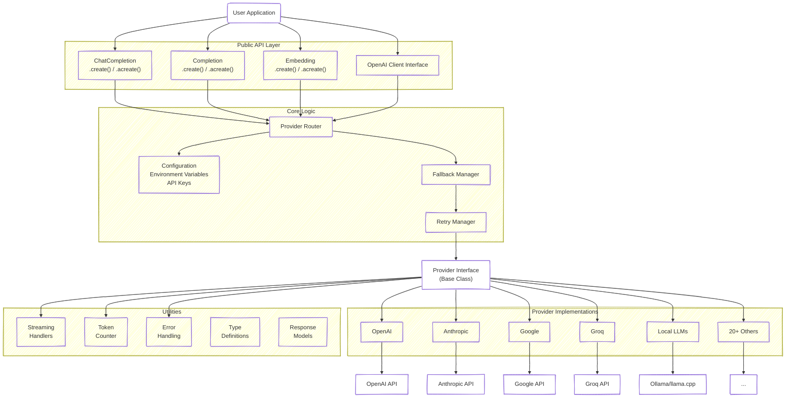
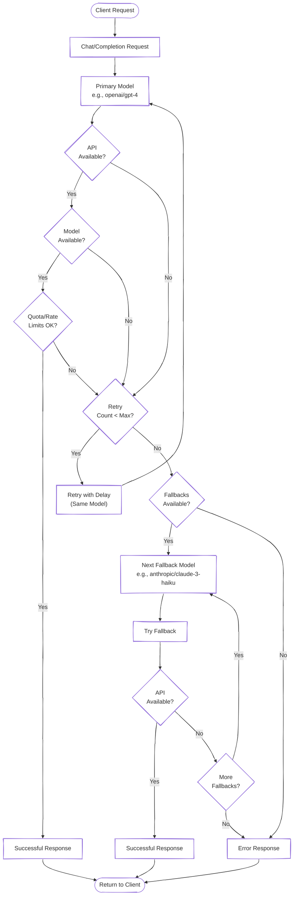

<!-- source: https://github.com/muxi-ai/onellm.git sha: adffcd010ffb2f1c3d22ed1e550bf98ad5da6c3f readme: main/README.md -->
# muxi-ai/onellm

Unified interface for interacting with various LLMs hundreds of models, caching, fallback mechanisms, and enhanced reliability.

---

# OneLLM

[](https://pypi.python.org/pypi/onellm)
[](https://pypi.python.org/pypi/onellm)
[](https://pypi.python.org/pypi/onellm)
[](https://opensource.org/licenses/Apache-2.0)
[](https://github.com/muxi-ai/onellm/actions/workflows/scorecard.yml)
&nbsp;
[](https://deepwiki.com/muxi-ai/onellm)

### A "drop-in" replacement for OpenAI's client that offers a unified interface for interacting with large language models from various providers, with support for hundreds of models, intelligent semantic caching, built-in fallback mechanisms, and enhanced reliability features.

---

## 📚 Table of Contents

- [Overview](https://github.com/muxi-ai/onellm/blob/main/README.md#-overview)
- [Getting Started](https://github.com/muxi-ai/onellm/blob/main/README.md#-getting-started)
- [Key Features](https://github.com/muxi-ai/onellm/blob/main/README.md#-key-features)
- [Supported Providers](https://github.com/muxi-ai/onellm/blob/main/README.md#-supported-providers)
- [Architecture](https://github.com/muxi-ai/onellm/blob/main/README.md#-architecture)
- [API Design](https://github.com/muxi-ai/onellm/blob/main/README.md#-api-design)
- [Advanced Features](https://github.com/muxi-ai/onellm/blob/main/README.md#-advanced-features)
- [Migration from OpenAI](https://github.com/muxi-ai/onellm/blob/main/README.md#-migration-from-openai)
- [Model Naming Convention](https://github.com/muxi-ai/onellm/blob/main/README.md#-model-naming-convention)
- [Configuration](https://github.com/muxi-ai/onellm/blob/main/README.md#-configuration)
- [Versioning](https://github.com/muxi-ai/onellm/blob/main/README.md#-versioning)
- [Documentation](https://github.com/muxi-ai/onellm/blob/main/README.md#-documentation)
- [Call for Contributions](https://github.com/muxi-ai/onellm/blob/main/README.md#-call-for-contributions)
- [License](https://github.com/muxi-ai/onellm/blob/main/README.md#-license)
- [Acknowledgements](https://github.com/muxi-ai/onellm/blob/main/README.md#-acknowledgements)

## 👉 Overview

**OneLLM** is a lightweight, provider-agnostic Python library that offers a unified interface for interacting with large language models (LLMs) from various providers. It simplifies the integration of LLMs into applications by providing a consistent API while abstracting away provider-specific implementation details.

The library follows the OpenAI client API design pattern, making it familiar to developers already using OpenAI and enabling easy migration for existing applications. **Simply change your import statements and instantly gain access to hundreds of models** across dozens of providers while maintaining your existing code structure.

With support for 22 implemented providers (and more planned), OneLLM gives you access to approximately 300+ unique language models through a single, consistent interface - from the latest proprietary models to open-source alternatives, all accessible through familiar OpenAI-compatible patterns.

> [!NOTE]
> **Ready for Use**: OneLLM now supports 22 providers with 300+ models! From cloud APIs to local models, you can access them all through a single, unified interface. [Contributions are welcome](./CONTRIBUTING.md) to help add even more providers!

---

## 🚀 Getting Started

### Installation

```bash
# Basic installation (includes OpenAI compatibility and download utility)
pip install OneLLM

# For all providers (includes dependencies for future provider support)
pip install "OneLLM[all]"
```

### Download Models for Local Use

OneLLM includes a built-in utility for downloading GGUF models:

```bash
# Download a model from HuggingFace (saves to ~/llama_models by default)
onellm download --repo-id "TheBloke/Llama-2-7B-GGUF" --filename "llama-2-7b.Q4_K_M.gguf"

# Download to a custom directory
onellm download -r "microsoft/Phi-3-mini-4k-instruct-gguf" -f "Phi-3-mini-4k-instruct-q4.gguf" -o /path/to/models
```

For the in-process `local/` embedding provider (HuggingFace embedding models, ONNX-first), pass the full repo id to pre-download a snapshot into the standard HF cache (`$HF_HOME` or `~/.cache/huggingface/hub/`):

```bash
onellm download local/nomic-ai/nomic-embed-text-v1.5
onellm download local/sentence-transformers/all-MiniLM-L6-v2

# Pin to a specific git revision (commit SHA, tag, or branch) for reproducible deployments
onellm download local/nomic-ai/nomic-embed-text-v1.5 --revision e04b7e4c5ea3e3d7e41e13d4c02fa5e29e0e3a0a
```

### Quick Win: Your First LLM Call

```python
# Basic usage with OpenAI-compatible syntax
from onellm import ChatCompletion

response = ChatCompletion.create(
    model="openai/gpt-4o-mini",
    messages=[
        {"role": "system", "content": "You are a helpful assistant."},
        {"role": "user", "content": "Hello, how are you?"}
    ]
)

print(response.choices[0].message["content"])
# Output: I'm doing well, thank you for asking! I'm here and ready to help you...
```

For more detailed examples, check out the [examples directory](./examples).

---

## ✨ Key Features

| Feature | Description |
|---------|-------------|
| **📦 Drop-in replacement** | Use your existing OpenAI code with minimal changes |
| **🔄 Provider-agnostic** | Support for 300+ models across 20 implemented providers |
| **⚡ Blazing-fast semantic cache** | 42,000-143,000x faster responses, 50-80% cost savings with streaming support & TTL |
| **🔌 Connection pooling** | Reuse HTTP connections for 100-300ms faster sequential calls |
| **🔁 Automatic fallback** | Seamlessly switch to alternative models when needed |
| **🔄 Auto-retry mechanism** | Retry the same model multiple times before failing |
| **🧩 OpenAI-compatible** | Familiar interface for developers used to OpenAI |
| **📺 Streaming support** | Real-time streaming responses from supported providers |
| **🖼️ Multi-modal capabilities** | Support for text, images, audio across compatible models |
| **🏠 Local LLM support** | Run models locally via Ollama and llama.cpp |
| **⬇️ Model downloads** | Built-in CLI to download GGUF models from HuggingFace |
| **🧹 Unicode artifact cleaning** | Automatic removal of invisible characters to prevent AI detection |
| **🏷️ Consistent naming** | Clear `provider/model-name` format for attribution |
| **🧪 Comprehensive tests** | Extensive unit and integration test suite |
| **📄 Apache-2.0 license** | Open-source license that protects contributions |

---

## 🌐 Supported Providers

OneLLM currently supports **22 providers** with more on the way:

### Cloud API Providers (20)
- **Anthropic** - Claude family of models
- **Anyscale** - Configurable AI platform
- **AWS Bedrock** - Access to multiple model families
- **Azure OpenAI** - Microsoft-hosted OpenAI models
- **Cohere** - Command models with RAG
- **DeepSeek** - Chinese LLM provider
- **Fireworks** - Fast inference platform
- **Moonshot** - Kimi models with long-context capabilities
- **Google AI Studio** - Gemini models via API key
- **Groq** - Ultra-fast inference for Llama, Mixtral
- **GLM (Z.AI)** - OpenAI-compatible GLM-4 family
- **Mistral** - Mistral Large, Medium, Small
- **OpenAI** - GPT-4o, 3o-mini, DALL-E, Whisper, etc.
- **OpenRouter** - Gateway to 100+ models
- **Perplexity** - Search-augmented models
- **Together AI** - Open-source model hosting
- **Vercel AI Gateway** - Gateway to 100+ models from multiple providers
- **Vertex AI** - Google Cloud's enterprise Gemini
- **X.AI** - Grok models
- **MiniMax** - M2 model series with advanced reasoning

### Local Providers (3)
- **`local/`** - In-process HuggingFace embeddings (ONNX Runtime by default, PyTorch fallback)
- **Ollama** - Run chat / completion models locally with easy management
- **llama.cpp** - Direct GGUF model execution

### Notable Models Available

Through these providers, you gain access to hundreds of models, including:

<div align="center">

<!-- Model categories -->
<table>
  <tr>
    <th>Model Family</th>
    <th>Notable Models</th>
  </tr>
  <tr>
    <td><strong>OpenAI Family</strong></td>
    <td>GPT-4o, GPT-4 Turbo, o3</td>
  </tr>
  <tr>
    <td><strong>Claude Family</strong></td>
    <td>Claude 3 Opus, Claude 3 Sonnet, Claude 3 Haiku</td>
  </tr>
  <tr>
    <td><strong>Llama Family</strong></td>
    <td>Llama 3 70B, Llama 3 8B, Code Llama</td>
  </tr>
  <tr>
    <td><strong>Mistral Family</strong></td>
    <td>Mistral Large, Mistral 7B, Mixtral</td>
  </tr>
  <tr>
    <td><strong>Gemini Family</strong></td>
    <td>Gemini Pro, Gemini Ultra, Gemini Flash</td>
  </tr>
  <tr>
    <td><strong>Embeddings</strong></td>
    <td>Ada-002, text-embedding-3-small/large, Cohere embeddings, HuggingFace via <code>local/</code> (ONNX-first)</td>
  </tr>
  <tr>
    <td><strong>Multimodal</strong></td>
    <td>GPT-4 Vision, Claude 3 Vision, Gemini Pro Vision</td>
  </tr>
</table>

</div>

---

## 🏗️ Architecture

OneLLM follows a modular architecture with clear separation of concerns:



### Core Components

1. **Public Interface Classes**
   - `ChatCompletion` - For chat-based interactions
   - `Completion` - For text completion
   - `Embedding` - For generating embeddings

2. **Provider Interface**
   - Abstract base class defining required methods
   - Provider-specific implementations

3. **Configuration System**
   - Environment variable support
   - Runtime configuration options

4. **Error Handling**
   - Standardized error types
   - Provider-specific error mapping

5. **Fallback System**
   - Automatic retries with alternative models
   - Configurable fallback chains
   - Graceful degradation options

---

## 🔌 API Design

OneLLM mirrors the OpenAI Python client library API for familiarity:

### Chat Completions

```python
from onellm import ChatCompletion

# Basic usage (identical to OpenAI's client)
response = ChatCompletion.create(
    model="openai/gpt-4",
    messages=[
        {"role": "system", "content": "You are a helpful assistant."},
        {"role": "user", "content": "Hello, how are you?"}
    ]
)

# Streaming
for chunk in ChatCompletion.create(
    model="anthropic/claude-3-opus",
    messages=[{"role": "user", "content": "Write a poem about AI"}],
    stream=True
):
    print(chunk.choices[0].delta.content, end="", flush=True)

# With fallback options
response = ChatCompletion.create(
    model=["openai/gpt-4", "anthropic/claude-3-opus", "mistral/mistral-large"],
    messages=[{"role": "user", "content": "Explain quantum computing"}]
)

# With retries and fallbacks for enhanced reliability
response = ChatCompletion.create(
    model="openai/gpt-4",
    messages=[{"role": "user", "content": "Explain quantum computing"}],
    retries=3,  # Try gpt-4 up to 3 additional times before failing or using fallbacks
    fallback_models=["anthropic/claude-3-opus", "mistral/mistral-large"]
)

# JSON mode for structured outputs
response = ChatCompletion.create(
    model="openai/gpt-4o",
    messages=[
        {"role": "user", "content": "List the top 3 planets by size"}
    ],
    response_format={"type": "json_object"}  # Request structured JSON output
)
print(response.choices[0].message["content"])  # Outputs valid, parseable JSON

# Multi-modal with images
response = ChatCompletion.create(
    model="openai/gpt-4-vision",
    messages=[
        {"role": "user", "content": [
            {"type": "text", "text": "What's in this image?"},
            {"type": "image_url", "image_url": {"url": "https://example.com/image.jpg"}}
        ]}
    ]
)

# Multi-modal with audio
response = ChatCompletion.create(
    model="anthropic/claude-3-sonnet",
    messages=[
        {"role": "user", "content": [
            {"type": "text", "text": "Transcribe and analyze this audio clip"},
            {"type": "audio_url", "audio_url": {"url": "https://example.com/audio.mp3"}}
        ]}
    ]
)
```

### Completions

```python
from onellm import Completion

response = Completion.create(
    model="groq/llama3-70b",
    prompt="Once upon a time",
    max_tokens=100
)
```

### Embeddings

```python
from onellm import Embedding

response = Embedding.create(
    model="openai/text-embedding-3-small",
    input="The quick brown fox jumps over the lazy dog"
)
```

#### Local embeddings (`local/` provider)

Any HuggingFace embedding model works — the id after `local/` is passed straight to HuggingFace. No registry, no curation. Install `pip install "onellm[cache]"` (lean ONNX Runtime path, ~345 MB on a fresh venv with cloud-provider deps), then call through the same `Embedding.create()` surface as cloud providers:

```python
from onellm import Embedding

# Nomic v1.5: Apache 2.0, 768-dim, Matryoshka-trained (64/128/256/512/768)
response = Embedding.create(
    model="local/nomic-ai/nomic-embed-text-v1.5",
    input="search_document: The quick brown fox jumps over the lazy dog",
    dimensions=768,             # Matryoshka truncation (symmetric with OpenAI text-embedding-3-*)
    task="search_document",      # prepended as "search_document: " to each input
    pooling="mean",             # "mean" (default) | "cls" | "max" - ONNX backend only
    max_length=2048,             # optional; defaults to the model's advertised cap
)
vec = response.data[0].embedding
```

**Backend selection**: on first load of a repo, OneLLM looks for ONNX weights (`onnx/model.onnx`, `model.onnx`, or `onnx/model_quantized.onnx`). If present, the repo runs on ONNX Runtime (fast, lean). If absent, OneLLM falls back to `sentence-transformers` *only if it's already installed* (via `onellm[local-pytorch]`); otherwise raises `InvalidConfigurationError` with remediation.

**Extras reference**:

| Extra | Pulls | Notes |
|---|---|---|
| `onellm[cache]` | onnxruntime + transformers + numpy + faiss-cpu | Lean default (~345 MB), no torch. On macOS the CoreML EP auto-activates via the standard onnxruntime wheel — no GPU extra needed for Apple Silicon. |
| `onellm[local-cuda]` | onnxruntime-gpu + transformers + numpy + faiss-gpu-cu12 | Full CUDA stack (GPU ONNX + GPU FAISS). `CUDAExecutionProvider` auto-selected. Active EP is logged per backend load; a driver-mismatch WARNING fires if the GPU wheel falls back to CPU. CUDA-only — no DirectML / ROCm / MPS today. |
| `onellm[local-gpu]` | → `onellm[local-cuda]` | **Deprecated alias.** Transitively resolves to `[local-cuda]`; existing pins keep working and now inherit the GPU FAISS upgrade. Please migrate; removal scheduled for a future major. |
| `onellm[local-pytorch]` | sentence-transformers (+ torch) | Fallback for repos without ONNX weights. On Linux x86_64 the PyPI `torch` default wheel is CUDA-enabled, so pairing `onellm[local-cuda,local-pytorch]` gives GPU inference on both code paths. |

Knobs:

- `dimensions=<int>` — truncate and L2-renormalize (pass-through; caller owns whether the size makes sense for the chosen model).
- `task=<str>` — prepend `f"{task}: "` to every input. Matches the Nomic prefix convention; other models ignore the extra tokens.
- `pooling=<"mean"|"cls"|"max">` — override the token-embedding reduction on the ONNX backend (default `"mean"`). The PyTorch fallback bakes pooling into the model at load time; requesting a non-default strategy there emits a one-shot warning.
- `max_length=<int>` — override the max sequence length for this call. Defaults to the model's advertised cap, resolved from (in priority order) the ONNX session's `input_ids` shape, `AutoConfig.max_position_embeddings`, and `tokenizer.model_max_length`. Bogus sentinel values (e.g. `10**30`) are rejected. Passing a value larger than the advertised cap raises `InvalidRequestError` unless you also pass `allow_exceed_model_max_length=True`.
- `allow_exceed_model_max_length=<bool>` — opt into exceeding the model's config-advertised cap. Needed for models like Nomic v1.5 that use RoPE NTK-scaling to reach longer contexts (8192) than the base config declares (2048). Logs a one-shot warning when triggered. Default `False`.
- `revision=<str>` — pin the HuggingFace download to a specific git commit SHA, tag, or branch name. Forwarded to every HF entry point (weights, tokenizer, model config) so reproducibility is bit-for-bit. Empty string is rejected. Default `None` (= `main`). The provider's LRU keys on `(repo, revision)`, so two callers pinning different revisions of the same repo don't collide.
- `trust_remote_code=<bool>` — defaults to `True` (models like Nomic ship custom pooling code). Set `ONELLM_ALLOW_TRUST_REMOTE_CODE=false` as a global kill switch that overrides per-call kwargs.
- `ONELLM_LOCAL_CACHE_SIZE=<int>` — class-level LRU size for the in-memory backend cache (default 2). Shared across `LocalProvider` instances so repeated `Embedding.acreate()` calls don't reload the backend.
- `ONELLM_LOCAL_MAX_TOKEN_LENGTH=<int>` — deployment-level safety ceiling applied at backend load time (default `32768`). Useful on memory-constrained hosts: even if the model advertises an 8K context, the resolved cap is `min(advertised, ceiling)`. Non-integer or `<1` values fall back to the default with a warning.

Weights live in the standard HF cache (`$HF_HOME` or `~/.cache/huggingface/hub/`), so downloads are shared with every other HF-using tool in the environment. Failures from the HuggingFace backend (missing repo, gated access, 429, 5xx, timeout, OOM, kill-switch) normalize to the same `onellm.errors` classes the cloud providers use, so `fallback_models=["local/...", "openai/..."]` chains work out of the box.

---

## 🛠️ Advanced Features

### Fallback Chains for Enhanced Reliability

OneLLM includes built-in fallback support to handle API errors gracefully:

```python
response = ChatCompletion.create(
    model="openai/gpt-4",
    messages=[{"role": "user", "content": "Hello, how are you?"}],
    fallback_models=[
        "anthropic/claude-3-haiku",  # Try Claude if GPT-4 fails
        "openai/gpt-3.5-turbo"       # Try GPT-3.5 if Claude fails
    ]
)
```

If the primary model fails due to service unavailability, rate limiting, or other retriable errors, OneLLM automatically tries the fallback models in sequence.

### Automatic Retries

For transient errors, you can configure OneLLM to retry the same model multiple times before falling back to alternatives:

```python
response = ChatCompletion.create(
    model="openai/gpt-4",
    messages=[{"role": "user", "content": "Hello, how are you?"}],
    retries=3,  # Will try the same model up to 3 additional times if it fails
    fallback_models=["anthropic/claude-3-haiku", "openai/gpt-3.5-turbo"]
)
```

This is implemented using the fallback mechanism under the hood, making it both powerful and efficient.

### Fallback Chains + Automatic Retries Architecture



### JSON Mode for Structured Outputs

For applications that require structured data, OneLLM supports JSON mode with compatible providers:

```python
response = ChatCompletion.create(
    model="openai/gpt-4o",
    messages=[
        {"role": "user", "content": "List the top 3 programming languages with their key features"}
    ],
    response_format={"type": "json_object"}  # Request JSON output
)

# The response contains valid, parseable JSON
json_response = response.choices[0].message["content"]
print(json_response)  # Structured JSON data

# Parse it with standard libraries
import json
structured_data = json.loads(json_response)
```

When using providers that don't natively support JSON mode, OneLLM automatically adds system instructions requesting JSON-formatted responses.

### Asynchronous Support

Both synchronous and asynchronous APIs are available:

```python
# Synchronous
response = ChatCompletion.create(
    model="openai/gpt-4",
    messages=[{"role": "user", "content": "Hello"}]
)

# Asynchronous with fallbacks and retries
response = await ChatCompletion.acreate(
    model="openai/gpt-4",
    messages=[{"role": "user", "content": "Hello"}],
    retries=2,
    fallback_models=["anthropic/claude-3-opus"]
)
```

### Semantic Caching (Optional)

OneLLM includes an intelligent semantic cache that **reduces API costs by 50-80%** and provides blazing-fast response times:

```python
import onellm
from onellm import ChatCompletion

# Enable cache once at startup (~13s one-time model load)
onellm.init_cache()

# Use OneLLM normally - responses are cached automatically
response = ChatCompletion.create(
    model="openai/gpt-4",
    messages=[{"role": "user", "content": "What is Python?"}]
)
# First call: ~2000ms (API call + cached)

response = ChatCompletion.create(
    model="openai/gpt-4",
    messages=[{"role": "user", "content": "What is Python?"}]
)
# Second call: 0.0035ms (instant hash cache hit - 570,000x faster!)

response = ChatCompletion.create(
    model="openai/gpt-4",
    messages=[{"role": "user", "content": "Tell me about Python programming"}]
)
# Third call: ~18ms (semantic cache hit, 95%+ similar - still 100x faster!)

# Streaming responses are also cached and simulated naturally
for chunk in ChatCompletion.create(
    model="openai/gpt-4",
    messages=[{"role": "user", "content": "What is Python?"}],
    stream=True
):
    print(chunk.choices[0].delta.content, end="", flush=True)
# Cached streaming: returns instantly, chunks naturally to maintain UX

# Check cache statistics
stats = onellm.cache_stats()
print(f"Hit rate: {stats['hits'] / (stats['hits'] + stats['misses']):.1%}")
```

**⚡ Performance Benchmarks:**
- **Exact hash match**: 3.5µs (0.0035ms) - **42,000-143,000x faster than API calls**
- **Semantic match**: 18ms - **10-30x faster than API calls**
- **Cache overhead**: Essentially zero compared to 150-500ms API latency
- **Cost savings**: 50-80% by deduplicating similar queries

**How it works:**
- **Hash matching** for exact queries (instant, ~3.5µs)
- **Semantic matching** for similar queries (~18ms, 50+ languages)
- **Streaming support** with natural chunking to preserve UX
- **TTL auto-expiration** with refresh-on-access (default: 1 day)
- **Zero API costs** - uses local multilingual embeddings
- **Memory-only** - best for long-running processes (web servers, notebooks)

**Configuration:**
```python
# Full configuration options
onellm.init_cache(
    max_entries=1000,              # LRU eviction limit (default: 1000)
    p=0.95,                        # Similarity threshold (default: 0.95)
    hash_only=False,               # Disable semantic matching (default: False)
    stream_chunk_strategy="words", # Chunking: words|sentences|paragraphs|characters
    stream_chunk_length=8,         # Chunk size (default: 8)
    ttl=86400                      # Time-to-live in seconds (default: 86400 = 1 day)
)

# Production examples
onellm.init_cache(max_entries=5000, ttl=3600)  # Larger cache, 1-hour TTL
onellm.init_cache(p=0.90)                      # More aggressive matching
onellm.init_cache(stream_chunk_strategy="sentences", stream_chunk_length=2)

# Cache management
onellm.clear_cache()    # Clear all entries
onellm.disable_cache()  # Disable caching
```

See [examples/cache_example.py](./examples/cache_example.py) and [docs/caching.md](./docs/caching.md) for complete documentation.

### HTTP Connection Pooling (Optional)

For workflows with multiple sequential LLM calls, OneLLM supports HTTP connection pooling to reduce latency:

```python
import onellm

# Enable connection pooling (off by default)
onellm.init_pooling()

# All subsequent calls reuse HTTP connections
response = ChatCompletion.create(...)  # First call: establishes connection
response = ChatCompletion.create(...)  # Subsequent calls: 100-300ms faster!

# Cleanup on shutdown
await onellm.close_pooling()
```

**Benefits:**
- **100-300ms faster** per request after the first call (saves TCP/TLS handshake)
- **Zero-risk**: automatically falls back to per-request sessions if pooling fails
- **Configurable**: `onellm.init_pooling(max_connections=100, max_per_host=20)`

---

## 🔄 Migration from OpenAI

OneLLM provides multiple ways to migrate from the OpenAI client, including a fully compatible client interface:

### Option 1: Complete Drop-in Replacement (Identical Interface)

OneLLM is a complete drop-in replacement for the OpenAI client with the OpenAI library included as a default dependency:

```python
# Before
from openai import OpenAI
client = OpenAI()
response = client.chat.completions.create(
    model="gpt-4",
    messages=[{"role": "user", "content": "Hello world"}]
)

# After - 100% identical client interface
from onellm import OpenAI  # or Client
client = OpenAI()            # completely compatible with OpenAI's client
response = client.chat.completions.create(
    model="gpt-4",  # automatically adds "openai/" prefix when needed
    messages=[{"role": "user", "content": "Hello world"}]
)
```

### Option 2: Streamlined Direct API (Fewer Lines)

```python
# Before
from openai import OpenAI
client = OpenAI()
response = client.chat.completions.create(
    model="gpt-4",
    messages=[{"role": "user", "content": "Hello world"}]
)

# After - more concise
from onellm import ChatCompletion
response = ChatCompletion.create(
    model="openai/gpt-4",  # explicitly using provider prefix
    messages=[{"role": "user", "content": "Hello world"}]
)
```

### Option 3: Model Fallback (Enhanced Reliability)

```python
# Adding fallback options with ChatCompletion
from onellm import ChatCompletion
response = ChatCompletion.create(
    model="openai/gpt-4",
    messages=[{"role": "user", "content": "Hello world"}],
    fallback_models=[
        "anthropic/claude-3-haiku",
        "openai/gpt-3.5-turbo"
    ],
    # optional config
    fallback_config={
        "log_fallbacks": True
    }
)

# Using retries with fallbacks for enhanced reliability
from onellm import ChatCompletion
response = ChatCompletion.create(
    model="openai/gpt-4",
    messages=[{"role": "user", "content": "Hello world"}],
    retries=3,  # Will retry gpt-4 up to 3 additional times before using fallbacks
    fallback_models=[
        "anthropic/claude-3-haiku",
        "openai/gpt-3.5-turbo"
    ]
)

# Using fallback with the client interface
from onellm import OpenAI
client = OpenAI()
response = client.chat.completions.create(
    model="openai/gpt-4",
    messages=[{"role": "user", "content": "Hello world"}],
    fallback_models=[
        "anthropic/claude-3-opus",
        "groq/llama3-70b"
    ]
)
```

---

## 🏷️ Model Naming Convention

Models are specified using a provider prefix to clearly identify the source:

<!-- Model naming examples -->
<table>
  <tr>
    <th>Provider</th>
    <th>Format</th>
    <th>Example</th>
  </tr>
  <tr>
    <td>OpenAI</td>
    <td><code>openai/{model}</code></td>
    <td><code>openai/gpt-4</code></td>
  </tr>
  <tr>
    <td>Google</td>
    <td><code>google/{model}</code></td>
    <td><code>google/gemini-pro</code></td>
  </tr>
  <tr>
    <td>Anthropic</td>
    <td><code>anthropic/{model}</code></td>
    <td><code>anthropic/claude-3-opus</code></td>
  </tr>
  <tr>
    <td>Groq</td>
    <td><code>groq/{model}</code></td>
    <td><code>groq/llama3-70b</code></td>
  </tr>
  <tr>
    <td>Mistral</td>
    <td><code>mistral/{model}</code></td>
    <td><code>mistral/mistral-large</code></td>
  </tr>
  <tr>
    <td>Ollama</td>
    <td><code>ollama/{model}@host:port</code></td>
    <td><code>ollama/llama3:8b@localhost:11434</code></td>
  </tr>
  <tr>
    <td>llama.cpp</td>
    <td><code>llama_cpp/{model.gguf}</code></td>
    <td><code>llama_cpp/llama-3-8b-q4_K_M.gguf</code></td>
  </tr>
  <tr>
    <td>XAI (Grok)</td>
    <td><code>xai/{model}</code></td>
    <td><code>xai/grok-beta</code></td>
  </tr>
  <tr>
    <td>Cohere</td>
    <td><code>cohere/{model}</code></td>
    <td><code>cohere/command-r-plus</code></td>
  </tr>
  <tr>
    <td>AWS Bedrock</td>
    <td><code>bedrock/{model}</code></td>
    <td><code>bedrock/claude-3-5-sonnet</code></td>
  </tr>
</table>

---

## ⚙️ Configuration

OneLLM can be configured through environment variables or at runtime:

```python
# Environment variables
# OPENAI_API_KEY=sk-...
# ANTHROPIC_API_KEY=sk-...

# Runtime configuration
import onellm

onellm.openai_api_key = "sk-..."  # OpenAI API key
onellm.anthropic_api_key = "sk-..."  # Anthropic API key

# Configure fallback behavior
onellm.config.fallback = {
    "enabled": True,
    "default_chains": {
        "chat": ["openai/gpt-4", "anthropic/claude-3-opus", "groq/llama3-70b"],
        "embedding": ["openai/text-embedding-3-small", "cohere/embed-english"]
    },
    "retry_delay": 1.0,
    "max_retries": 3
}
```

---

## 📅 Versioning

OneLLM uses [ScalVer (Scalable Calendar Versioning)](https://scalver.org) for its version numbering scheme.

### What is ScalVer?

ScalVer is a calendar-aware versioning scheme that's fully compatible with SemVer while providing clear time-based information. The format is `MAJOR.DATE.PATCH`:

- **MAJOR** - Breaking changes (same as SemVer)
  - `0` = Alpha/Experimental (current status)
  - `1+` = Stable with compatibility guarantees
- **DATE** - Release date in `YYYYMMDD` format (e.g., `20251008` for October 8, 2025)
  - Clearly shows when the release was made
  - Can expand from yearly (`YYYY`) to monthly (`YYYYMM`) to daily (`YYYYMMDD`)
  - OneLLM uses daily format for maximum release flexibility
- **PATCH** - Incremental counter for same-day releases
  - `0` for first release of the day
  - `1`, `2`, etc. for subsequent releases

### Current Version

**0.20251008.0** - Released October 8, 2025 (first release of the day)

### Why ScalVer?

1. **Time Transparency**: Know exactly when a release was made just by looking at the version
2. **SemVer Compatible**: Works with all existing package managers (pip, npm, cargo, etc.)
3. **Flexible Cadence**: Daily format supports rapid iteration and urgent hotfixes
4. **Breaking Change Tracking**: MAJOR version still indicates compatibility breaks
5. **Universal Tooling**: Every ScalVer version is valid SemVer 2.0

### Examples

| Version | Meaning |
|---------|---------|
| `0.20251008.0` | First release on Oct 8, 2025 (alpha) |
| `0.20251008.1` | Second release on Oct 8, 2025 (alpha) |
| `0.20251015.0` | First release on Oct 15, 2025 (alpha) |
| `1.20251101.0` | First stable release on Nov 1, 2025 (breaking changes possible when going to 2.x) |
| `1.20251101.3` | Fourth release on Nov 1, 2025 (stable, backward compatible) |

Learn more at [scalver.org](https://scalver.org)

---

## 📖 Documentation

OneLLM uses a code-first documentation approach:

1. **Examples Directory**: The `examples/` directory contains well-documented example scripts that demonstrate all key features of the library:
   - Each example includes detailed frontmatter explaining its purpose and relationship to the codebase
   - Examples range from basic usage to advanced features like fallbacks, retries, and multi-modal capabilities
   - Running the examples is the fastest way to understand the library's capabilities

2. **Code Docstrings**: All public APIs, classes, and methods have comprehensive docstrings:
   - Detailed parameter descriptions
   - Return value documentation
   - Exception information
   - Usage examples

3. **Type Annotations**: The codebase uses Python type annotations throughout:
   - Provides IDE autocompletion support
   - Makes argument requirements clear
   - Enables static type checking

This approach keeps documentation tightly coupled with code, ensuring it stays up-to-date as the library evolves. To get started, we recommend examining the examples that match your use case.

---

## 🤝 Call for Contributions

We're building something amazing with OneLLM, and we'd love your help to make it even better! There are many ways to contribute:

- **Code contributions**: Add new providers, enhance existing ones, or improve core functionality
- **Bug reports**: Help us identify and fix issues
- **Documentation**: Improve examples, clarify API usage, or fix typos
- **Feature requests**: Share your ideas for making OneLLM more powerful
- **Testing**: Help ensure reliability across different environments and use cases

**Getting started is easy:**

1. Check out our [open issues](https://github.com/muxi-ai/onellm/issues) for good first contributions
2. Fork the repository and create a feature branch
3. Make your improvements and run tests
4. Submit a pull request with a clear description of your changes

For complete details on contribution guidelines, code style, provider development, testing standards, and our contributor license agreement, please read our [CONTRIBUTING.md](./CONTRIBUTING.md).

---

## 📄 License

OneLLM is licensed under the [Apache-2.0 license](./LICENSE).

### Why Apache 2.0?

I chose the Apache 2.0 license to make OneLLM easy to adopt, integrate, and build on. This license:

- Allows you to freely use, modify, and distribute the library in both open-source and proprietary software
- Encourages wide adoption by individuals, startups, and enterprises alike
- Includes a clear patent grant for legal peace of mind
- Enables flexible usage without the complexity of copyleft restrictions

Whether you’re building internal tools or commercial applications, Apache 2.0 gives you the freedom to use OneLLM however you need – no strings attached.

---

## 🌟 Acknowledgements

This project stands on the shoulders of many excellent open-source projects and would not be possible without the collaborative spirit of the developer community.

Special thanks to all the LLM providers whose APIs this library integrates with, and to the early adopters who tested the library and provided crucial feedback.

## 🙏 Thank You

Thank you for trying out OneLLM! Your interest and support mean a lot to this project. Whether you're using it in your applications, experimenting with different LLM providers, or just exploring the capabilities, your participation helps drive this project forward.

If you find OneLLM useful in your work:

- Consider starring the repository on GitHub
- Share your experiences or use cases with the community
- Let us know how we can make it better for your needs

Thank you for your support!

~ **Ran Aroussi**<br>
𝕏 / [@aroussi](https://x.com/aroussi)
