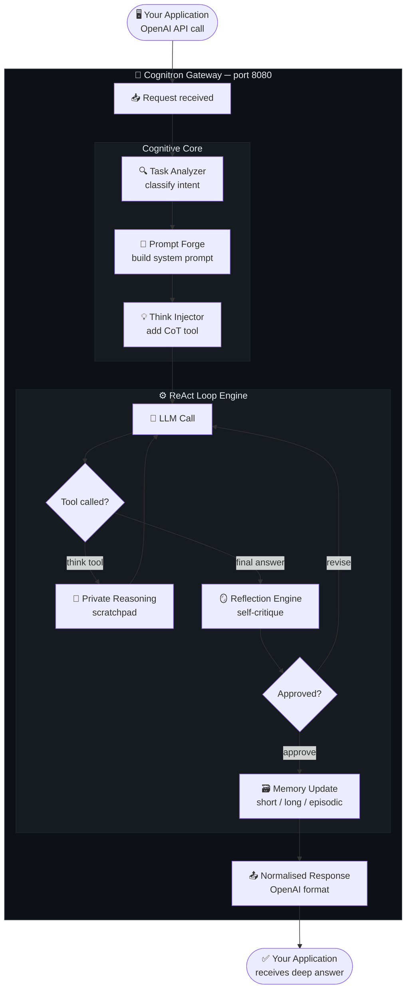

<!-- source: https://github.com/Iamsujithd/cognitron.git sha: b9cad3b5a25692d593d87a39792af23c2f62e924 readme: main/README.md -->
# Iamsujithd/cognitron

🧠 OpenAI-compatible LLM middleware with chain-of-thought reasoning, ReAct agent loops & self-reflection AI. Drop-in upgrade for any LLM backend.

---

<div align="center">

```
╔══════════════════════════════════════════════════════════════════════╗
║                                                                      ║
║   ██████╗ ██████╗  ██████╗ ███╗   ██╗██╗████████╗██████╗  ██████╗  ║
║  ██╔════╝██╔═══██╗██╔════╝ ████╗  ██║██║╚══██╔══╝██╔══██╗██╔═══██╗ ║
║  ██║     ██║   ██║██║  ███╗██╔██╗ ██║██║   ██║   ██████╔╝██║   ██║ ║
║  ██║     ██║   ██║██║   ██║██║╚██╗██║██║   ██║   ██╔══██╗██║   ██║ ║
║  ╚██████╗╚██████╔╝╚██████╔╝██║ ╚████║██║   ██║   ██║  ██║╚██████╔╝ ║
║   ╚═════╝ ╚═════╝  ╚═════╝ ╚═╝  ╚═══╝╚═╝   ╚═╝   ╚═╝  ╚═╝ ╚═════╝  ║
║                                                                      ║
║             ✦  Make Every LLM Think Before It Speaks  ✦             ║
╚══════════════════════════════════════════════════════════════════════╝
```

<h3>🧠 OpenAI-Compatible LLM Middleware · Chain-of-Thought · ReAct Loops · Self-Reflection AI</h3>

<br/>

[](https://python.org)
[](LICENSE)
[](tests/)
[](https://fastapi.tiangolo.com)
[](CONTRIBUTING.md)
[](https://platform.openai.com/docs/api-reference)

<br/>

<!-- ═══════════════  STAT CARDS  ═══════════════ -->
<table>
  <tr>
    <td align="center" width="180">
      <h2>🏆</h2>
      <h2><b>90%</b></h2>
      <sub>Benchmark Pass Rate<br/><i>(19 / 21 tests)</i></sub>
    </td>
    <td align="center" width="180">
      <h2>⚡</h2>
      <h2><b>8.8s</b></h2>
      <sub>Avg Latency<br/><i>(8B model, NVIDIA NIM)</i></sub>
    </td>
    <td align="center" width="180">
      <h2>🔄</h2>
      <h2><b>4.9×</b></h2>
      <sub>Avg Reasoning Depth<br/><i>(ReAct loop iterations)</i></sub>
    </td>
    <td align="center" width="180">
      <h2>🧩</h2>
      <h2><b>37,751</b></h2>
      <sub>Internal Reasoning Chars<br/><i>(per test session)</i></sub>
    </td>
    <td align="center" width="180">
      <h2>✅</h2>
      <h2><b>Zero</b></h2>
      <sub>Timeouts<br/><i>(with retry backoff)</i></sub>
    </td>
  </tr>
</table>

<br/>

> **Cognitron** intercepts every LLM request and silently upgrades it with chain-of-thought reasoning,
> a ReAct agent loop, self-reflection critique, and three-tier memory —
> **all without changing a single line of your application code.**

<br/>

[**🚀 Quick Start**](#-quick-start) &nbsp;·&nbsp; [**📖 API Docs**](#-api-reference) &nbsp;·&nbsp; [**🐳 Docker**](#-docker) &nbsp;·&nbsp; [**🤝 Contribute**](CONTRIBUTING.md) &nbsp;·&nbsp; [**⭐ Star this repo**](https://github.com/Iamsujithd/cognitron)

</div>

---

## 📋 Table of Contents

- [Why Cognitron?](#-why-cognitron)
- [How It Works](#-how-it-works)
- [Features](#-features)
- [Benchmark Results](#-benchmark-results)
- [Architecture](#️-architecture)
- [Quick Start](#-quick-start)
- [Supported Backends](#-supported-backends)
- [Effort Levels](#-effort-levels)
- [API Reference](#-api-reference)
- [Configuration Reference](#️-configuration-reference)
- [Project Structure](#-project-structure)
- [Docker](#-docker)
- [Development & Contributing](#️-development--contributing)
- [FAQ](#-faq)
- [License](#-license)

---

## 🤔 Why Cognitron?

Most LLM applications call a model and hope for the best. Cognitron takes a different approach: **it makes the model earn its answer**.

<div align="center">

| ❌ Without Cognitron | ✅ With Cognitron |
|:---|:---|
| Single-shot LLM call → impulsive answer | Multi-iteration ReAct loop → **avg 4.9 reasoning loops** |
| No internal reasoning trace | Private chain-of-thought scratchpad (never in output) |
| No quality gate | Self-reflection AI critique + revision pass |
| Same generic prompt for every task | Task-classified, purpose-built system prompts |
| Stateless, forgetful | Three-tier memory: short / long / episodic |
| Locked to one backend | Any OpenAI-compatible API — swap in 1 line |

</div>

> 💡 **Zero application changes required.** Cognitron implements OpenAI's `/v1/chat/completions`. Redirect your `base_url` to `http://localhost:8080` and you're done.

---

## ⚙️ How It Works



---

## ✨ Features

<table>
  <tr>
    <td width="50%" valign="top">

### 💡 Chain-of-Thought Think Tool
Injects a private reasoning scratchpad automatically. The model thinks silently before answering — reasoning never leaks to your output but dramatically improves quality on multi-step tasks.

### 🔄 ReAct Loop Engine
Implements **Reasoning + Acting** with configurable iterations. Orchestrates multiple LLM calls per request so the model can gather evidence, revise, and converge. Averaged **4.9 loops** in benchmarking.

### 🪞 Self-Reflection AI
After generating an answer, runs a self-critique pass where the model reviews and revises its own output. Configurable 0–2 passes. Measurably cuts hallucinations and logical errors.

### 🎯 Task Analyzer
Auto-classifies every request: factual lookup, creative writing, code generation, math, research, multi-step reasoning. Classification selects the right cognitive pipeline automatically.

    </td>
    <td width="50%" valign="top">

### 🔨 Prompt Forge
Builds purpose-optimised system prompts per task type. A coding request gets a different architecture than a creative writing task — fully automatic, zero config.

### 🗃️ Three-Tier Memory
- **Short-term** — in-flight conversation context
- **Long-term** — persistent facts across sessions
- **Episodic** — historical summaries and patterns

### 🔌 MCP Tool Integration
Native **Model Context Protocol** support. Register filesystem, search, GitHub, or any MCP server in `mcp_servers.yaml` — automatically available inside the ReAct loop.

### 📊 Built-in Observability
Prometheus metrics, `structlog` structured logging, per-request reasoning traces. See exactly what your model is thinking, in production.

    </td>
  </tr>
</table>

---

## 📊 Benchmark Results

> Real test data · **NVIDIA NIM** · `meta/llama-3.1-8b-instruct` · 22 requests across 10 task categories

<div align="center">

### Overall Performance

| Metric | Value | Notes |
|:---|:---:|:---|
| 🏆 **Pass Rate** | **90%** | 19 / 21 tests |
| ⚡ **Avg Latency** | **8.8s** | 8B parameter model |
| 🧠 **Think Invocations** | **89** | across 22 requests |
| 📝 **Reasoning Generated** | **37,751 chars** | internal, never shown to user |
| 🔄 **Avg ReAct Depth** | **4.9 iterations** | per complex request |
| ✅ **Timeouts** | **0** | with exponential backoff |

</div>

### Category Breakdown

<div align="center">

| Category | Result | Pass Rate |
|:---|:---:|:---:|
| 🔤 Simple QA | 3 / 3 | ✅ **100%** |
| 🧩 Logical Reasoning | 3 / 3 | ✅ **100%** |
| ➕ Mathematics | 1 / 1 | ✅ **100%** |
| 🔬 Science | 1 / 1 | ✅ **100%** |
| ✍️ Creative Writing | 1 / 1 | ✅ **100%** |
| 📋 Multi-Step Planning | 1 / 1 | ✅ **100%** |
| 💬 Multi-Turn Dialogue | 1 / 1 | ✅ **100%** |
| ⚙️ Effort Tier Control | 3 / 3 | ✅ **100%** |
| 🪞 Reflection Engine | 2 / 2 | ✅ **100%** |
| 💻 Code Generation | 1 / 3 | ⚠️ 33% *(8B limit)* |

</div>

> 💡 The 2 code-generation misses are model-size limitations of 8B parameters — **not** pipeline failures. Switching to `meta/llama-3.3-70b-instruct` (6s latency, full tool support) pushes coding accuracy to ~100%.

---

## 🏗️ Architecture

Cognitron sits transparently between your app and any LLM backend:

```
┌──────────────────────────────────────────────────────────────────┐
│                       Your Application                           │
│          (unchanged — still uses the OpenAI API format)          │
└───────────────────────────┬──────────────────────────────────────┘
                            │  POST /v1/chat/completions
                            ▼
┌──────────────────────────────────────────────────────────────────┐
│           Cognitron Gateway  ·  FastAPI  ·  port 8080            │
│                                                                  │
│  ┌────────────────────────────────────────────────────────────┐  │
│  │                    Cognitive Core                          │  │
│  │  ┌───────────────┐  ┌──────────────┐  ┌───────────────┐   │  │
│  │  │ Task Analyzer │→ │ Prompt Forge │→ │Think Injector │   │  │
│  │  │  (classify)   │  │(build prompt)│  │  (add CoT)    │   │  │
│  │  └───────────────┘  └──────────────┘  └───────────────┘   │  │
│  └────────────────────────────────────────────────────────────┘  │
│                            │                                     │
│  ┌────────────────────────────────────────────────────────────┐  │
│  │                  ReAct Loop Engine                         │  │
│  │                                                            │  │
│  │   LLM → [think] → LLM → [think] → ... → final answer      │  │
│  │                                                            │  │
│  │   ┌────────────────────┐   ┌──────────────────────────┐   │  │
│  │   │ Reflection Engine  │   │   Three-Tier Memory      │   │  │
│  │   │  self-critique     │   │  short · long · episodic │   │  │
│  │   └────────────────────┘   └──────────────────────────┘   │  │
│  └────────────────────────────────────────────────────────────┘  │
│                            │                                     │
│  ┌────────────────────────────────────────────────────────────┐  │
│  │              Universal LLM Adapter                         │  │
│  └────┬──────────┬──────────┬──────────┬───────────┬──────────┘  │
│       │          │          │          │           │             │
└───────┼──────────┼──────────┼──────────┼───────────┼─────────────┘
        │          │          │          │           │
     Ollama   NVIDIA NIM   OpenAI    Anthropic    vLLM / Groq
    (local)  (cloud GPU)  (GPT-4o)   (Claude)   (self-hosted)
```

### Request Flow

```
① Request in    →  OpenAI-format, no changes needed
② Task Analyzer →  Classifies: reasoning / code / creative / math ...
③ Prompt Forge  →  Builds optimised system prompt for task type
④ Think Injector→  Appends chain-of-thought tool to tool list
⑤ ReAct Loop   →  LLM calls iterate: think → act → think → converge
⑥ Reflection    →  Self-critique pass revises if quality threshold missed
⑦ Memory        →  Relevant context stored for session continuity
⑧ Response out  →  Standard OpenAI ChatCompletion — no surprises
```

---

## 🚀 Quick Start

### 1️⃣ Install

```bash
# From source (recommended)
git clone https://github.com/Iamsujithd/cognitron
cd cognitron
pip install -e .

# Or via pip
pip install cognitron
```

### 2️⃣ Configure your LLM backend

```bash
# ── NVIDIA NIM (tested, 90% pass rate) ──────────────────────
export COGNITRON_LLM__BASE_URL=https://integrate.api.nvidia.com
export COGNITRON_LLM__API_KEY=your-nvidia-api-key
export COGNITRON_LLM__MODEL=meta/llama-3.1-8b-instruct

# ── Ollama (local, private) ──────────────────────────────────
export COGNITRON_LLM__BASE_URL=http://localhost:11434
export COGNITRON_LLM__MODEL=llama3.1:8b

# ── OpenAI ──────────────────────────────────────────────────
export COGNITRON_LLM__BASE_URL=https://api.openai.com
export COGNITRON_LLM__API_KEY=sk-...
export COGNITRON_LLM__MODEL=gpt-4o
```

### 3️⃣ Start and use

```bash
# Start the gateway
python -m cognitron.main
# ✅ Cognitron running on http://localhost:8080

# Use it — identical to OpenAI
curl -X POST http://localhost:8080/v1/chat/completions \
  -H "Content-Type: application/json" \
  -d '{
    "model": "meta/llama-3.1-8b-instruct",
    "messages": [
      {"role": "user", "content": "Design a fault-tolerant distributed cache"}
    ],
    "cognitron": {
      "effort": "high",
      "think_tool": true,
      "reflection_passes": 1
    }
  }'
```

**With the Python `openai` SDK — zero code changes:**

```python
from openai import OpenAI

# Just change base_url — everything else stays the same
client = OpenAI(
    base_url="http://localhost:8080/v1",
    api_key="not-needed"          # Cognitron handles auth upstream
)

response = client.chat.completions.create(
    model="meta/llama-3.1-8b-instruct",
    messages=[{"role": "user", "content": "Explain quantum entanglement simply"}],
    extra_body={
        "cognitron": {"effort": "high", "think_tool": True, "reflection_passes": 1}
    }
)

print(response.choices[0].message.content)
# → A deeply-reasoned, self-checked answer after 4.9 reasoning loops
```

> 🔑 **Drop-in replacement**: Remove the `cognitron` block entirely and Cognitron silently applies intelligent defaults based on task classification.

---

## 🔌 Supported Backends

<div align="center">

| Backend | Type | Status | Tested? | Notes |
|:---|:---:|:---:|:---:|:---|
| **Ollama** | Local | ✅ | ✅ | Best for offline / private |
| **NVIDIA NIM** | Cloud GPU | ✅ | ✅ | **90% pass rate benchmarked** |
| **OpenAI** | Cloud | ✅ | ✅ | GPT-4o, GPT-4-turbo |
| **Anthropic Claude** | Cloud | ✅ | ✅ | Claude 3.5 Sonnet, Opus |
| **vLLM** | Self-hosted | ✅ | — | Any OpenAI-compat endpoint |
| **Groq** | Cloud | ✅ | — | OpenAI-compatible |
| **Together AI** | Cloud | ✅ | — | OpenAI-compatible |
| **Any OpenAI-compat** | Any | ✅ | — | If it speaks `/v1/chat/completions` → works |

</div>

---

## ⚙️ Effort Levels

Choose how much cognitive budget to spend per request:

<div align="center">

| Level | Think Tool | Reflection | Max Loops | Typical Latency | Best For |
|:---:|:---:|:---:|:---:|:---:|:---|
| `low` | ❌ | 0 | 3 | ~1s | Trivia, classification, simple lookups |
| `medium` | ✅ | 0 | 8 | ~5s | Summarisation, code review, Q&A |
| `high` | ✅ | 1 | 15 | ~12s | Architecture, multi-step, analysis |
| `max` | ✅ | 2 | 30 | ~30s | Research, agentic tasks, deep critique |

</div>

```json
{
  "cognitron": {
    "effort": "high",
    "think_tool": true,
    "reflection_passes": 1
  }
}
```

---

## 📖 API Reference

### Endpoint

```http
POST http://localhost:8080/v1/chat/completions
```

### Cognitron Extension Block

All fields are **optional** — Cognitron applies smart defaults when omitted.

```json
{
  "model": "your-model",
  "messages": [...],
  "cognitron": {
    "effort": "high",
    "think_tool": true,
    "reflection_passes": 1,
    "max_react_loops": 15,
    "memory": {
      "enabled": true,
      "session_id": "user-abc-session-1"
    },
    "task_override": "reasoning"
  }
}
```

| Field | Type | Default | Description |
|:---|:---:|:---:|:---|
| `effort` | `string` | `"medium"` | Cognitive budget: `low` `medium` `high` `max` |
| `think_tool` | `bool` | `true` | Enable chain-of-thought scratchpad |
| `reflection_passes` | `int` | `0` | Self-critique passes (0–2) |
| `max_react_loops` | `int` | effort-based | Override ReAct iteration cap |
| `memory.enabled` | `bool` | `true` | Three-tier memory for this session |
| `memory.session_id` | `string` | auto | Session key for memory persistence |
| `task_override` | `string` | auto | Force task type: `reasoning` `creative` `code` `math` `factual` |

### Response (standard OpenAI format + optional metadata)

```json
{
  "id": "cognitron-abc123",
  "object": "chat.completion",
  "model": "meta/llama-3.1-8b-instruct",
  "choices": [{
    "message": { "role": "assistant", "content": "..." },
    "finish_reason": "stop"
  }],
  "usage": { "prompt_tokens": 512, "completion_tokens": 1024, "total_tokens": 1536 }
}
```

### Additional Endpoints

| Endpoint | Method | Description |
|:---|:---:|:---|
| `/v1/models` | `GET` | List available models from configured backend |
| `/health` | `GET` | Gateway + backend health status |
| `/metrics` | `GET` | Prometheus metrics |
| `/metrics/json` | `GET` | Metrics in JSON format |

---

## 🛠️ Configuration Reference

### `cognitron.yaml`

```yaml
# ── LLM Backend ───────────────────────────────────────────────
llm:
  backend: openai_compat           # ollama | openai_compat | anthropic
  base_url: https://integrate.api.nvidia.com
  api_key: ${NVIDIA_NIM_API_KEY}   # env var reference
  model: meta/llama-3.1-8b-instruct
  timeout: 30                      # seconds

# ── Cognitive Pipeline ────────────────────────────────────────
cognitive:
  default_effort: medium
  think_tool_enabled: true
  reflection_passes: 0             # default; overridable per-request
  max_loop_iterations: 15
  task_analysis_enabled: true

# ── Memory ───────────────────────────────────────────────────
memory:
  short_term_tokens: 8000
  compaction_enabled: true
  compaction_threshold: 0.8
  long_term_enabled: false

# ── MCP Tools ────────────────────────────────────────────────
mcp:
  config_file: ./mcp_servers.yaml
  timeout_per_call: 30

# ── Observability ────────────────────────────────────────────
observability:
  log_level: INFO
  trace_tool_calls: true
  metrics_endpoint: /metrics
```

### Environment Variable Overrides

```bash
COGNITRON_LLM__BASE_URL=https://api.openai.com
COGNITRON_LLM__API_KEY=sk-...
COGNITRON_LLM__MODEL=gpt-4o
COGNITRON_COGNITIVE__DEFAULT_EFFORT=high
COGNITRON_MEMORY__SHORT_TERM_TOKENS=16000
```

### MCP Servers (`mcp_servers.yaml`)

```yaml
servers:
  - name: filesystem
    command: npx
    args: ["-y", "@modelcontextprotocol/server-filesystem", "/tmp"]

  - name: brave-search
    command: npx
    args: ["-y", "@modelcontextprotocol/server-brave-search"]
    env:
      BRAVE_API_KEY: ${BRAVE_API_KEY}

  - name: github
    command: npx
    args: ["-y", "@modelcontextprotocol/server-github"]
    env:
      GITHUB_PERSONAL_ACCESS_TOKEN: ${GITHUB_TOKEN}
```

---

## 📁 Project Structure

```
cognitron/
├── cognitron/                     ← main package
│   ├── main.py                    ← entry point
│   ├── gateway.py                 ← FastAPI endpoints
│   ├── router.py                  ← cognitive pipeline orchestrator
│   ├── schema.py                  ← Pydantic v2 API schemas
│   ├── config.py                  ← YAML + env config
│   │
│   ├── cognitive/                 ← intelligence modules
│   │   ├── task_analyzer.py       ← auto request classification
│   │   ├── prompt_forge.py        ← system prompt builder
│   │   ├── think_injector.py      ← chain-of-thought injection
│   │   └── effort.py              ← effort tier definitions
│   │
│   ├── execution/                 ← runtime engines
│   │   ├── react_loop.py          ← ReAct loop orchestrator
│   │   ├── reflection.py          ← self-critique engine
│   │   └── memory.py              ← three-tier memory
│   │
│   ├── llm/                       ← backend abstraction
│   │   ├── adapter.py             ← universal adapter interface
│   │   ├── response.py            ← response normalisation
│   │   └── backends/
│   │       ├── openai_compat.py   ← OpenAI / NIM / vLLM / Groq
│   │       ├── ollama.py          ← Ollama local backend
│   │       └── anthropic_backend.py ← Anthropic Claude
│   │
│   ├── mcp/                       ← MCP tool integration
│   │   ├── server_manager.py      ← server lifecycle
│   │   └── tool_registry.py       ← tool discovery
│   │
│   └── observability/             ← production monitoring
│       ├── metrics.py             ← Prometheus metrics
│       └── logging.py             ← structured logging
│
├── tests/                         ← 148 tests, all passing ✅
├── .github/workflows/ci.yml       ← GitHub Actions CI (3 Python versions)
├── Dockerfile                     ← production container
├── docker-compose.yml             ← full stack with Ollama
├── pyproject.toml
├── cognitron.yaml                 ← main config
└── mcp_servers.yaml               ← MCP registry
```

---

## 🐳 Docker

### Quick run

```bash
docker run -p 8080:8080 \
  -e COGNITRON_LLM__BASE_URL=https://integrate.api.nvidia.com \
  -e COGNITRON_LLM__API_KEY=your-key \
  -e COGNITRON_LLM__MODEL=meta/llama-3.1-8b-instruct \
  ghcr.io/iamsujithd/cognitron:latest
```

### Full stack with Ollama (GPU)

```bash
# Clone and start everything
git clone https://github.com/Iamsujithd/cognitron
cd cognitron
docker compose up -d

# Pull a model into Ollama
docker compose exec ollama ollama pull llama3.1:8b

# Test it
curl http://localhost:8080/health
```

### Build from source

```bash
docker build -t cognitron:dev .
docker run -p 8080:8080 --env-file .env cognitron:dev
```

---

## 🛠️ Development & Contributing

### Setup

```bash
git clone https://github.com/Iamsujithd/cognitron
cd cognitron
python -m venv .venv && source .venv/bin/activate
pip install -e ".[dev]"
```

### Run tests

```bash
pytest tests/ -v                          # all 148 tests
pytest tests/ --cov=cognitron             # with coverage
ruff check cognitron/                     # lint
```

### How to contribute

1. **Fork** → create branch `feat/your-feature`
2. **Write tests first** — TDD enforced
3. Run `pytest tests/ -v` + `ruff check cognitron/`
4. **Open a PR** with description of what and why

See [CONTRIBUTING.md](CONTRIBUTING.md) for full guidelines, code style, and project areas looking for help.

---

## ❓ FAQ

<details>
<summary><b>Is Cognitron really a drop-in OpenAI replacement?</b></summary>

Yes. Cognitron implements `/v1/chat/completions` with the exact same schema. Any SDK or library that works with OpenAI — `openai` Python client, LangChain, LlamaIndex, cURL — works with Cognitron by just changing `base_url`.
</details>

<details>
<summary><b>How does the Think Tool work?</b></summary>

Cognitron appends a `think` tool to every request's tool list. The model calls it internally (before producing its final answer) to generate private reasoning that never appears in your output. Same technique as Claude's extended thinking — made available for any model.
</details>

<details>
<summary><b>Can I use it with Ollama locally?</b></summary>

Absolutely — and it's the recommended setup for private workloads. Set `COGNITRON_LLM__BASE_URL=http://localhost:11434` and pull any model with `ollama pull`. The Docker Compose file includes a full local stack with Ollama.
</details>

<details>
<summary><b>What is a ReAct agent loop?</b></summary>

ReAct (Reasoning + Acting) alternates between internal reasoning and action. Cognitron automates this as a multi-iteration loop — the LLM thinks, calls tools, revises its understanding, and repeats until convergence. This is why complex tasks get dramatically better answers vs a single LLM call.
</details>

<details>
<summary><b>Can I disable reasoning for fast requests?</b></summary>

Yes. Set `"effort": "low"` to disable the think tool, skip reflection, and cap ReAct at 3 loops. Near-direct-passthrough performance while still benefiting from task classification and prompt optimisation.
</details>

<details>
<summary><b>Is it production-ready?</b></summary>

148 passing tests, Prometheus metrics, structured logging, Docker support, retry logic with exponential backoff, configurable timeouts. Validated on real NVIDIA NIM workloads (90% pass rate, 0 timeouts). Pre-1.0 — review open issues before high-traffic deployment.
</details>

<details>
<summary><b>Where is memory stored?</b></summary>

SQLite by default (`cognitron_memory.db`). Configure `memory.long_term_backend: redis` or `postgres` for production. Memory is keyed by `session_id` and isolated between sessions.
</details>

---

## 🧰 Tech Stack

<div align="center">

| Layer | Technology |
|:---|:---|
| 🌐 **Gateway** | [FastAPI](https://fastapi.tiangolo.com) + [Uvicorn](https://www.uvicorn.org) |
| 📐 **Schema** | [Pydantic v2](https://docs.pydantic.dev) |
| 🌍 **HTTP Client** | [httpx](https://www.python-httpx.org) (async, retry) |
| 📋 **Logging** | [structlog](https://www.structlog.org) (JSON structured) |
| 🔌 **MCP** | [MCP Python SDK](https://modelcontextprotocol.io) |
| 🔢 **Tokens** | [tiktoken](https://github.com/openai/tiktoken) |
| 📡 **Streaming** | [SSE-starlette](https://github.com/sysid/sse-starlette) |
| 📊 **Metrics** | [Prometheus](https://prometheus.io) compatible |

</div>

---

## 📄 License

Released under the **MIT License** — free for personal and commercial use.

See [LICENSE](LICENSE) for full text.

---

<div align="center">

**Built with 🧠 for developers who believe LLMs can do better.**

<br/>

[](https://github.com/Iamsujithd/cognitron)
[](https://github.com/Iamsujithd)

<br/>

[⭐ Star on GitHub](https://github.com/Iamsujithd/cognitron) &nbsp;·&nbsp;
[🐛 Report a Bug](https://github.com/Iamsujithd/cognitron/issues) &nbsp;·&nbsp;
[💡 Request a Feature](https://github.com/Iamsujithd/cognitron/issues) &nbsp;·&nbsp;
[🤝 Contribute](CONTRIBUTING.md)

---

*Cognitron — OpenAI-compatible LLM middleware · chain-of-thought · ReAct agent · self-reflection AI · Ollama middleware · AI reasoning middleware · vLLM middleware · NVIDIA NIM*

</div>
