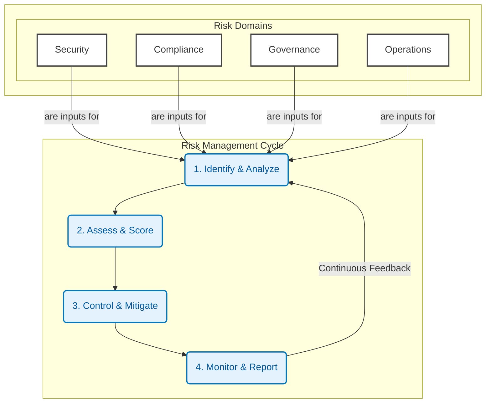

<!-- source: https://github.com/ai-safe-ops-labs/ai-safe-ops.git sha: 2d7187357fb71ff8387378ab40a96493b4856481 readme: main/README.md -->
# ai-safe-ops-labs/ai-safe-ops

🥱 The standard toolikt for boring AI challenges like governance, security, guardrails, compliance and regulatory. 

---

# AI Safe Ops Toolkit

> 🥱 **An integrated Risk Management Framework for the boring-but-critical AI challenges:** Governance, Security, Compliance, and Operational Resilience.

### Vision & Mission

**Vision:** To become the standard framework for managing the risks of AI agentic systems.

**Mission:** We provide developers and organizations with a comprehensive, open-source toolkit to systematically identify, assess, control, and monitor the unique risks associated with AI agents, enabling safe and compliant innovation.

---

### Target Audience
AI Engineers developing AI agent systems with frameworks like: 
- [langchain](https://github.com/langchain-ai/langchain) & [langgraph](https://github.com/langchain-ai/langgraph)
- [Google Agent Development Kit](https://github.com/google/adk-python)
- [crewAI](https://github.com/crewAIInc/crewAI)
- [agno](https://github.com/agno-agi/agno)

seeking for a solution covering all "boring" topics like: 
- Governance
- Security
- Guardrails
- Compliance
- Regulation

---

## The Challenge: From Powerful Tools to Trusted Systems

AI agent frameworks (Google ADK, LangChain, CrewAI) provide incredible power, but this power creates a new class of risks. How do you prevent agents from leaking data? How do you ensure they comply with laws like the EU AI Act? How do you stop them from failing in unpredictable ways?

**AI Safe Ops replaces ad-hoc checklists with a structured, continuous risk management lifecycle.**

## The Framework: A Continuous Cycle for Agent Safety

Our toolkit is built around the four established phases of risk management, applied to the specific domains of AI agents.

1.  **Identify & Analyze:** Proactively uncover risks in your codebase, configuration, and documentation.
2.  **Assess & Score:** Evaluate the severity of identified risks to prioritize action.
3.  **Control & Mitigate:** Implement active measures to prevent risks at runtime and fix vulnerabilities at the source.
4.  **Monitor & Report:** Continuously observe agent behavior and provide a verifiable audit trail.

We apply this cycle across four key risk domains: **Security, Compliance, Governance, and Operations.**

### The AI Agent Risk Matrix

This matrix is the heart of our toolkit. It shows how our features systematically address risks across the entire lifecycle.

| Phasen → Domänen ↓ | 1. Analyse (Checkups & Audits) | 2. Bewertung (Scoring) | 3. Steuerung (Guardrails & Recommendations) | 4. Überwachung (Monitoring) |
| :--- | :--- | :--- | :--- | :--- |
| **Security** | `bandit` Code-Scan `detect-secrets` `pip-audit` Dependencies | Kritikalität von CVEs & Secrets (High/Medium/Low) | **Guardrail:** Block SQL-Injection **Recommendation:** Upgrade package X to Y | OTel: Alert on repeated attack patterns |
| **Compliance** | AI Audit vs. `eu-ai-act.yml` | Report: Fulfilled vs. unfulfilled legal requirements | **Guardrail:** Block users from restricted regions **Recommendation:** Add specific disclaimer text | OTel: Log every compliance-relevant action (Audit Trail) |
| **Governance** | Scan for PII in logs Scan for biased language Check `README` & `LICENSE` | "High" risk score for PII exposure | **Guardrail:** Redact PII in real-time **Recommendation:** Add a Model Card | OTel: Dashboard "PII Redactions per Hour" |
| **Operational** | Analyze for error patterns & prompt injection vulnerabilities | Frequency of errors and hallucinations | **Guardrail:** Filter prompt injections **Recommendation:** Implement human-in-the-loop for specific tasks | OTel: Trace agent execution flow for debugging |

---

## Toolkit Capabilities

Our framework is implemented through a set of powerful, integrated engines, all accessible via our interactive CLI.

*   🖥️ **The CLI (`ai-safe-ops-cli`):** The single, interactive entry point to the entire risk management framework.
*   🔍 **Audit & Checkup Engine:** The core of the **Analysis** phase. Runs fast, deterministic `Blueprint Checkups` and deep, AI-powered `Policy Audits` to identify risks.
*   🛡️ **Guardrails Library:** The heart of the **Control** phase. A lightweight library that integrates directly into your agent's code to block, redact, and manage behavior in real-time.
*   🧠 **Recommendation Engine:** The intelligence layer between **Assessment** and **Control**. It generates actionable recommendations based on findings, best practices, and real-time threat intelligence (e.g., new exploits, new prompt injection techniques).
*   📊 **Reporting Engine:** The output of the framework, serving the **Monitoring** phase. It generates reports in multiple formats – starting with machine-readable `JSON` for tool integration, human-readable `Markdown` for developers, and audit-ready `PDF` for stakeholders.
*   📡 **Observability (via OpenTelemetry):** The foundation of the **Monitoring** phase. All components, especially Guardrails, emit structured logs and traces, integrating seamlessly into your existing monitoring platforms (Datadog, Honeycomb, etc.).

## 🗺️ Roadmap: Filling the Matrix

Our development is focused on systematically building out the capabilities in our risk matrix.

### Phase 1: Foundation - Analysis & Assessment

**Goal:** Provide a robust, offline-first engine for baseline risk identification and scoring.

*   [x] **CLI:** Interactive Go-based TUI.
*   [x] **Checkup Engine:** Deterministic scans for Security, Governance, and Operational risks (`bandit`, `detect-secrets`, `pip-audit`, PII scans).
*   [x] **Scoring:** Basic risk classification (High, Medium, Low).
*   [x] **Reporting:** Generation of `Markdown` reports.

### Phase 2: Active Mitigation - The Guardrail System

**Goal:** Implement the real-time risk control mechanisms.

*   [ ] **Guardrails Library:** Create the core `GuardrailManager` with `spaCy` integration for rule-based filtering (PII, Keywords).
*   [ ] **`guardrails.yml` Schema:** Define the configuration standard for runtime rules.
*   [ ] **OpenTelemetry Integration:** Instrument Guardrails to provide a live feed for the **Monitoring** phase.
*   [ ] **Guardrail Templates:** Provide pre-built rules for common Security and Governance risks.

### Phase 3: Advanced Intelligence - AI Audits & Recommendations

**Goal:** Introduce adaptive and intelligent capabilities to the framework.

*   [ ] **AI Audit Engine:** Build the PydanticAI agent for flexible `Policy Audits`, starting with Compliance risks (EU AI Act).
*   [ ] **`policy.yml` Schema:** Define the "Compliance-as-Code" standard.
*   [ ] **Recommendation Engine (v1):** Integrate static recommendations into the report based on scan results.
*   [ ] **Advanced Reporting:** Add `JSON` output to the Reporting Engine.

### Phase 4: Full Lifecycle Integration

**Goal:** Complete the risk management cycle with advanced monitoring and dynamic intelligence.

*   [ ] **Recommendation Engine (v2):** Connect the engine to external threat intelligence feeds for dynamic recommendations.
*   [ ] **CI/CD Integration:** Provide templates for GitHub Actions to automate the **Analysis** and **Assessment** phases.
*   [ ] **Advanced Reporting:** Add `PDF` generation capabilities.

## 🤝 Contributing

We are building the standard for AI Agent risk management and welcome contributions. Please see `CONTRIBUTING.md` for guidelines.

## 📄 License

This project is licensed under the Apache 2.0 License. See the `LICENSE` file for details.