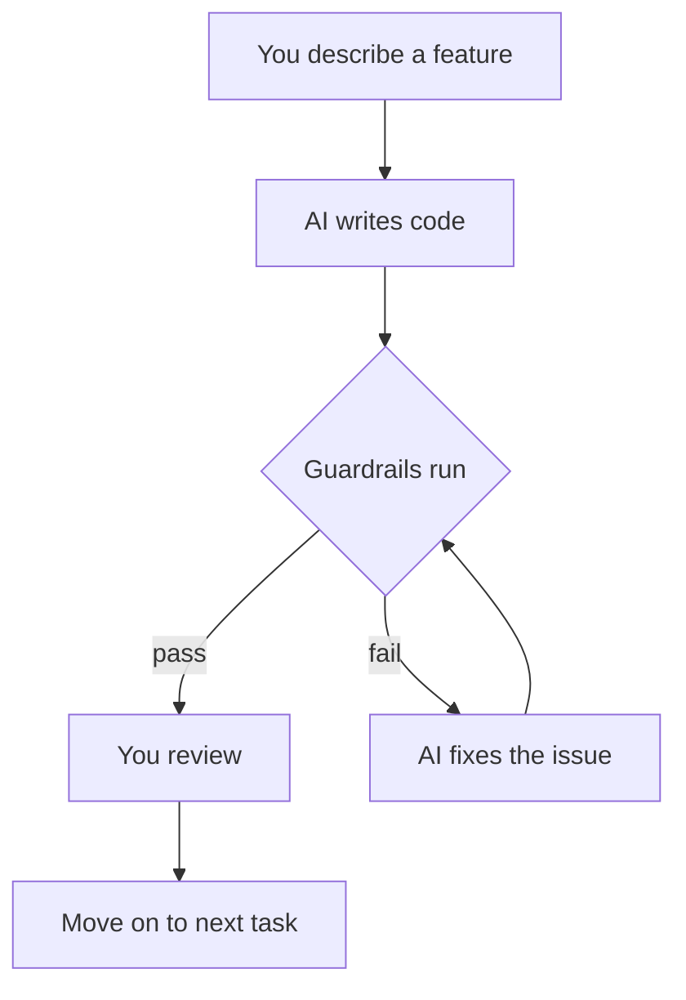

<!-- source: https://github.com/tortastudios/python-ai-guardrails-template.git sha: aae364ac21d5d369ce26af7d826d4a2e7488278a readme: main/README.md -->
# tortastudios/python-ai-guardrails-template

Engineering guardrails for AI-generated Python code. Enforces types, tests, complexity limits, security, and architecture automatically.

---

# Python AI Guardrails Starter Template

AI coding assistants produce code faster than humans can review it. The only
scalable solution is automated guardrails.

This template enforces engineering discipline on every edit — whether the author
is a human or a machine. Clone it, start building, and let the automation
enforce quality at the speed AI generates code.

## Works with

Claude Code, Cursor, Copilot, Aider, or any workflow where an LLM writes the
code and a human steers direction. The guardrails are tool-agnostic — they hook
into your editor, your CI pipeline, or both.

## Quick start

```bash
# Clone the template
git clone <your-repo-url> my-project
cd my-project

# Install dependencies (requires uv — https://docs.astral.sh/uv/)
uv sync

# Run the quality checks
make check

# Run the application
uv run python -m src.main

# Run the full audit (criticality analysis + dead code + dependency hygiene)
make audit
```

## Architectural awareness

Most templates enforce style. This one also understands architecture.

**pyan3 + networkx** build a call graph of the entire codebase and identify
critical functions — the ones with high fan-in (many callers), high fan-out
(many dependencies), or high betweenness centrality (bottleneck positions in
the graph).

The results are written to `CRITICALITY.md`. AI tools read this file before
editing and apply higher scrutiny to critical functions: mandatory type
annotations, mandatory docstrings, mandatory tests.

This gives the AI something most linting tools do not: an understanding of
which code is load-bearing and which code is peripheral.

Run `make criticality` to regenerate the report after structural changes.

## See it in action

A nested type annotation passes mypy but hides the data's meaning:

```python
# Before — anonymous and opaque
results: dict[str, list[dict[str, str]]] = scan(target)

# After — named and documented
class SecretFinding(TypedDict):
    hashed_secret: str
    line_number: str
    type: str

type ScanResults = dict[str, list[SecretFinding]]
results: ScanResults = scan(target)
```

`check_type_complexity.py` catches this automatically. The AI reads the rules,
picks the right named type, and fixes it in the same session.

See [docs/type-complexity.md](docs/type-complexity.md) for the full rationale
and decision guide for `@dataclass` vs `TypedDict` vs `TypeAlias`.

The workflow looks like this:



By the time you review, the mundane quality issues are already resolved. You
focus on whether the code does the right thing.

## Why this exists

The development model has changed. AI writes code, humans steer direction, and
**automation enforces quality**. Most teams fill that gap with manual code
review. That worked at human speed — it does not work when an AI generates
hundreds of lines per minute.

Code generated without constraints is fragile. Functions without type hints
introduce silent bugs during refactoring. Untested code breaks without warning.
Long, complex functions resist comprehension — by humans and by the AI itself
on its next pass.

This template gives AI tools two things that produce dramatically better code:
**clear rules** (explicit definitions of what "good" means) and **automated
feedback loops** (immediate consequences when the code falls short). The result
is code that remains readable and stable even when generated quickly.

## What the guardrails catch

Every tool below catches a different class of problem. Together they cover
types, complexity, tests, style, dead code, dependency hygiene, and security.

**ruff** — consistent formatting and common error detection. Auto-fixes most
violations. Configured with pycodestyle, pyflakes, bugbear, bandit, isort,
mccabe, naming, and pyupgrade rule sets.

**mypy (strict mode)** — verifies type hints are correct and present on every
function. Strict mode closes the gap where mypy silently skips untyped
functions. The single highest-leverage guardrail.

**radon** — measures cyclomatic complexity, maintainability index, and Halstead
metrics. Forces decomposition of long, tangled functions into smaller,
composable units.

**pytest + coverage** — runs the test suite and fails if coverage drops below
80%. Tests also anchor AI output — the model can verify its own work.

**vulture** — finds dead code: functions, variables, and imports that nothing
references. AI assistants generate dead code frequently.

**deptry** — catches packages imported but not declared in `pyproject.toml`,
and packages declared but never imported.

**bandit** — static security analysis. Identifies hardcoded passwords, use of
`eval()`, insecure hash functions, weak cryptography.

**pip-audit** — scans dependencies against the OSV and PyPI Advisory databases
for known CVEs. If a dependency has a known vulnerability, the build fails.

**detect-secrets** — prevents hardcoded credentials from landing in the repo.

**check_type_complexity** — enforces a nesting depth limit of 2 and character
length limit of 40 on type annotations. See
[docs/type-complexity.md](docs/type-complexity.md) for the full decision guide.

## How it steers AI tools

Two mechanisms create the feedback loop:

1. **`CLAUDE.md`** — rules the AI reads at the start of every session. Defines
   code style, quality expectations, and how to handle critical functions.
   Other tools (Cursor, Copilot) can use equivalent rule files.

2. **PostToolUse hook** (`.claude/settings.json`) — every time a `.py` file is
   edited or created, `make check` runs automatically. For tools without hook
   support, the **pre-commit hook** provides the same gate at commit time.

The cycle: **write → check → fix → check → move on**. Code that does not pass
the gates does not ship.

## CI/CD

The guardrails work locally during development. CI/CD ensures they also run on
every push and pull request.

**Pre-commit hook** — install once with `uv run pre-commit install`. Runs
`make check` before every commit. Configuration lives in
`.pre-commit-config.yaml`.

**GitHub Actions** — `.github/workflows/quality.yml` runs `make check` on every
push to `main` and every pull request targeting `main`. No secrets or special
configuration required.

**Other CI platforms** — the quality gates are CI-agnostic. Any platform that
can install `uv` and run `make check` will work.

## Project structure

```
.
├── CLAUDE.md                    # Rules for AI coding tools
├── CRITICALITY.md               # Auto-generated critical function report
├── Makefile                     # Quality gate commands
├── README.md                    # This file
├── pyproject.toml               # Project config, tool settings, dependencies
├── .python-version              # Python 3.12
├── .secrets.baseline            # Reviewed secrets baseline (committed)
├── .pre-commit-config.yaml      # Pre-commit hook configuration
├── .claude/
│   └── settings.json            # Claude Code hook configuration
├── .github/
│   └── workflows/
│       └── quality.yml          # GitHub Actions CI workflow
├── docs/
│   └── type-complexity.md       # Type annotation complexity guide
├── src/
│   ├── __init__.py
│   ├── py.typed                 # PEP 561 typed package marker
│   └── main.py                  # Entry point
├── tests/
│   ├── __init__.py
│   └── test_main.py             # Tests
└── scripts/
    ├── analyze_criticality.py   # Call graph → CRITICALITY.md
    ├── check_halstead.py        # Halstead metric checker
    ├── check_secrets.py         # Detect-secrets baseline comparison
    └── check_type_complexity.py # Type annotation complexity checker
```

Application code lives in `src/`. Tests live in `tests/`. Scripts in `scripts/`
support the quality gates and are not part of the application.

## Commands

| Command                      | What it does                                                      |
| ---------------------------- | ----------------------------------------------------------------- |
| `make check`                 | Run all quality gates (ruff + mypy + radon + coverage + security) |
| `make security`              | Run security gates only (bandit + pip-audit + detect-secrets)     |
| `make check FILE=src/foo.py` | Run gates on a single file                                        |
| `make check src/foo.py`      | Same as above — positional shorthand                              |
| `make types`                 | Check type annotation complexity                                  |
| `make fix`                   | Auto-fix ruff violations and format code                          |
| `make fix FILE=src/foo.py`   | Auto-fix a single file                                            |
| `make audit`                 | Full project audit (criticality + dead code + deps)               |
| `make criticality`           | Rebuild `CRITICALITY.md` from the call graph                      |
| `make dead-code`             | Find unused code with vulture                                     |
| `make deps`                  | Check for missing/unused dependencies with deptry                 |
| `make help`                  | Show all available commands                                       |
