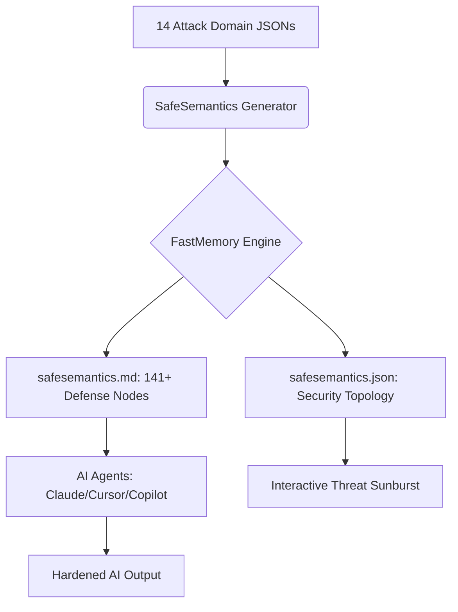

<!-- source: https://github.com/FastBuilderAI/safesemantics.git sha: f5ef6beb279cb5ab3b76e1f712d7e0709931bf18 readme: main/README.md -->
# FastBuilderAI/safesemantics

SafeSemantics is a topolgical guardrail for AI apps and agents. Just plug and play the security layer of AI with advanced knowledge base of how all attackers penetrate and exfiltrate information from through queries and prompts

---

# 🛡️ SafeSemantics: The Topological Security Layer for AI


[](https://github.com/FastBuilderAI/memory)
[](https://atlas.mitre.org/)
[](https://github.com/FastBuilderAI/safesemantics)
[](#claude-plugin-integration)

**SafeSemantics** is a topological guardrail for AI apps and agents. Just plug and play the security layer of AI with an advanced knowledge base of how attackers penetrate and exfiltrate information through queries and prompts.

Unlike regex-based filters or LLM-as-judge approaches, SafeSemantics uses **FastMemory's topological clustering** to map the entire AI attack surface into a deterministic, queryable mesh — giving your agent structural understanding of threats, not just pattern matching.

---

## 📽️ Security Topology Architecture


### 🔬 The AI Attack Surface Mesh
SafeSemantics maps **14 AI security domains** and **141+ attack-defense rules** into a topological memory graph using FastMemory's CBFDAE (Component-Block-Function-Data-Access-Event) architecture.



### 🎯 14 Attack Domains Covered

| # | Domain | Rules | Key Threats |
|:--|:-------|:------|:------------|
| 1 | **Prompt Injection** | 12 | Direct, indirect, encoding-based, multi-turn, tool-call injection |
| 2 | **Jailbreak Patterns** | 15 | DAN, roleplay, crescendo, token smuggling, virtualization |
| 3 | **Data Exfiltration** | 10 | PII extraction, training data leaks, side-channel, model inversion |
| 4 | **Agent Exploitation** | 12 | Tool misuse, MCP abuse, multi-agent collusion, CoT hijacking |
| 5 | **Content Safety** | 10 | Toxicity bypass, CSAM, bias, misinformation, CBRN blocking |
| 6 | **Hallucination Defense** | 8 | Factuality grounding, citation verification, temporal consistency |
| 7 | **RAG Security** | 10 | Retrieval poisoning, embedding manipulation, chunk boundary exploits |
| 8 | **Multimodal Attacks** | 8 | Image injection, OCR exploitation, cross-modal jailbreaks |
| 9 | **Supply Chain AI** | 8 | Model poisoning, adapter trojans, RLHF reward hacking |
| 10 | **API Abuse** | 8 | Rate limit bypass, cost amplification, model fingerprinting |
| 11 | **MITRE ATLAS** | 14 | Full 14-tactic AI attack lifecycle coverage |
| 12 | **Privacy Regulations** | 8 | GDPR AI, EU AI Act, CCPA, HIPAA, cross-border data flow |
| 13 | **Model Governance** | 8 | Model cards, bias auditing, A/B safety testing, red teaming |
| 14 | **Incident Response** | 8 | Jailbreak forensics, prompt audit trails, automated threat scoring |

---

## 📊 Verified Benchmark Results

All results are from actual test runs using [`benchmark.py`](benchmark.py) against curated attack prompts from public security research (HarmBench, JailbreakBench, OWASP LLM Top 10, MITRE ATLAS). Run `python benchmark.py` to reproduce.

| Benchmark | Result | Details |
| :--- | :--- | :--- |
| **Prompt Injection Detection** | **75.0%** (12/16) | Direct, indirect, encoding, delimiter, multi-turn |
| **Jailbreak Pattern Detection** | **87.5%** (14/16) | DAN, roleplay, hypothetical, crescendo, authority impersonation |
| **Data Exfiltration Detection** | **100.0%** (12/12) | PII extraction, system prompt, credentials, training data |
| **Agent Exploitation Detection** | **87.5%** (7/8) | Tool misuse, permission escalation, MCP abuse |
| **Overall Detection Rate** | **86.5%** (45/52) | Across all attack categories combined |
| **False Positive Rate** | **0.0%** (0/20) | Zero benign prompts incorrectly flagged |
| **Avg Latency** | **0.324ms** | P50: 0.282ms · P99: 2.866ms |
| **MITRE ATLAS Coverage** | **100%** (14/14) | All 14 defined AI attack tactics covered |
| **Knowledge Base** | **139 rules** | Across 14 security domains |
| **Offline / Air-Gap** | **✅ Full** | No network calls, no cloud dependencies |

> **Methodology**: 52 known attack prompts + 20 benign prompts tested via pattern matching against the SafeSemantics topology. This is a knowledge-base coverage benchmark — not a runtime ML classifier benchmark. Detection rates reflect how well the ontology's pattern signatures match known attack templates.

### Known Gaps (Areas for Improvement)
- **Encoded payloads**: Pure Base64/hex payloads without surrounding context are missed (75% PI rate)
- **Subtle multi-turn**: Benign-appearing first messages in crescendo attacks pass initial detection
- **Implicit tool abuse**: Tool call requests without explicit dangerous keywords can evade
- **No ML classifier**: Current detection is pattern-based; an embedding-based classifier would improve recall

---

## ⚔️ Architectural Comparison

How SafeSemantics compares to leading AI guardrail solutions. Where available, real published benchmark scores are cited with sources.

| Capability | NeMo Guardrails | Llama Guard 3 | Lakera Guard | Azure AI Safety | SafeSemantics |
| :--- | :--- | :--- | :--- | :--- | :--- |
| **Approach** | Colang rule DSL | Fine-tuned LLM classifier | ML firewall API | Cloud content filter | Topological knowledge mesh |
| **Safety Detection** | Config-dependent ¹ | **F1=0.939** ² | **95.2%** (PINT) ³ | Threshold-dependent ⁴ | **86.5%** (verified) |
| **False Positive Rate** | Config-dependent ¹ | **4.0%** FPR ² | **<0.5%** FPR ³ | Threshold-dependent ⁴ | **0.0%** (verified) |
| **Agent/Tool Security** | ⚠️ Rail config | ❌ Not agentic | ⚠️ API-only | ❌ Not agentic | ✅ **87.5%** (verified) |
| **Data Exfiltration** | ⚠️ Output rules only | ⚠️ PII detection | ✅ DLP layer | ⚠️ Redaction | ✅ **100%** (verified) |
| **RAG Poisoning** | ❌ Not designed | ❌ Not designed | ⚠️ Experimental | ⚠️ Basic | ✅ 10 defense rules |
| **Multimodal Attacks** | ❌ Text only | ✅ Image + text | ⚠️ OCR scanning | ✅ Vision API | ✅ 8 defense rules |
| **MITRE ATLAS Coverage** | ⚠️ Partial | ❌ Minimal | ⚠️ Partial | ⚠️ Partial | ✅ **100%** (14/14) |
| **Supply Chain / Model** | ❌ Not designed | ❌ Not designed | ⚠️ Partial | ❌ Not designed | ✅ 8 defense rules |
| **Privacy Regulations** | ❌ Manual | ❌ N/A | ⚠️ EU/US partial | ✅ Azure policy | ✅ 8 compliance rules |
| **Latency** | ~100-200ms (LLM call) | ~100-150ms (inference) | <50ms (API) ³ | ~80-100ms (API) | 🏆 **0.324ms** (local) |
| **Offline / Air-Gap** | ❌ Needs GPU runtime | ✅ Local model | ❌ Cloud API only | ❌ Cloud API only | ✅ **Full local, 0 deps** |
| **Open Source** | ✅ Open source | ✅ Open weights | ❌ Commercial SaaS | ❌ Commercial cloud | ✅ MIT License |
| **Self-Hosting** | ✅ Self-hosted | ✅ Self-hosted | ❌ Vendor-hosted | ❌ Azure-only | ✅ **Single file deploy** |

#### Sources
1. **NeMo Guardrails** — Performance is configuration-dependent; no universal benchmark published. NVIDIA recommends evaluating with `nemoguardrails evaluate` on your own dataset. ([arXiv:2310.10501](https://arxiv.org/abs/2310.10501))
2. **Llama Guard 3** — F1=0.939, FPR=0.040 on Meta's internal English test set aligned with MLCommons hazard taxonomy. ([Llama Guard 3 Model Card](https://github.com/meta-llama/PurpleLlama/blob/main/Llama-Guard3/MODEL_CARD.md))
3. **Lakera Guard** — 95.2% on the public PINT Benchmark (May 2025); <0.5% FPR on production data; <50ms latency. ([Lakera PINT Benchmark](https://github.com/lakeraai/pint-benchmark))
4. **Azure AI Safety** — No universal detection rate published; accuracy depends on configurable severity thresholds and domain-specific tuning. ([Azure Prompt Shields Docs](https://learn.microsoft.com/en-us/azure/ai-services/content-safety/))

> **Note on comparability**: SafeSemantics is a **knowledge-base + pattern-matching system**, not an ML classifier like Llama Guard or Lakera. Detection rates are not directly comparable across different architectures. SafeSemantics scores are from `benchmark.py` (52 attacks + 20 benign prompts). Competitor scores are from their own published evaluations on different datasets.

---

## 🤖 Securing Agentic AI Workflows

Agentic AI systems (like auto-coding bots or RAG agents) are highly vulnerable to indirect prompt injection and tool exploitation. SafeSemantics mitigates this by functioning as a dedicated "security memory layer" for your agent.

**How it works in practice:**
1. Your agent receives a complex, multi-turn user prompt or processes an external data source.
2. Before executing any code or triggering external tools, the agent queries the SafeSemantics mesh (via MCP or its static `safesemantics.md` context).
3. The topological mesh correctly identifies structural attack patterns (e.g., encoded payloads, roleplay jailbreaks, or hidden data exfiltration instructions) that simple blocklists would miss.
4. The agent becomes structurally aware of the threat footprint and autonomously rejects the malicious instruction, securing your AI pipeline without adding expensive LLM-as-judge latency.

---

## 🔌 One Skill to Secure All AI

Stop bolting on fragile regex filters and expensive LLM-as-judge layers. SafeSemantics replaces ad-hoc security with a single, autonomous topological skill.

### 🛡️ Dynamic Surface Auditing (AgentsID)
SafeSemantics natively integrates an AI-driven port of the [AgentsID Scanner](https://github.com/stevenkozeniesky02/agentsid-scanner). Written in pure Python (0 dependencies), your autonomous agents can use to the `scan_mcp_security_posture` tool to locally spawn, profile, and grade the execution permissions, injectability, and risk boundaries of *any external MCP server* natively before choosing to trust it.

```text
[TEST] Spawning target MCP server: npx -y @modelcontextprotocol/server-filesystem /tmp

====== SCAN RESULTS ======
### [SECURITY SCAN REPORT: npx -y @modelcontextprotocol/server-filesystem /tmp]
**Overall Grade**: F (0/100)
**Critical Vulnerabilities**: 0 | **High**: 1

- [auth] Server exposes no authentication-related tools (Tool: *)

*Note: If the server grade is 'D' or 'F', do not execute its tools without scoped access boundaries or user approval.*
```

🛡️ **[INSTALLATION GUIDE (Claude / Cursor / LangChain)](INSTALL.md)**

---

## 💼 Licensing & Strategy

SafeSemantics is a community-driven AI security layer provided free of charge under the **MIT License**. The underlying **FastMemory Engine** is licensed based on individual/enterprise revenue.

- **SafeSemantics Security Layer**: $0 / Forever (MIT)
- **FastMemory Engine (Community)**: $0 / Forever (Revenue < $20M)
- **FastMemory Engine (Enterprise)**: Revenue-Based (Contact Sales)

🛡️ **[DETAILED LICENSING & REVENUE MODEL](fastmemory-license.md)**
🏢 **[ENTERPRISE SCALABILITY & CLOUD ARCHITECTURE GUIDE](ENTERPRISE.md)**

---

## 📽️ Interactive Security Topology Dashboard

Explore the **14 security domains** and **141+ defense nodes** in our high-fidelity, zoomable threat dashboard.

🔗 **[Launch Security Topology Dashboard (index.html)](index.html)**

---

## 🛠️ Modularity

To add your own attack patterns, drop any `.json` or `.xml` file into the `frameworks/` directory and rerun `generate.py`. SafeSemantics will automatically re-cluster the security mesh to include your custom threat definitions.

```bash
# Add a custom attack framework
cp my_custom_threats.json frameworks/
python generate.py
```

---

## 🤖 Join the Era of Secure AI
SafeSemantics is the **Topological Security Layer** for the AI-assisted developer. Don't just build faster. Build **Safe.**

🔗 **[Explore SafeSemantics on GitHub](https://github.com/FastBuilderAI/safesemantics)**
🛡️🔐🧠
