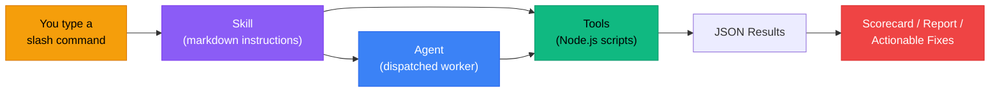
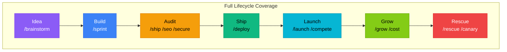
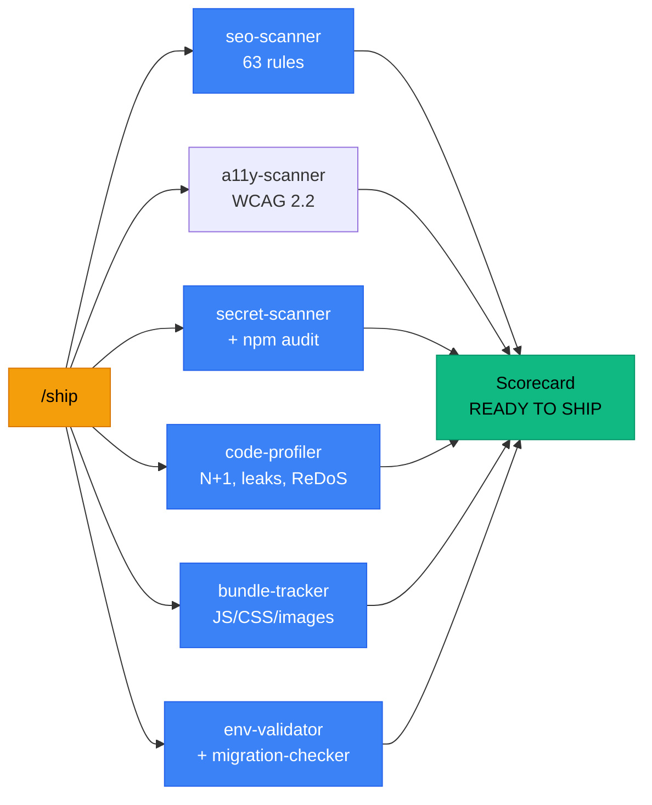
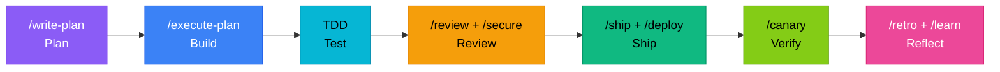
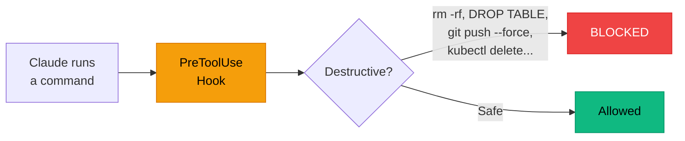
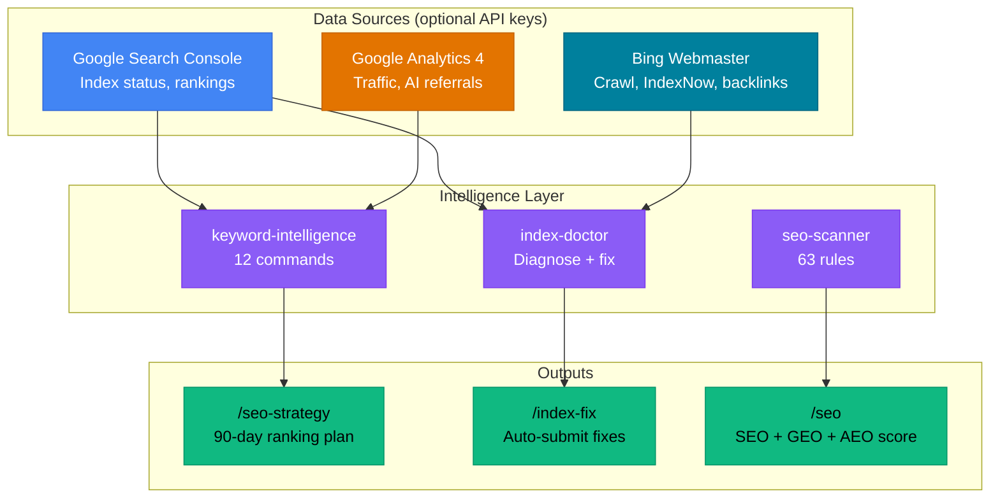
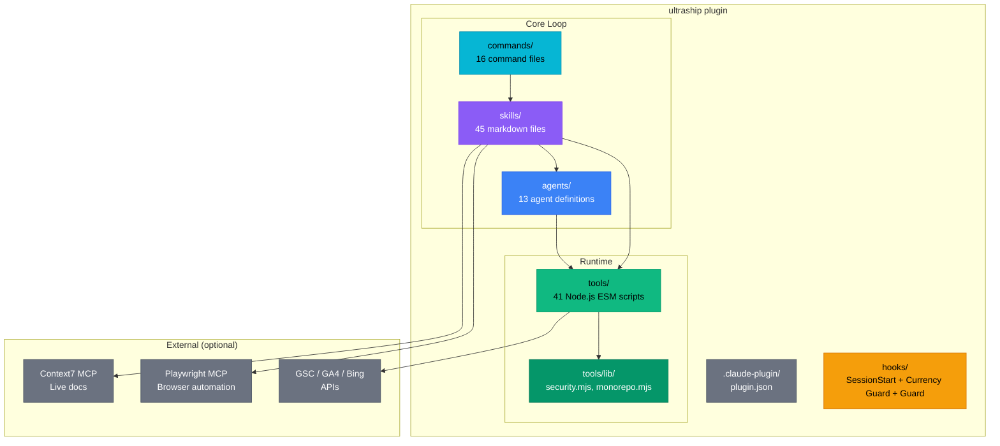

<!-- source: https://github.com/Houseofmvps/ultraship.git sha: ed232cba00040a3a8294aff08d14a0053cb8a0ae readme: main/README.md -->
# Houseofmvps/ultraship

"ULTRASHIP" Claude Code plugin — 39 skills, 33 tools, 11 agents for ship-ready workflows: planning, review, pentesting, safety guardrails, canary monitoring, SEO/AI-readiness check, penetration testing, code review, competitive analysis, incident response. 1 dependency. 180 tests. MIT.

---

<div align="center">


### Claude Code plugin. 43 expert-level skills for building, shipping, and scaling production software. 37 audit tools (accessibility, vibe-coding security, AI evals, pentest, code quality, bundle size, SEO + AI Readiness check) plus a blocking ship-gate close the loop before deploy. A built-in Currency Guard keeps Claude on current docs, not stale training data.

[](https://www.npmjs.com/package/ultraship)
[](https://www.npmjs.com/package/ultraship)
[](https://www.npmjs.com/package/ultraship)
[](https://github.com/Houseofmvps/ultraship/stargazers)
[](LICENSE)
[](https://github.com/Houseofmvps/ultraship/actions)
[](https://github.com/sponsors/Houseofmvps)

---

[](https://x.com/kaileskkhumar)
[](https://www.linkedin.com/in/kailesk-khumar-soundararajan)
[](https://houseofmvps.com)
[](https://www.kailxlabs.co)

**Built by [Kaileskkhumar](https://www.linkedin.com/in/kailesk-khumar-soundararajan), founder of [HouseofMVPs](https://houseofmvps.com) and [Kailxlabs](https://www.kailxlabs.co)**

</div>

---

```
0 dependencies · 274 tests · Node.js ESM · MIT
```

## Install

```bash
# Claude Code plugin
claude plugin marketplace add Houseofmvps/ultraship
claude plugin install ultraship

# Or standalone via npx
npx ultraship ship .
npx ultraship seo .
npx ultraship security .
```

## How It Works





## What `/ship` Does

`/ship` runs 6 tools in parallel and outputs a scorecard:



```
+===========================================+
|      U L T R A S H I P   S C O R E       |
+===========================================+
|  SEO + AI Vis.  92/100  ############-    |
|  Security        95/100  ############-    |
|  Code Quality    88/100  ###########--    |
|  Bundle Size     97/100  ############-    |
+===========================================+
|   OVERALL         90/100                  |
|   STATUS          READY TO SHIP           |
+===========================================+
```

<details>
<summary>Demo</summary>


</details>

## Tools (40)

Each tool is a standalone Node.js script (`node tools/<name>.mjs`). JSON output. Exit 0 always. No build step.

### Auditing

| Tool | What it checks |
|---|---|
| `seo-scanner` | 63 rules: 39 SEO (meta tags, canonicals, headings, OG tags, structured data, sitemap, cross-page duplicate/orphan detection), 20 GEO (AI bot access in robots.txt, snippet restrictions, llms.txt, structured data for AI extraction), 4 AEO (FAQPage/HowTo/speakable schema) |
| `a11y-scanner` | WCAG 2.2 A/AA static checks: missing alt text, unlabeled form controls, icon-only buttons, missing `lang`/`title`/`main`, heading order, positive tabindex, zoom disabled, duplicate ids, broken aria references. Zero false positives. |
| `ship-gate` | Blocking quality gate — scores all auditors (shared math with `/ship`), compares to `.ultraship/ship-gate.json` thresholds, hard-fails on leaked secrets / critical findings, **exits 1 on fail**. Generates a pre-push hook + GitHub Actions workflow. |
| `secret-scanner` | AWS keys, Stripe keys, JWT secrets, database URLs, private keys. Redacts values in output. |
| `vibe-security-scanner` | Vibe-Coding Security Sentinel — context secret-scanner misses: server-only secrets behind a `NEXT_PUBLIC_`/`VITE_` prefix, a decoded Supabase `service_role` key exposed to the client, service_role in a `"use client"` file, Supabase tables with no RLS. Zero false positives. |
| `eval-scanner` | Locates every LLM call site (Anthropic, OpenAI, Gemini, Mistral, Cohere, Ollama, Vercel AI SDK, LangChain) by provider + model id, detects the test runner and whether an eval suite exists. Flags AI features shipping with no evals. Seeds `/evals`. Zero false positives. |
| `code-profiler` | N+1 queries, sync I/O in handlers, unbounded queries, missing indexes, memory leaks, sequential awaits, ReDoS risk |
| `bundle-tracker` | JS/CSS/image sizes in build output. Detects heavy deps (`moment`→`dayjs`, `lodash`→native). History for before/after. Monorepo-aware. |
| `dep-doctor` | Unused dependencies via import graph analysis (not just grep). Dead wrapper files. Outdated packages. |
| `content-scorer` | Flesch-Kincaid readability, keyword density, thin content detection, GEO heading analysis |
| `lighthouse-runner` | Lighthouse via headless Chrome. Core Web Vitals, render-blocking resources, diagnostics. |

### Validation

| Tool | What it checks |
|---|---|
| `health-check` | HTTP status, response time, SSL certificate (issuer, expiry), 6 security headers |
| `env-validator` | Compares `.env.example` against actual `.env`. Catches missing/empty/placeholder vars. |
| `migration-checker` | Pending DB migrations for Drizzle, Prisma, Knex |
| `og-validator` | Open Graph tags, image reachability, size validation |
| `redirect-checker` | Redirect chains, loops, mixed HTTP/HTTPS. Sitemap-based bulk check. |
| `api-smoke-test` | Hit API endpoints, check status codes, response times, CORS headers |

### Generators

| Tool | What it creates |
|---|---|
| `sitemap-generator` | `sitemap.xml` from HTML files and routes |
| `robots-generator` | AI-friendly `robots.txt` (allows GPTBot, PerplexityBot, ClaudeBot) |
| `llms-txt-generator` | `llms.txt` for AI assistant discoverability |
| `structured-data-generator` | JSON-LD schema markup |

### Competitive & Launch

| Tool | What it does |
|---|---|
| `compete-analyzer` | Compares two URLs: tech stack, SEO score, security headers, response time. ASCII comparison card. |
| `launch-prep` | Reads project, generates PH/Twitter/LinkedIn/HN copy, 14-item checklist, press kit |
| `demo-prep` | Finds console.logs, TODOs, placeholder text, missing favicons. Scores demo readiness. |

### Operations

| Tool | What it does |
|---|---|
| `incident-commander` | Health check + git culprit analysis + error patterns + rollback commands + post-mortem template |
| `growth-tracker` | Uptime, git velocity, SEO trajectory, dep health. Stores snapshots for week-over-week comparison. |
| `cost-tracker` | Log AI token usage per feature/model. Built-in pricing for Claude, GPT-4o, Gemini. Daily trends. |
| `pentest-scanner` | Automated penetration testing: XSS, SQLi, SSTI, command injection, path traversal, CORS, JWT, GraphQL introspection, prototype pollution, race conditions, request smuggling. Zero false positives, every finding has proof-of-concept. |
| `canary-monitor` | Post-deploy canary monitoring: HTTP status, response time, error patterns, baseline regression detection. Auto-saves baselines for future comparison. |
| `retro-analyzer` | Sprint retrospective: git velocity, commit patterns (features vs fixes), test health, hot files, shipping cadence. Generates insights and recommendations. |
| `learnings-manager` | Project learnings CRUD: save, search, list, prune, export. Structured knowledge that compounds across sessions. |

### Project Analysis

| Tool | What it does |
|---|---|
| `onboard-generator` | Auto-generates developer guide: stack, directory tree, routes, schema, env vars, Mermaid diagram |
| `architecture-mapper` | 4 Mermaid diagrams: system overview, route tree, DB ER, data flow. Circular dependency + orphan detection. |
| `pattern-analyzer` | Analyzes testing, error handling, TypeScript usage, CI/CD, git practices. Cross-repo comparison. |
| `audit-history` | Saves/compares audit scores over time |

### Integrations (optional)

| Tool | What it does |
|---|---|
| `gsc-client` | Google Search Console: submit sitemaps, inspect URLs, query rankings (requires `ULTRASHIP_GSC_CREDENTIALS`) |
| `bing-webmaster` | Bing Webmaster: submit sitemaps/URLs, IndexNow instant push, keyword research, backlinks, site-scan, URL inspection (requires `ULTRASHIP_BING_KEY`). Powers ChatGPT Search + Microsoft Copilot. |
| `ga4-client` | Google Analytics 4: overview, top-pages, landing-pages, traffic-sources, conversions, user-journey, devices, realtime, **ai-traffic** (ChatGPT/Perplexity/Copilot tracking), **organic** (search-only). `--organic` flag. |
| `keyword-intelligence` | 12-command keyword engine: analyze, quick-wins, cannibalization, content-gaps, intent-map, trending, high-intent, page-keywords, content-decay, difficulty, **anomalies** (CTR anomalies), **cross-reference** (GSC↔GA4). `--brand` flag for non-brand filtering. |
| `index-doctor` | Index diagnosis: inspect URLs via GSC URL Inspection API, diagnose 15+ coverage states, auto-fix and submit to Bing. |

## Commands (16)

> **Every skill is also a slash command.** Claude Code merged commands into skills, so `/a11y`, `/sprint`, `/pentest`, `/compete`, `/canary`, `/launch`, `/rescue`, `/grow`, `/deploy`, `/learn`, `/guard`, `/retro`, `/investigate`, `/cost`, `/onboard`, `/architecture`, `/clone-patterns`, `/demo`, `/visual-diff`, `/release`, `/seo-strategy` and `/index-fix` all work too — they live in [Skills](#skills-41) above. The commands below are the remaining dedicated command files.

| Command | Description |
|---|---|
| `/ship` | Pre-deploy scorecard. Runs 6 auditors, scores 5 categories |
| `/seo` | SEO audit (63 rules) + AI visibility checks (bot access, snippet restrictions, schema) |
| `/secure` | Secret scanning + OWASP patterns + `npm audit` |
| `/perf` | Lighthouse + bundle size |
| `/review` | Code review with confidence-scored findings |
| `/health` | Production health check |
| `/codex` | Generate a compact codebase index (routes, schema, components, lib) to save AI tokens |
| `/content` | Readability + keyword density analysis |
| `/bundle` | Bundle size tracking |
| `/profile` | Static analysis for backend anti-patterns |
| `/deps` | Unused/outdated dependency detection |
| `/redirects` | Redirect chain/loop detection |
| `/revise-claude-md` | Update CLAUDE.md with session learnings |
| `/brainstorm` | Deprecated alias → use the `brainstorming` skill |
| `/write-plan` | Deprecated alias → use the `writing-plans` skill |
| `/execute-plan` | Deprecated alias → use the `executing-plans` skill |

## Skills (43)

Skills are markdown instruction files that shape Claude's behavior during your session. They activate based on context. When you're debugging, Claude uses the debugging skill. When you're building UI, it uses the frontend design skill.

**Workflow (19):** brainstorming, planning, TDD, implementation, code review, debugging, refactoring, frontend design, API design, data modeling, git workflow, deploy pipeline, release, CLAUDE.md management, verification, browser testing, **sprint pipeline**, **investigation**, **learnings management**

**Specialist (12):** SEO + AI visibility audit, **accessibility audit + auto-fix**, **deterministic ship-gate**, **AI eval harness**, security audit, **penetration testing**, performance audit, content quality, code profiling, parallel agent dispatching, **safety guardrails**, **staying current**

**Growth & Intelligence (12):** competitive analysis, launch prep, incident response, growth tracking, cost tracking, onboarding, architecture mapping, pattern analysis, demo readiness, visual regression, **canary monitoring**, **sprint retrospective**

## Agents (13)

Agents are dispatched by skills to run audits in parallel:

`code-reviewer` · `seo-auditor` · `seo-strategist` · `security-auditor` · `pentest-auditor` · `perf-auditor` · `a11y-auditor` · `browser-verifier` · `compete-analyzer` · `launch-auditor` · `incident-responder` · `growth-tracker` · `canary-monitor`

## MCP Servers (2)

| Server | Purpose |
|---|---|
| [Context7](https://github.com/upstash/context7) | Live library documentation. Fetches current docs for any framework/library. |
| [Playwright](https://github.com/anthropics/anthropic-quickstarts/tree/main/mcp-server-playwright) | Browser automation. Navigate, screenshot, fill forms, test deployed pages. |

Both lazy-start on first use. No background processes.

### Optional MCP integrations (detect-if-present)

Ultraship doesn't bundle these (they need your credentials and would slow every install), but several skills use them automatically *if you've connected them*:

| Connect | Sharpens |
|---|---|
| **Sentry** | `/rescue` pulls live production errors and maps stack traces to code instead of guessing the culprit. `/canary` confirms a post-deploy error spike before recommending rollback. |
| **Vercel** | `/deploy` reads real deployment status, build logs, and which commit is live (not just a single HTTP probe). |
| **Supabase** | `/deploy` verifies migration state against the actual database to catch dashboard-vs-repo drift. |

Add them with `claude mcp add` (or the `/plugin` browser). When connected, the skills detect the tools and use them; when not, they fall back to the built-in static checks.

## Sprint Workflow

Ultraship skills chain into a structured sprint pipeline. Each phase produces artifacts that feed the next.



| Phase | Skill | Output |
|---|---|---|
| Plan | `/write-plan` | Implementation plan with file map and test strategy |
| Build | `/execute-plan` | Working code on a feature branch |
| Test | TDD skill | Passing test suite |
| Review | `/review` + `/secure` | Review report, security scan |
| Ship | `/ship` + `/deploy` | Scorecard + production deploy |
| Verify | `/canary` | Post-deploy health verification |
| Reflect | `/retro` + `/learn` | Retrospective + saved learnings |

Run `/sprint` to follow the full pipeline, or run individual phases as needed.

## Safety Guardrails

`/guard` activates PreToolUse hooks that block destructive commands before they execute:



- `rm -rf`, `DROP TABLE`, `TRUNCATE` (data destruction)
- `git push --force`, `git reset --hard` (git history destruction)
- `git clean -f`, `git checkout .` (working directory destruction)
- `kubectl delete`, `docker system prune` (infrastructure destruction)

Optional directory freeze restricts all file edits to a specific path. Explicitly confirmed actions always proceed.

## Persistent Memory

Ultraship enforces a **memory-first rule** at session start. The SessionStart hook detects if you have a `MEMORY.md` file and instructs Claude to read it before performing any task. Context persists across sessions. No more repeating yourself about project state, deploy status, or decisions already made.

- If `MEMORY.md` is found: Claude reads memory files before doing anything
- If not found: Claude suggests setting up auto-memory for persistent context

No configuration needed. Just install the plugin.

## SEO + AI Visibility



The SEO scanner checks 63 rules across three layers:

- **SEO (39 rules)**: meta tags, canonicals, heading hierarchy, alt text, OG tags, sitemap, robots.txt, structured data, analytics detection, cross-page duplicate titles/descriptions, orphan page detection, canonical conflicts, thin content, internal linking
- **GEO (20 rules)**: AI search visibility signals. Does `robots.txt` block GPTBot/PerplexityBot/ClaudeBot? Do `nosnippet`/`max-snippet` directives restrict AI citation eligibility? Is there `llms.txt` for AI discovery? Does structured data exist for AI extraction? These are verifiable technical signals, not ranking factor guesses.
- **AEO (4 rules)**: answer engine schema checks. FAQPage, HowTo, speakable, Article/BlogPosting. These are the structured data types that enable featured snippets and voice results. We check presence, not SERP performance.

Beyond the scanner, Ultraship connects to real APIs: GSC URL Inspection (actual index status), GA4 (actual AI referral traffic from ChatGPT/Perplexity/Copilot), Bing Webmaster (crawl status, IndexNow). Data-driven analysis, not estimates.

## Dogfooding

`/ship` results on [SaveMRR](https://savemrr.co) (Hono + React + Drizzle pnpm monorepo, 5 packages, 41 routes):

| | Backend + Dashboard | Landing (29 pages) |
|---|---|---|
| SEO + AI Visibility | 63 | 52 |
| Security | 100 | 100 |
| Code Quality | 70 | 67 |
| Bundle Size | 100 | 92 |
| **Overall** | **83** | **78** |

227 findings: 1 N+1 query, 33 unused deps (dead shadcn/ui wrappers via import graph), 153 SEO issues, 1 memory leak, 1 heavy dep.

## Security

All tools use `execFileSync` with array args (no shell interpolation). HTTP tools import `tools/lib/security.mjs` for SSRF protection (blocks private IPs, cloud metadata, non-HTTP schemes). 10MB file read cap. 5MB response cap. Secret values redacted in output. Zero telemetry.

See [SECURITY.md](SECURITY.md).

## Architecture



- Node.js ESM (`type: module`)
- 1 dependency: `htmlparser2` (SAX HTML parser, ~30KB)
- Tools output JSON to stdout, exit 0 on success and failure (errors in JSON)
- Skills reference tools via `${CLAUDE_PLUGIN_ROOT}/tools/<name>.mjs`
- No build step. No native bindings. No `node-gyp`.

## Contributing

```bash
git clone https://github.com/Houseofmvps/ultraship.git
cd ultraship
npm test              # 180 tests, node:test
node tools/<tool>.mjs # Run any tool directly
```

[Open an issue](https://github.com/Houseofmvps/ultraship/issues) or submit a PR.

## License

MIT

---

Built by [Kailesk Khumar](https://www.linkedin.com/in/kailesk-khumar), founder of [HouseofMVPs](https://houseofmvps.com) · [Book a 30-min strategy call](https://cal.com/houseofmvps/30-min-strategy-call-with-our-founder)
