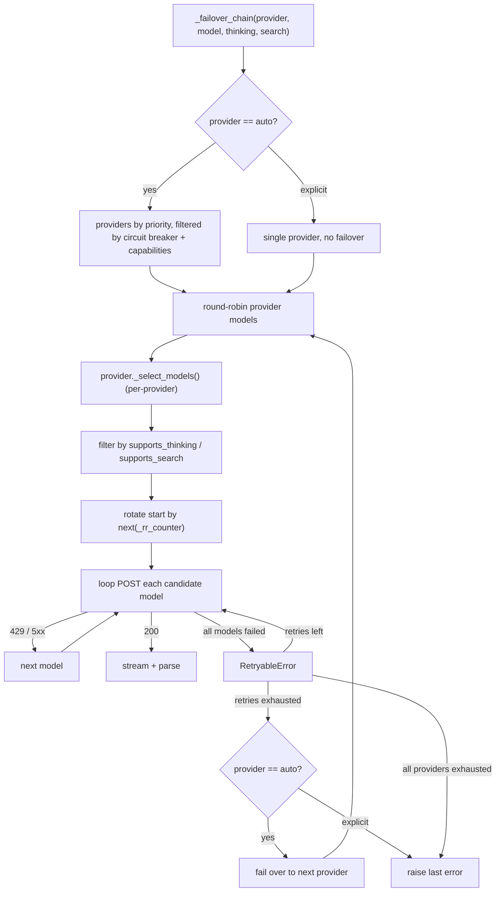

<!-- source: https://github.com/iqbalmh18/abigail.git sha: 048d61f380b4dbd04e73ffc49e90bf848e1d4d12 readme: main/README.md -->
# iqbalmh18/abigail

Zero-API-key CLI & async Python library for AI chat, image & video generation. 7 providers, 25+ models, streaming, auto-failover, and proxy support.

---

# AI Bridge Interface & Gateway Abstraction Layer

**Abigail** is a powerful Command-Line Interface (CLI) tool and Python library for accessing free web AI services (chat models, image & video generation) directly from your terminal or Python code-with zero API keys required.

<p align="center">
  
</p>

**Language:** [English](README.md) · [Bahasa Indonesia](README-id.md)

> [!CAUTION]
> **Disclaimer:** This package accesses third-party public web AI interfaces. Please use it responsibly and in accordance with each service's Terms of Service.

---

[](https://asciinema.org/a/1261215)

## Quick Start
### Installation

Requires Python ≥ 3.12.

**Install as CLI tool:**
```bash
pip install abigail
# or with uv:
uv tool install abigail
```
**Install as dependency in your Python project:**

```bash
pip install abigail
# or with uv:
uv add abigail
```

**Install from source (for development):**

```bash
git clone https://github.com/iqbalmh18/abigail.git
cd abigail
uv sync
source .venv/bin/activate
```

### Dependencies

All dependencies are installed automatically with `pip install abigail` or `uv add abigail`.

| Package | Version | Purpose |
|---------|---------|---------|
| `pydantic` | ≥ 2.13.4 | Request/response models and config validation. |
| `typer` | ≥ 0.14.0 | CLI framework. |
| `curl-cffi` | ≥ 0.15.0 | HTTP client with TLS fingerprint spoofing. |
| `tomli-w` | ≥ 1.2.0 | Writing TOML config files. |
| `quickjs` | ≥ 1.19.4 | Embedded JavaScript runtime for challenge solving. |
| `nodriver` | ≥ 0.50.3 | Headless browser automation (required for `ImageClient`). |
| `term-image` | ≥ 0.7.2 | Rendering images inline in the terminal. |
| `rich` | ≥ 15.0.0 | Terminal formatting and output rendering. |
| `pillow` | ≥ 10.4.0 | Image processing. |

> [!NOTE]
> **`nodriver`** is required for `ImageClient` (image generation) and `VideoClient` (video generation). It drives a real Chromium browser in the background to solve browser challenges. On headless servers, make sure Chromium and its dependencies are available, or set `headless=false` / `abigail config set headless false` if you need a visible browser window for debugging.

---

## CLI Usage

Abigail features a rich command-line tool (`abigail`) so you can stream AI responses, generate images, or pipe terminal data directly into LLMs without writing code.

### Quick Commands Overview

```bash
# 1. Ask a question & stream response to stdout
abigail chat "Explain quantum computing in simple terms"

# 2. Generate an image
abigail imagen "a cute sleeping cat on a cozy rug"

# 3. Generate a video
abigail vidgen "a cat wearing a suit dancing in Times Square"

# 4. Enter interactive terminal chat mode
abigail shell
```

### All Available CLI Commands

| Command | Description |
|---------|-------------|
| `abigail chat PROMPT` | Send a prompt to an AI model and stream the response to terminal. |
| `abigail imagen PROMPT` | Generate images using AI providers (e.g., Perchance). |
| `abigail vidgen PROMPT` | Generate videos using AI providers (e.g., Upsampler), with optional image-to-video. |
| `abigail shell` | Start an interactive chat session (`/help`, `/exit`). |
| `abigail providers` | List all registered AI providers and their capabilities. |
| `abigail models` | List all supported AI models and aliases. |
| `abigail inspect <provider>` | Display provider metadata (capabilities, models, aliases). |
| `abigail benchmark [PROMPT]` | Benchmark providers & models with success rate and latency stats. |
| `abigail config get\|set\|unset\|reset` | View or manage local CLI config (`~/.config/abigail/config.toml`). |

---

## Supported Providers & Models

Capabilities are listed **per model** (`✓` = supported, `-` = not supported).

| Provider    | Alias                           | Capability | Thinking | Search | Priority |
| ----------- | ------------------------------- | ---------- | :------: | :----: | -------: |
| deepai      | deepai/default                  | Chat       |     -    |    -   |      100 |
| deepai      | deepai/deepseek-v3.2            | Chat       |     -    |    -   |      100 |
| deepai      | deepai/llama-4-scout            | Chat       |     -    |    -   |      100 |
| deepai      | deepai/gpt-oss-120b             | Chat       |     ✓    |    -   |      100 |
| deepai      | deepai/gemini-2.5-flash-lite    | Chat       |     -    |    -   |      100 |
| deepai      | deepai/gemma-4                  | Chat       |     -    |    -   |      100 |
| deepai      | deepai/gpt-4.1-nano             | Chat       |     -    |    -   |      100 |
| deepai      | deepai/gpt-5-nano               | Chat       |     -    |    -   |      100 |
| deepai      | deepai/llama-3.3-70b-instruct   | Chat       |     -    |    -   |      100 |
| deepai      | deepai/llama-3.1-8b-instant     | Chat       |     -    |    -   |      100 |
| heckai      | heckai/gpt-5.4-mini             | Chat       |     -    |    -   |      100 |
| heckai      | heckai/gemini-3.1-flash-preview | Chat       |     -    |    -   |      100 |
| heckai      | heckai/gemini-3-flash-lite      | Chat       |     -    |    -   |      100 |
| heckai      | heckai/deepseek-v4-flash        | Chat       |     ✓    |    ✓   |      100 |
| heckai      | heckai/deepseek-v4-pro          | Chat       |     ✓    |    ✓   |      100 |
| heckai      | heckai/hy3-preview              | Chat       |     ✓    |    ✓   |      100 |
| heckai      | heckai/qwen3.7-plus             | Chat       |     ✓    |    ✓   |      100 |
| heckai      | heckai/step-3.7-flash           | Chat       |     ✓    |    ✓   |      100 |
| notrack     | notrack/default                 | Chat       |     ✓    |    -   |      100 |
| notrack     | notrack/minimax                 | Chat       |     ✓    |    -   |      100 |
| notrack     | notrack/chatgpt                 | Chat       |     ✓    |    -   |      100 |
| perchance   | perchance/text-to-image         | Chat       |     -    |    -   |      100 |
| quillbot    | quillbot/default                | Chat       |     -    |    -   |      100 |
| unlimitedai | unlimitedai/default             | Image      |     -    |    -   |      100 |
| upsampler   | upsampler/ltx-video             | Video      |     -    |    -   |      100 |

---

### CLI Examples & Tips

#### `chat` Examples

```bash
# Stream response using a specific provider & model
abigail chat "Explain quantum computing" -p heckai -m heckai/gpt-5.4-mini

# Use the notrack provider to upload & analyze files or PDFs
abigail chat "Describe this image" -p notrack -f /path/to/image.jpg
abigail chat "Summarize this PDF" -p notrack -f sample.pdf

# Non-streaming JSON output
abigail chat "Hello" --no-stream --json

# Enable thinking/reasoning and live web search
abigail chat "Latest AI news" --thinking --search --timeout 60 --proxy socks5://host:port
```
> [!NOTE]
> **Auto file routing:** When passing `-f/--files` with `provider="auto"`, Abigail automatically picks a provider that supports file attachments (like `notrack`).

> [!TIP]
> **Rate limited?** If `chat`, `imagen`, or `vidgen` hits a rate limit (`429`), route the request through a proxy with the `--proxy` argument, e.g. `abigail chat "Hi" --proxy socks5://host:port` or `abigail imagen "a cat" --proxy http://127.0.0.1:8080`. You can also set a default proxy or a rotating proxy pool via `abigail config set proxy proxies.txt`.

#### Unix Pipelines (stdin)

`abigail chat`, `abigail imagen`, and `abigail vidgen` natively accept piped data from standard input (stdin):

```bash
# Pipe code into Abigail for review
cat main.py | abigail chat "Review this file in depth"

# Pipe git diff to write a commit message
git diff | abigail chat "Write a concise commit message for this diff"

# Chain LLM prompt output into image generation
abigail chat "Write a detailed prompt for a fantasy castle" | abigail imagen -r 1024x1024

# Stdin only (no prompt argument needed)
echo "Explain what a monad is" | abigail chat
```

#### `imagen` Examples

```bash
# Generate image with default resolution (512x768)
abigail imagen "a cute sleeping cat"

# Custom resolution, guidance scale, and output path
abigail imagen "a futuristic cyberpunk city" -r 1024x1024 -g 9.0 -o city.jpeg

# Pipe prompt via stdin
echo "a majestic dragon flying over mountains" | abigail imagen -r 768x768

# Disable headless mode (shows browser window, useful for debugging)
abigail imagen "a cute cat" --no-headless
```

#### `vidgen` Examples

```bash
# Generate a video with default settings (768x512, 3 seconds)
abigail vidgen "a cat wearing a suit dancing in Times Square"

# Custom duration, resolution preset, and output path
abigail vidgen "a futuristic cyberpunk city" -d 5 -r 16:9 -o city.mp4

# Image-to-video: animate an existing image
abigail vidgen "a still life comes alive" -i input.jpg

# Fixed seed with prompt enhancement
abigail vidgen "a majestic dragon" -s 42 --no-randomize --enhance

# Pipe prompt via stdin
echo "waves crashing on a beach at sunset" | abigail vidgen -r portrait
```

> [!TIP]
> `-r/--resolution` accepts `WIDTHxHEIGHT` (e.g. `768x512`) or presets: `landscape`, `portrait`, `square`, `landscape-hd`, `portrait-hd`, `square-hd`, and ratios `16:9`, `9:16`, `1:1`, `3:2`, `2:3`.

#### Configuration (`abigail config`)

CLI preferences are saved in `~/.config/abigail/config.toml` and applied automatically:

```bash
# Set default provider & model
abigail config set provider notrack
abigail config set model notrack/ChatGPT

# General options
abigail config set timeout 120.0
abigail config set stream true
abigail config set verbose true

# Headless mode for browser-based providers (default: true)
abigail config set headless false

# View or reset all config
abigail config get
abigail config reset
```

All available config keys:

| Key | Default | Description |
|-----|---------|-------------|
| `provider` | _(not set)_ | Default provider (`auto` if unset). |
| `model` | _(not set)_ | Default model (`auto` if unset). |
| `proxy` | _(not set)_ | Proxy URL or `@path/to/proxies.txt`. |
| `timeout` | _(not set)_ | Request timeout in seconds (no limit if unset). |
| `stream` | `true` | Stream responses by default. |
| `thinking` | `false` | Enable chain-of-thought reasoning by default. |
| `search` | `false` | Enable web search by default. |
| `verbose` | `false` | Show metadata and debug info by default. |
| `failover` | _(not set)_ | `true` / `false` / `"provider1,provider2"` — see below. |
| `headless` | `true` | Run browser-based providers in headless mode. |
| `resolution` | `512x768` | Default image resolution for `imagen`. |
| `guidance_scale` | `7.0` | Default guidance scale for `imagen`. |
| `seed` | `-1` | Default seed for `imagen` (-1 = random). |
| `negative_prompt` | _(empty)_ | Default negative prompt for `imagen`. |

To reset a single key back to its default:

```bash
abigail config unset provider
abigail config unset headless
abigail config unset negative_prompt
```

#### Proxy & Failover Settings

```bash
# Set a single proxy or proxy pool file
abigail config set proxy "http://127.0.0.1:8080"
abigail config set proxy proxies.txt

# Failover: restrict & order the failover chain
abigail config set failover "quillbot,heckai"   # explicit order
abigail config set failover true                 # auto failover to all
abigail config set failover false                # never fail over

# Override per command
abigail chat "Hi" --no-failover
abigail chat "Hi" --failover-order quillbot,heckai
```

When a specific `--provider` is set, Abigail automatically boosts that provider's score and penalises others so it stays at the top of the failover chain.

---

## Python Library Usage

Abigail is also a fully typed, asynchronous Python library (`asyncio`).

### 1. Stream Chat (Recommended)

```python
import asyncio
from abigail import ChatClient

async def main():
    async with ChatClient() as client:
        async for chunk in client.stream_chat("Explain machine learning"):
            if chunk.event == "content":
                print(chunk.text, end="", flush=True)

asyncio.run(main())
```

### 2. Non-Streaming Chat

```python
import asyncio
from abigail import ChatClient

async def main():
    async with ChatClient() as client:
        response = await client.chat("What is Python?")
        print(response.text)
        print("thinking:", response.thinking)

asyncio.run(main())
```

### 3. Image Generation (`ImageClient`)

```python
import asyncio
from abigail import ImageClient

async def main():
    async with ImageClient() as client:
        res = await client.generate_image(
            prompt="a cute sleeping cat",
            resolution="512x768",
            guidance_scale=7.0,
        )
        img = res.images[0]
        with open("cat.jpeg", "wb") as f:
            f.write(img.image_bytes)
        print(f"Saved image from provider: {res.provider}, seed: {img.seed}")

asyncio.run(main())
```

### 4. Video Generation (`VideoClient`)

```python
import asyncio
from abigail import VideoClient

async def main():
    async with VideoClient() as client:
        res = await client.generate_video(
            prompt="a cat wearing a suit dancing in Times Square",
            duration=3.0,
            width=768,
            height=512,
        )
        vid = res.videos[0]
        with open(f"cat.{vid.file_extension}", "wb") as f:
            f.write(vid.video_bytes)
        print(f"Saved video from provider: {res.provider}, seed: {vid.seed}")

asyncio.run(main())
```

Image-to-video is supported via the `image` parameter:

```python
await client.generate_video("a still life comes alive", image="/path/to/input.jpg")
```

### 5. Advanced Capabilities: Thinking & Web Search

```python
# Enable CoT (Chain of Thought) reasoning
await client.chat("Solve: if 2x + 3 = 11, what is x?", thinking=True)

# Enable web search / live internet access
await client.chat("Latest tech news?", search=True)
```

Parsing SSE event stream with thinking & search:

```python
from abigail import ChatEventType

async for chunk in client.stream_chat("Latest AI news", thinking=True, search=True):
    match chunk.event:
        case ChatEventType.thinking:
            print(chunk.thinking, end="")
        case ChatEventType.content:
            print(chunk.text, end="")
        case ChatEventType.sources:
            for s in chunk.search:
                print(s.title, s.url)
```

### 6. Specific Provider / Model Selection

```python
await client.chat("Hello!", provider="quillbot")
await client.chat("Explain quantum computing", provider="heckai", model="heckai/openai/gpt-5.4-mini")
```

### 7. File Attachments

```python
# Pass local file paths directly
await client.chat("Describe this image", files=["/path/to/image.jpg"])

# Or use the Attachment model for raw bytes
from abigail.types.requests import Attachment

my_file = Attachment(name="data.csv", data=b"a,b,c\n1,2,3")
await client.chat("Analyze this data", files=[my_file])
```

### 8. Built-in Resilience & Failover

`ChatClient` automatically retries transient errors (`429`, `5xx`, connection resets) and fails over across providers when `provider="auto"` is used. Circuit breaker temporary skips unhealthy providers automatically.

---

## Architecture & Internals (For Contributors)

This section explains internal mechanics for developers interested in contributing or adding new providers.

### Request Flow & Failover Logic



### Adding a New Provider

To add a provider, create a package under `abigail/providers/<name>/` (`metadata.py`, `session.py`, `parser.py`, `provider.py`) and register it using `@register_provider`. Both `ChatClient` and the CLI will auto-discover it without requiring edits to CLI core files.

### Running Tests

```bash
uv run pytest tests/ -v
uv run pytest tests/ --cov=abigail --cov-report=term-missing
```

---

## License

MIT License.