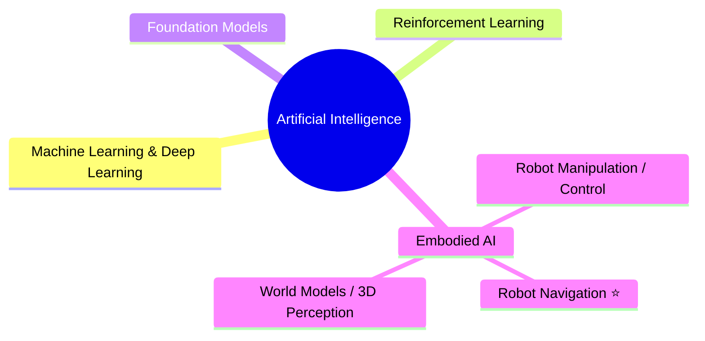
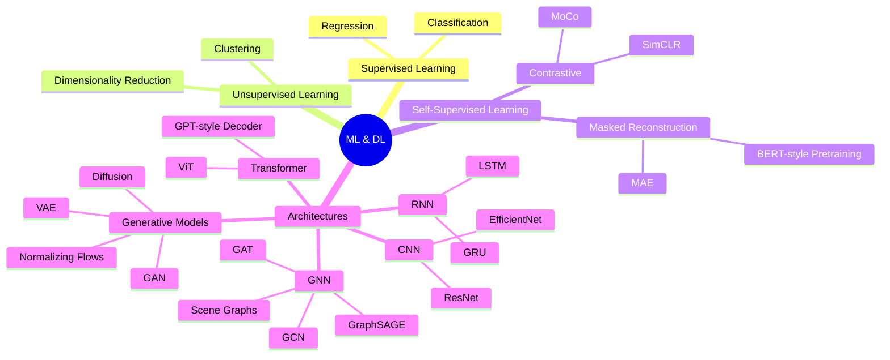
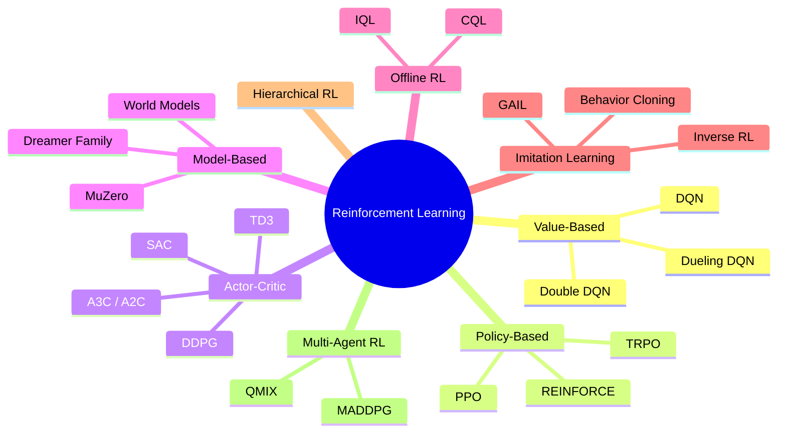
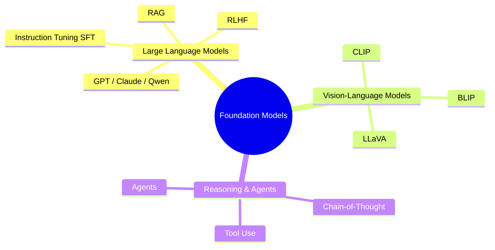
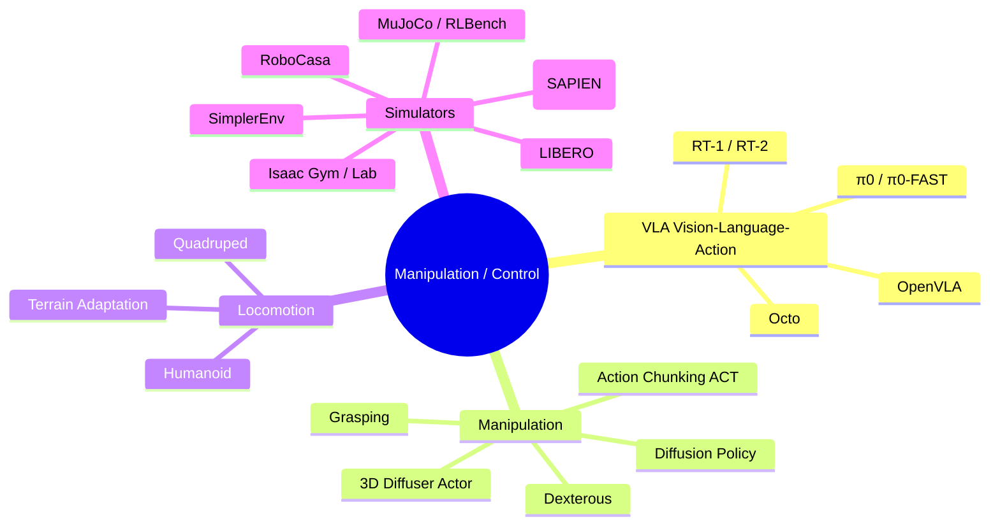
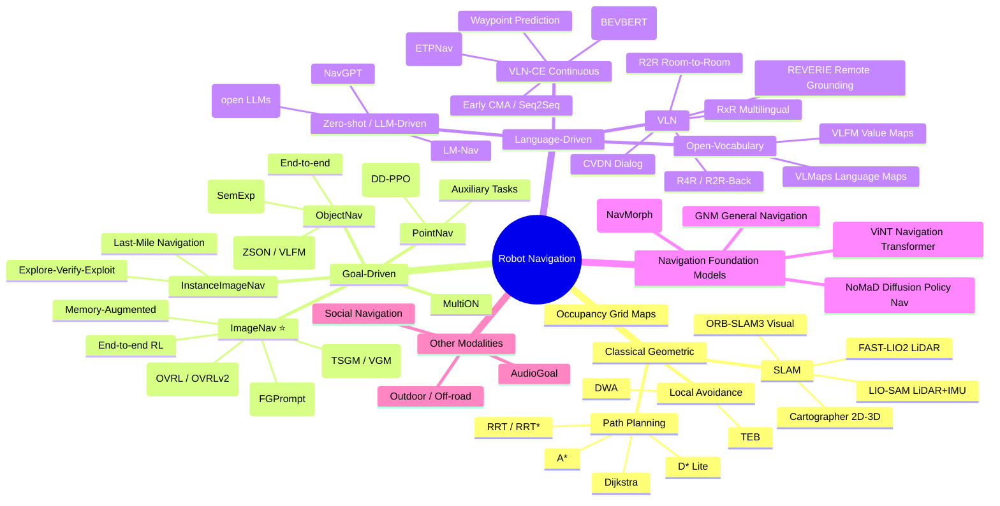
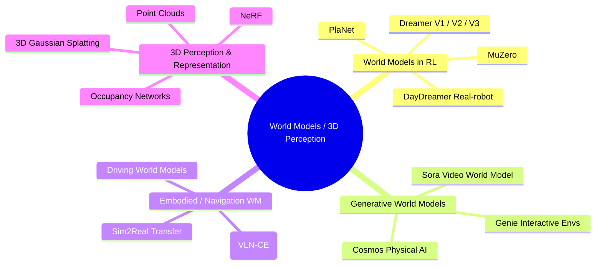

<!-- source: https://github.com/GaryLee1210/GaryLee1210.git sha: 6161ac2da1117908df426a3ea4f8f9375958c12b readme: main/README.md -->
# GaryLee1210/GaryLee1210

AI / Embodied AI / Robot Navigation knowledge map, with a curated Image-Goal Navigation paper list (EN / 中文)

---

**English** | [简体中文](README.zh-CN.md)

# 👋 Hi, I'm GaryLee1210

> 🎓 MSc student in Robotics Science and Engineering, Northeastern University (China) | 🧭 **Image-Goal Navigation / End-to-End Robot Navigation**
> Submitted to RA-L. Currently working on Image-Goal Navigation; next interests: Vision-and-Language Navigation (VLN), world-model-based navigation, and sim-to-real transfer for embodied navigation.

This repository is my personal knowledge map of **AI → Embodied AI → Robot Navigation**.
Mindmaps show the structure; tables list representative algorithms with official code. Continuously updated.

---

## 🚁 Featured Project

| Project | Description |
|---|---|
| [**UAV-Navigation-System**](https://github.com/GaryLee1210/UAV-Navigation-System) | A custom 250mm autonomous quadrotor: Livox Mid-360 + **FAST-LIO2 / DLIO** LiDAR-inertial localization + **EGO-Planner** waypoint navigation, verified on a real platform (Jetson Orin NX + PX4). Roadmap: autonomous exploration → DRL-based end-to-end navigation. |

---

## 🗺️ Big Picture

⭐ = my current research focus.

---

## 📊 1. Machine Learning & Deep Learning

**Representative algorithms / libraries**

| Name | Category | Code | One-liner |
|---|---|---|---|
| PyTorch | Framework | [pytorch/pytorch](https://github.com/pytorch/pytorch) | The mainstream deep learning framework |
| timm | Vision backbones | [huggingface/pytorch-image-models](https://github.com/huggingface/pytorch-image-models) | Open implementations of nearly every vision backbone |
| MAE | Self-supervised | [facebookresearch/mae](https://github.com/facebookresearch/mae) | Masked autoencoder, landmark of visual SSL |
| CLIP | Multimodal | [openai/CLIP](https://github.com/openai/CLIP) | Image-text contrastive learning, ubiquitous in Embodied AI |
| DINOv2 | Self-supervised | [facebookresearch/dinov2](https://github.com/facebookresearch/dinov2) | Strong SSL visual representations, adopted by many VLA / navigation works |

---

## 🎮 2. Reinforcement Learning

**Representative algorithms / libraries**

| Name | Category | Code | One-liner |
|---|---|---|---|
| Stable-Baselines3 | RL library | [DLR-RM/stable-baselines3](https://github.com/DLR-RM/stable-baselines3) | Reliable PyTorch RL algorithms (PPO / SAC / DQN, ...) |
| RL Baselines3 Zoo | Training scripts | [DLR-RM/rl-baselines3-zoo](https://github.com/DLR-RM/rl-baselines3-zoo) | Training / tuning / evaluation framework for SB3 |
| CleanRL | Single-file RL | [vwxyzjn/cleanrl](https://github.com/vwxyzjn/cleanrl) | One file per algorithm, great for reading and hacking |
| DreamerV3 | World-model RL | [danijar/dreamerv3](https://github.com/danijar/dreamerv3) | Nature 2025, SOTA across 150+ environments with one set of hyperparameters |
| DD-PPO | Distributed PPO | in [habitat-lab](https://github.com/facebookresearch/habitat-lab) | Large-scale distributed PPO that nearly "solved" PointNav |

---

## 🧠 3. Foundation Models

**Representative algorithms / libraries**

| Name | Category | Code | One-liner |
|---|---|---|---|
| CLIP | VLM | [openai/CLIP](https://github.com/openai/CLIP) | Image-text contrastive learning that started the multimodal pretraining era |
| LLaVA | Multimodal LLM | [haotian-liu/LLaVA](https://github.com/haotian-liu/LLaVA) | Visual instruction tuning, the mainstream open-source VLM recipe |
| BLIP-2 | Multimodal LLM | [salesforce/LAVIS](https://github.com/salesforce/LAVIS) | Q-Former bridging vision and language |
| LLaMA-Factory | Fine-tuning | [hiyouga/LLaMA-Factory](https://github.com/hiyouga/LLaMA-Factory) | One-stop fine-tuning framework for mainstream LLMs |

---

## 🦾 4. Robot Manipulation & Control (incl. VLA)

**Representative algorithms / libraries**

| Name | Category | Code | One-liner |
|---|---|---|---|
| OpenVLA | VLA | [openvla/openvla](https://github.com/openvla/openvla) | 7B open-source VLA pretrained on Open X-Embodiment |
| openpi (π0) | VLA | [Physical-Intelligence/openpi](https://github.com/Physical-Intelligence/openpi) | Official π0 / π0-FAST / π0.5 from Physical Intelligence |
| open-pi-zero | VLA reproduction | [allenzren/open-pi-zero](https://github.com/allenzren/open-pi-zero) | Community reproduction of π0, great for studying the architecture |
| Diffusion Policy | Manipulation policy | [real-stanford/diffusion_policy](https://github.com/real-stanford/diffusion_policy) | RSS 2023, foundational work on diffusion for visuomotor control |
| ACT (ALOHA) | Manipulation policy | [tonyzhaozh/aloha](https://github.com/tonyzhaozh/aloha) | Action chunking + Transformer, low-cost bimanual teleop + imitation |
| 3D Diffuser Actor | Manipulation policy | [nickgkan/3d_diffuser_actor](https://github.com/nickgkan/3d_diffuser_actor) | Extends Diffusion Policy to 3D representations |
| LIBERO | Benchmark | [Lifelong-Robot-Learning/LIBERO](https://github.com/Lifelong-Robot-Learning/LIBERO) | VLA / lifelong-learning manipulation benchmark (standard for OpenVLA etc.) |
| SimplerEnv | Evaluation | [simpler-env/SimplerEnv](https://github.com/simpler-env/SimplerEnv) | Evaluating real-robot VLA policies in simulation (RT-1 / Octo / π0, ...) |
| RoboCasa | Simulator | [robocasa/robocasa](https://github.com/robocasa/robocasa) | Large-scale household kitchen manipulation with generative scenes/tasks |
| ManiSkill | Simulator | [haosulab/ManiSkill](https://github.com/haosulab/ManiSkill) | GPU-parallel manipulation simulation and benchmark on SAPIEN |
| RLBench | Benchmark | [stepjam/RLBench](https://github.com/stepjam/RLBench) | 100+ manipulation tasks, home turf of PerAct / 3D Diffuser Actor |
| Isaac Lab | Simulator | [isaac-sim/IsaacLab](https://github.com/isaac-sim/IsaacLab) | NVIDIA's high-fidelity robot learning platform |

---

## 🧭 5. Robot Navigation ⭐

> My current research focus — expanded in the most detail,
> organized along five threads: classical / end-to-end / modular / language-driven / foundation models.

### 5.1 Classical Geometric Navigation

| Name | Type | Code | One-liner |
|---|---|---|---|
| ORB-SLAM3 | Visual SLAM | [UZ-SLAMLab/ORB_SLAM3](https://github.com/UZ-SLAMLab/ORB_SLAM3) | Mono/stereo/RGB-D + IMU, the de-facto standard of visual SLAM |
| Cartographer | 2D/3D SLAM | [cartographer-project/cartographer](https://github.com/cartographer-project/cartographer) | Google's classic LiDAR SLAM |
| FAST-LIO2 | LiDAR SLAM | [hku-mars/FAST_LIO](https://github.com/hku-mars/FAST_LIO) | HKU MaRS Lab, 3D LiDAR-inertial odometry |
| LIO-SAM | LiDAR SLAM | [TixiaoShan/LIO-SAM](https://github.com/TixiaoShan/LIO-SAM) | MIT, tightly-coupled LiDAR + IMU |

### 5.2 Goal-Driven Navigation (Habitat task family)

| Name | Task | Code | One-liner |
|---|---|---|---|
| Habitat-Challenge | Benchmark | [facebookresearch/habitat-challenge](https://github.com/facebookresearch/habitat-challenge) | Official ObjectNav / ImageNav benchmark and starter code |
| DD-PPO | PointNav | [habitat-lab](https://github.com/facebookresearch/habitat-lab) | 2.5B frames of training, nearly "solved" PointNav |
| SemExp | ObjectNav | [devendrachaplot/Object-Goal-Navigation](https://github.com/devendrachaplot/Object-Goal-Navigation) | Modular semantic mapping + goal policy, CVPR 2020 Challenge winner |
| ZSON | Zero-shot ObjectNav | [gunagg/zson](https://github.com/gunagg/zson) | CLIP multimodal goal embeddings for zero-shot ObjectNav (NeurIPS 22) |
| VLFM | Zero-shot ObjectNav | [bdaiinstitute/vlfm](https://github.com/bdaiinstitute/vlfm) | Vision-language frontier maps, deployable on Spot (ICRA 24) |
| FGPrompt ⭐ | ImageNav | [XinyuSun/FGPrompt](https://github.com/XinyuSun/FGPrompt) | Fine-grained goal prompting + early/mid fusion, NeurIPS 2023 SOTA |

> ⭐ FGPrompt is a key reference work in my research direction.

### 5.3 Vision-and-Language Navigation (VLN)

| Name | Task | Code | One-liner |
|---|---|---|---|
| VLN-CE | Continuous VLN | [jacobkrantz/VLN-CE](https://github.com/jacobkrantz/VLN-CE) | Lifts R2R to continuous action space, foundational for VLN-CE (ECCV 20) |
| Recurrent VLN-BERT | R2R | [YicongHong/Recurrent-VLN-BERT](https://github.com/YicongHong/Recurrent-VLN-BERT) | Time-aware recurrent BERT, strong VLN baseline |
| VLN-HAMT | R2R / RxR / REVERIE | [cshizhe/VLN-HAMT](https://github.com/cshizhe/VLN-HAMT) | History-aware multimodal Transformer (NeurIPS 21) |
| Discrete-Continuous VLN | R2R-CE | [YicongHong/Discrete-Continuous-VLN](https://github.com/YicongHong/Discrete-Continuous-VLN) | Candidate waypoint predictor bridging discrete/continuous VLN (CVPR 22) |
| VLN-VER | VLN | [DefaultRui/VLN-VER](https://github.com/DefaultRui/VLN-VER) | Volumetric environment representation for VLN (CVPR 24) |
| Open-Nav | Zero-shot VLN-CE | [YanyuanQiao/Open-Nav](https://github.com/YanyuanQiao/Open-Nav) | Zero-shot continuous VLN with open-source LLMs (ICRA 25) |

### 5.4 Navigation Foundation Models

| Name | Type | Code | One-liner |
|---|---|---|---|
| GNM / ViNT / NoMaD | Visual navigation foundation models | [robodhruv/visualnav-transformer](https://github.com/robodhruv/visualnav-transformer) | Berkeley's general navigation model family, zero-shot cross-embodiment |

### 5.5 Awesome Lists

| Name | Content | Link |
|---|---|---|
| Awesome Embodied Navigation | Surveys & papers on embodied navigation | [Franky-X/Awesome-Embodied-Navigation](https://github.com/Franky-X/Awesome-Embodied-Navigation) |
| Awesome Embodied Vision | Embodied vision papers | [ChanganVR/awesome-embodied-vision](https://github.com/ChanganVR/awesome-embodied-vision) |
| Awesome ObjectNav | ObjectNav-specific list | [jws39/awesome-objectnav](https://github.com/jws39/awesome-objectnav) |
| Awesome Target-Driven Nav | Target-driven navigation | [Skylark0924/awesome-target-driven-navigation](https://github.com/Skylark0924/awesome-target-driven-navigation) |
| Awesome VLA / VA / VLN | VLA + VLN resources | [jonyzhang2023/awesome-embodied-vla-va-vln](https://github.com/jonyzhang2023/awesome-embodied-vla-va-vln) |

---

## 🌍 6. World Models & 3D Perception

**Representative algorithms / libraries**

| Name | Category | Code | One-liner |
|---|---|---|---|
| DreamerV3 | General world-model RL | [danijar/dreamerv3](https://github.com/danijar/dreamerv3) | SOTA on 150+ tasks with fixed hyperparameters, Nature 2025 |
| DayDreamer | Real-robot world model | [danijar/daydreamer](https://github.com/danijar/daydreamer) | Learns world models directly on real robots, no simulator |
| World-Model Survey | Survey | [tsinghua-fib-lab/World-Model](https://github.com/tsinghua-fib-lab/World-Model) | ACM CSUR 2025 world-model survey and paper list |
| Awesome Physical AI | Survey | [keon/awesome-physical-ai](https://github.com/keon/awesome-physical-ai) | VLA / world models / embodied foundation model list |

---

## 📌 Roadmap

- [x] Image-Goal Navigation paper list — see [papers/imagenav](papers/imagenav/) (deep-reading notes coming next)
- [ ] Habitat environment setup pitfalls guide
- [ ] VLN-CE baseline reproduction notes
- [ ] Explore world models for navigation (starting point: NavMorph)

---

## 📫 Contact

- GitHub Issues are welcome for discussion
- Email: `18840596587@163.com`

> This repository is continuously updated. If it helps you, a ⭐ Star is appreciated.
